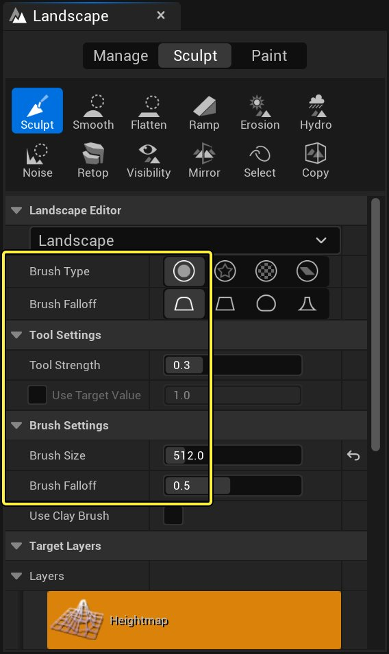
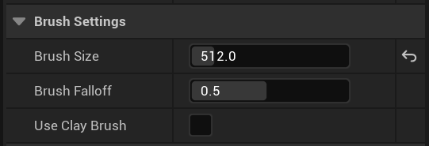
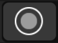
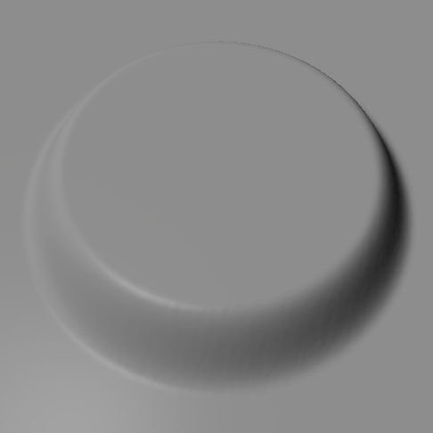
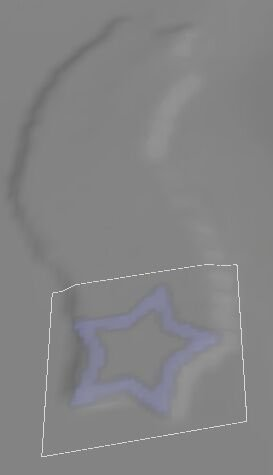
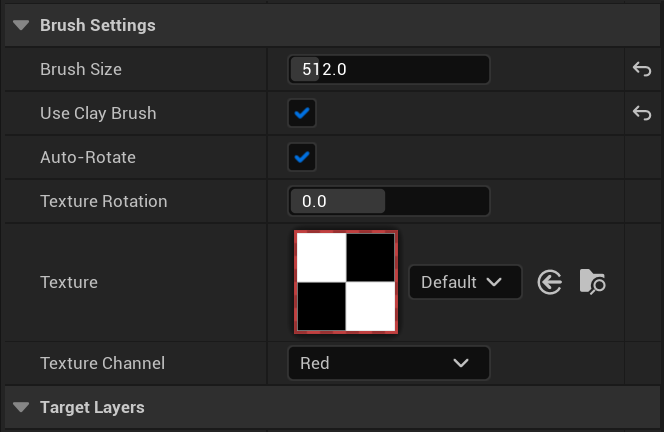
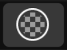

# 地形笔刷

> 路径：虚幻引擎5.7文档 / 构建虚拟世界 / 地形户外地貌 / 编辑地形 / 地形笔刷

> 原始页面：https://dev.epicgames.com/documentation/unreal-engine/landscape-brushes-in-unreal-engine

**地形（Landscape）** 工具的笔刷定义了地形区域（其将受雕刻或绘制的影响）的形状和大小。笔刷可拥有不同形状、大小和衰减。对曾经使用过Photoshop等图像编辑软件的人来说，笔刷工具并不会让他们感到陌生。

可在地形工具栏的 **雕刻** 或 **绘制** 标签页中设置笔刷类型和衰减。地形面板中也可以调整设置。

| Property | 说明 |
| --- | --- |
| **笔刷尺寸** | 决定着笔刷的尺寸（按虚幻单位计，含衰减）。在此区域中，笔刷将至少拥有一些效果。 |
| **笔刷衰减** | 决定了衰减开始处笔刷范围的百分比。本质上来说，它决定着笔刷边缘的硬度。0.0的衰减意味着笔刷拥有硬边，整体皆拥有完整的效果。1.0的衰减意味着笔刷只在中心拥有完整效果，效果将从其所在的整个区域到边缘逐渐减弱。 |
| **使用泥浆笔刷** | 泥浆笔刷可以用一种有机的、叠加的方法雕刻地形，类似使用数字泥浆。选中后，就可使用泥浆笔刷。 |

当前笔刷的尺寸和衰减在视口中显示为一对同心圆。

| Falloff of 0.0 | Falloff of 0.5 | Falloff of 1.0 |
| --- | --- | --- |
| 衰减：0.0 | 衰减：0.5 | 衰减：1.0 |

## 圆

**圆** 笔刷在一个圆形区域中应用当前的工具，带数字和类型两者定义的衰减。

### 圆笔刷衰减类型

| 图标 | 类型 | 描述 |
| --- | --- | --- |
| Smooth Falloff | **平滑** | 线性衰减已被平滑，磨圆衰减开始和结束的锐边。 |
| Linear Falloff | **线性** | 锐利的线性衰减，不带磨圆的边。 |
| Spherical Falloff | **球形** | 头端平滑而末端锐利的半椭圆形衰减。 |
| Tip Falloff | **尖端** | 头端凸出而末端平滑椭圆的衰减。**球形** 衰减的反面。 |

以下是这些衰减类型在高度图上呈现出的效果（半径和衰减量均相同）：

| Smooth Falloff example | Linear Falloff example | Spherical Falloff example | Tip Falloff example |
| --- | --- | --- | --- |
| **平滑** | **线性** | **球形** | **尖端** |

## 透明度

**透明度** 笔刷与图案笔刷相似，但绘制时它不会在地形上平铺纹理，它将把笔刷纹理对准绘制的方向并在移动鼠标时拖动形状。

### 透明度笔刷设置

| **设置** | **描述** |
| --- | --- |
| **纹理** | 设置要使用的纹理，从 **内容浏览器** 中进行指定。 |
| **纹理通道** | 将透明度笔刷的内容设置为来自当前指定纹理的相应通道的数据。 |
| **笔刷尺寸** | 设置笔刷的大小。 |
| **使用泥浆笔刷** | 选中后将使用一个泥浆笔刷。 |

## 图案

**图案** 笔刷可使用任意的笔刷形状，其工作原理是从纹理采样单一色彩通道，用作笔刷的透明度。绘制笔刷时将平铺纹理图案。

举例而言，以下纹理即可用作透明度：

Alpha Tex Alpha Tex Checker

它们可形成以下笔刷：

Alpha Pattern Alpha Applied

Alpha Pattern Checker Alpha Default Checker

### 图案笔刷设置

> 图片已省略：Pattern Brush Settings

| **设置** | **描述** |
| --- | --- |
| **纹理** | 设置要使用的纹理，从 **内容浏览器** 中进行指定。 |
| **纹理通道** | 将图案笔刷的内容设置为来自当前指定纹理的相应通道的数据。 |
| **笔刷尺寸** | 设置笔刷的大小。 |
| **笔刷衰减** | 设置笔刷衰减。 |
| **使用泥浆笔刷** | 可使用一个泥浆笔刷。 |
| **纹理缩放** | 设置采样纹理相对于地形表面的大小。Alpha Default Alpha Texscale |
| **纹理旋转** | 设置采样纹理相对于地形表面的旋转。Alpha Texrot Default Alpha Texrotation |
| **纹理平移[U/V]** | 设在地形表面上设置采样纹理的偏差。Alpha Default Alpha Texpan |

## 组件

> 图片已省略：Component Brush

**组件** 笔刷用于在单个组件上进行操作。光标一次将受限于一个单一组件：

> 图片已省略：Component Brush selection

> [!NOTE]
> 使用工具在个体组件关卡上进行操作时，组件笔刷是唯一可用的笔刷。

## 小工具

> 图片已省略：Gizmo Brush

**小工具** 笔刷可使用地形小工具来修改地形。地形小工具可用于对地形的特定本地化区域执行操作。

> [!NOTE]
> 只有在雕刻模式中使用复制/粘贴工具时才可以使用小工具笔刷。

如需了解小工具的更多信息，请参见 [地形拷贝工具](../landscape-copy-tool/index.md)。
