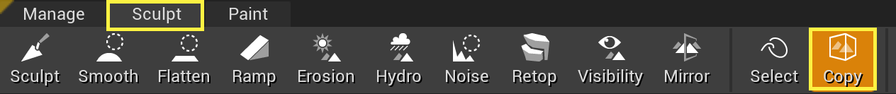
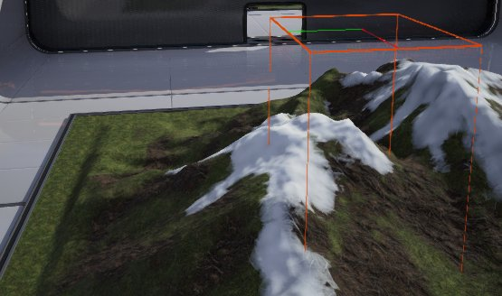
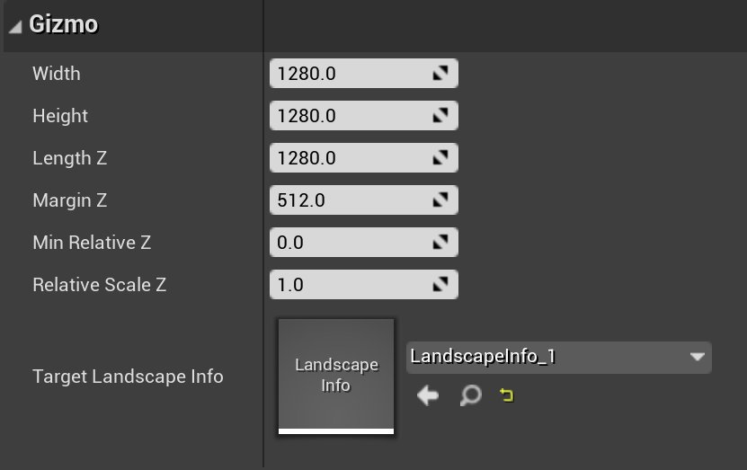
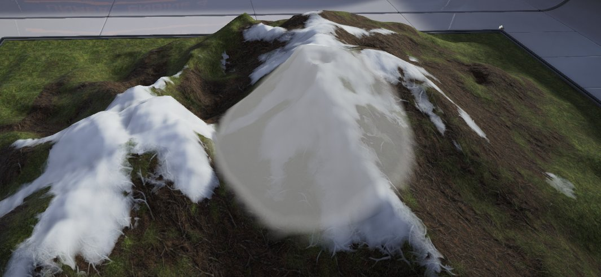
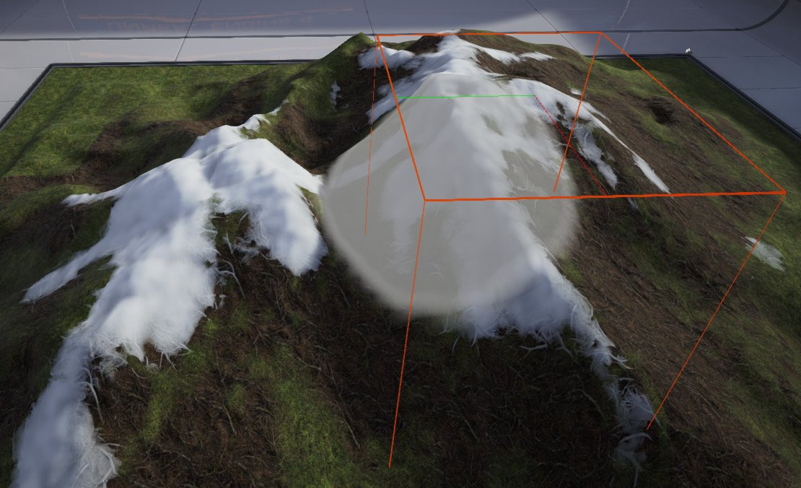
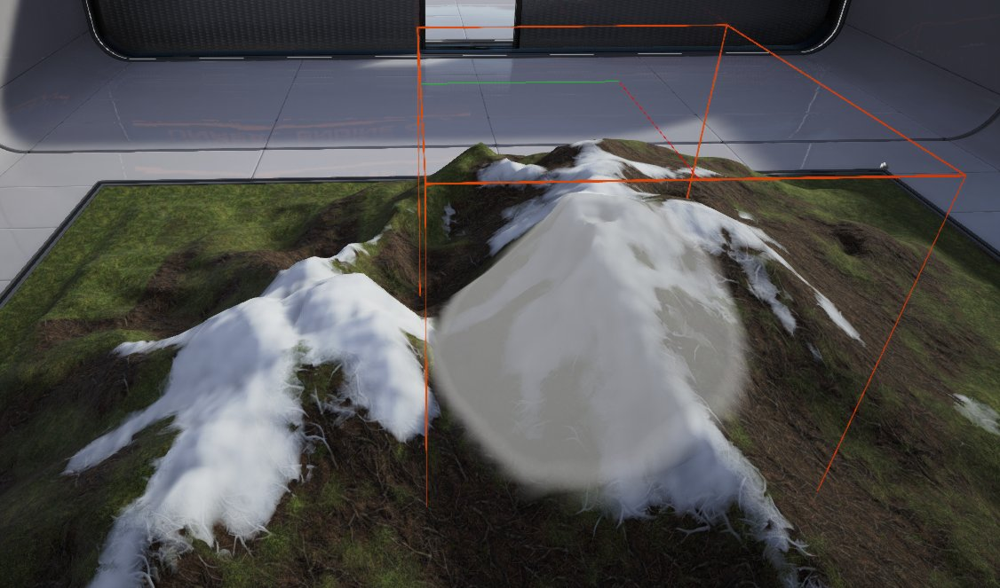

# 地形拷贝工具

> 路径：虚幻引擎5.7文档 / 构建虚拟世界 / 地形户外地貌 / 编辑地形 / 地形拷贝工具

> 原始页面：https://dev.epicgames.com/documentation/unreal-engine/landscape-copy-tool-in-unreal-engine

**地形小工具** 是纯编辑器的actor，与其所定义特定区域的体积相似。其作用是保存地形区域的高度和图层数据，以便被复制到地形上的另一个位置，或导出在另一个地形或高度图生成器（World Machine、Terresculptor等）中使用。

## 访问小工具

**访问小工具的方法：**

1. 在 **地形** 模式中点击 **造型（Sculpt）** 标签页，打开 **造型工具（Sculpting Tools）** 工具栏。

   
2. 从工具栏中选择 **复制（Copy）** 选项。小工具笔刷在选中的地形上显示为一个红色外框。

   

选择小工具笔刷创建一个临时的小工具actor。可使用变换工具操纵此actor（方式于操纵其他内容相同），以此定义需要复制的地形区域。

> [!NOTE]
> 如需了解变换工具的详细信息，请查阅[变换Actor](../../../../understanding-the-basics/actors-and-geometry/transforming-actors/index.md)。

可在 **细节** 面板中修改小工具actor的属性。

| 属性 | 描述 |
| --- | --- |
| **Width** | 小工具actor的基础宽度（以虚幻单位计）；X轴显示为红线。 |
| **Height** | 小工具actor的基础高度（以虚幻单位计）；Y轴显示为绿线。 |
| **LengthZ** | 小工具actor的基础Z长度（以虚幻单位计）。 |
| **MarginZ** | 将小工具与选择匹配时的Z值，含最大高度和最小高度。将小工具与所选区域匹配时，LengthZ = （最大高度 - 最小高度） + 2 * MarginZ。 |
| **MinRelativeZ** | 小工具中数据的最小高度值。小工具中的高度值被标准化（从0.f到1.f），并显示为（值 - MinRelativeZ） * RelativeScaleZ。 |
| **RelativeScaleZ** | 小工具中数据的高度缩放。 |
| **TargetLandscape** | 当前选中、小工具将用于的地形。 |

## 复制到小工具

为复制地形的部分，区域的数据必须复制到小工具。之后数据可被粘贴到另一个位置。

**复制选定区域的方法：**

1. 在 **雕刻** 模式中选择 **区域选择（Region Selection）** 雕刻工具。

   
2. 用笔刷涂抹，选中地形中的一个区域，类似普通的绘制流程。

   
3. 选择 **复制/粘贴** 雕刻工具。

   

   小工具在视口中不可见。

   

1. 点击 **将小工具匹配到选定区域（Fit Gizmo to Selected Regions）** 按钮来放置小工具并调整大小，使其包围所有选定的区域。

   
2. 点击 **复制数据到小工具（Copy Data to Gizmo）** 按钮在小工具的边界中转移地形选定区域的数据。按下 **Ctrl + C** 可执行相同操作。

   > 图片已省略：Copied Gizmo Data

**在小工具中复制区域的方法：**

1. 选择

   区域复制/粘贴

   雕刻工具。小工具将显示在视口中。
2. 点击选中小工具。变换控件将出现。

   > 图片已省略：Transform Gizmo
3. 移动、旋转并缩放小工具，使其包围希望复制的地形部分。

   > 图片已省略：Transformed Gizmo
4. 按下 **复制数据到小工具（Copy Data to Gizmo）** 按钮在小工具的边界中转移地形部分的数据。按下 **Ctrl + C** 可执行相同操作。

   > 图片已省略：Copied Data to Gizmo

   > 图片已省略：Copiy Data to Gizmo button

## 从小工具进行粘贴

从小工具粘贴数据则无法将地形的部分从一个位置转移到另一个位置。数据可被完整[粘贴](#pastingdata)来创建一个完全相同的地貌；或使用笔刷笔刷和强度设置来转移部分地貌，将其绘制到新位置。

从小工具粘贴数据前，其必须先被[复制](#copyingdata)到一个小工具。

**粘贴小工具数据的方法：**

1. 移动、旋转和放缩一个包含数据的小工具，使其覆盖需要粘贴数据的区域。

   > 图片已省略：Translating Gizmo to Paste

   > 图片已省略：Gizmo Paste
2. 使用一个可用笔刷（圆形、图案、透明度、小工具）来粘贴数据，"绘制"来自小工具的数据。

   - 小工具笔刷可将完整粘贴来自小工具的数据。按下

     Ctrl + V

     也可完整粘贴来自小工具的数据。
   - 其他笔刷也可使用当前笔刷大小和强度来绘制来自小工具的数据。

   > 图片已省略：Painting Gizmo Data

   > 图片已省略：Painted Gizmo Data

## 小工具数据导出/导入

可通过 **地形编辑器（Landscape Editor）** 中的 **小工具导入/导出** 部分将高度图数据导出至小工具，以及从小工具进行导入。

> 图片已省略：Gizmo Import/Export options

**将数据导入小工具：**

1. 点击浏览文件按钮( import_filebrowse.png)并选择需要导入到小工具的高度图文件（16位原始文件）。 Importing external Gizmo data

   > [!NOTE]
   > 因为导入进程使用.raw文件格式，因此无法正确确定尺寸。将自动进行猜测，但需要手动调整尺寸才能正确导入高度图。UE4会生成一个包含不同尺寸的下拉菜单，可通过点击上图中的向下箭头访问。你可能需要尝试几个不同尺寸才能找到合适的那个。
2. 如果也希望导入层权重信息，请按下"添加层"按钮(

   > 图片已省略：import_layeradd.png

   )来添加所需的层数量。

   > 图片已省略：Importing Layer weight data
3. 选择导入到每层的层权重图文件（8位raw文件）。将填入文件和层命名。层命名默认使用文件的命名。如有需要可修改层命名。启用 **无导入** 勾选框可防止单个层信息被导入。

   > [!NOTE]
   > 层命名必须匹配存在于地形上的层的命名，否则导入将失败。

   > 图片已省略：Layer name must match exactly what is in the file
4. 选中高度图和任意层后，按下 **导入至小工具（Import to Gizmo）** 按钮将数据导入到小工具。 如尺寸不正确，则可能看到这种现象：

   > 图片已省略：Import Wrong Dimensions

   反转尺寸并重新导入则能够获得正确结果。如果尺寸正确，小工具应显示正确数据。

**导入小工具数据的方法：**

1. 小工具填入数据后（参见

   复制到小工具

   ），按下

   导出小工具数据（Export Gizmo Data）

   按钮将小工具数据导出到文件。启用小工具选项顶部的

   小工具复制/粘贴所有层

   勾选框后将把高度图和所有层的权重数据导出到文件。
2. 选择高度图文件的位置和命名。

   > 图片已省略：Exporting Heightmap file
3. 如正在导出层，则选择每个导出层的位置和文件名。

   > 图片已省略：Exporting Layer file
