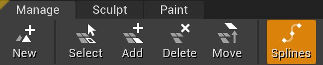
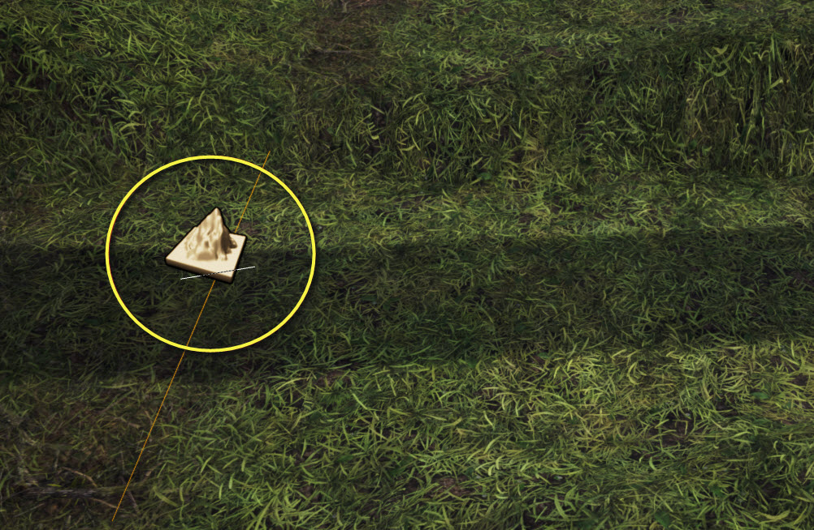
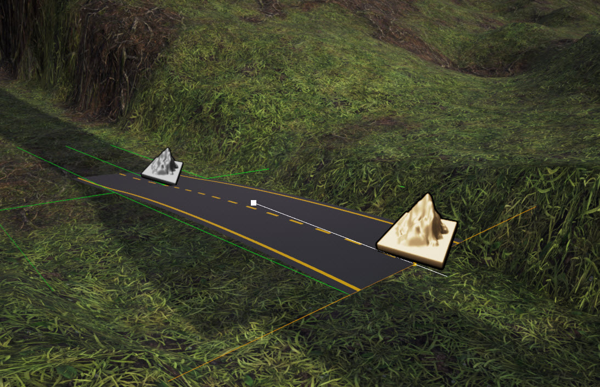
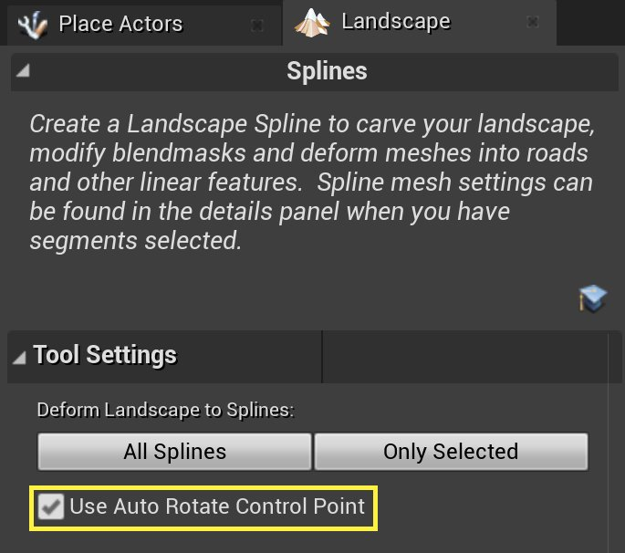
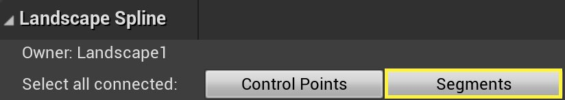
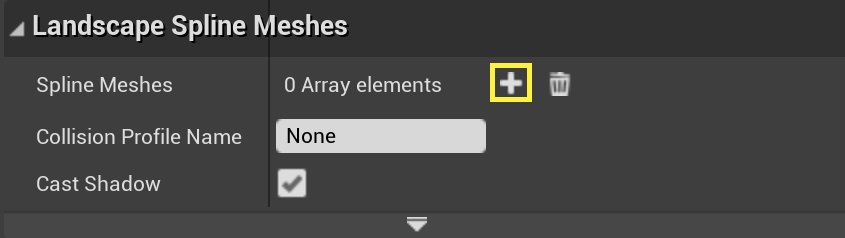
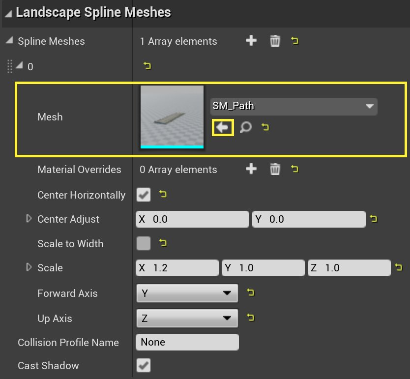
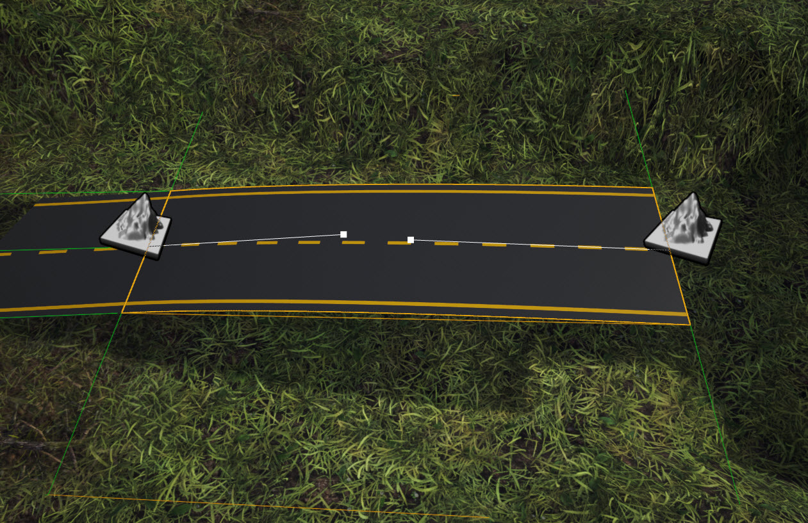

# 地形样条线

> 路径：虚幻引擎5.7文档 / 构建虚拟世界 / 地形户外地貌 / 编辑地形 / 地形管理模式 / 地形样条线

> 原始页面：https://dev.epicgames.com/documentation/unreal-engine/landscape-splines-in-unreal-engine

**地形样条** 是一种灵活的系统，可创建需要与地形相符的任何线性特征，甚至可通过拖拉来更好地构建这些特征。在地形工具中使用样条工具可创建和编辑地形样条。

样条工具最适合在环境中制作街道或小路，但总的来说，其可用于任何必须符合地形的网格体，例如鹅卵石墙壁、或又长又直的成排玉米。

## 创建样条线

1. 在 **管理（Manage）** 下选择 **编辑样条（Edit Splines）**。

   
2. 按 **Ctrl+左键点击** 设置样条的首个控制点。控制点的Sprite看起来像一座经过雕刻的地形山峰。

   
3. 再次按 **Ctrl+左键点击** 创建另一个控制点，通过样条段将其与第一个控制点相连。选中项现变为新的控制点，重复以上步骤便可添加更多控制点。

   

   或者也可用 **ALT+鼠标左键拖动** 创建新的样条控制点和分段。选择一个现有控制点，然后朝要放置新控制点的方向按 **ALT+鼠标左键拖动**。 如选择样条任一端的点，**ALT+鼠标左键拖动** 会添加新分段并延长样条。拖动该点时，可在视口中查看新分段的外观。

### 合并和拆分样条

要合并两个样条，选中一个样条，然后按 **Ctrl+左键点击** 另一个样条。

要拆分样条，按 **Ctrl+左键点击** 一个分段。此操作可将该分段在点击处拆分，并插入新的控制点。

除了按 **Ctrl+左键点击**，还可使用 **ALT+鼠标左键拖动** 拆分样条。在分段的任一侧选择一个样条点，然后朝现有分段按 **ALT+鼠标左键拖动** 光标来执行拆分。 如启用 **使用自动旋转控制点（Use Auto Rotate Control Point）**，释放光标后样条点会自动旋转，使样条保持平滑。

### 向样条添加静态网格体Actor

1. 在 **内容浏览器** 中找到并选择要用于样条的静态网格体资源。
2. 点击地形上的样条控制点。
3. 在关卡编辑器内 **细节** 面板的 **地形样条（Landscape Spline）** 部分中，点击 **选择所有已连接项目（Select all connected）** 旁的 **分段**。此操作会确保将该静态网格体添加至样条的所有分段。

   
4. 如尚无元素，在 **地形样条线网格体（Landscape Spline Meshes）** 部分的 **样条线网格体（Spline Meshes）** 下，点击加号图标 Plus Sign) 进行添加。

   
5. 展开刚添加的元素。在 **网格体（Mesh）** 旁，点击指定箭头图标（Assign）来指定选择的静态网格体。

   

> [!TIP]
> 还可通过选择控制点并在 **网格体** 部分的 **细节** 面板中指定静态网格体，将静态网格体指定给各个控制点。

## 编辑样条线

样条控制点按预期对平移和旋转工具的做出反应，但缩放工具会调出另一个工具，即样条切线。

选择分段时，该工具将在分段的每一端显示切线；选择控制点时，其将显示所有已连接分段的切线。 拖动切线的末端可调整其比例，从而改变样条分段的弯曲程度。

## 将样条应用到地形

**将样条应用到地形（Apply Splines to Landscape）** 按钮使用样条信息修改地形高度图和图层权重图。 高度图会升高或降低来适应样条，两边都有平滑的余弦混合衰减。高度图由样条控制点的"宽度"和"衰减"属性以及各个样条分段的 **升高/降低地形（Raise/Lower Terrain）** 选项控制。 绘制的纹理图层（若有）在各个样条分段的 **图层名称** 属性中指定，而绘制受控制点中的样条宽度和衰减设置的影响。

## 样条属性

所选控制点或分段的属性显示在关卡编辑器的 **细节** 面板中。

### 控制点属性

| 属性 | 说明 |
| --- | --- |
| **位置（Location）** | 控制点相对于地形的位置。 |
| **旋转（Rotation）** | 控制点的旋转，控制任何相连样条分段的切线方向。 |
| **宽度（Width）** | 样条的宽度，显示为实线。影响所有已连接的分段。 |
| **侧衰减（Side Falloff）** | 样条任一侧的余弦混合衰减区域的宽度，显示为虚线。 |
| **端衰减（End Falloff）** | 只有一个附加分段的样条末端控制点。余弦混合衰减区域的长度会平滑地终止样条分段。 |
| **图层命名（Layer Name）** | 将样条应用到地形时绘制混合遮罩图层的命名。 |
| **升高地形（Raise Terrain）** | 将样条应用到地形时升高地形来配合样条。适用于路堤上的道路。 |
| **降低地形（Lower Terrain）** | 将样条应用到地形时降低地形来配合样条。适用于河流和沟渠。 |

### 样条分段属性

#### 地形样条分段

| 属性 | 说明 |  |
| --- | --- | --- |
| **连接（Connections）** | 连接到分段的两个控制点的专属设置。 | **连接子属性**： **切线长度（Tangent Len）**：切线在该点的缩放，并控制曲线段。负切线会导致线段连接至控制点的背面。 **插槽名称（Socket Name）**：用不同样条材质重载静态网格体的指定材质。 |
| **图层命名（Layer Name）** | 将样条应用到地形时绘制混合遮罩图层的命名。 |  |
| **升高地形（Raise Terrain）** | 将样条应用到地形时升高地形来配合样条。适合路堤上的道路。 |  |
| **降低地形（Lower Terrain）** | 将样条应用到地形时降低地形来配合样条。适用于河流和沟渠。 |  |

#### 地形样条网格体

| 属性 | 说明 |  |
| --- | --- | --- |
| **样条网格体（Spline Meshes）** | 应用于样条的网格体。将按照随机种子控制的随机顺序应用多个网格体。 | **样条网格体子属性（使用的每个网格体）**： **网格体（Mesh）**：应用于样条的静态网格体。 **材质重载（Material Overrides）**：控制点上的插槽连接至线段末端。 **水平居中（Center H）**：确定是将网格体在样条上水平居中，还是使用网格体原点。 **偏移（Offset）**：从样条中偏移网格体（单位在网格体空间内，未被样条缩放）。 **缩放至宽度**：确定是将网格体缩放至匹配样条宽度，还是按原样使用网格体。 **缩放（Scale）**：网格体大小的乘数。若启用 **缩放至宽度（Scale to Width）**，则此处指定的 **缩放（Scale）** 相对于样条宽度。否则就是相对于网格体的自然大小。 **前轴（Forward Axis）**：选择 **样条网格体** 的前轴。 **上轴（Up Axis）**：选择 **样条网格体** 的上轴。 |
| **碰撞配置文件名称（Collision Profile Name）** | 此样条使用的碰撞配置文件的名称。 |  |
| **投射阴影（Cast Shadow）** | 允许由网格体投射阴影。 |  |
| **随机种子（Random Seed）** | 控制将多个样条网格体应用于样条的顺序。 |  |
| **最大绘制距离（Max Draw Distance）** | 样条中使用的所有网格体的最大绘制距离。 |  |
| **半透明排序优先级（Translucency Sort Priority）** | 设置半透明对象的排序优先级。若不是半透明网格体，则忽略。默认优先级为零。 |  |
| **在游戏中隐藏（Hidden in Game）** | 在游戏中隐藏静态网格体。 |  |
| **在流送关卡中放置样条网格体（Place Spline Meshes in Streaming Levels）** | 确定将样条网格体放置在地形代理流送关卡中，还是在样条关卡中。默认为True。 |  |

## 功能按钮参考

| 功能按钮 | 操作 |
| --- | --- |
| **鼠标左键** | 选择控制点或分段。 |
| **Shift+鼠标左键** | 选择多个控制点或分段。 |
| **Ctrl+A** | 选择所有连接到当前选定控制点的控制点和/或所有连接到当前选定分段的分段。 |
| **Ctrl+鼠标左键** | 添加新控制点，并自动连接到任何选定的控制点。 在选定一个或多个控制点的情况下，创建分段将所有选定的控制点连接到新的控制点。 在选定一个分段的情况下，在该点拆分分段并插入新的控制点。 |
| **ALT+鼠标左键拖动** | 在选定一个控制点的情况下，添加新控制点并将它朝拖动方向平移。 在拖动穿过现有分段时拆分路径。 在从样条任一端拖开时添加新分段。 |
| **Del** | 删除选定的控制点或分段。 |
| **R** | 自动计算选定样条控制点的旋转。 |
| **T** | 自动翻转选定控制点/分段的切线。 |
| **F** | 翻转选定的样条分段（仅影响样条上的网格体）。 |
| **End** | 将选定控制点对齐到下方的地形。 |
