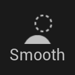
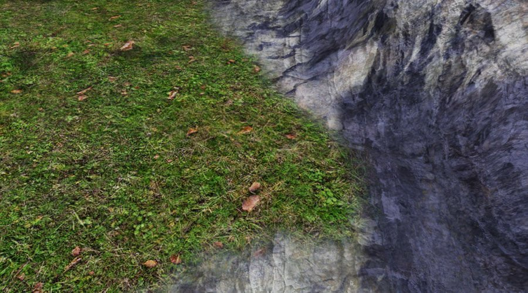
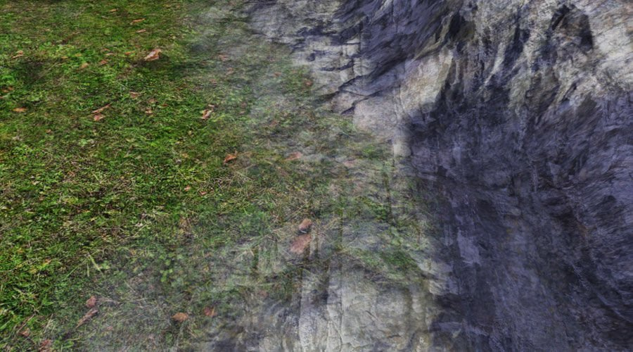
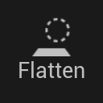
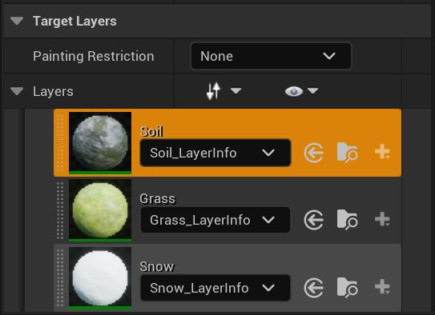
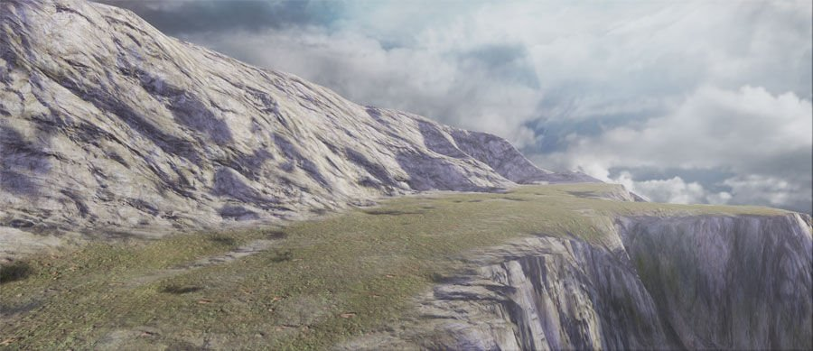

# 地形绘制模式

> 路径：虚幻引擎5.7文档 / 构建虚拟世界 / 地形户外地貌 / 编辑地形 / 地形绘制模式

> 原始页面：https://dev.epicgames.com/documentation/unreal-engine/landscape-paint-mode-in-unreal-engine

在 **绘制（Paint）** 模式下，工具使你能够将材质图层选择性地应用于地形Actor的各个部分，从而修改地形的外观。

有关地形材质的更多信息，请参阅[地形材质](../../landscape-materials/index.md)。

## 绘制工具

你可以使用绘制工具（Painting Tool）来将专门设计的地形材质图层选择性地应用于地形的各个部分，从而修改其的外观。

| **常用功能按钮** | **操作** |
| --- | --- |
| **鼠标左键** | 执行一个笔划，用于将选定工具的效果应用于选定图层。 |
| **Ctrl+Z** | 撤销上一笔划。 |
| **Ctrl+Y** | 重做上次未完成的笔划。 |

绘制工具有一些常用选项：

| **选项** | **说明** |
| --- | --- |
| **工具强度（Tool Strength）** | 控制每个笔划的效果程度。 |
| **将区域用作遮罩（Use Region as Mask）** | 选中时，区域选择用作遮罩，且活动区域由选定区域组成。 |
| **负像遮罩（Negative Mask）** | 同时选中此选项与 **将区域用作遮罩（Use Region as Mask）** 时，区域选择用作遮罩，但活动区域由非选定区域组成。 |

有关地形材质图层的更多信息，请参阅本页后面的[图层](#layers)。

### 绘制

绘制工具以当前选定的笔刷和衰减的形式，增加或减少应用于地形的材质图层的权重。

| **其他选项** | **说明** |
| --- | --- |
| **使用目标值（Use Target Value）** | 如果选中，混合应用于目标值的噪点值。 |

### 平滑

平滑工具平滑受其影响的地形范围内的图层权重。强度决定平滑量。

**图层平滑（Layer Smoothing）**

地形平滑图层使用前

地形平滑图层使用后

| **其他选项** | **说明** |
| --- | --- |
| **滤波器内核比例（Filter Kernal Scale）** | 设置平滑滤波器内核的比例乘数。 |
| **细节平滑（Detail Smooth）** | 如果选中，使用指定的细节平滑值执行细节保持平滑。越大的细节平滑值将删除更多的细节，而越小的细节平滑值则可以保留更多的细节。 |

### 平整

平整工具直接将选定图层的权重设置为 **工具强度（Tool Strength）** 滑块的值。

| **其他选项** | **说明** |
| --- | --- |
| **平整模式（Flatten Mode）** | 决定此工具是增加还是减少选定图层权重的应用，或者两者兼而有之。 |

### 噪点

此工具将噪点滤波器应用于图层权重。强度决定噪点量。

| **其他选项** | **说明** |
| --- | --- |
| **使用目标值（Use Target Value）** | 如果选中，混合应用于目标值的噪点值。 |
| **噪点模式（Noise Mode）** | 决定是应用所有噪点效果，仅应用导致图层应用增加的噪点效果，还是仅应用导致图层应用减少的噪点效果。 |
| **噪点比例（Noise Scale）** | 使用的Perlin噪点滤波器的大小。噪点滤波器与位置和比例有关，也就是说，如果你没有更改噪点比例，则同一滤波器将多次应用于同一位置。 |

## 图层

图层是分配的地形材质的一部分，你想要在地形上绘制图层以改变地形外观。

地形图层决定纹理（或材质网）如何应用于地形Actor。地形可以使用多个具有不同纹理、缩放、旋转和平移组合的图层来创建最终的纹理地形。

地形材质（Landscape Material ）中定义的图层将自动在地形工具的 **绘制（Paint）** 模式下填充 **目标图层（Target Layers）** 列表。每个图层都显示有其名称和一个小缩略图。

无论选择了哪个图层，你都可以根据工具的选项和设置以及正在使用的[笔刷](../landscape-brushes/index.md)将其应用于地形。

> [!NOTE]
> 很多绘制工具与雕刻工具类似，你可以通过类似方式使用它们，但是目的在于操控图层的权重而不是高度图的权重。

你将在材质本身中创建图层。有关图层和地形材质的更多信息，请参阅[地形材质](../../landscape-materials/index.md)。

### 图层信息对象

图层信息对象是包含有关特定地形图层的信息的资产。每个地形图层都必须分配了一个图层信息对象，否则无法绘制它。你可以从地形面板创建图层信息对象。

图层对象类型分为两种，即权重混合（Weight-Blended）和非权重混合（Non Weight-Blended）：

- 权重混合（Weight-Blended）

  - 绘制一个权重混合图层将减少所有其他权重混合图层的权重。例如，绘制泥土会除去草丛，而绘制草丛则会除去泥土。这是最常用的图层信息对象类型。
- 非权重混合（Non Weight-Blended）

  - 相互独立的图层。绘制非权重混合图层不会影响其他图层的重量。它们用于更高级的效果，例如要将白雪混合到其他图层上时：你将使用非权重混合的白雪图层来在"青草、泥地或岩石"与"覆雪青草、覆雪泥地或覆雪岩石"之间混合，而不是使用"青草、泥地、岩石或白雪"。

你可以从图层本身创建一个图层信息对象，也可以重复使用另一地形的现有图层信息对象。

**创建图层信息对象：**

1. 按下图层名称右边的

   加号

   图标。
2. 选择

   权重混合图层（Weight-Blended Layer）（标准）

   或

   非权重混合图层（Non Weight-Blended Layer）

   。

   > 图片已省略：Weight Blended Non Weight Blended
3. 选择要保存图层信息对象的位置。

创建后，图层信息对象作为资产存在于 **内容浏览器（Content Browser）** 中：

> 图片已省略：Layer Info Object

然后，它们可以被其他地形重复使用。

> [!NOTE]
> 虽然可以在多个地形中使用同一个图层信息对象，但在单个地形中，你只能使用每个图层信息对象一次。地形中的每个图层必须使用不同的图层信息对象。

**若要重复使用另一地形的现有图层信息对象：**

1. 在 **内容浏览器（Content Browser）** 中找到并选择图层信息对象。
2. 在地形面板的 **目标图层（Target Layers）** 部分中，在要使用的图层信息类型的图层的右侧，单击分配（Assign）图标(Assign)。

> [!NOTE]
> 只有当图层信息对象的图层名称与最初创建它们的图层相匹配时，才能使用图层信息对象。

虽然图层信息对象的主要用途是担当绘制图层数据的唯一键，但是它们也包含一些用户可编辑的属性：

| 选项 | 说明 |
| --- | --- |
| **物理材质（Phys Material）** | 分配到地形中此图层占主导地位之区域的[物理材质](../../../../gameplay-systems/physics/physical-materials/index.md)（如有）。 |
| **硬度（Hardness）** | [侵蚀](../landscape-sculpt-mode/landscape-erosion-tool/index.md)工具使用的值。 |

### 孤立图层

如果一个图层在填充了一个地形的 **目标图层（Target Layers）** 列表后被从地形材质中移除，并且它已经在此地形上绘制了数据，那么它在此列表中将显示一个 **?** 图标。这表示一个孤立图层。

> 图片已省略：Missing Layer

之前使用此图层绘制的区域可能会呈现黑色，但是确切的行为取决于地形材料。

#### 删除孤立图层

你可以从地形中删除孤立图层，但是建议你首先在之前使用此图层的所有区域上进行绘制。绘制的图层数据会一直保留，直至此图层被删除，所以，如果你在地形材质上操作不慎，也不会丢失任何信息。

**若要从地形中删除图层：**

- 单击图层名称右边的 **X** 图标。

  > 图片已省略：Delete Layer

### 权重编辑

在每个地形顶点上，每个图层都有一个权重指定此图层对地形的影响程度。图层没有特定的混合顺序。相反，每个图层的权重单独存储并添加结果。如果是权重混合图层，权重合计最多为255。非权重混合图层独立于其他图层，可以拥有任何权重值。

你可以使用绘制工具来增加或减少活动图层的权重。为此，选择要调整权重的图层，并使用其中一个绘制工具将此图层应用于地形。对于权重混合图层，当你增加一个图层的权重时，其他图层的权重会均匀减少。完全绘制一个图层会导致任何其他图层上没有权重。

在绘制过程中，当你通过按下 **Ctrl + Shift** 来减小某个权重混合图层时，应该增加哪一图层来替代它并不明确。当前行为是均匀地增加任何其他图层的权重。由于这种行为，无法完全涂掉所有图层。建议你选择想要绘制的图层，然后再额外绘制它，而不是将所有图层涂掉。
