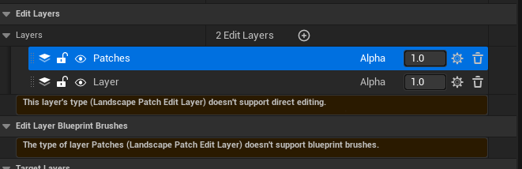
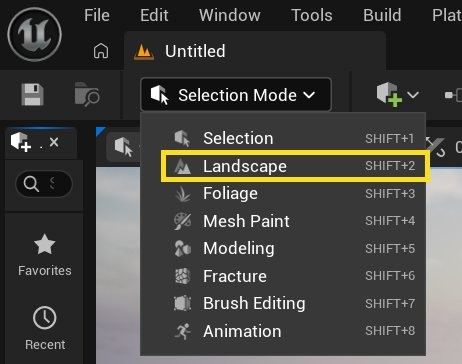
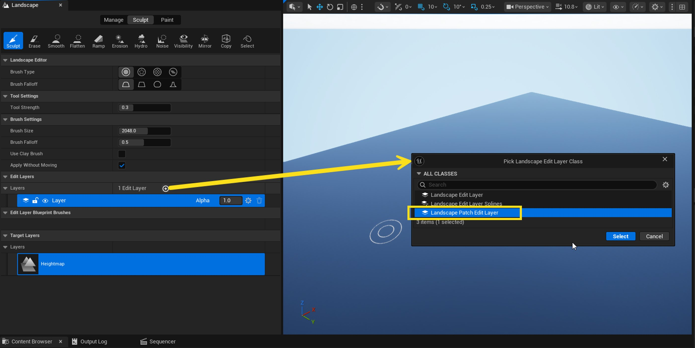
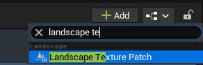
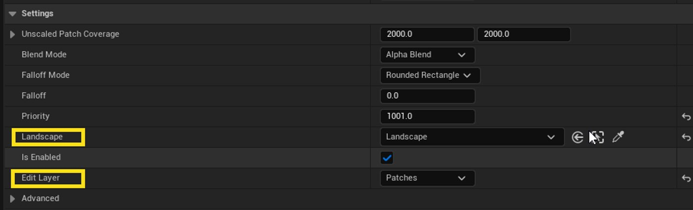
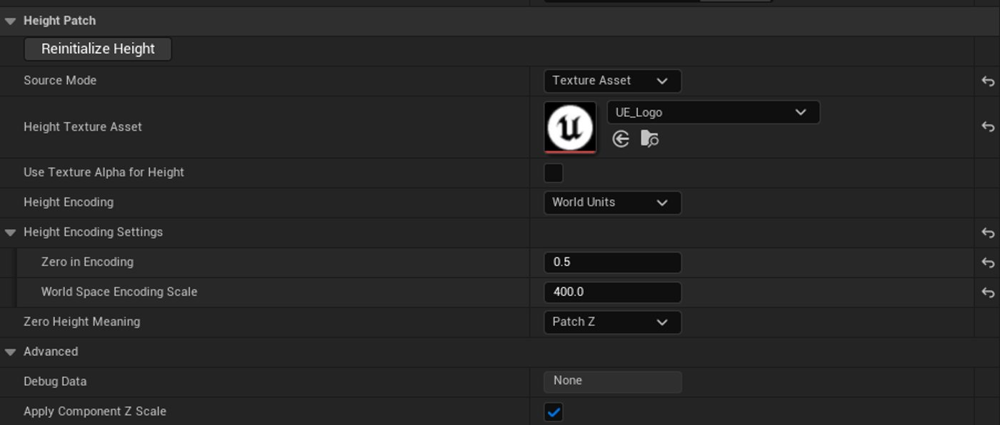
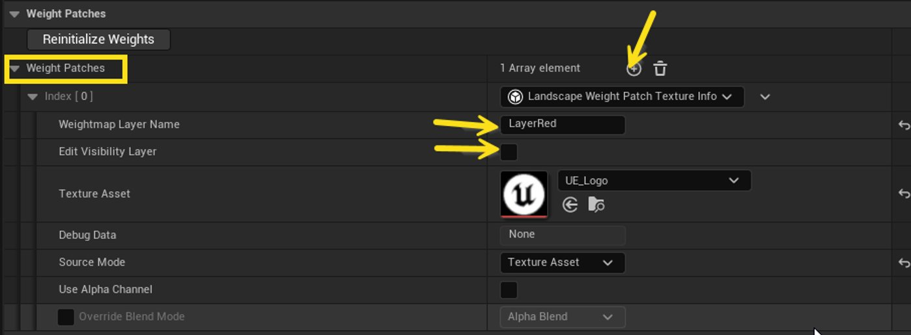
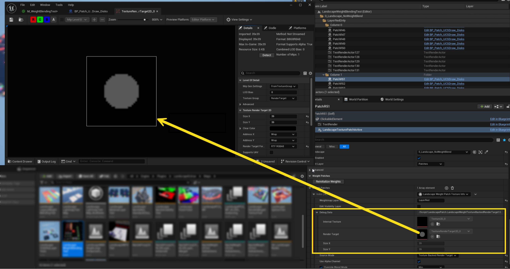

# Landscape Patch System

> 路径：虚幻引擎5.7文档 / 构建虚拟世界 / 地形户外地貌 / 编辑地形 / Landscape Patch System

> 原始页面：https://dev.epicgames.com/documentation/unreal-engine/landscape-patch-system

该页面没有可用的官方中文版本；以下内容保留原文，并按本项目人工译文规则逐步回译。

Landscape Patch 是一个编辑器插件，可使用名为 landscape patch 的 texture patch component，以程序化方式更改 landscape heightmap 和 weightmap。这些 patch 可以附加到任意 Actor，并自动对给定 landscape 的 patch edit layer 应用基于 texture 的修改。Patch 可以从 texture 或 render target 读取，并在编辑器中将结果应用到 landscape。结果会烘焙到最终 landscape 中。它们所需的任何数据都是 editor-only，因此不会影响运行时内存或性能。

## Landscape Patch Edit Layer（地形补丁编辑层）

Landscape patch 会使用一个或多个专用 **patch edit layer**应用到 landscape。此 edit layer 类型完全是程序化的，因此不能使用常规 landscape 工具在该层上 sculpt 或 paint。操作 patch 的唯一方式是使用标准 viewport 和 scene outliner。

要创建 patch edit layer，请执行以下步骤：

1. 在主工具栏中选择 **Landscape** ，它位于 **Selection Mode** 下拉菜单。

   
2. 在 **Edit Layers** 部分，点击 **add（+）** 按钮。
3. 选择 landscape patch edit layer 类型并点击 **Select**.

   

也可以通过向 world 中的现有 Actor 添加 patch component，或将带 patch component 的 Blueprint Actor 拖入 world 来创建 patch edit layer。执行任一操作后，会出现对话框，可选择在 edit layer stack 中何处添加新的 patch edit layer。

可以在同一个 landscape 中使用多个 patch edit layer。patch edit layer 会按从上到下的顺序应用。创建 patch edit layer 后，可以在 edit layer stack 中拖动该层，以改变它的应用时机。

## Landscape Texture Patch（地形纹理补丁）

texture patch component 是与 patch edit layer 交互的主要组件。要创建它，请向 Actor 添加 **Landscape Texture Patch（地形纹理补丁）** component，可在 **Actor Details** 视图或 **Blueprint Editor**.

patch 第一次拖入 world 时，会附加到它找到的第一个 landscape 上的第一个 patch edit layer。如果 patch 未找到 patch edit layer，它会创建一个并提示你将其插入 edit layer stack。

选中 patch 时，可以在 **Details** 面板中看到它附加到的 landscape 和 edit layer。

更改其中任一设置时，另一个设置会自动匹配。如果更改 landscape actor，patch 会附加到它在新 landscape 中找到的第一个 patch edit layer。

以下视频展示典型 patch 设置流程。

## Patch 细节

### Height Patch

**Height Patch** 部分定义 patch 是否影响 heightmap。可以将 patch 设置为只影响 heightmap、只影响 visibility、只影响指定 target layer，或影响这些项的任意组合。

此部分包含以下属性：

- **Source Mode**：根据以下选项设置 source texture data 应从何处获取：

  - **None**：patch 不影响 heightmap。
  - **Internal Texture**：patch data 从内部存储的 texture 读取。在此模式下，不能使用 Blueprint 写入 patch，但它避免存储以下模式所需的额外 render target： **Texture Backed Render Target**。通常只与 Reinitialize 命令一起使用。
  - **Texture Backed Render Target**：patch data 从内部存储的 render target 读取，可使用 Blueprint 写入，并在需要时序列化到内部存储的 texture。内存使用量是 **Internal Texture**的两倍。允许 Blueprint 渲染 texture。
  - **Texture Asset**：patch data 从 UTexture asset 读取，该 asset 可以是 render target。允许多个 patch 共享同一个 texture。
- **Height Encoding**：定义 patch 中存储的值如何表示高度。Internal Texture source mode 不可自定义，它始终使用 native packed height。包含以下选项：

  - **ZeroToOne**：texture 中的值应解释为 [0,1] 范围内的 float。Zero In Encoding 参数设置哪个值对应零高度（landscape 被清空时）。World Space Encoding 参数设置该范围在 world unit 中的大小。
  - **World Units**：texture 中的值是直接的 world-space height。
  - **Native Packed Height**：texture 中的值存储为打包到两个字节中的 16-bit integer，在应用 landscape scale 前映射到 [-256, 256 - 1/128]。
- **Zero In Encoding**：patch data 中对应零高度的值，相对于 Zero Height Meaning 指定的起点。
- **World Space Encoding Scale**：应用到 patch 中存储数据的 world coordinate scale，相对于 encoding 中的零值。例如，如果 encoding 为 [0,1]，0.5 对应 0，且 World Space Encoding Scale 为 100，则结果值在 world space 中位于 [-50, 50] 范围。如果 Z scale 为 100，这些坐标在 landscape local height 中为 [-0.5, 0.5]。
- **Zero Height Meaning**：根据以下选项定义如何解释零高度：

  - **Patch Z**：零高度对应 patch 相对于 landscape 的垂直位置。patch 上下移动时，结果也会上下移动。
  - **Landscape Z**：零高度对应 landscape local space 中 Z 坐标为 0 的位置，不受 patch 垂直位置影响。例如，如果 landscape transform 的 world Z 坐标为 -100，则写入高度 0 会对应 world 坐标中的 Z=-100，而不受 Patch Z 影响。
  - **World Zero**：零高度对应 world origin 相对于 landscape 的高度。换言之，写入高度 0 会对应 world 坐标中的 Z=0，而不受 Patch Z 或 landscape transform 影响（只要 landscape transform 仍在 world 坐标中以 Z 向上）。

### Weight Patch

Weight patch 需要逐个添加（每个 target layer 一个），方法是向 **Landscape Weight Patch Texture Info（权重补丁纹理信息）** 添加元素，该元素属于 **Weight Patch** 属性。

此部分包含以下属性：

- **Weightmap Layer Name**：此 weight patch 应应用到的 landscape 中声明的 weightmap layer（target layer）名称。名称不区分大小写，但除此之外必须与目标 landscape 中声明的 target layer 名称完全匹配，patch 才能工作。

- **Edit Visibility Layer**：是否将此 weight patch 应用到 Visibility layer。启用后， **Weightmap Layer Name** 会被忽略。landscape material 必须支持 visibility，此选项才会影响 visibility。

- **Source Mode**：根据以下选项设置 source texture data 应从何处获取：

  - **None**：patch 不影响 weightmap。
  - **Internal Texture**：patch data 从内部存储的 texture 读取。在此模式下，不能使用 Blueprint 写入 patch，但它避免存储以下模式所需的额外 render target： **Texture Backed Render Target**。通常只与 Reinitialize 命令一起使用。
  - **Texture Backed Render Target**：patch data 从内部存储的 render target 读取，可使用 Blueprint 写入，并在需要时序列化到内部存储的 texture。内存使用量是**Internal Texture**的两倍。允许 Blueprint 渲染 texture。
  - **Texture Asset**：patch data 从 UTexture asset 读取，该 asset 可以是 render target。允许多个 patch 共享同一个 texture。

### 重新初始化 Height 和 Weight

**Reinitialize Heights（重新初始化高度）** and **Reinitialize Weights（重新初始化权重）** 按钮会捕获 patch 当前位置的当前 landscape height 和 weight，并将其烘焙到 patch texture 中，以便移动到其它位置。sculpt 和 paint landscape 后，将 patch 放在其上方并按这些按钮，即可将数据传输到 patch 内部 texture 中，使这些编辑可以随 patch 移动。

以下视频展示如何使用这些按钮的示例。

### Debug Data

使用 **Debug Data** 部分进行调试，当 source mode 为**Internal Texture** 或 **Texture Backed Render Target**时。可以在 texture viewer 中打开 debug data，并查看是否有可见内容。

### Settings

**Settings** 部分包含控制 patch 如何应用到 landscape 的属性。

> 图片已省略：The Settings section

此部分包含以下属性：

- **Unscaled Patch Coverage**：patch 的大小。scale 为 1.0 时，区域的 X 和 Y 会受 height patch 影响。这对应 patch texture 中 X 和 Y 方向上第一个像素中心到最后一个像素中心的距离。
- **Blend Mode**：根据以下选项，定义此 patch 应如何相对于下方 layer 应用到 landscape：

  - **Alpha Blend**：patch 指定实际 target height 和 weight，然后使用 falloff 与 alpha 将其与现有 height 和 weight 混合。例如，没有 falloff 且 alpha 为 1 时，landscape 会直接设置为从 patch 采样的 height 和 weight。alpha 为 0.5 时，landscape height/weight 会与 patch height/weight 均匀平均。
  - **Additive**：将 landscape 中间值解释为 0, 并在 height 情况下将 texture patch 作为 offset 应用到 landscape。 对于 weight，它只是标准 additive 行为。 falloff 和 alpha 只影响 offset 应用程度（例如 alpha 为 0.5 will apply just half the offset).
  - **Min**：类似 **Alpha Blend** 模式，但仅限降低现有 landscape 值。
  - **Max**：类似 **Alpha Blend** 模式，但仅限提高现有 landscape 值。
- **Falloff Mode**：根据以下选项定义 patch 行为在 patch 边缘如何衰减：

  - **Circle**：影响 patch 定义的圆形区域内的 landscape，并从圆形边缘开始向内衰减。
  - **Rounded Rectangle**：影响 patch 的整个矩形区域（圆角除外），并从矩形边缘开始向内衰减。

## Patch 顺序

在 **Alpha Blend**, **Min**和 **Max** blend mode 中，每个 patch 会按 Priority 属性控制的特定顺序应用。在 Additive blend mode 中，顺序无关紧要。

**Priority** 属性决定 patch 相对于其它 patch 的顺序。priority 值越低，patch 应用得越早。例如，Priority 为 1000 的 patch 会先于 Priority 为 1001 的 patch 应用。

patch 添加到 Actor 时会自动分配 Priority 值。可使用 **Priority Initialization** 属性控制，该属性位于 **Advanced** 面板中。该属性包含以下选项：

- **Acquire Highest**：分配比现有最高 priority patch 高 1 的 priority，使新 patch 位于所有现有 patch 之上。注意，当前最高 priority 可能在 landscape 更新之间过时。
- **Keep Original**：分配默认 priority 值。将自定义 priority 值用作 category 时，这会很有用。
- **Small Increment**：分配比现有最高 priority patch 高 0.01 的 priority。多次复制 patch 时这会很有用，因为它允许新 patch 在 priority 层级中大致位于同一位置，同时仍高于被复制的 patch。

## 在 Blueprint 中使用 Patch

如果希望 patch 使用同一个 texture 或 render target，请将 source mode 设置为 texture asset。如果希望每个 patch 拥有自己的 render target，可以将 source mode 设置为 **Texture Backed Render Target**。Texture backed 表示这些内部 render target 也会复制到内部 texture 以便序列化，因此在编辑器中会占用额外内存，但下次重新加载地图时不会被清空。之后可以使用以下函数写入 render target： **GetHeightRenderTarget** 或 **GetWeightPatchRenderTarget**.

> 图片已省略：GetHeightRenderTarget and GetWeightPatchRenderTarget

在 construction script 中，通过 Blueprint 在 Actor 的 landscape texture patch component 上设置多个 weight patch（使用 Texture Backed Render Target 模式）的示例。

construction script 中的 Render Patch 节点。

应使用 call-in-editor 方法在明确时间点写入 render target，而不是在不必要时持续重写。写入或更改后，可能需要在 patch 上调用 **RequestLandscapeUpdate** 以确保它被应用，尽管许多函数调用本身也会触发更新。此请求可以在一个 tick 中安全调用多次，因为实际更新只会在请求后的后续 tick 中发生一次。只要 patch 已启用且 source mode 未设置为以下值，移动 patch 就会自动触发更新： **None**.

修改 patch 时尝试从 landscape 读取，可能在 landscape 更新时产生延迟。例如，如果尝试禁用 patch 后立即从 landscape 读取（使用 landscape **RenderHeightmap** 调用、scene capture 或其它方式），patch 的移除可能尚未应用。如果为了写入 patch 而尝试从 landscape 读取，应使用一个操作禁用 patch，然后用另一个独立操作读取或写入。

### 确定性

生成 landscape data 时，所有 expression 都必须是 deterministic，也就是使用相同输入数据时始终返回相同结果。同一 landscape 区域的两次连续更新必须具有完全相同输出，每个计算像素都具有相同最终 height 和 weight 值。例如，不要在影响 landscape patch texture 的 material graph 中使用基于时间的 material expression。

## 故障排查

如果 patch 没有任何效果，请检查以下内容：

- patch 是否已启用？检查 **Is Enabled** 标志。
- source mode 是否设置为非以下值： **None**?
- 是否有关联的 landscape 和 patch edit layer？
- console log 中是否有报错？
- 查看 patch 正在使用的 texture。如果 patch 设置为使用 texture alpha，请在 viewer 中打开 texture 并选择 alpha channel，确认其中是否有数据。
- 如果从 landscape 重新初始化 patch 并移动它，patch 是否有效？如果无效，则 attachment 存在问题。它可能附加到了错误的 landscape，或附加到未启用 edit layer 的 landscape。

如果 patch 会影响 landscape，但 patch 区域内 landscape 始终是平的，则很可能是提供给 patch 的数据有问题。尝试以某种方式检查这些值，并确保 height encoding 设置与数据匹配。例如，可能写入的是 0-1 单位，却将其解释为 world unit。可以增大单位 scale，查看效果是否更明显。
