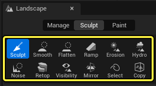
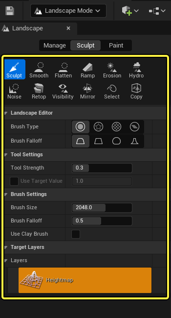

# 雕刻模式

> 路径：虚幻引擎5.7文档 / 构建虚拟世界 / 地形户外地貌 / 编辑地形 / 雕刻模式

> 原始页面：https://dev.epicgames.com/documentation/unreal-engine/landscape-sculpt-mode-in-unreal-engine

地形雕刻本质上是修改高度图，而这涉及到许多工具。在这些工具中，既有一些最简单的雕刻工具（例如借助笔刷和强度刻度来绘制高度值），也有一些通过复杂算法来实现效果的工具（比如侵蚀效果）。每种工具有提供了一组参数，用于调整它们对地形的影响效果。

## 工具使用流程

在[创建完地形](../../creating-landscapes/index.md)后，地形工具将显示剩余功能选项。点击 **雕刻（Sculpt）** 模式选项卡，开始雕刻。

选中后，选项卡下方的各种雕刻工具以及[笔刷类型和衰减类型](../landscape-brushes/index.md)将变为可用；你可以通过笔刷将它们的效果添加到地形上。

选中雕刻工具后，可以用以下控制选项来雕刻地形：

| **常见操控** | **作用** |
| --- | --- |
| **鼠标左键** | 执行一次笔刷操作，将所选工具的效果以叠加方式添加到高度图上并提升地形。 |
| **鼠标左键 + Shift** | 执行一次笔刷操作，将所选工具的效果以减法方式添加到高度图上并降低地形。 |
| **Ctrl + Z** | 撤销最后一次操作。 |
| **Ctrl + Y** | 恢复上一次撤销的操作。 |

## 雕刻工具

**雕刻工具** 用于以多种方式修改地形的形状。查看下文，了解各种雕刻选项：

## 区域工具

**区域工具** 用于对地形的特定区域执行操作。查看下文，了解各种区域选项：
