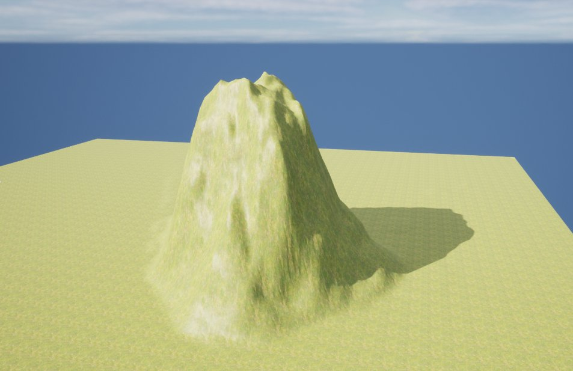
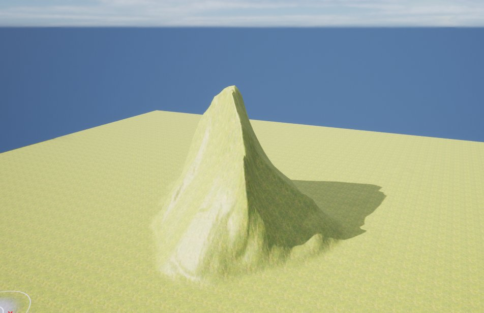

# 地形侵蚀工具

> 路径：虚幻引擎5.7文档 / 构建虚拟世界 / 地形户外地貌 / 编辑地形 / 雕刻模式 / 地形侵蚀工具

> 原始页面：https://dev.epicgames.com/documentation/unreal-engine/landscape-erosion-tool-in-unreal-engine

**侵蚀（Erosion）** 工具利用热力侵蚀模拟调整地形高度图的高度。它模拟土壤被自然力量从高处移动向低处的效果。 高低落差越大，产生的侵蚀效果越强。该工具还可在侵蚀上应用 noise 效果，呈现出自然真实的随机外貌。

## 使用侵蚀工具

在此例中，侵蚀工具将用于山峰面的前面和背面。正面的坡度不够陡峭，因此所用的设置不会对表面形成快速的侵蚀。 然而背面的坡度较为陡峭，侵蚀效果则更为迅速。

可使用以下功能键为地形高度图打造侵蚀效果：

| **功能键** | **操作** |
| --- | --- |
| **Left Mouse Button** | 将升高、降低、或两者皆有的侵蚀值应用到高度图。 |

使用前

使用后

在此例中，侵蚀使用绘制到山坡上的 noise 来升高或降低表面，基于用于驱动所应用侵蚀的强度和诸多属性值 在不同的个高度形成效果的变化。

## 工具设置

|  |  |
| --- | --- |
| Erosion Tool | Erosion Tool Properties |

| **属性** | **描述** |
| --- | --- |
| **Tool Strength** | 设定每次笔刷笔划效果的量。 |
| **Threshold** | 产生侵蚀效果的最低高度差。数值越小，侵蚀效果越强。 |
| **Surface Thickness** | 设置图层权重侵蚀效果的地表厚度。 |
| **Iterations** | 执行的迭代次数。数值越大，生成的侵蚀层数越多。 |
| **Noise Mode** | 确定是否应用 noise 提升或降低（或执行两项操作）高度图。 **Both**：升高和降低应用到高度图的所有侵蚀效果的数值。 **Raise**：应用升高高度图的侵蚀效果。 **Lower**：应用降低高度图的侵蚀效果。 |
| **Noise Scale** | 使用的 noise 过滤器尺寸。Noise 过滤器与位置和比例有关，如不改变 **Noise Scale**，同一 noise 过滤器将多次应用到相同位置。 |
