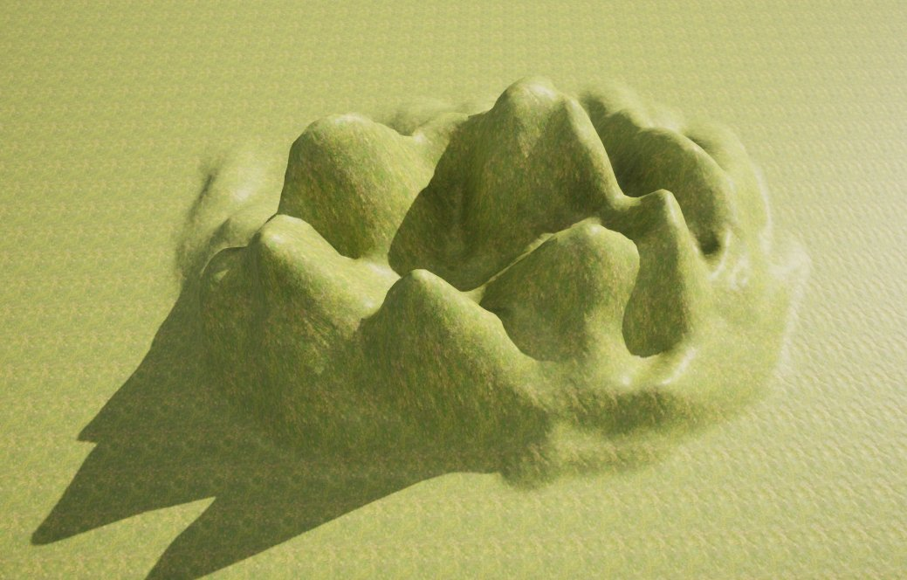

# 地形平整工具

> 路径：虚幻引擎5.7文档 / 构建虚拟世界 / 地形户外地貌 / 编辑地形 / 雕刻模式 / 地形平整工具

> 原始页面：https://dev.epicgames.com/documentation/unreal-engine/landscape-flatten-tool-in-unreal-engine

启用后，**平整（Flatten）** 工具将把高度图的所有部分推拉至鼠标之下的水平线上。 这样便可将周围的高度图数值升高或降低到相同的数值。

## 使用平整工具

在此例中，平整工具将对山丘中鼠标点击的区域执行平整化操作。按住鼠标按键后， 沿表面所使用高度值将基于高度升高或降低（基于工具设置）。

可使用以下功能键打造地形高度图：

| **功能键** | **操作** |
| --- | --- |
| **Left Mouse Button** | 同时升高降低进行高度图平整，或单独进行升高或降低。 |

平整前

平整后

笔刷强度决定使用笔刷工具时执行平整的强度。

## 工具设置

|  |  |
| --- | --- |
| Flatten Tool | Flatten Tool Properties |

| **属性** | **描述** |
| --- | --- |
| **Flatten Target** | 设置进行平整的目标高度。 |
| **Tool Strength** | 设定每次笔刷笔划的平滑量。 |
| **Flatten Mode** | 确定工具在笔刷下是否升高或降低高度图分段。 **Both** ：点击鼠标时将对当前的高度值升高和降低数值。 **Raise**：点击鼠标时只升高低于当前选择高度的数值。不会对高于此点击点的数值进行修改。 **Lower**：点击鼠标时只降低高于当前选择高度的数值。不会对低于此点击点的数值进行修改。 |
| **Use Slope Flatten** | 勾选后将沿地形的当前斜坡进行平整，而非沿水平平面进行平整。 |
| **Pick Value Per Apply** | 勾选后将固定选择新数值进行平整，而非只使用首个点击点。 |
| 高级 |  |
| **Show Preview Grid** | 启用平整目标后，可启用此项显示平整目标高度的预览网格。 |
| **Terrace Interval** | 为地形平整模式设置地形间隔的高度。 |
| **Terrace Smoothing** | 为地形平整模式设置平滑度 |
