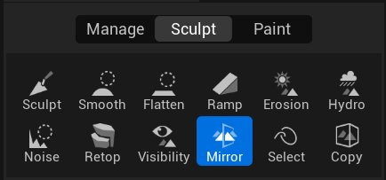
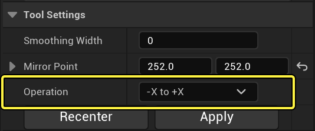
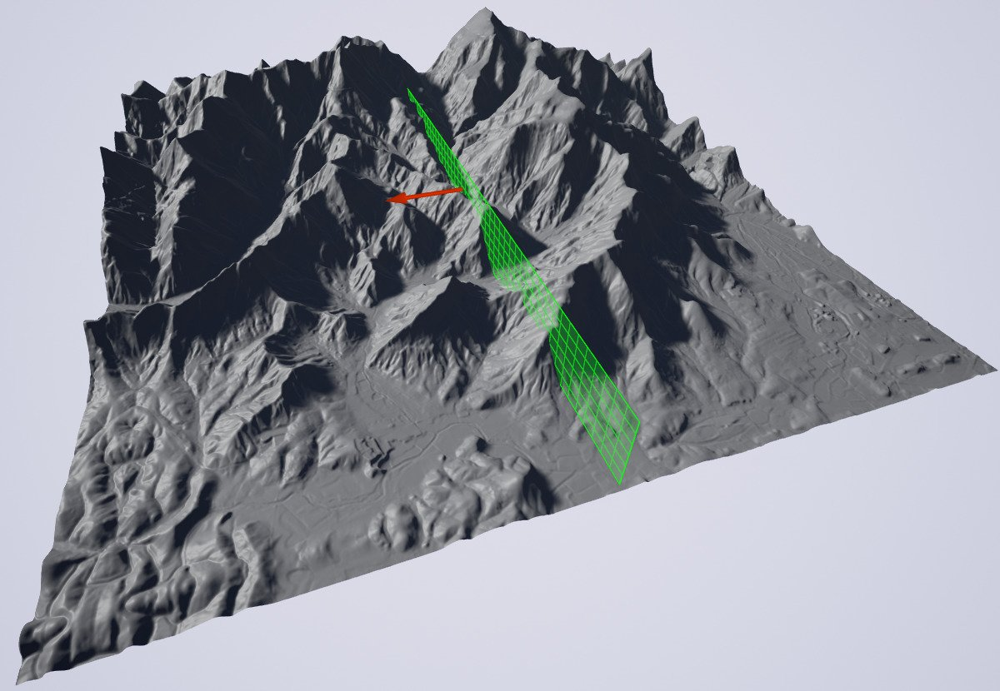
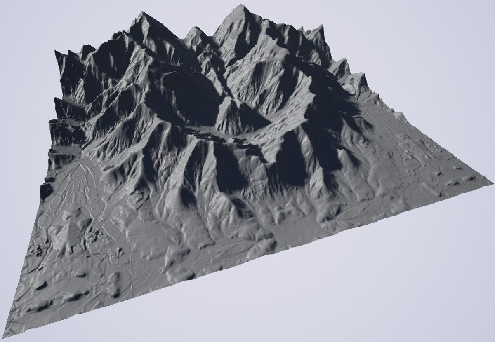
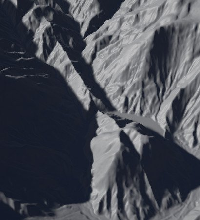

# 地形镜像工具

> 路径：虚幻引擎5.7文档 / 构建虚拟世界 / 地形户外地貌 / 编辑地形 / 雕刻模式 / 地形镜像工具

> 原始页面：https://dev.epicgames.com/documentation/unreal-engine/landscape-mirror-tool-in-unreal-engine

利用 **镜像（Mirror）** 工具可沿 X 轴或 Y 轴镜像或旋转现有的地形高度图几何体。

在本示例中，镜像工具用于将整个地形沿着Y轴进行镜像处理。

## 使用镜像工具

1. 在 Landscape 工具栏的 **Sculpt** 标签页中选择 **Mirror** 工具。

   
2. 使用 **Operation** 下拉选项选择用于所选地形的轴和镜像方法。方向箭头则说明地形几何体的哪一侧将被镜像。

   
3. 如有必要，可调整镜像平面的 **镜像点（Mirror Point）** 值，或左键点击拖动镜像平面的方向箭头到需要镜像的位置中。

   > [!NOTE]
   > 只有当前选中的 **操作（Operation）** 轴才将用于 **镜像点（Mirror Point）**。举例而言，如操作方法为"-X to +X"，X 轴则是唯一一个被影响的活跃镜像点。

   
4. 完成编辑后即可按下 **Apply** 按钮查看结果。

   

   您现在便获得了带镜像几何体的地形。

### 镜像平滑宽度

如应用修改后镜像地形产生的边缘接缝相比之下十分不自然或锐度过高，则可使用 **CTRL + Z** 取消上一步操作。然后再对 **平滑宽度（Smoothing Width）** 进行调整， 将这些合并的边缘顶点柔化。

使用平滑宽度前

使用平滑宽度后

在此例中，左图为镜像地形后未应用平滑的效果，而右图则是对镜像边缘应用了 10 点平滑值的效果，减弱了接缝的毛边。

## 工具设置

| Mirror Tool | Mirror Tool properties |
| --- | --- |
|  |  |

| **属性** | **描述** |
| --- | --- |
| **Mirror Point** | 这将设置镜像平面的位置。位置默认为所选地形的中央，通常情况下均无需进行修改。 |
| **Operation** | 执行的镜像操作类型。举例而言，"-X to +X"将把地形 -X 的一半复制并翻转到 +X 的一半上。 |
| **Recenter** | 此按钮将把镜像平面放置回所选地形的中央。 |
| **Smoothing Width** | 此属性将设置镜面平面任意一侧的顶点数量，平滑镜像面，减少相比之下的锐角。 |
