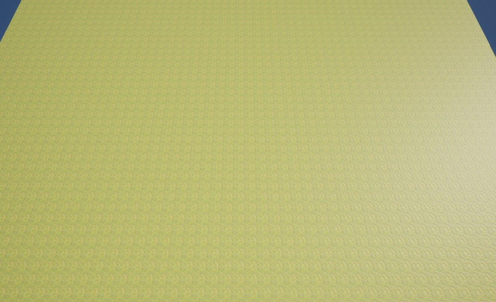
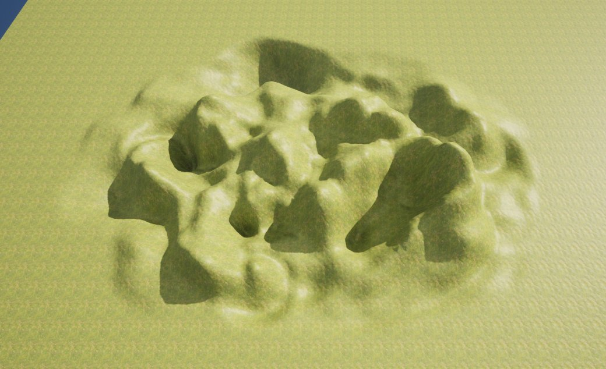

# 地形噪点工具

> 路径：虚幻引擎5.7文档 / 构建虚拟世界 / 地形户外地貌 / 编辑地形 / 雕刻模式 / 地形噪点工具

> 原始页面：https://dev.epicgames.com/documentation/unreal-engine/landscape-noise-tool-in-unreal-engine

**噪点** 工具将应用一个 噪点过滤器，在地形高度图表面生成各种变化效果。

## 使用噪点工具

在此例中，噪点工具用于在地形上进行绘制，与造型工具的使用方法相似。这样便能基于工具设置升高和降低高度图，在区域上绘制出多样性。 用户能够利用这个工具在地形上绘制出明显或微妙的多样性。

可使用以下功能键为地形高度图打造噪点效果：

| **功能键** | **操作** |
| --- | --- |
| **鼠标左键** | 增加高度图或所选图层的权重。 |

之前

之后

在此例中，噪点被绘制到平滑的地形表面上，基于使用的强度和属性值形成不同高度上的多样性。

## 工具设置

|  |  |
| --- | --- |
| Noise Tool | Noise Tool Properties |

| **属性** | **描述** |
| --- | --- |
| **Tool Strength** | 设定每次笔刷笔划效果的量。 |
| **Use Target Value** | 勾选后，将对应用至目标值的噪点值进行混合。 |
| **Noise Mode** | 确定是否应用所有噪点效果、确定噪点效果只使高度图上升，或只使高度图下降。 **Both**：点击鼠标时此项将升高和降低 噪点 在高度图上的绘制值。 **Raise**：点击鼠标时此项将升高 噪点 在高度图上的绘制值。 **Lower**：点击鼠标时此项将降低 噪点 在高度图上的绘制值。 |
| **Noise Scale** | 使用的柏林噪点过滤器尺寸。噪点过滤器与位置和比例有关，如不改变 **Noise Scale**，同一噪点过滤器将多次应用到相同位置。 |

笔刷强度决定使用噪点工具时升高或降低的量。
