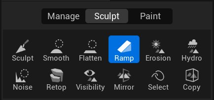
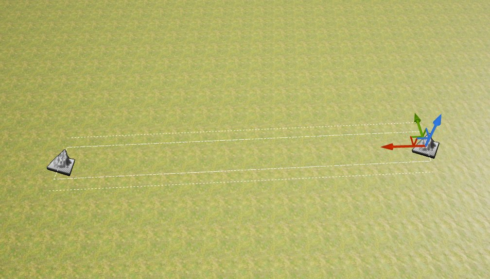
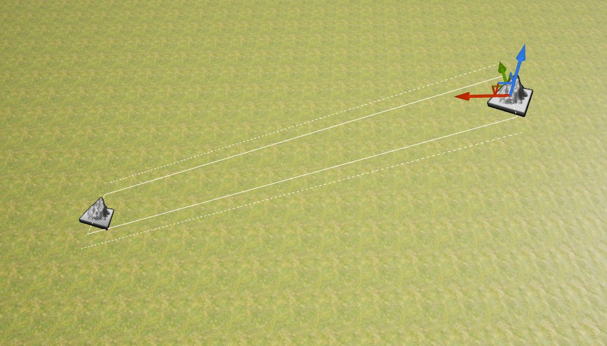
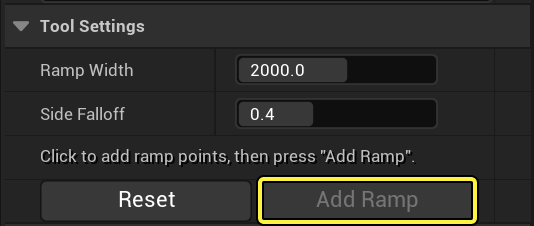
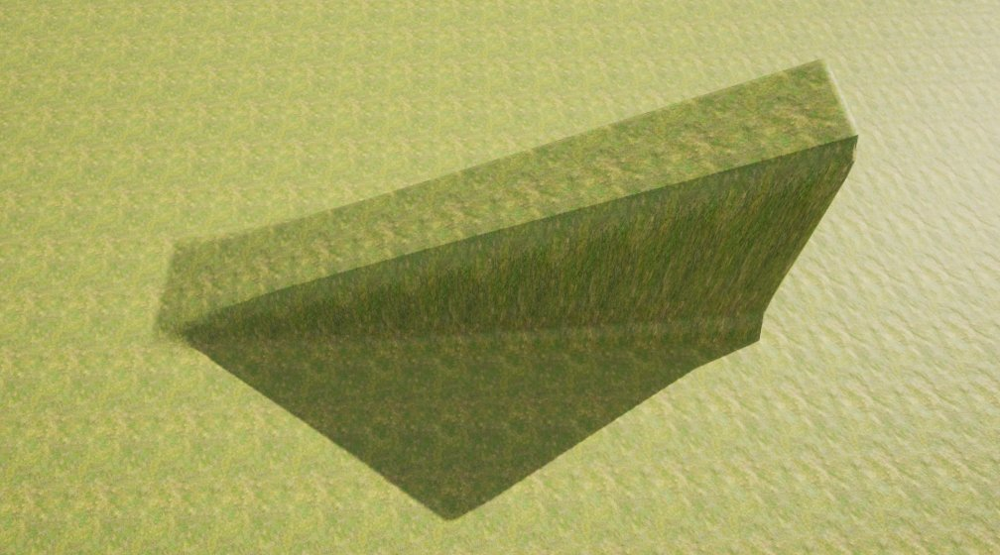

# 地形斜坡工具

> 路径：虚幻引擎5.7文档 / 构建虚拟世界 / 地形户外地貌 / 编辑地形 / 雕刻模式 / 地形斜坡工具

> 原始页面：https://dev.epicgames.com/documentation/unreal-engine/landscape-ramp-tool-in-unreal-engine

使用 **斜坡（Ramp）** 工具可在地形上选择两个位置并在两个点之间创建一个平板斜坡，并在侧边指定衰减。

## 使用斜坡工具

1. 在地形工具栏的 **造型（Sculpt）** 标签页中选择 **斜坡（Ramp）** 工具。

   
2. 在地形的视口中，**点击左键** 并进行拖动，或在地形的两个不同位置上点击左键即可标出斜坡的开始和结束点。

   

   > [!TIP]
   > 设置开始和结束点之后，如需放弃创建斜坡，点击 **重置（Reset）** 即可将其清除。
3. 选择任意一个标志并调整其位置。在此例中，它在地形表面之上沿 Z 轴移动。

   
4. 选择好位置后，点击工具设置中的 **添加斜坡（Add Ramp）** 按钮即可创建斜坡。

   

   现在，你的高度图中便拥有了一个斜坡。

   

## 工具设置

| Ramp Tool | Ramp Tool Properties |
| --- | --- |
|  |  |

| **属性** | **描述** |
| --- | --- |
| **Ramp Width** | 设置斜坡的宽度。 |
| **Side Falloff** | 在斜坡的侧边设置边缘衰减，使其融入整体地形。此衰减将为侧边的边缘流增添一些柔度。数值 **0** 意味着不存在衰减，数值 **1** 意味着斜坡不存在平坦表面，全为衰减。 |
