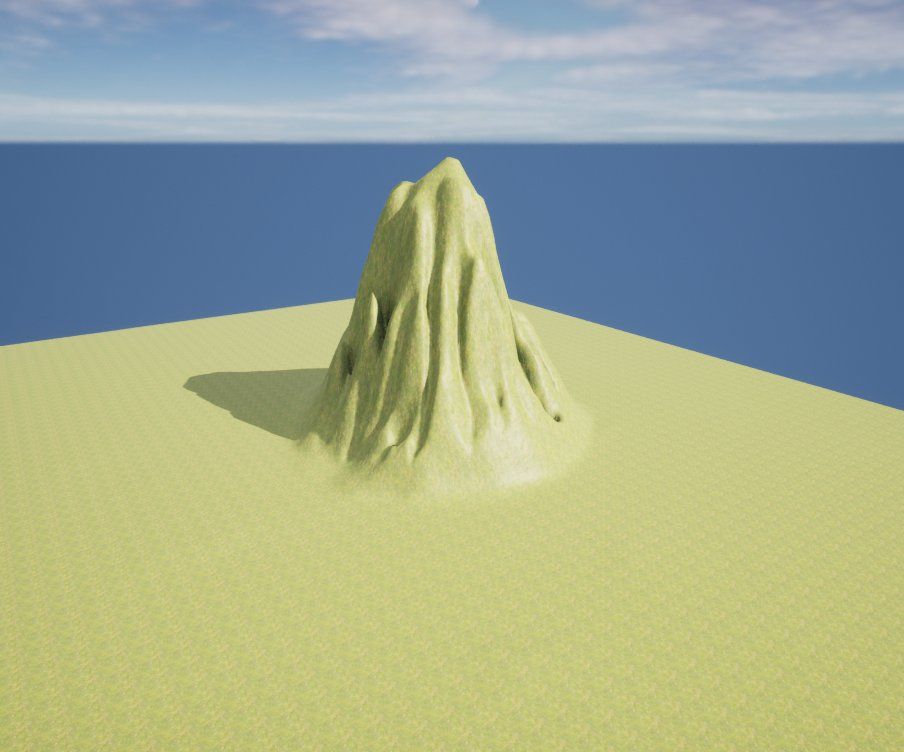
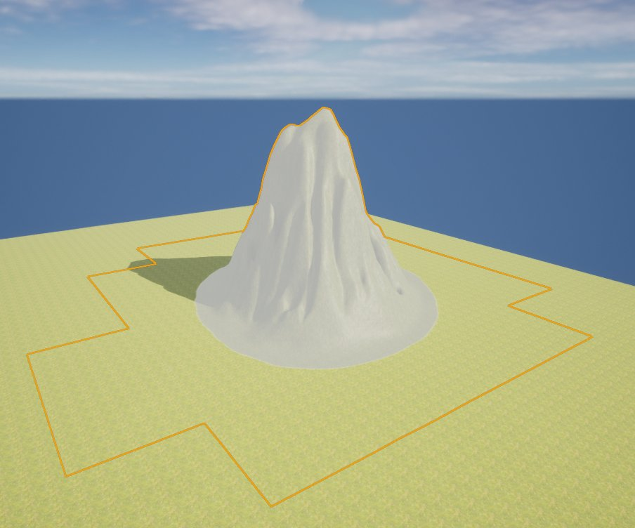

# 地形区域选择工具

> 路径：虚幻引擎5.7文档 / 构建虚拟世界 / 地形户外地貌 / 编辑地形 / 雕刻模式 / 地形区域选择工具

> 原始页面：https://dev.epicgames.com/documentation/unreal-engine/landscape-region-selection-tool-in-unreal-engine

**区域选择（Region Selection）** 工具使用当前的笔刷设置和工具强度选择区域，用于将地形 [小工具](../../landscape-copy-tool/index.md) 匹配到特定区域， 或用作复制数据到小工具（或从小工具复制数据）的遮罩。

## 使用区域选择工具

在此例中将利用默认正数法使用区域选择工具绘制地形区域；然后再切换至负数法，对不需要包括的区域进行位置；最终显示 Use Region As Mask 部分， 采集被绘制的整个地形组件，而非只采集其中的区域。

使用以下控制键绘制可用于选择的区域：

| **功能键** | **操作** |
| --- | --- |
| **鼠标左键** | 添加到所选区域。 |
| **Shift + 鼠标左键** | 从所选区域移除。 |

无选中

有选中

在此例中，一个区域已被绘制进行选择，然后可用于遮罩层或与复制/粘贴工具共用。

## 工具设置

| Landscape Select button | Selection tool properties |
| --- | --- |
|  |  |

| **属性** | **描述** |
| --- | --- |
| **Clear Region Selection** | 清楚当前选中的区域。 |
| **Tool Strength** | 设定每次笔刷笔划效果的量。 |
| **Use Region as Mask** | 勾选后，区域选择将成为活动区域（由所选区域构成）的遮罩。 |
| Region Selection |  |
| **Negative Mask** | 此项与 **Use Region as Mask** 同时勾选后，区域选择将成为一个遮罩，但活动区域由未选中的区域构成。 |
| Region Mask Negative Selection |  |
