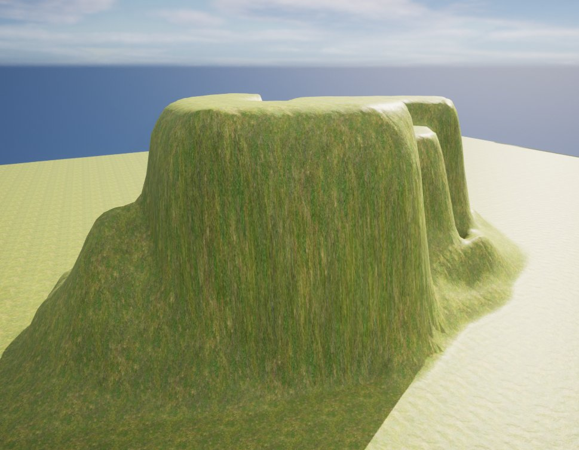
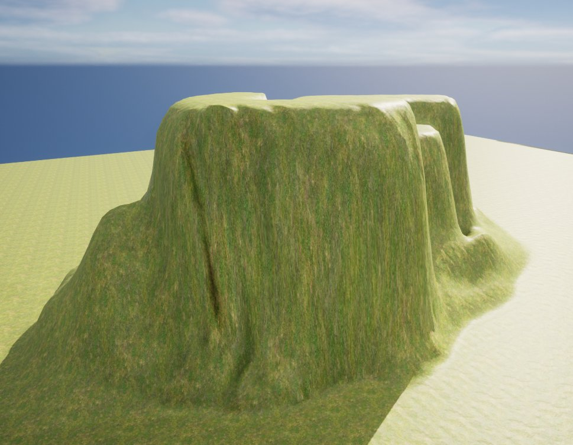
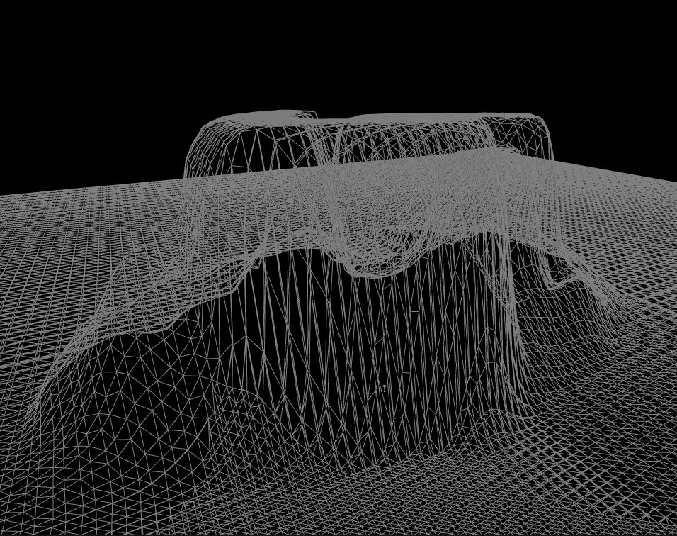
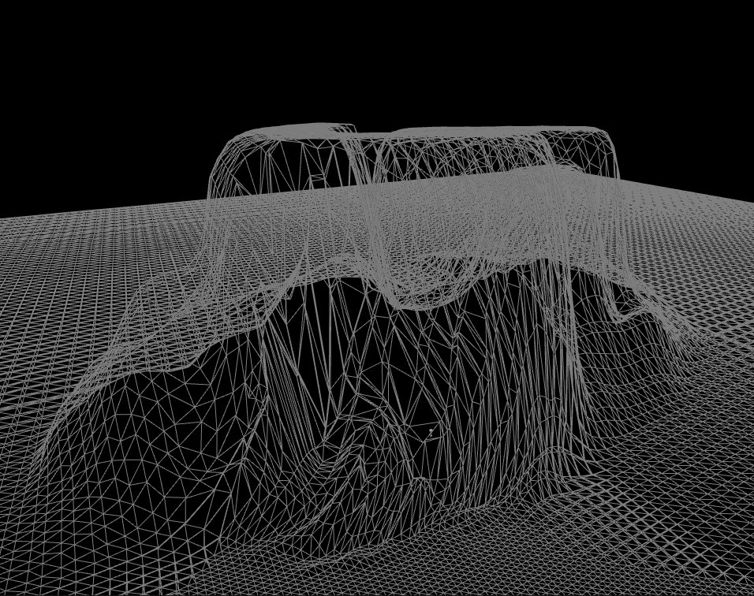

# 自动拓扑

> 路径：虚幻引擎5.7文档 / 构建虚拟世界 / 地形户外地貌 / 编辑地形 / 雕刻模式 / 自动拓扑

> 原始页面：https://dev.epicgames.com/documentation/unreal-engine/landscape-retopologize-tool-in-unreal-engine

**自动拓扑（Retopologize）** 工具通过 X/Y 偏移贴图自动调整地形顶点，改善所需区域中的顶点密度（如陡峭悬崖）。它将顶点分散到这些密度较低的区域中， 从而减少这类区域中的纹理拉伸。

> [!NOTE]
> 使用 X/Y 偏移贴图后，用其他工具渲染或绘制地形的速度将变慢，因此只推荐使用拓扑工具。

## 使用自动拓扑工具

在此例中，我们通过扁平区域形成了陡峭斜坡，然而这会使地形顶点数量较少的垂直区域沿表面分布，从而导致纹理出现拉伸， 扁平区域的边缘周围也会出现一些锯齿穿帮。使用拓扑工具可对可拉伸并重新分布周边顶点，无需对扁平区域的工作进行大量修改。 这能减少出现的拉伸和锯齿边。

使用以下功能键绘制 X/Y 偏移贴图，拓扑地形高度图：

| **功能键** | **操作** |
| --- | --- |
| **鼠标左键** | 增加高度图或所选图层的权重。 |

**拓扑光照视图**

使用前

使用后

**拓扑线框视图**

使用前

使用后

在范例对比中，您可在光照展示中法线尖锐坡度的纹理拉伸已减弱； 在线框展示中则能看到顶点已重新分布，更均匀地分布在这些陡峭的坡度上。

### 工具设置

没有可进行调整的拓扑特有工具设置。选择工具，在需要重新分布顶点密度的地形中绘制区域即可。
