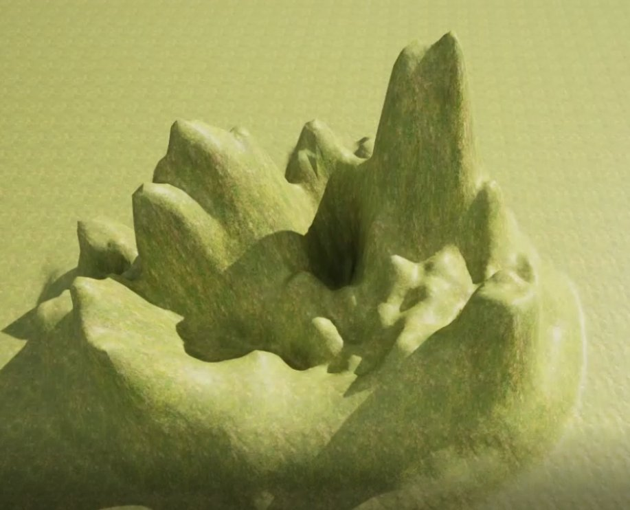
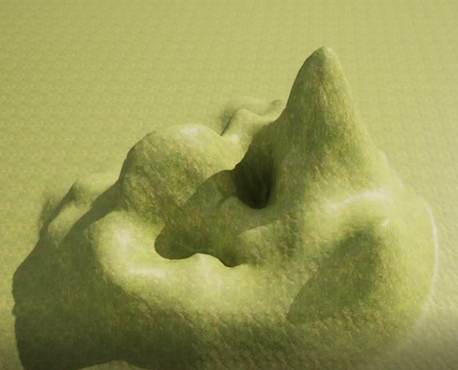

# 地形平滑工具

> 路径：虚幻引擎5.7文档 / 构建虚拟世界 / 地形户外地貌 / 编辑地形 / 雕刻模式 / 地形平滑工具

> 原始页面：https://dev.epicgames.com/documentation/unreal-engine/landscape-smooth-tool-in-unreal-engine

**平滑（Smooth）** 工具能够柔化高度图绘制值，消除使用造型或侵蚀工具后有时会出现的锯齿穿帮，使地形的外观平滑流畅。

## 使用平滑工具

在此例中，平滑工具将用于柔化使用诸多地形工具时可能出现的硬边穿帮。

可使用以下功能键打造地形高度图：

| **功能键** | **操作** |
| --- | --- |
| **鼠标左键** | 平滑并柔化高度图或所选图层的权重。 |

平滑前

平滑后

笔刷强度决定使用平滑工具时执行平滑的强度。

## 工具设置

| Landscape Smooth Button | Smooth Tool Properties |
| --- | --- |
|  |  |

| **属性** | **描述** |
| --- | --- |
| **Tool Strength** | 设定每次笔刷笔划的平滑量。 |
| **Filter Kernel Scale** | 设置执行平滑的半径中平滑过滤核的标度乘数。数值越高，平滑掉的细节越大；数值越低，平滑掉的细节越小。 |
| **Detail Smooth** | 勾选后，使用指定的细节平滑值进行保留细节的平滑操作。细节平滑值越大，更多细节将被移除；而数值越小，更多细节将被保留。 |
