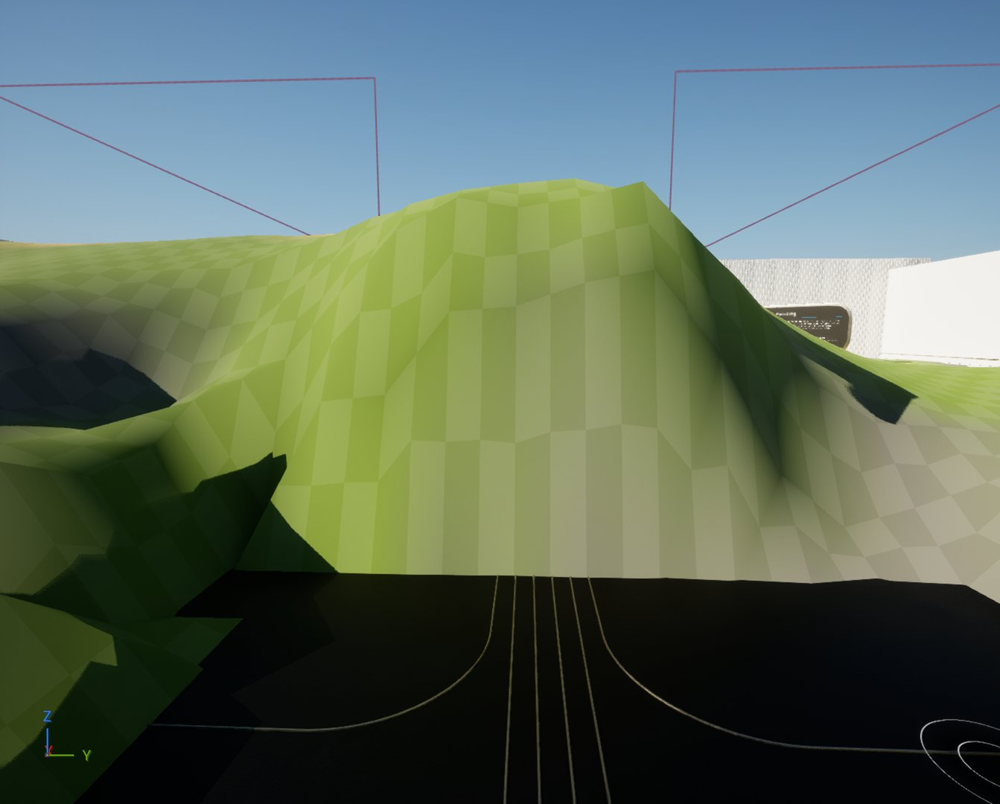
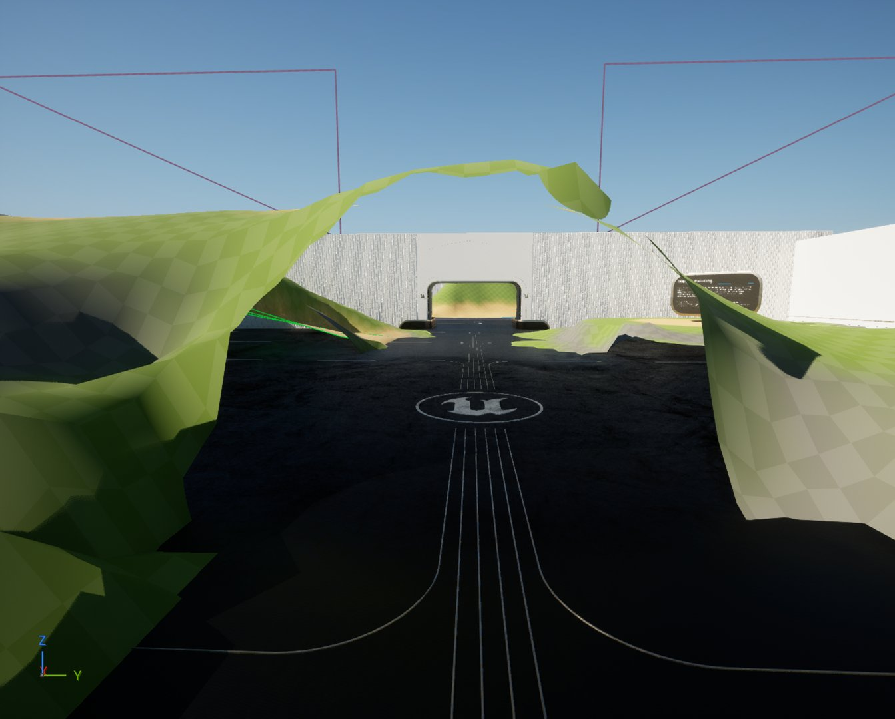
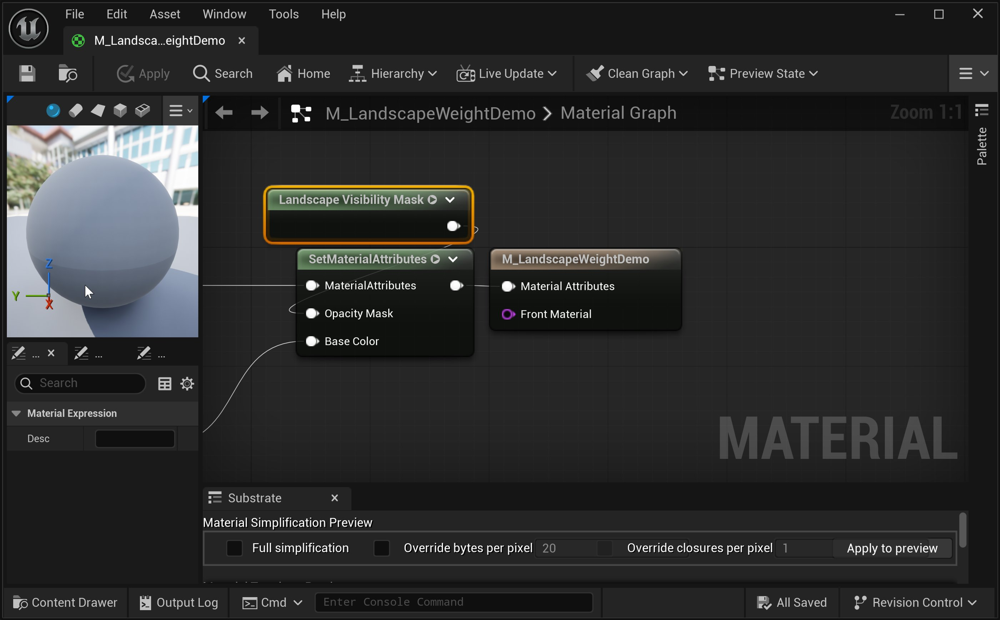
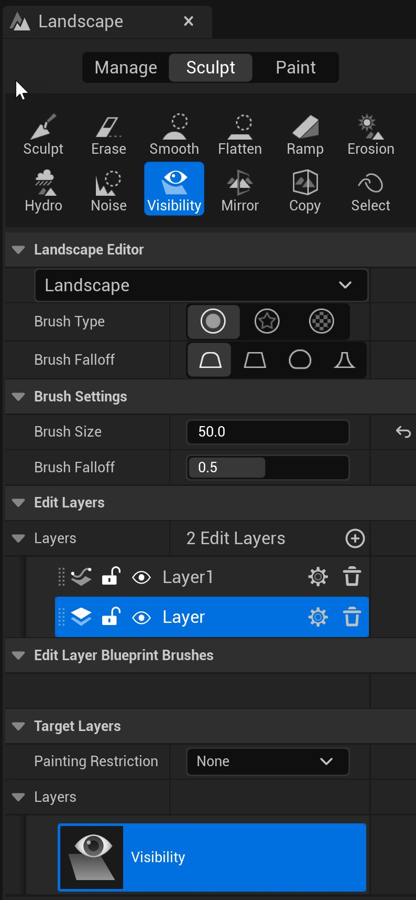
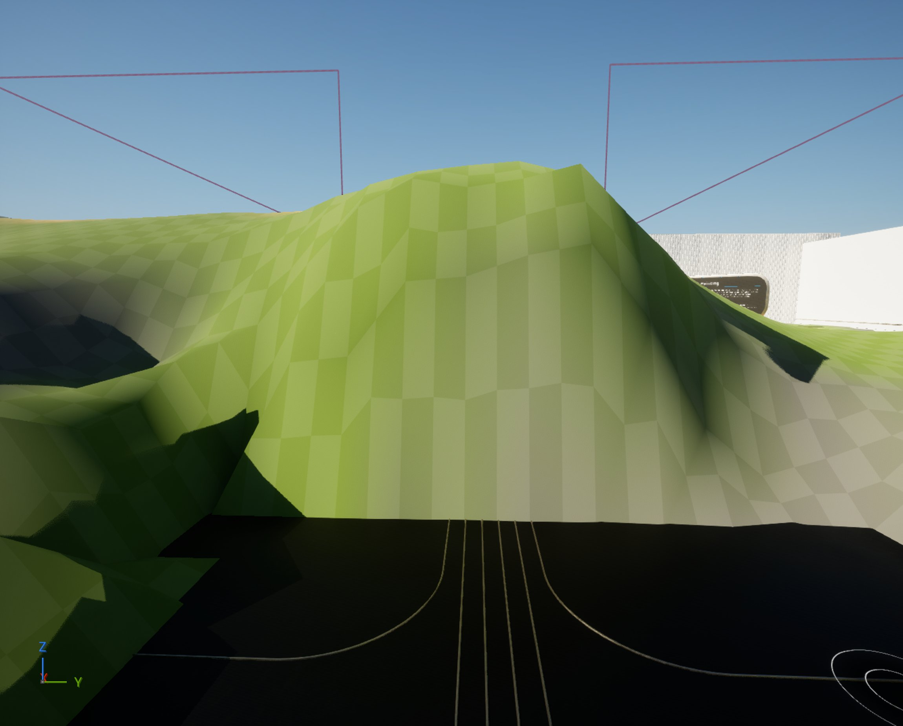
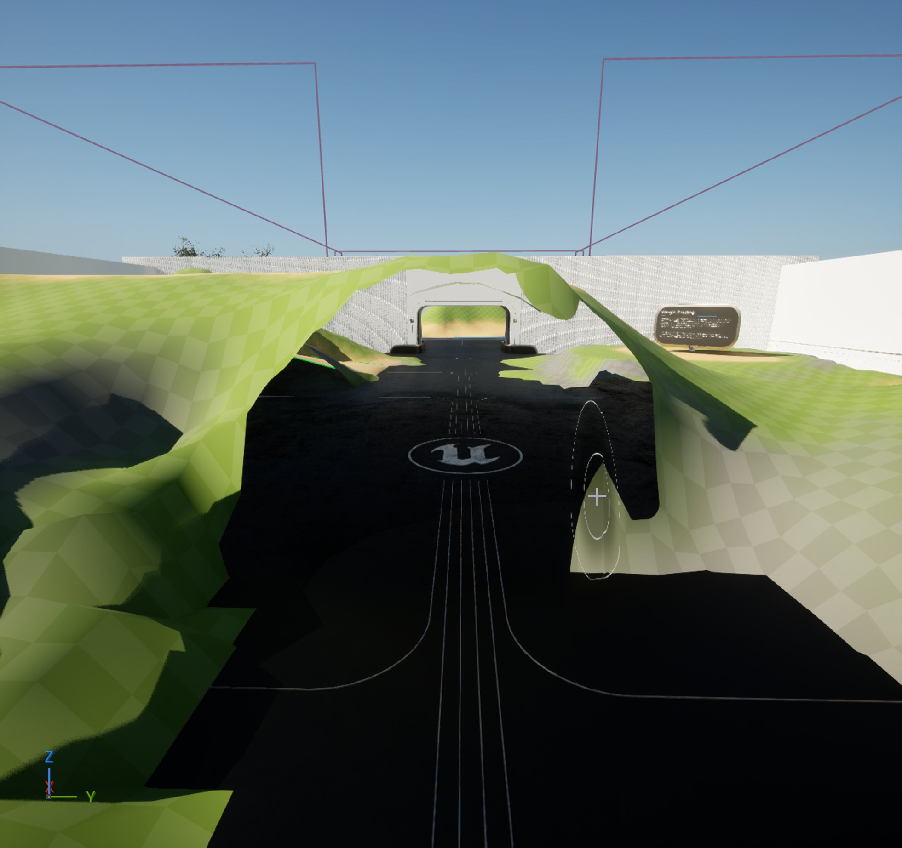
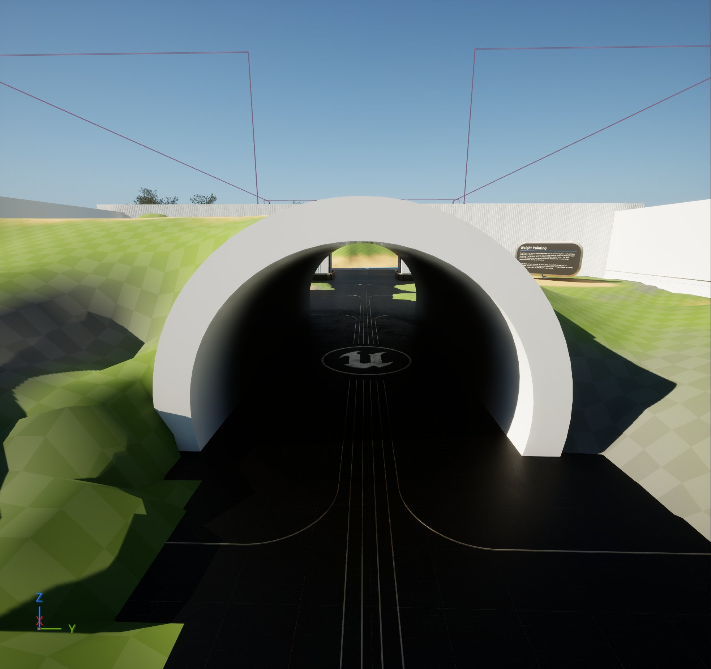

# 地形可视性工具

> 路径：虚幻引擎5.7文档 / 构建虚拟世界 / 地形户外地貌 / 编辑地形 / 雕刻模式 / 地形可视性工具

> 原始页面：https://dev.epicgames.com/documentation/unreal-engine/landscape-visibility-tool-in-unreal-engine

**可视性**工具提供了一种遮罩（创建洞）地形部分的方式，用于隧道或洞穴等区域。 这意味着你可以创建三维关卡环境，同时使用地形系统，尽管地形系统存在二维高度图雕刻的限制。 你可以通过在地形中添加洞口来人工创建隧道等区域，无缝过渡到非地形静态网格体部分。

## 使用可视性工具

在此示例中，我们使用了可视性工具，结合已设为使用**地形材质**的[地形可视性遮罩（Landscape Visibility Mask）节点](../../../landscape-materials/index.md#landscape-visibility-mask-node)。 这意味着你可以将地形的部分绘制为不可见或可见，以便使用额外的静态网格体Actor创建洞穴和其他地下区域。 上方的演示展示了先绘制不可视性，然后重新绘制可视性。

使用以下功能键绘制地形可见性的遮罩或非遮罩区域：

| 功能按钮 | 操作 |
| --- | --- |
| **左键单击** | 添加可见性遮罩，使地形不可见。 |
| **Shift + 左键点击** | 移除可见性遮罩，使地形组件重新可见。 |

前

后

在此示例中，我们使用了地形可视性遮罩节点的功能，为地形绘制不可见（或被遮罩）区域。 绘制遮罩区域时，你只能得到可见或不可见状态，因此无法实现从完全遮罩到无遮罩的过渡梯度。

### 使用可见性遮罩创建洞穴

虽然可以使用造型工具在地形中创建垂直洞穴，但你可能会发现你还需要创建水平洞穴，例如隧道或洞穴。 你可以通过使用可视性遮罩，利用可视性工具"涂抹"掉地形的一部分。

在你能够涂抹掉地形一部分的可视性之前，你必须使用可视性遮罩节点正确设置地形材质。 如需详细了解如何正确设置此项，请参阅地形材质文档中的[地形可见性遮罩节点](../../../landscape-materials/index.md#landscape-visibility-mask-node)部分。

> [!NOTE]
> 你也可以使用分配给地形材质的地形洞材质来绘制掉可见性，但这是一个旧版功能，渲染开销更高，因此不是首选方法。 如果你正在使用这种方法，我们建议切换到使用地形可见性遮罩节点。

### 创建地形洞

1. 确认已为地形指定 **地形洞材质**。

   
2. 在地形工具栏的 **雕刻** 模式中，选择 **可视性** 工具。

   
3. 确定在地形上创建洞穴的位置。

   
4. 将笔刷大小调整到你想要使用的大小，然后**单击左键**绘制洞口，**Shift + 单击左键**擦除现有洞口。

   
5. 你现在可以将静态网格体Actor匹配到地形的孔洞中，以创建隧道。

   

   > [!NOTE]
   > 要使用在编辑器中运行（PIE）测试新建洞穴的碰撞，你可能需要从 **地形** 模式切换到 **放置** 模式。

## 工具设置

此部分中没有可进行调整的可视性特有工具设置。 按照步骤使用[可见性遮罩节点](../../../landscape-materials/index.md#landscape-visibility-mask-node)设置地形材质，并使用绘制控件在遮罩区域中进行绘制。

如果地形材质中没有地形可见性遮罩节点，你将在**目标图层**下的可见性工具面板中看到以下警告：

> 图片已省略：可视性工具警告
