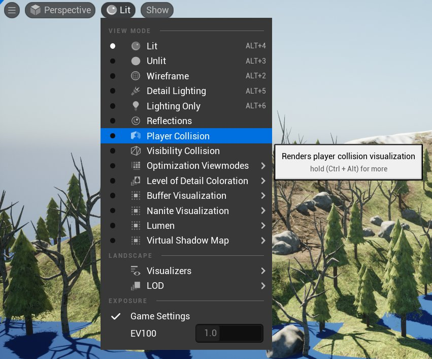
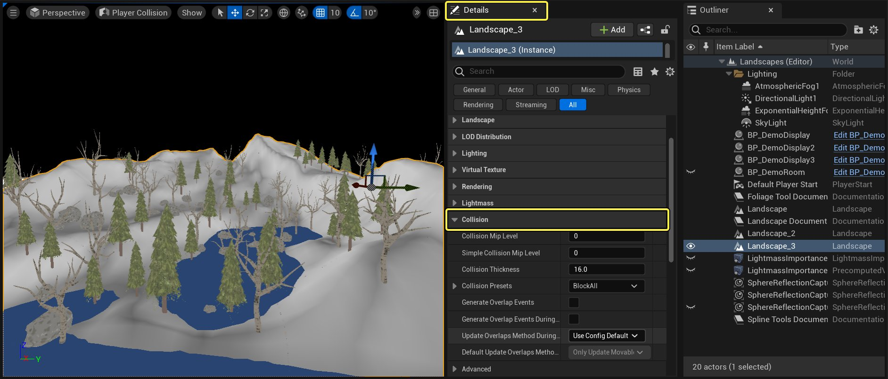
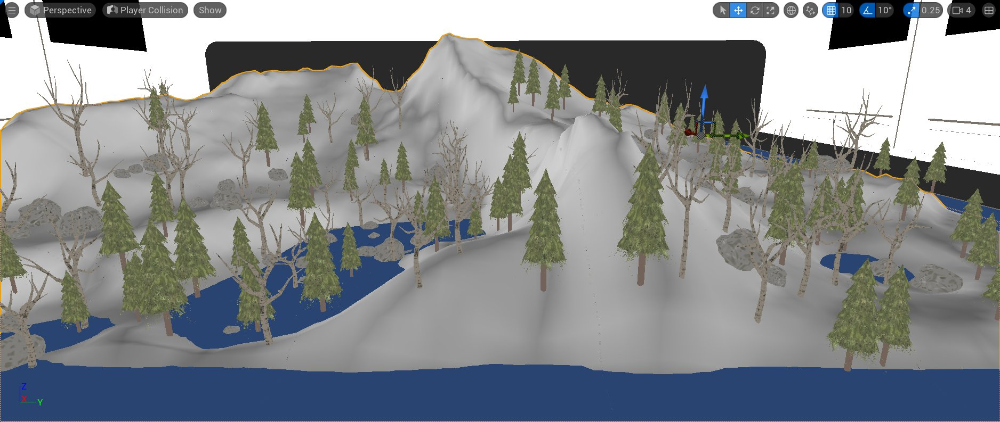
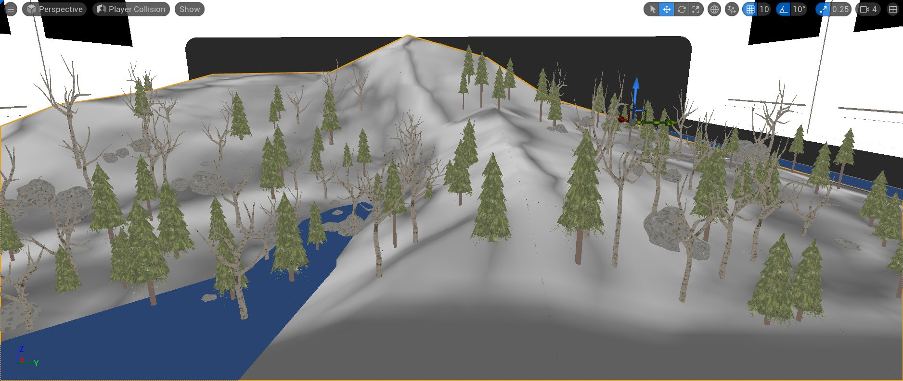
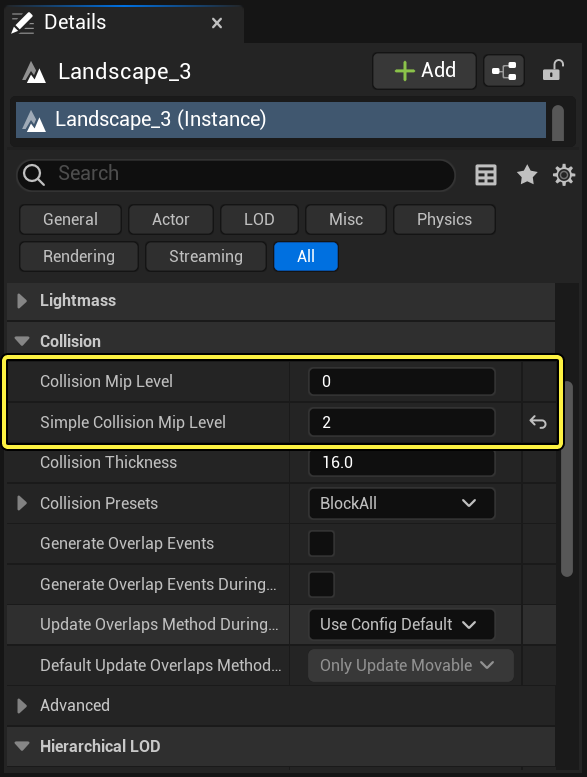
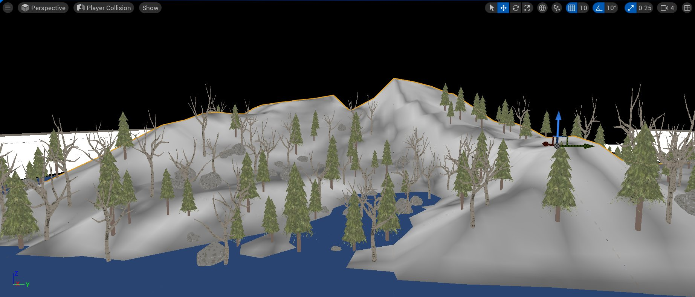
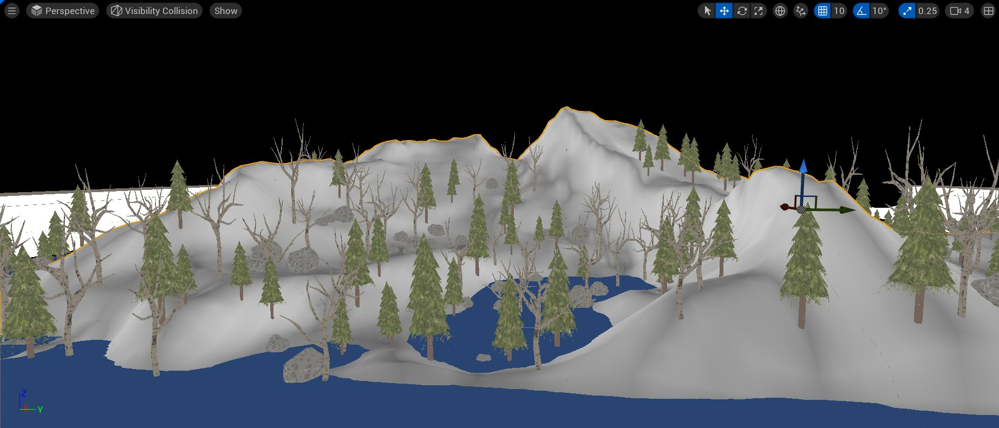

# 地形碰撞指南

> 路径：虚幻引擎5.7文档 / 构建虚拟世界 / 地形户外地貌 / 地形碰撞指南

> 原始页面：https://dev.epicgames.com/documentation/unreal-engine/landscape-collision-guide-in-unreal-engine

## 地形碰撞

虚幻引擎5（UE5）地形系统可指定几何体（这些几何体用于整个地形或单独组件的简单和复杂碰撞）的细节程度。在以下部分中，我们将说明如何使用该系统，以及在 UE5 项目中使用前须知的相关信息。

> [!NOTE]
> 在此示例中，我们使用的是在UE5启动程序 **学习** 标签页中的Content Examples项目。

### 碰撞Mip等级

如选择已放置在关卡中的任意地形 Actor，可在 **细节（Details） 面板的**碰撞（Collision）**部分下可找到两个设置：**碰撞Mip等级（Collision Mip Level）**和**简单碰撞Mip等级（Simple Collision Mip Level）**。

| 列 1 | 列 2 |
| --- | --- |
| **碰撞Mip等级（Collision Mip Level）** | 用于设置地形的 **复杂** 碰撞的复杂度。碰撞Mip等级默认设为 **0**，将获得准确的地形碰撞，但内存消耗较大。将此数值设为最高的 **5** 可控制地形碰撞的开销，但碰撞的准确性便会下降。 拖动滑块可在 0 到 5 之间调整碰撞 Mip 等级 **拖动滑块可在 0 到 5 之间调整碰撞 Mip 等级** |
| *简单碰撞Mip等级（Simple Collision Mip Level）** | 用于设置地形的 **简单** 碰撞的复杂度。简单碰撞Mip等级默认设为 **0**，将获得准确的地形碰撞，但内存消耗较大。将此数值设为最高的 **5** 可控制地形碰撞的开销，但碰撞的准确性便会下降。 拖动滑块可在 0 到 5 之间调整简单碰撞 Mip 等级 **拖动滑块可在 0 到 5 之间调整简单碰撞 Mip 等级** |

### 查看碰撞Mip等级

可通过玩家碰撞查看模式显示地形碰撞几何体。前往编辑器视口工具栏中的 **查看模式（View Mode）** 菜单，并选择 **玩家碰撞（Player Collision）** 或 **可见碰撞（Visibility Collision）** 即可启用碰撞查看模式。

点击查看大图。

| 列 1 | 列 2 |
| --- | --- |
| **玩家碰撞（Player Collision）** | **玩家碰撞（Player Collision）** 查看模式显示简单碰撞 Mip 等级。 碰撞Mip等级玩家碰撞 |
| **可见碰撞（Visibility Collision）** | **可见碰撞（Visibility Collision）** 查看模式显示碰撞 Mip 等级。 碰撞Mip等级可见碰撞 |

### 调整地形碰撞 Mip 等级

如要对简单和复杂地形碰撞的复杂度进行设置，需要执行以下操作：

1. 在编辑器视口中选择地形地貌。在 **细节（Details） 面板中打开**碰撞（Collision）** 部分。

   

   点击查看大图。
2. 在 **碰撞（Collision）** 部分下找到 **Collision Mip Level** 选项。将数值设为 **0** 到 **5** 之间，然后按下 **回车** 键应用变更。关卡中的灰色碰撞网格体将自动更新反映变更。

   

   

   碰撞Mip等级 0

   碰撞Mip等级 5

### 混合碰撞 Mip 等级选项

可对简单和复杂地形碰撞网格体二者的复杂度进行设置，在性能和准确度上达到更好的平衡。如要在项目中独立设置简单和复杂碰撞等级，需要执行下列操作：

1. 选择地形，然后在 **细节（Details） 面板中打开**碰撞（Collision）** 部分。

   

   点击查看大图。
2. 将 **碰撞 Mip 等级（Collision Mip Level）** 的数值设为 **0**；**简单碰撞Mip等级（Simple Collision Mip Level）** 的数值设为 **2**。

   

   点击查看大图。

在下图对比中即可明确碰撞Mip等级和简单碰撞Mip等级设为不同数值时地形碰撞的变化。

玩家碰撞|简单碰撞Mip等级 = 2

可见碰撞|碰撞Mip等级 = 0

> [!NOTE]
> 多数情况下将 **碰撞Mip等级（Collision Mip Level）** 设为 0，**简单碰撞Mip等级（Simple Collision Mip Level）** 设为 1 或 2。如使用的数字较高，角色和碰撞的精确度便会降低。

### 设置每个地形组件的碰撞Mip等级

可对单个地形组件的碰撞Mip等级进行设置，可降低关卡非操作区域的地形碰撞复杂度。

如要在项目中设置单个组件的碰撞Mip等级，需要执行下列操作：

1. 在 **模式（Modes）** 下拉菜单中点击地形（Landscape）选项并选中 **管理（Manage）** 标签页。

   > 图片已省略：Modes Panel

   点击查看大图。

   > 图片已省略：Landscape Panel

   点击查看大图。
2. 使用 **鼠标左键** 点击选中地形组件。选中的地形组件为红色高亮。

   > 图片已省略：Select a few Landscape components

   点击查看大图。
3. 在 **细节（Details） 面板中展开**地形组件（Landscape Component）**部分，将**碰撞Mip等级（Collision Mip Level）**和**简单碰撞Mip等级（Simple Collision Mip Level）**设为**5**。

   > 图片已省略：Details Panel

   点击查看大图。
4. 在 **工具设置（Tool Settings）** 下的地形 **管理（Manage）** 部分中，按下 **清除组件选择（Clear Component Selection）** 按钮可取消当前选中的地形组件。

   > 图片已省略：Clear Selected Component

   点击查看大图。
5. 多选择几个地形组件并将两个碰撞 Mip 等级均设为 2。

   > 图片已省略：Landscape Component

   点击查看大图。

下图中四个标出轮廓的地形组件的碰撞 Mip 等级设置不同。

> 图片已省略：Collision Mip level

点击查看大图。

| 数字 | 碰撞 Mip 等级 |
| --- | --- |
| 1 | 3 |
| 2 | 4 |
| 3 | 5 |
| 4 | 2 |
