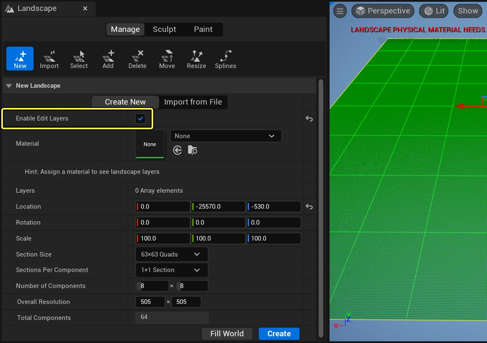
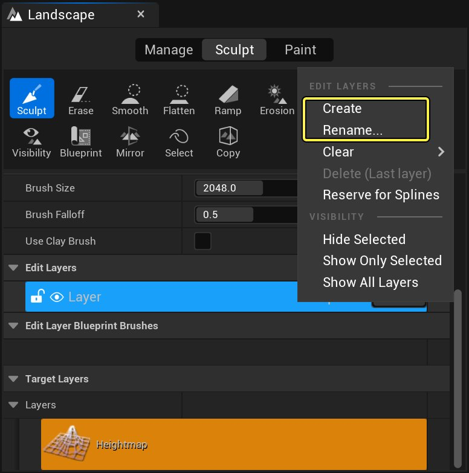
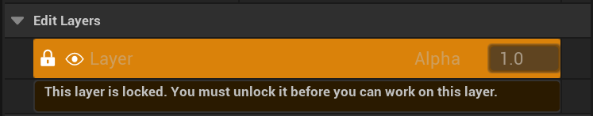
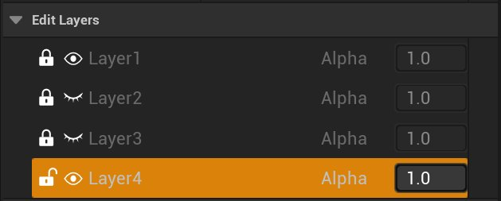
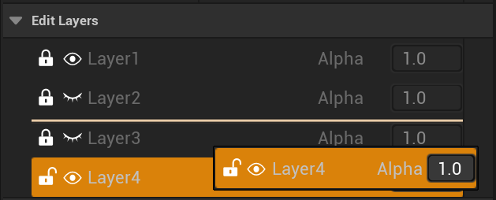
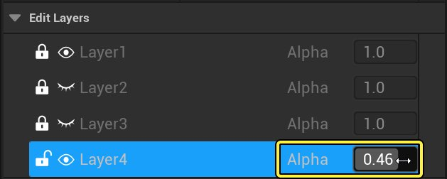
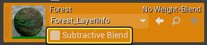
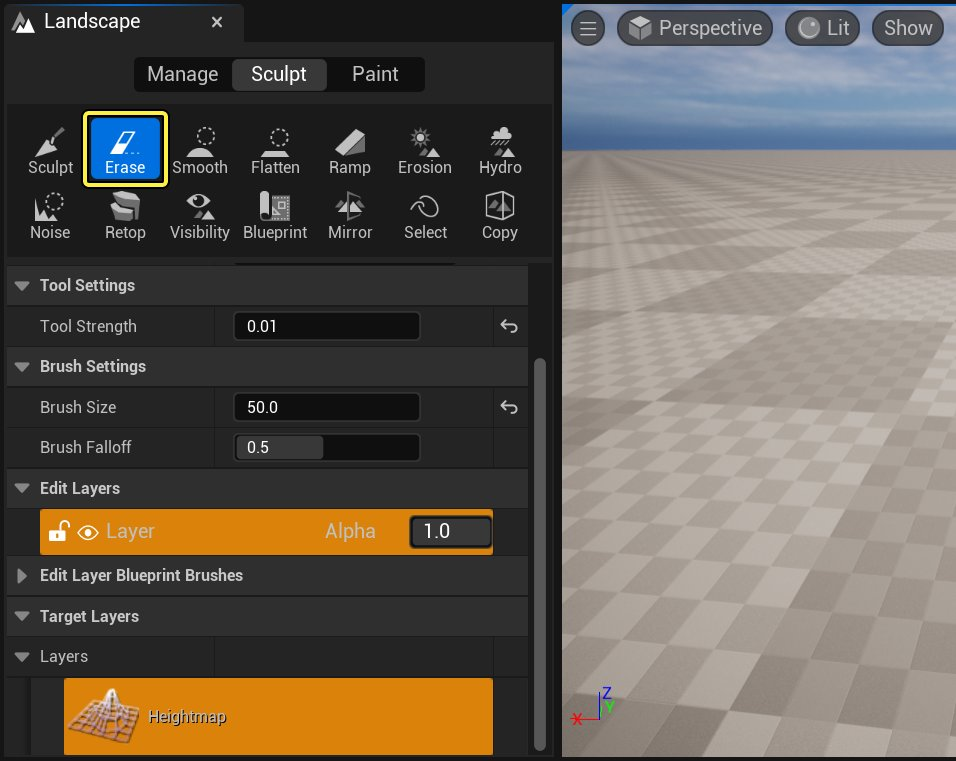

# 地形编辑层

> 路径：虚幻引擎5.7文档 / 构建虚拟世界 / 地形户外地貌 / 地形编辑层

> 原始页面：https://dev.epicgames.com/documentation/unreal-engine/landscape-edit-layers-in-unreal-engine

**地形编辑层（Landscape Edit Layers）** 可以编辑地形高度图，并使用非破坏性地形层绘制地形。你可以给地形添加多个层，每个都可以独立编辑。 你也可以保留一个层给样条使用，以便非破坏性地添加和绘制样条。添加、移动和编辑这些样条会自动更新非破坏性层。

要使用地形编辑层，请在 **管理（Manage）** 标签页下勾选 **编辑层（Edit Layers）**。层无法反向添加到现有地形中，你始终需要新建一个地形来在项目中使用它们。

点击查看大图。

> [!WARNING]
> 关闭地形层系统会导致编辑器删除所有图层数据。

## 将图层添加到地形中

新版本中不再用一个层来雕刻高度图或绘制材质，可将多个层添加到地形。 这些新层可作为雕刻和绘制地形的基础，从而更高效地操纵和维持地形。

默认情况下固定有一个层（Layer1），它是初始的基础层。要添加新层，**右键点击** 现有层并选择 **创建（Create）**。也可以通过此菜单 **重命名** 层。

我们建议对层进行重命名，这样就知道哪个是基础层，哪些是添加的层。可以在地形中添加任意数量的层。

点击查看大图。

## 管理层

有几个用来管理层的选项，包括：锁定/解锁层、隐藏/取消隐藏层，以及用层贡献高亮显示层。

### 锁定和解锁层

你可以选择 **锁定** 图标锁定该层。关闭的锁则表示无法编辑该层，打开的锁表示可以编辑该层。

点击查看大图。

### 隐藏和取消隐藏层

如要从混合中排除某个层，可选择眼睛图标来 **隐藏** 该层。

点击查看大图。

### 高亮显示层

要高亮显示层，可打开 **层贡献（Layer Contribution）**。通过高亮显示层可看到雕刻层的全貌。层将保持高亮显示，直到关闭高亮显示为止。要打开层贡献，导航至 **光照（Lit）> 显示器（Vizualizers）> 层贡献（Layer Contribution）**。 要查看层对高度图的贡献，在 **雕刻** 模式下选择该层。要查看层对绘制层的贡献，在 **绘制** 模式下选择该层。

请组合使用这些工具高效地雕刻和绘制高度图。例如，如决定绘制Layer1但不锁定基础层，可同时绘制这两个层。隐藏Layer1即可看到在基础层上的何处进行绘制。然而，如果在绘制Layer1前锁定基础层，那么基础层不会有任何改变。

## 编辑层

可以用多种方法编辑层，其中包括：排序层、调整透明度层混合和使用擦除工具。

### 排序层

可以按任何顺序拖放层。移动层时，层在视口中的显示顺序也会改变。

点击查看大图。

### 调整透明度层混合

可以通过增减 **透明度** 值来更改每个层的混合。视口会实时显示这些数值的更改。

点击查看大图。

每个层都有两个透明度值，一个用于控制高度图混合，另一个用于控制绘制层混合。 将高度图透明度值设为负值将进行删减混合。每个绘制层还有一个附加标记，用于确定混合是加乘式还是消去式。

### 擦除层中的高度

如对层使用擦除工具，雕刻会恢复到默认层高度。使用擦除工具时层贡献可能很有帮助，因为它会让层便于识别。

点击查看大图。

## 使用非破坏性样条线

新版本中可以在单独的层中创建和管理样条，使其与高度图的基础层分开。也就是说，新版本中可以非破坏性的方式编辑、更改和移动样条，地形将会自动成形。

要添加样条，首先添加一个新层。右键点击重命名该层，然后选择 **为样条保留（Reserve for Splines）**。系统提示时选择 **继续（Continue）**。

> 图片已省略：Reserve for splines in layer context menu

点击查看大图。

> 图片已省略：Reserved for plines layer message

点击查看大图。

你可以使用"细节"面板来编辑样条线，并使用"变换控件"调整样条线。改变图层顺序也会影响样条线，这意味着部分样条线可以根据图层顺序被地形隐藏。

## 其他信息

地形编辑层还包括一些其他功能，能让你以非破化性的方式轻松创建地形。请参阅以下功能，了解更多信息：

- 地形蓝图笔刷
