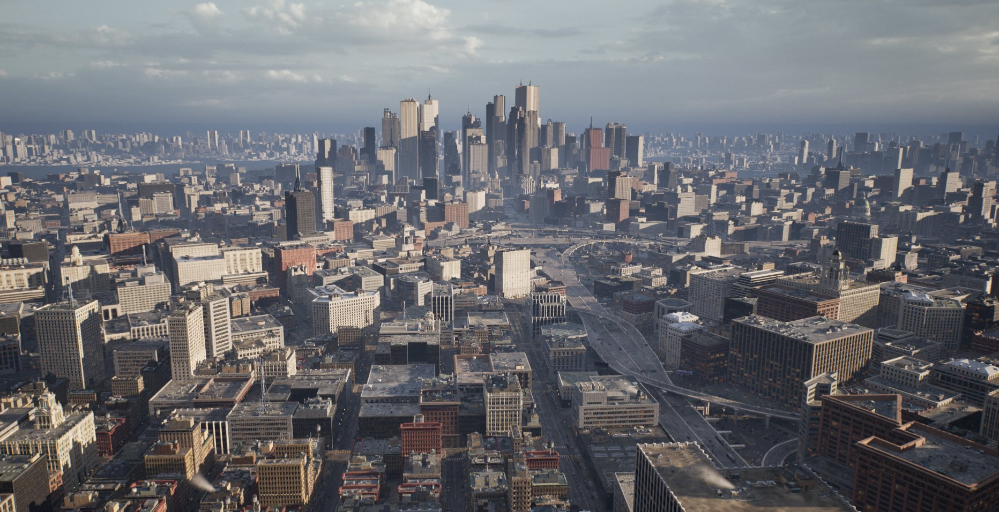
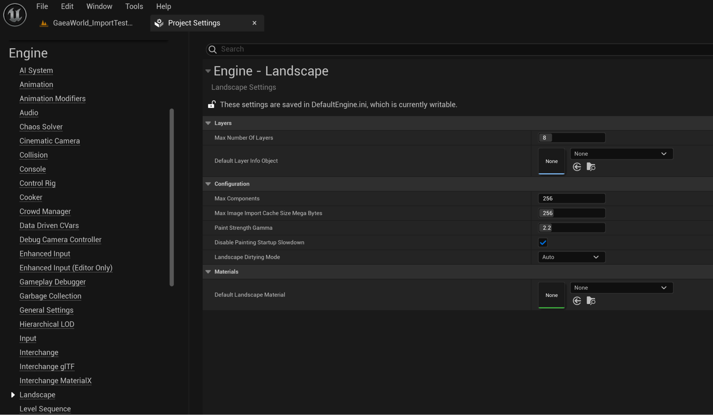

# Landscape地形概述

> 路径：虚幻引擎5.7文档 / 构建虚拟世界 / 地形户外地貌 / Landscape地形概述

> 原始页面：https://dev.epicgames.com/documentation/unreal-engine/landscape-overview

你可以使用 **地形（Landscape）** 为你的世界场景创建地形。山脉、山谷、起伏或倾斜的地面，甚至洞穴的开口都可以做到。使用地形系统的工具集，你就能修改地形的形状和外观。

有关开口和使用地形（Landscape）工具的信息，请参阅[地形快速入门指南](https://dev.epicgames.com/documentation/404)。

## 地形工具模式

地形工具有三种模式，可以通过地形工具窗口顶部的图标访问。

| 图标 | 模式 | 说明 |
| --- | --- | --- |
| Manage mode | **管理模式（Manage mode）** | 创建新的地形，并修改地形组件。你也可在管理模式中使用[地形拷贝工具](../editing-landscapes/landscape-copy-tool/index.md)复制、粘贴、导入、导出部分地形。有关管理模式的更多信息，请参阅[地形管理模式](https://dev.epicgames.com/documentation/unreal-engine/landscape-manage-mode-in-unreal-engine)。 |
| Sculpt mode | **雕刻模式（Sculpt mode）** | 通过选择和使用特定的工具，修改地形的形状。有关雕刻模式的更多信息，请参阅[地形雕刻模式](../editing-landscapes/landscape-sculpt-mode/index.md)。 |
| Paint mode | **绘制模式（Paint mode）** | 基于在地形材质中定义的图层，通过在地形上绘画纹理以修改部分地形的外观。有关绘制模式的更多信息，请参阅[地形绘制模式](../editing-landscapes/landscape-paint-mode/index.md)。 |

> [!TIP]
> 创建一个地形意味着创建一个地形Actor。与其他Actor一样，你可以在关卡编辑器的 **细节（Details）** 面板中编辑它的许多属性，包括其指定材质。有关 **细节（Details）** 面板的更多信息，请参阅[关卡编辑器细节面板](../../level-editor/level-editor-details-panel/index.md)。

## 地形功能

下面的章节将介绍Landscape地形系统的主要功能和采用的技术。

### 大地形尺寸

Landscape系统为地形铺平了道路，这些地形比之前在虚幻引擎中可能出现的地形大若干个数量级。由于其强大的 **细节级别（Level of Detail）** (**LOD**)系统和高效利用内存的方式，现在可以合法地实现和使用高达8192x8192像素的高度图。虚幻引擎现在支持广袤的室外世界场景，这意味着用户可以快速创建游戏，而无需修改现有的引擎或工具。

点击查看大图。

### Landscape内存使用

对于创建大型地形，Landscape通常是比 **静态网格体** 更好的选择。

对于顶点数据，Landscape为每个顶点使用4个字节。静态网格体以12字节矢量的形式存储位置，每个切线X和Z矢量封装为4个字节，并为每个顶点的共24或28个字节存储16位或32位浮点UV。

这意味着，对于相同的顶点密度，静态网格体将使用6或7倍于Landscape的内存。Landscape还将它们的数据存储为 **纹理**，并且可以为遥远的区域流送未使用的LOD关卡，并在你接近它们时从后台的磁盘加载它们。Landscape使用一个常规的高度场，因此其碰撞数据也能够比静态网格体的碰撞数据更高效地存储。

### 静态渲染数据作为纹理存储在GPU内存中

在大多数平台上，Landscape系统在GPU内存中以纹理的形式存储地形的渲染数据。这种存储形式允许在顶点着色器中查找数据。这种渲染数据使用32位纹理进行存储，高度会占据16位（通过R、G和法线通道）；或者保存为28位的数值（分别用于X和Y，占据B和A通道）。此外，如果使用了[重新拓补](../editing-landscapes/landscape-sculpt-mode/landscape-retopologize-tool/index.md) 工具，另外一个32位纹理会保存X和Y偏移。

### 连续Geo-MipMap LOD

标准纹理mipmap为Landscape地形处理LOD。每个mipmap都是一个细节级别，可以使用"text2Dlod"HLSL指令指定要采样的mipmap。你的Landscape可以拥有大量LOD，通知保持平滑的LOD过渡，因为一次过渡中的两个LOD的mip级别都可以被采样，然后高度和X和Y偏移量可以内插到顶点着色器以创建一个干净利落的变换效果。

| Landscape LOD1 | Landscape LOD1 to LOD2 | Landscape LOD2 |
| --- | --- | --- |
| **完全LOD 1（Fully LOD 1）** | **从LOD 1变换到LOD 2（Morphing from LOD 1 to LOD 2）** | **完全LOD 2（Fully LOD 2）** |

### 高度图和权重数据流送

由于使用纹理存储数据，虚幻引擎中的标准纹理流送系统可以根据需要对mipmap进行流进流出处理。这不仅适用于高度图数据，也适用于纹理层的权重。只需要每个LOD所需的mipmap，就可以在任何时候最大程度减少要使用的内存量，这意味着你可以创建更加庞大的地形。

### 高分辨率LOD独立照明

由于存储了地形的X和Y斜率，所以所有的高分辨率（非LOD）法线数据都可以用于照明计算。

| Landscape LODs | Landscape Full Resolution Normals |
| --- | --- |
| **地形LOD（Landscape LODs）** | **全分辨率法线（Full Resolution Normals）** |

这意味着你可以始终使用地形的最高分辨率执行逐像素照明，甚至在无LOD的遥远组件上也可如此。

| Landscape Simple Vertex Lighting | Landscape High Res Per-Pixel |
| --- | --- |
| **简单顶点照明** | **高分辨率逐像素照明** |

当这些高分辨率的法线数据与精细的法线图结合在一起时，Landscape地形可以实现非常精细的照明，却只需要极少的系统开销。

| Landscape Geometry Normals | Landscape Detail Normals |
| --- | --- |
| **仅几何体法线** | **带细节法线** |

### PhysX碰撞

Landscape用一个高度场对象来实现碰撞。你可以为图层指定[物理材质](../../../gameplay-systems/physics/physical-materials/index.md)，碰撞系统将使用每一位置的主导层来确定使用哪一种物理材质。可以使用降低的分辨率碰撞高度场（例如0.5x渲染分辨率）来节省大型Landscape地形的内存需求。远距Landscape的碰撞和渲染组件也可以使用关卡流送系统实现流出。

## 地形项目设置

地形项目设置

| **选项** | **说明** |
| --- | --- |
| **最大层数（Max Number of Layers）** | 定义可以添加到地形的最大编辑层数。 |
| **默认层信息对象（Default Layer Info Object）** | 定义要将哪个 **层信息对象（Layer Info Object）** 默认添加到新地形。 |
| **最大组件数（Max Components）** | 定义地形中的最大组件数。 |
| **最大图像导入缓存大小（兆字节）（Max Image Import Cache Size Mega Bytes）** | 定义导入图像缓存的最大大小，以MB为单位。 |
| **绘制强度Gamma（Paint Strength Gamma）** | 定义用于调整 **绘制（Paint）** 工具的强度的指数。 |
| **地形脏污模式（Landscape Dirtying Mode）** | 定义引擎何时要求重新保存地形： **自动（Auto）**：被标记为需要重新保存的地形会出现在 **选择要保存的文件（Choose files to save）** 对话框中。每当地形发出请求时，改动将被保存。此为默认模式。 **仅在地形模式中（In Landscape Mode Only）**：被标记为需要重新保存的地形不会出现在 **选择要保存的文件（Choose files to save）** 对话框中。此为手动保存模式，由用户负责避免与其他用户发生文件竞争。视口将显示错误信息，说明地形Actor不是最新版本，需要重新保存。这需要通过 **构建（Build）> 保存修改后的地形（Save Modified Landscapes）** 完成。 **在地形模式和用户触发的修改中（In Landscape Mode and User Triggered Changes）**：被标记为需要重新保存的地形不会出现在 **选择要保存的文件（Choose files to save）** 对话框中。但任何用户触发的修改（直接或间接）都会要求重新保存地形。推荐协作团队使用此模式，因为它提供其他两种模式中最好用的功能，同时确保了被修改的地形Actor得到保存，并被正确提交到源控制中。 |
| **默认地形材质（Default Landscape Material）** | 定义默认分配给地形的地形材质。 |
