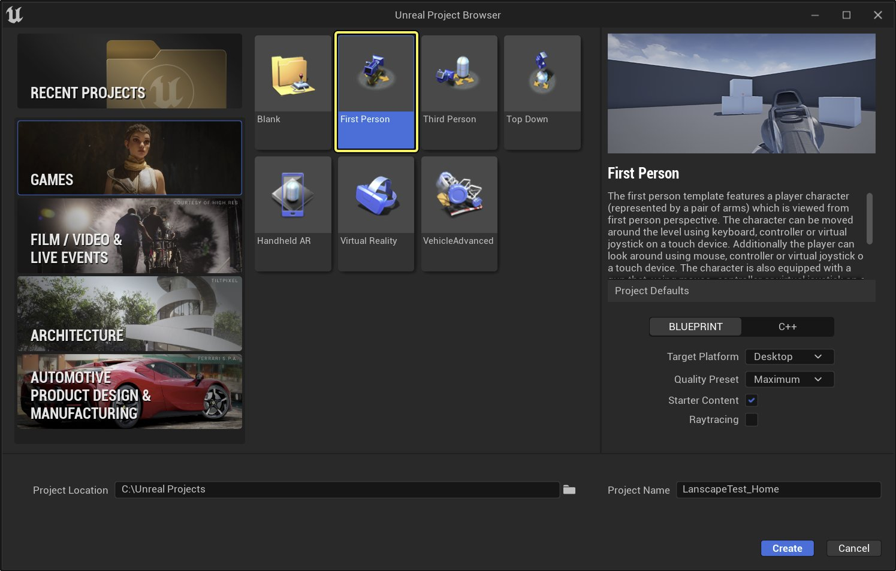
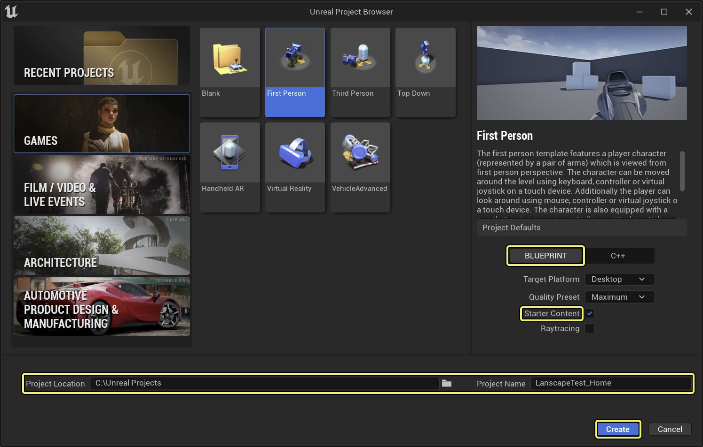
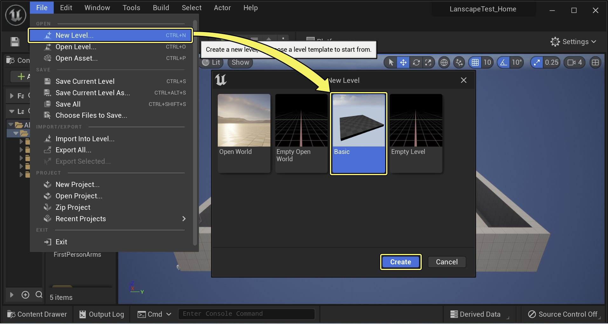
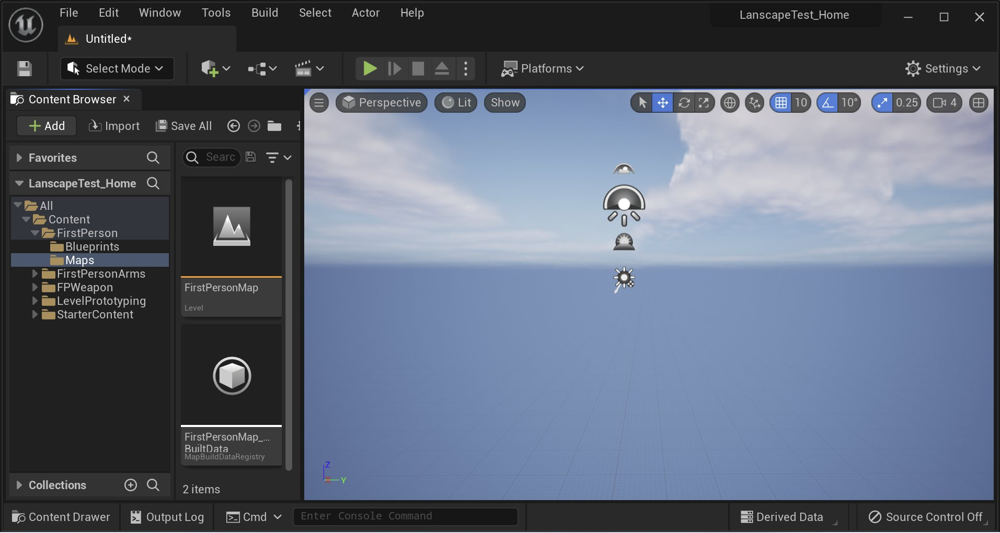
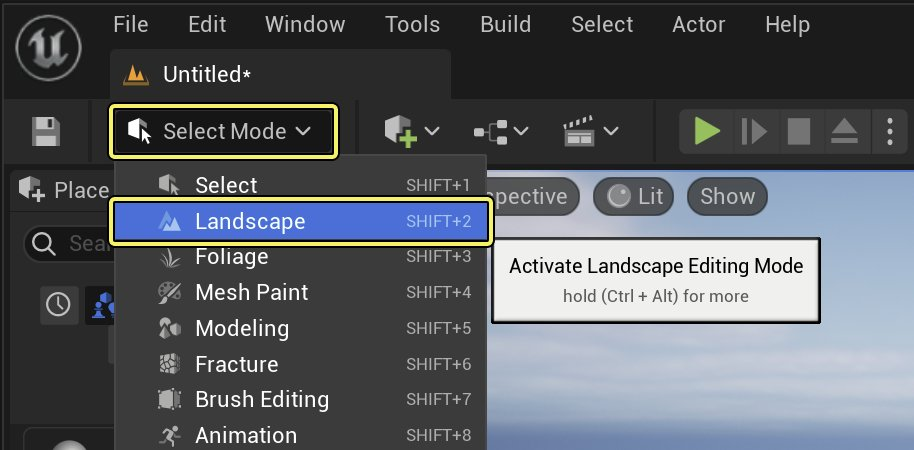
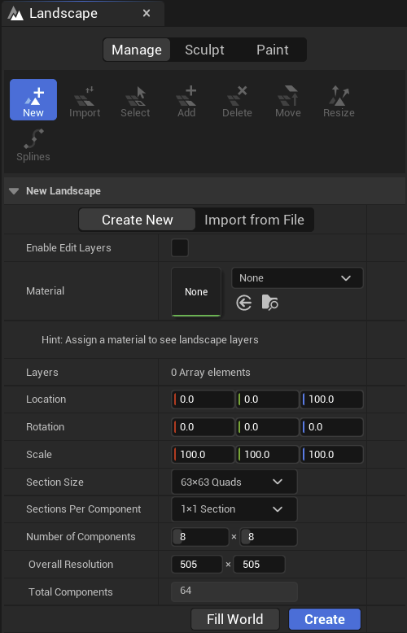
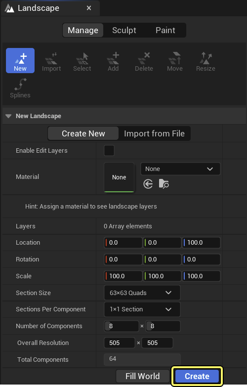

# Landscape Quick Start Guide

> 路径：虚幻引擎5.7文档 / 构建虚拟世界 / 地形户外地貌 / Landscape Quick Start Guide

> 原始页面：https://dev.epicgames.com/documentation/unreal-engine/landscape-quick-start-guide-in-unreal-engine

该页面没有可用的官方中文版本；以下内容保留原文，并按本项目人工译文规则逐步回译。

Unreal Editor/Landscape Quick Start Guide（地形快速入门） 会带你完成创建新 Landscape、雕刻 Landscape、为 Landscape 创建 Material，以及在 Landscape 上绘制这些 Material 的流程。

## 1 - 使用 Landscape Tools

该 **Landscape（地形）** Unreal Engine 5（UE5）中的 Landscape system 是一组工具，用于创建广阔 outdoor environment。在开始创建第一个 Landscape 之前，先熟悉与 Landscape system 交互时最常用的一些工具和键盘输入。

### 打开 Landscape Tool 并使用模式

所有用于与 Landscape system 交互的工具都可以在以下位置找到： **Landscape（地形）**选项，该选项位于 **Modes（模式）**下拉菜单中。要启用 Landscape tools，请打开 Modes 下拉菜单，并从菜单中选择该选项。

Landscape tool 有三个 mode： **Manage（管理）**, **Sculpt（雕刻）**, and **Paint（绘制），**可通过点击 Landscape toolbar window 顶部图标访问。每个 mode 提供不同 Landscape 交互方式。下面快速概述每种 mode 可执行的操作。

| Icon（图标） | Mode（模式） | 说明 |
| --- | --- | --- |
| [Manage mode](https://dev.epicgames.com/community/api/documentation/image/e3a9361d-8795-410f-a9f6-b083217f2a6c?resizing_type=fit) | Manage mode（管理模式） | 创建新的 Landscape，并修改 Landscape component。Manage mode 也是使用以下工具的位置： [Landscape Copy Tool（地形复制工具）](../editing-landscapes/landscape-copy-tool/index.md) 用于复制、粘贴、导入和导出 Landscape 的部分内容。有关 Manage mode 的更多信息，请参阅 [Landscape Manage Mode（地形管理模式）](https://dev.epicgames.com/documentation/unreal-engine/landscape-manage-mode-in-unreal-engine?application_version=5.7). |
| [Sculpt mode](https://dev.epicgames.com/community/api/documentation/image/0a1c9648-e916-497e-9e10-dc8403ef16e2?resizing_type=fit) | Image mode（图像模式） | 通过选择和使用特定工具修改 Landscape 形状。有关 Sculpt mode 的更多信息，请参阅 [Landscape Sculpt Mode（地形雕刻模式）](../editing-landscapes/landscape-sculpt-mode/index.md). |
| [Image mode](https://dev.epicgames.com/community/api/documentation/image/d752bec0-5759-4af7-aa10-edd5a43077ad?resizing_type=fit) | Sculpt mode（雕刻模式） | 根据 Landscape Material 中定义的 layer，通过绘制 texture 修改 Landscape 局部外观。有关 Paint mode 的更多信息，请参阅 [Landscape Paint Mode（地形绘制模式）](../editing-landscapes/landscape-paint-mode/index.md). |

### 与 Landscape Tools 交互

Landscape tools 中的三种 mode 允许以不同方式与 Landscape 交互，但使用的键盘和鼠标按键相似。下面列出使用 Landscape tool 时最常见的一些按键、组合键和鼠标按钮。

| Common Controls（常用控制） | Operation（操作） |
| --- | --- |
| **Ctrl** | 选择 Landscape component。 |
| **Left Mouse Button（LMB，鼠标左键）** | 抬高或增加 heightmap 或选中 layer 的 weight。例如在 Sculpting mode 中会抬高 Landscape heightmap；在 Paint mode 中会把选中的 material 应用到 Landscape。 |
| **Shift + LMB** | 降低或减少 heightmap 或选中 layer 的 weight。例如在 Sculpting mode 中会降低 Landscape heightmap；在 Paint mode 中会擦除应用到 Landscape 某个区域的选中 material。 |
| **Ctrl + Z** | 撤销上一个操作。 |
| **Ctrl + Y** | 重做上一次撤销的操作。 |

## 2 - 创建新的 Landscape

开始创建第一个 Landscape 之前，先创建一个新项目： **First Person（第一人称）** 项目。

如果不熟悉如何创建新项目，请查看以下页面： [Creating a New Project（创建新项目）](../../../understanding-the-basics/working-with-projects-and-templates/creating-a-new-project/index.md).

### Creating a Landscape（创建地形）

1. 首先创建一个新的 **First Person（第一人称）** 项目（如果尚未创建）。

   虽然本教程可以使用其他 template，但 First Person 更便于检查 Landscape。选择 First Person 选项后，点击 **Next（下一步）** 按钮。

   

   点击图片查看完整尺寸。
2. 确保项目设置为使用 Blueprint，并包含 Starter Content 文件夹。选择项目在电脑上的存储位置，并确认名称合适。最后点击 **Create Project（创建项目）** 按钮继续。

   

   点击图片查看完整尺寸。
3. 创建新项目并加载 editor 后，使用以下菜单创建新 level： **File > New Level（文件 > 新建关卡）** 并选择 **Default（默认）** 作为 New Level Template 中的 Level。

   

   点击图片查看完整尺寸。
4. 新 level 创建后，选择 **Floor（地板）** 并按 **Delete** 键将其从 level 中移除。

   > [!NOTE]
   > 请选中 Player Start，并在 Z 轴上略微上移。这样可以确保 player 不会从新创建的 Landscape 下方开始。

   完成后，应得到类似下图的结果。

   

   点击图片查看完整尺寸。
5. 清空 level 并将 Player Start 在 Z 轴上略微上移后，就可以创建新的 Landscape。要创建新 Landscape，请点击 **Landscape（地形）** option in the **Modes（模式）** 下拉菜单。

   

   点击图片查看完整尺寸。
6. 点击 Landscape 选项后，会在以下面板中看到一组 Landscape tools： **Landscape（地形）** 面板。

   

   点击图片查看完整尺寸。
7. 本教程只关注使用默认设置创建 Landscape。若想了解 Landscape tool 的 Manage mode 各项设置，请参阅 [Creating Landscapes（创建地形）](../creating-landscapes/index.md). 现在请确保设置与下图一致，然后点击 **Create（创建）** 按钮创建 Landscape。

   

   点击图片查看完整尺寸。

   完成后，应得到类似下图的结果。

   > 图片已省略：Creating a Landscape

   点击图片查看完整尺寸。

### 3 - 雕刻 Landscape

雕刻 **Landscape（地形）** 是一个耗时过程。所有 sculpting 工具都位于 **Sculpt（雕刻）** tab 下的 Landscape toolbar 中。若想详细了解每个 Sculpting Tool 的作用，请查看 [Sculpt Mode（雕刻模式）](../editing-landscapes/landscape-sculpt-mode/index.md) 页面。有关 sculpting Landscape 时最常用键盘和鼠标交互，请参阅 [与 Landscape Tools 交互](index.md#nbsp-interacting-with-the-landscape-tools) 一节。

在本教程的 Landscape 雕刻部分，将从一块完全平坦的 Landscape 区域开始，并逐步添加细节。这里的目标不是精确复制教程中的结果，而是熟悉并习惯使用各种 Landscape tool。

> [!NOTE]
> 教程中的结果可能无法与下方截图完全一致，原因有很多。使用 Landscape tools 需要大量尝试和修正，因此你的结果会与图中的示例不同，有时差异很大。本教程最重要的收获，是理解每个 Landscape tool 如何工作，以及这些工具如何协同生成最终结果。

1. 首先找到要处理的 Landscape 区域。本教程不会填充整个 Landscape，只处理其中一块。为便于使用，请按以下按键设置 camera bookmark： **Ctrl + 1** 。这会设置 camera bookmark，提供一个可随时返回的 camera view，便于判断 Landscape 进展。在 editor session 中任意时刻按 1 键，camera 会返回到设置的同一位置。

   > 图片已省略：Find a Landscape section to work with

   点击图片查看完整尺寸。
2. 设置 bookmark 后，使用以下工具开始绘制 hill 和 valley 的大形体： **Sculpt Tool（雕刻工具）**. 此步骤使用的 brush size 和 strength setting 列在下方；完成后应得到类似下图的结果。Brush Size 和 Strength 可在 Landscape panel 或 viewport 上方的 Landscape toolbar 中修改。

   | Tool Used（使用工具） | Brush Size（笔刷大小） | Strength Setting（强度设置） |
   | --- | --- | --- |
   | **Sculpt Tool（雕刻工具）** | 8192 | 0.29 |

   > 图片已省略：Sculpting hills and valleys

   点击图片查看完整尺寸。
3. 完成 hills 和 valleys 的 blockout 后，使用 **Smooth Tool（平滑工具）** 来优化它们的外观和感觉。使用此工具会平滑你的 **Landscape（地形）** 特征，使其更自然。注意不要把所有特征都平滑掉! 此步骤使用的 brush size 和 strength setting 列在下方；完成后应得到类似下图的结果。

   | Tool Used（使用工具） | Brush Size（笔刷大小） | Strength Setting（强度设置） |
   | --- | --- | --- |
   | **Smooth Tool（平滑工具）** | 2048 | 0.29 |

   > 图片已省略：Smoothing your Landscape

   点击图片查看完整尺寸。
4. 平滑 Landscape 后，可以使用以下工具添加一些平坦 mesa 状区域： **Flatten Tool（平整工具）**. Flatten Tool 会捕获第一次点击位置的高度信息，并升高/或降低 heightmap，使其在拖动 brush 时贴合该高度点。 此步骤使用的 brush size 和 strength setting 列在下方；完成后应得到类似下图的结果。

   | Tool Used（使用工具） | Brush Size（笔刷大小） | Strength Setting（强度设置） |
   | --- | --- | --- |
   | **Flatten Tool（平整工具）** | 2048 | 0.29 |

   > 图片已省略：Flatten you Landscape

   点击图片查看完整尺寸。
5. 现在使用 **Ramp Tool（坡道工具）** 在 mesa 之间添加平坦 ramp。该工具通过指定 ramp 起点和终点，然后点击 **Add Ramp（添加坡道）** 按钮，在两点之间创建平坦路径。每个点都可向任意方向移动，以创建适合具体情况的 ramp。 此步骤使用的 brush size 和 strength setting 列在下方；完成后应得到类似下图的结果。 如果不容易看出 Ramp 的使用位置，图中已用黄色高亮。

   | Tool Used（使用工具） | Ramp Width（坡道宽度） | Side Falloff（侧边衰减） |
   | --- | --- | --- |
   | **Ramp Tool（坡道工具）** | 2000 | 0.40 |

   > 图片已省略：Creating Ramps in your Landscape

   点击图片查看完整尺寸。
6. 接下来，使用以下工具向 Landscape 添加 erosion effect，使其具有风化外观： **Erosion Tool（侵蚀工具）** 它通过模拟风蚀工作，非常适合削去 hill 局部以创建 mountain peak 和 ridge。 此步骤使用的 brush size 和 strength setting 列在下方；完成后应得到类似下图的结果。

   | Tool Used（使用工具） | Brush Size（笔刷大小） | Strength Setting（强度设置） |
   | --- | --- | --- |
   | **Erosion Tool（侵蚀工具）** | 693 | 0.25 |

   > 图片已省略：Erode your Landscape

   点击图片查看完整尺寸。
7. 下一步会在刚添加的 erosion 基础上继续推进，为 Landscape 添加 Hydro Erosion。 The **Hydro Erosion Tool（水力侵蚀工具）** 不同于 Erosion Tool，它用于模拟水随时间侵蚀 Landscape detail 的方式。与 **Smooth Tool（平滑工具）**, 请注意不要侵蚀掉所有 detail。 此步骤使用的 brush size 和 strength setting 列在下方；完成后应得到类似下图的结果。

   | Tool Used（使用工具） | Brush Size（笔刷大小） | Strength Setting（强度设置） |
   | --- | --- | --- |
   | **Hydro（水力）****Erosion（侵蚀）** | 2048 | 0.29 |

   > 图片已省略：Using Hydro Erosion on your Landscape

   点击图片查看完整尺寸。
8. 要进一步打散 Landscape 表面，请使用 **Noise Tool（噪声工具）**. Noise Tool 会通过随机向上、向下或双向移动 Landscape vertex，在 Landscape 表面添加 random noise。 此步骤使用的 brush size 和 strength setting 列在下方；完成后应得到类似下图的结果。

   | Tool Used（使用工具） | Brush Size（笔刷大小） | Strength Setting（强度设置） |
   | --- | --- | --- |
   | **Noise（噪声）****Tool（工具）** | 2048 | 0.29 |

   > 图片已省略：Using the Noise Tool on your Landscape

   点击图片查看完整尺寸。
9. 在 Landscape sculpting 部分的最后一步，重新使用 **Smooth Tool（平滑工具）** 帮助平滑 Landscape 中较为参差的区域，使其更自然。 你未必需要亲自执行此步骤，但教程中这样做是为了均衡一些看起来过深、或玩家掉入后可能卡住的区域。 此步骤使用的 brush size 和 strength setting 列在下方；完成后应得到类似下图的结果。

   | Tool Used（使用工具） | Brush Size（笔刷大小） | Strength Setting（强度设置） |
   | --- | --- | --- |
   | **Smooth Tool（平滑工具）** | 1121 | 0.16 |

## 4 - 创建 Landscape Material

### Folder Setup（文件夹设置）

完成 Landscape 雕刻后，可以向其添加一些 Material，使其更接近真实世界中的外观。但在此之前，需要先设置一些文件夹，用于组织项目中创建和迁移的内容。

> [!NOTE]
> 如果想了解如何在 Unreal Engine 5 中设置文件夹，请参阅以下页面： [Folders（文件夹）](../../../understanding-the-basics/content-browser/sources-panel-reference/index.md).

1. 首先创建一个名为 **Landscape（地形）** 的新文件夹，位置在项目的 **Content（内容）** 文件夹中。
2. 然后在 Landscape 文件夹内创建以下三个文件夹：

   - Materials（材质）
   - Resources（资源）
   - Textures（纹理）

完成后，应得到类似下图的结果。

> 图片已省略：Setting up your project folders

点击图片查看完整尺寸。

### Migrating Textures（迁移纹理）

文件夹准备好后，可以从以下学习项目迁移一些 texture： **Landscape Mountains（地形山脉）** learning project，这样会有 texture 可用。可以在 Epic Games Launcher 的 Fab 或 Fab 网站找到该项目。若想了解如何在项目间迁移 content，请 查看以下页面了解如何 [内容迁移（迁移内容）](../../../understanding-the-basics/content-browser/sources-panel-reference/index.md).

> [!NOTE]
> 在项目间迁移 content 时，可能出现不需要的额外文件夹。要修正此问题，请在 **Content Browser（内容浏览器）** 中选择想要的 Texture，然后从当前位置拖到目标文件夹。此步骤只是整理内容，不影响教程结果。

可以在 Landscapes Content example project 的以下文件夹中找到这些 texture。

`/Game/ExampleContent/Landscapes/Textures/`

将从以下项目迁移的 Texture 包括： **Landscape Content Example（地形内容示例）** 项目：

- **T_LS_Grass_01_D**
- **T_LS_Grass_01_N**
- **T_FullGrass_D**
- **T_FullGrass_N**
- **T_IceNoise_N**

迁移这些 texture 时，将其放入前面创建的 **Textures（纹理）** 文件夹中。

### Creating the Landscape Material（创建地形材质）

可以按以下步骤为 Landscape 创建 material。

1. 导航到 **Materials（材质）** 文件夹，该文件夹位于 **Content Browser（内容浏览器）**.
2. **右键点击** in the **Content Browser（内容浏览器）** 并选择 **Material（材质）** ，它位于 **Create Basic Asset（创建基础资产）** 列表中。
3. 为新创建的 material 起一个便于查找的名称，例如 `Landscape_Material` for example.

> [!NOTE]
> 如果尚未了解，请查看 [Materials（材质）](../../../designing-visuals-rendering-and-graphics/unreal-engine-materials/index.md)页面，以更深入了解 material 在 Unreal Engine 5 中的工作方式。

完成后，应得到类似下图的结果：

> 图片已省略：Your new material in the Content Browser

点击图片查看完整尺寸。

创建新的 Landscape material 后，通过以下方式打开 material： **双击** 。 **Content Browser（内容浏览器）**打开后，屏幕上会出现类似下图的内容：

> 图片已省略：Landscape material in the editor

点击图片查看完整尺寸。

现在开始在 Material Editor 中添加 node。 首先创建的 node 是 **LandscapeLayerCoords（地形图层坐标）** UV node. 该 node 用于生成把 Landscape Material 映射到 Landscape Actor 的 UV coordinate。

> 图片已省略：Landscape Layer Coordinates UV node

点击图片查看完整尺寸。

> [!NOTE]
> 查找 Landscape 专用 node 的最快方式，是在 Materials **Palette（面板）** 框中使用 Landscape 作为关键字搜索。
>
> > 图片已省略：Landscape material search
>
> 点击图片查看完整尺寸。

接下来要添加的 Material node 用于地面的 texture： **Base Color（基础颜色）** and **Normal（法线）** map。

- 对于雪，只使用一个 **Vector Parameter（向量参数）** (**V + Left-click**），并使用偏白颜色。
- 为了确保不使用任何 **Metallic（金属度）** 信息，使用一个 **Constant（常量）** (**1 + Left-click**）并设置为 0，然后连接到 **Metallic（金属度）** 输入。
- 对于 **Roughness（粗糙度）**，设置一个 **Scalar Parameter（标量参数）** (**S + Left-click**），以便使用 **Material Instance（材质实例）**.
- 最后，确保将 **LandscapeCoords** 连接到每个 **Texture Samples（纹理采样）**.

完成后，node network 应如下所示：

> 图片已省略：Landscape materials

点击图片查看完整尺寸。

要添加 **Texture Sample（纹理采样）** node 用于各个 texture，请在 **Content Browser（内容浏览器）** 中选择目标 texture，然后按 **T + Left-click** in the **Material Editor（材质编辑器）**的 graph 中创建 node。

> [!NOTE]
> 若要了解这些 keybinding 的更多信息，请查看 **Edit > Editor Preferences > Keyboard Shortcuts** 窗口，并选择 **Material Editor - Spawn Nodes** 部分。

| Number（编号） | Texture Name（纹理名称） |
| --- | --- |
| **1** | T_LS_Grass_01_D |
| **2** | T_FullGrass_D |
| **3** | T_LS_Grass_01_N |
| **4** | T_FullGrass_N |
| **5** | T_IceNoise_N |

添加 Material node 并连接 **LandscapeCoords** 到 texture UV 后，就可以添加并设置 **Landscape Layer Blend（地形图层混合）** node。该 **Landscape Layer Blend（地形图层混合）** node 会使用 Weight blending、Height blending 或 Alpha blending 混合 layer。

- **Weight blending（权重混合）** 使用每个 layer 的 painted weight 决定显示哪个 layer。希望两个表面无缝混合时使用 Weight blending，例如 rock 混入 sand。
- **Height blending（高度混合）** 使用相同 weight 信息，并结合从 Texture Sample Alpha channel 取得的额外 height value。它最适合一个 material 明确位于另一个 material 上方的情况，例如 Grass 和 Snow 位于 Soil layer 上方。
- **Alpha blending（Alpha 混合）** 使用 painted weight 信息和 Alpha layer 决定最终结果。

> [!NOTE]
> 第一次放置 **Landscape Layer Blend（地形图层混合）** node 时，它会像下方标记为 1 的图片一样为空。要添加 **Layers（图层）**，需要在 **Material Graph（材质图表）** 中选择 node，然后在 **Details（详情）** 面板中点击 **Plus（加号）** 图标，该图标位于 **Elements（元素）** 和 **Trash Can（垃圾桶）** 图标。该图标在标记为 2 的图片中以黄色高亮。使用多少 texture 将决定需要多少 Layer。
>
> > 图片已省略：Landscape Layer Blend node
>
> > 图片已省略：Landscape adding layers to node

下表展示哪些 **Textures（纹理）** 与哪些 **Layer Name（图层名称）** and what **Blend Type（混合类型）** 关联，以及它们使用的 Blend Type。

#### Layer Blend Base Color（图层混合基础颜色）

| Texture（纹理） | Layer Name（图层名称） | Blend Type（混合类型） | Preview Weight（预览权重） |
| --- | --- | --- | --- |
| T_LS_Grass_01_D | Soil（土壤） | LB Weight Blend | 1.0 |
| T_FullGrass_D | Grass（草地） | LB Height Blend | 0.0 |
| Snow as a Vector 3（Vector3 雪色） | Snow（雪） | LB Height Blend | 0.0 |

> 图片已省略：Landscape layer blend

点击图片查看完整尺寸。

#### Layer Blend Normal（图层混合法线）

| Texture（纹理） | Layer Name（图层名称） | Blend Type（混合类型） | Preview Weight（预览权重） |
| --- | --- | --- | --- |
| `T_LS_Grass_01_N` | Soil（土壤） | LB Weight Blend | 1.0 |
| `T_FullGrass_N` | Grass（草地） | LB Weight Blend | 0.0 |
| `T_IceNoise_N` | Snow（雪） | LB Weight Blend | 0.0 |

> 图片已省略：Layer Blend Normal

点击图片查看完整尺寸。

> [!NOTE]
> 若要更深入了解如何使用 **Landscape Layer Blend（地形图层混合）** node 或排查问题，请阅读 [Landscape Material Expressions（地形材质表达式）](../../../designing-visuals-rendering-and-graphics/unreal-engine-materials/unreal-engine-material-expressions-reference/landscape-material-expressions/index.md) 页面。

设置好 **Layer Blend（图层混合）** node 后，将 Texture map 连接到它们。Height blended material 同时具有 Layer 连接和 Height 连接，以提供额外 height information。 完成后，应得到类似下图的结果。

> 图片已省略：Landscape material final

点击图片查看完整尺寸。

> [!NOTE]
> 这些 material connection 在 Photoshop 中进行了着色，以更好说明每个连接应连到哪里。目前 Unreal Engine 5 中无法更改连接 Material node 的线条颜色。

## 5 - 绘制 Landscape Material

创建 Landscape material 后，就可以将该 material 应用到 Landscape，并开始使用 Paint tools。

### Landscape Painting Prep（地形绘制准备）

开始绘制 Landscape 之前，需要先完成一些设置。首先将 Landscape material 应用到 Landscape：

1. 在 **Content Browser（内容浏览器）**中找到 material。它应位于名为 **Materials（材质）** 的文件夹下，也就是上一节创建的文件夹。点击它进行选择。

   > 图片已省略：Find your material

   点击图片查看完整尺寸。
2. 在 **Content Browser（内容浏览器）**中选中 Landscape material 后，在世界中选择 Landscape。然后在 **Details（详情）** panel, expand the **Landscape（地形）** 部分，并找到 **Landscape Material（地形材质）** 输入。

   > 图片已省略：Landscape material input

   点击图片查看完整尺寸。
3. 使用 **使用 Content Browser 中选中的资产（使用内容浏览器中选中的资产）（使用内容浏览器中选中的资产）** 箭头图标将 Material 应用到 Landscape。也可以将 Material asset 从 **Content Browser（内容浏览器）** 拖到 **Details（详情）** 面板，并放到 **Landscape Material（地形材质）** 输入。

   > 图片已省略：Apply the material to the Landscape

   点击图片查看完整尺寸。
4. 完成后，应得到类似下图的结果：

   > 图片已省略：Landscape with material applied

   点击图片查看完整尺寸。

   > [!NOTE]
   > 如果在 Landscape 中看到黑线，这是因为 lighting 尚未 build。重建 level lighting 后，黑线会消失。

应用 Landscape Material 后，几乎可以开始 painting。开始前，必须先创建并分配三个 **Landscape Layer Info Objects（地形图层信息对象）**。如果在分配 **Landscape Layer Info Objects（地形图层信息对象）**之前尝试绘制，会收到以下警告消息。

> 图片已省略：Layer info warning message

点击图片查看完整尺寸。

需要创建三个 **Landscape Layer Info Objects（地形图层信息对象）**，每个要绘制的 Texture 对应一个。操作方法如下：

1. 首先确保处于 **Landscape Paint（地形绘制）** mode。

   > 图片已省略：Landscape paint mode

   点击图片查看完整尺寸。
2. 在 Landscape panel 的 **Target Layers（目标图层）** 部分下，应看到三个 input，标签为 **Soil、Grass、** and **Snow（雪）**.

   > 图片已省略：Landscape target layers

   点击图片查看完整尺寸。
3. 这些名称右侧有一个 **Plus Sign（加号）** 图标。点击后会打开另一个菜单，询问要添加哪种 layer。本示例选择 **Weight-Blended Layer（normal）** 选项。

   > 图片已省略：Landscape blend layer

   点击图片查看完整尺寸。
4. 选择 **Weight-Blended Layer（normal）** 选项后，会弹出窗口询问要把新创建的对象保存到哪里。 **Landscape Layer Info Objects（地形图层信息对象）**选择 **Resources（资源）** folder under the **Landscape folder（地形文件夹）** 然后点击 **Save（保存）**.

   > 图片已省略：Landscape layer info save

   点击图片查看完整尺寸。
5. 完成第一个后，对另外两个重复相同流程。最终应得到类似下图的结果：

   > 图片已省略：Landscape finshed layers

   点击图片查看完整尺寸。

现在已经创建并应用 **Landscape Layer Info Objects（地形图层信息对象）**，可以开始绘制 Landscape。

### Painting the Landscape（绘制地形）

开始绘制 Landscape 之前，先回顾绘制 Landscape 时最常用的一些键盘和鼠标输入。

| Common Controls（常用控制） | Operation（操作） |
| --- | --- |
| **Left Mouse Button（LMB，鼠标左键）** | 执行一次 stroke，将选中 tool 的效果应用到选中 layer。 |
| **Ctrl+Z** | 撤销上一次 stroke。 |
| **Ctrl+Y** | 重做上一次撤销的 stroke。 |

用于向 Landscape 应用 texture 的主要工具是 **Paint Tool（绘制工具）**。若要了解所有可用于在 Landscape 上绘制的工具，请查看 [Paint Mode（绘制模式）](../editing-landscapes/landscape-paint-mode/index.md) 文档。

要向 Landscape 应用 Material，请按住 **Left Mouse Button（鼠标左键）** 将所选内容应用到 brush 下方区域。

要选择新的 texture 进行绘制，请确保处于 **Landscape Painting Mode（地形绘制模式）** 然后在 **Target Layers（目标图层）** 部分中，从列表点击要绘制的 texture。被高亮的 texture 会绘制到 Landscape。下图中可以看到 **Soil（土壤）** layer 被高亮，表示它就是将绘制到 Landscape 上的 texture。

> 图片已省略：Landscape picking layers to paint

点击图片查看完整尺寸。

完成绘制后，应得到类似下图的结果。

> 图片已省略：Landscape final paint

点击图片查看完整尺寸。

### Possible Issues and Workarounds（可能问题与解决方法）

第一次在 Landscape 上绘制时，可能遇到 base Material 消失或变黑的问题，如下图所示：

> 图片已省略：First paint issues

点击图片查看完整尺寸。

这是因为开始绘制时 Landscape 上没有 Paint Layer data。要修复此问题，请继续在 Landscape 上绘制，并在过程中生成 Paint Layer data。 如果想填充整个 Landscape，请先选择较大的 brush size，例如 8192.0, 选择要作为 base 的 layer，并对整个 Landscape 绘制一次。这会创建 Paint Layer data，使你可以继续绘制而不会变黑。

另一个可能遇到的问题是 Landscape 上 Texture scale 过大或过小。 要修复此问题，请打开 Landscape Material 并选择 **Landscape Coords（地形坐标）** node。选中该 node 后，调整 **Mapping Scale（映射缩放）** in the **Details（详情）** 面板并保存 Material。Material 重新编译后，在 viewport 中检查 scale。若 scale 不合适，请重复上述流程，直到获得想要结果。

> 图片已省略：Landscape texture size

点击图片查看完整尺寸。

下面比较的是 **Mapping Scale（映射缩放）** 的 **0.5** （左侧）和 **5.0** （右侧）。

> 图片已省略：Mapping Scale: 0.5

> 图片已省略：Mapping Scale: 5.0

Mapping Scale：0.5

Mapping Scale：5.0

## 6 - Landscape Tips and Tricks（地形提示与技巧）

上方快速入门教程可以让你开始使用 Landscape，但它只触及 Landscape tools 能力的一小部分。本节介绍一些使用 Landscape tools 的 tips and tricks，以及可用于生成 Landscape 的外部工具。

### Tips & Tricks（提示与技巧）

- 使用 **Paint Tools（绘制工具）**时，可能会发现直接在想擦除的内容上绘制，比使用以下方式擦除更容易： **Shift + Left Mouse Button**.
- 使用 **Alpha Brush（Alpha 笔刷）**时，请记住可以从 **Texture Channel（纹理通道）** 下拉菜单中选择不同 RGB channel，改变 brush 使用的 pattern。这很方便，因为可以在单张 texture 中打包最多三个不同 Alpha pattern。

  > 图片已省略：Landscape tips tricks

  点击图片查看完整尺寸。
- Landscape 会根据每个 component 上绘制的 layer，分别为每个 component 编译 shader。 例如，如果某个 component 上有 dirt layer，但没有绘制任何 grass layer，则该 component 的 material 会排除 grass layer texture，从而降低渲染成本。 因此在做 optimization pass 时，检查 Landscape 中仅有某个 layer 极少痕迹的 component，并将其擦除以降低 material complexity，是值得的。
- 绘制 layer 时还要注意避免在一个 component 上使用过多 texture。material editor stats 会显示允许使用的 texture sample 数量限制，但 Landscape material 中每个 layer 的 mask 也会计为 texture sample，且不会显示在 stats 中。 如果在 component 上绘制新 layer 后开始显示默认 texture（Grey Squares），很可能已经超过 texture sample limit，需要擦除某个 layer，或优化 material 以 使用更少 texture。
- 可以为单个 Landscape component 更改 LOD Distance Factor，使其在更近或更远的距离阈值下简化。 山峰或其他具有明显 silhouette 的对象，会在远离时产生最明显的 LOD 变化, 因此可以降低这些 component 的 LOD bias 来保留形状。对于 flat plain 等低细节区域，也可以提高 LOD bias，因为减少 tessellation 后视觉差异并不明显。

### World Composition（世界构成）

Unreal Engine 5 (UE5) 现在可创建由 Landscape 构成的 massive world，并可通过以下工具轻松管理： **World Composition（世界构成）** 工具。World Composition 旨在简化 large world 管理，尤其是使用 Landscape system 构建的 world。 若要了解 World Composition tool 的更多信息，请参阅此处的官方文档：

- [World Composition（世界构成）](../../level-streaming/world-composition/index.md) - 用于管理 large world 的系统，包括 origin shifting 技术。

### External Creation Tools（外部创建工具）

默认 Landscape tools 能满足 sculpting 与 painting 需求，但某些情况下可能希望进一步控制 Landscape 外观和感觉。 如果 Landscape tools 无法得到想要的结果，下面这些软件包可能有所帮助。

| Tool（工具） | 说明 |
| --- | --- |
| [Houdini](https://www.sidefx.com/) | Houdini 中的 procedural terrain generation 使用一组 heightfield node，让你通过 layer shape 和添加 noise 定义 digital landscape 的外观。高级 erosion tool 可更好控制 fluvial line、river bank、debris 等细节，并使用新的 hierarchical scattering 更高效地将元素放入 landscape。之后可以导出 height 和/或 mask layer，在 UE5 中创建 terrain；也可以把 terrain network 打包为 Houdini Digital Asset，并通过 Houdini Engine plug-in 在 UE5 中打开。当 Digital Asset 包含 heightfield node 时，它会与 Unreal Engine 原生 Terrain tools 无缝集成。 |
| [Mudbox](http://www.autodesk.com/products/mudbox/overview) | Mudbox 主要用于 digital sculpting 和 painting 3D mesh，但也可用于为 Landscape 生成 heightmap data。可以访问其网站了解 Mudbox 如何帮助制作 Landscape。 |
| [Terragen](http://planetside.co.uk/) | Terragen 是另一款强大的 全流程程序化 terrain creation software（程序化地形创建软件）（全流程程序化地形创建软件）。与 World Machine 类似，它可用于为 Landscape 构建、贴图并导出 heightmap 和 texture。可以访问其网站了解 Terragen 如何帮助制作 Landscape。 |
| [World Machine](http://www.world-machine.com/) | World Machine 是强大的 程序化 terrain creation software（程序化地形创建软件）。它可用于为 Landscape 构建、贴图并导出 heightmap 和 texture。可以访问其网站了解 World Machine 如何帮助制作 Landscape。 |
| [ZBrush](http://pixologic.com/) | ZBrush 是另一款 digital sculpting 和 painting tool，可用于为 Landscape 生成 heightmap data。可以访问其网站了解 ZBrush 如何帮助制作 Landscape。 |
