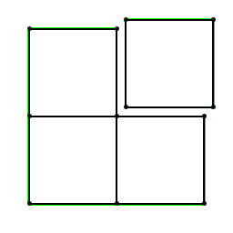
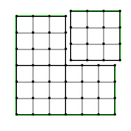
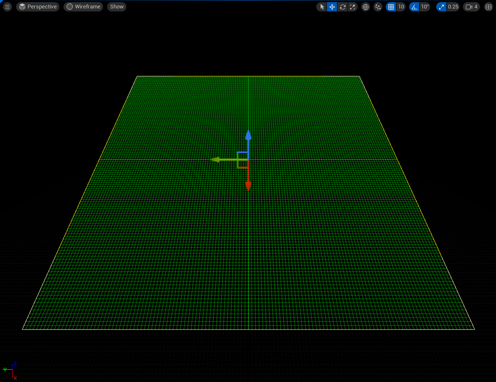
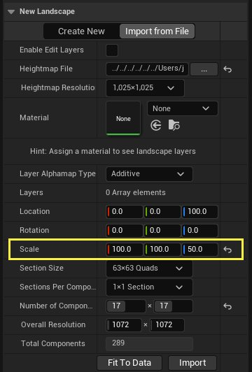
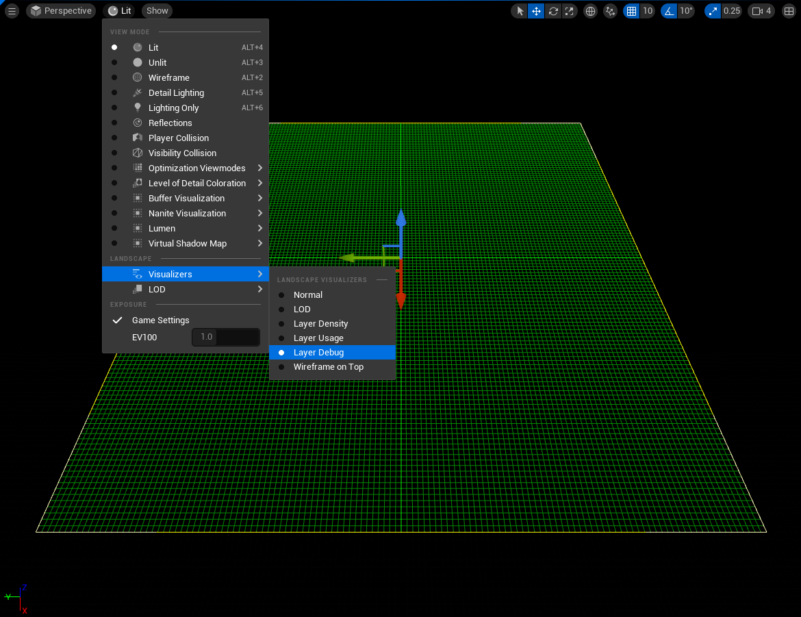
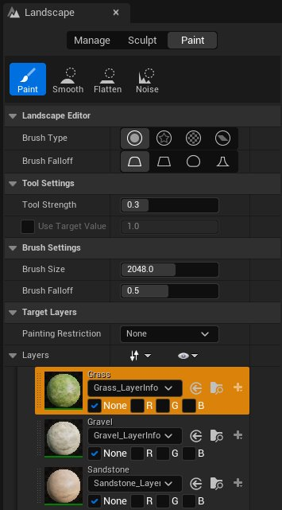
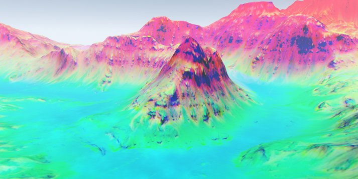

# 地形技术指南

> 路径：虚幻引擎5.7文档 / 构建虚拟世界 / 地形户外地貌 / 地形技术指南

> 原始页面：https://dev.epicgames.com/documentation/unreal-engine/landscape-technical-guide-in-unreal-engine

在虚幻引擎中创建地形时，其中一个挑战是如何在美观和性能之间取得平衡。在构建地形时，是否了解地形Actor的构造方式以及如何取得最佳性能就显得尤为重要。刚开始时，用户往往不清楚地形高度图中的哪些影响因素（维度）最重要。为了能理解高度图的哪些参数是有效的以及哪些是最佳参数，你需要充分理解地形的底层架构，而本文将对此进行介绍。

## 地形组件

每个地形都会被划分成多个地形组件。地形组件是虚幻引擎在渲染地形、计算地形可视性和处理地形碰撞时采用的基本单位。地形中的所有地形组件都具有相同的大小，并且始终为正方形。地形组件尺寸是在创建地形时决定的，取决于地形的大小和细节设置。

每个地形组建的高度数据存储在单独的纹理中。因此，纹理的大小必须是顶点数量的二次方。两个相邻地形组件的共同顶点行是重叠的，分别存储在各组件中。因此，在每个地形组件中考虑使用具有四条边的多边形（四边形）很有帮助。

下面的图示显示了非常简单的地形（以绿色显示轮廓），包含四个地形组件。每个组件都包含一个单独的四边形，并且其中一个进行了分隔，以显示地形组件拼接处的顶点是如何被复制的。



地形由四个地形组件构成。

## 组件分段

可以选择将组件划分成1个或4（2x2）个分段，以提高地形的分辨率。这些分段是地形LOD计算的基本单位。

如果使用相同大小的高度图，那么使用4（2x2）个分段时所产生的地形组件数是每个组件一个分段时的四倍，但使用更少的地形组件数可以获得更好的性能。

每个分段的大小（用顶点数表示）必须是值的二次方（最大为256x256），因此不同的LOD关卡可以存储在纹理的mipmap中。这将导致每个方向上（x或y）地形组件中的四边形数是值的二次方减去1（如果每个地形组件1个分段），或者是值的二次方减去2（如果每个地形组件4个分段）。

下面的图示显示了单个地形组件（以绿色显示轮廓），包含四个地形组件。每个分段由9（3x3）个四边形组成。在这里仍然可以看到相邻分段的顶点重叠在一起。



包含四个分段的地形组件。

## 地形组件UI

地形Actor采用颜色编码，可以更轻松地识别每种类型的地形组价。地形的边缘以黄色突出显示，每个组件的边缘都是浅绿色，分段边缘（如果设置为2x2个分段）为中绿色，单个地形四边形为深绿色。



要在显示UI颜色的视口中创建的新地形。

| **颜色（Color）** | **Description（说明）** |
| --- | --- |
| **黄色（Yellow）** | 地形Actor边缘 |
| **浅绿色（Light Green）** | 地形组件边缘 |
| **中绿色（Light Green）** | 地形分段边缘 |
| **深绿色（Dark Green）** | 地形单个四边形 |

## 性能注意事项

选择地形组件尺寸时，需要考虑地形组件总数，这是性能平衡的需要。较小的地形组件尺寸可以更快地进行LOD过渡和完成更多的地貌碰撞，但较小的尺寸也意味着需要更多的地形组件。

每个地形组件都会产生渲染线程CPU处理成本，每个分段都是一次绘制调用，因此需要将该数量保持在最低水平。对于最大的地形，Epic推荐最多使用1024个地形组件。

## 计算高度图维度

要创建一个能够容纳非常大的地貌大小，并且仍然能够在内存和性能方面保持高效的系统，架构必须对高度图的维度应用各种限制。关于这些限制的详细描述见下文。这意味着一些维度有效，而另外一些则无效。

地形的维度基于每个分段中的四边形数量、每个地形组件中的分段数量以及地形中地形组件的总数。一旦确定组件总数和每个组件的分辨率，就可以使用下面的公式计算出总体的地形维度数量：

（A*四边形数量 + 1，B*四边形数量 + 1）

A和B是每个方向上的地形组件数量，四边形数量是每个地形组件的四边形数量。

以下是使用此公式的两个不同示例。

### 示例1

如果开始的地形组件由一个分段构成，分段中包含64x64个顶点，然后地形组件尺寸为63x63个四边形。如果地形具有10x10个此类地形组件，则地形中共计拥有630x630个四边形。要导入此地形的高度，需要具有631x631个顶点的高度图，因为顶点行始终比四边形数量多一个（考虑1x1个四边形 - 需要4个顶点）。因此，631x631是有效的地形大小。

### 示例2

如果具有分成4个分段的地形组件，每个分段都由64x64个顶点组成，这就导致每个分段具有63x63个顶点，每个地形组件具有126x126个四边形。如果具有32x32个此类组件，则在每个方向上共计具有126 * 32 = 4032个四边形。因此，整个地形将具有4033x4033个顶点。

> [!TIP]
> 这些示例重点展示正方形地形。但是，你可以创建不是正方形的地形。假设每个组件具有63个四边形，那么可能由具有顶点总数为(A*63+1 , B*63+1)的AxB组件组成的任意地形。

## 计算高度图Z轴刻度

虚幻引擎使用-256和255.992之间的值来计算高度图的高度，使用16位精度进行存储。然后，将计算出的高度乘以你在导入高度图数据时输入的Z轴刻度值。例如，Z轴刻度值1将会产生最大高度256厘米，最大深度-256厘米。因此，如果使用默认的Z轴刻度值100，高速度将在256米和-256米之间。



在导入过程中调整Z轴刻度

计算自定义高度时，需要使用比例值将自定义高度值转换到虚幻引擎使用的-256到256范围内。由于高度范围总计为512个单位（-256到0是256个单位，0到256又是256个单位），比例值为1/512或0.001953125。

通过首先将衡量单位转换成厘米，然后乘以比例值，即可应用此比例值。

以下是示例：

为了在虚幻引擎关卡中呈现4207米的夏威夷最高峰——莫纳克亚山，需要执行以下操作：

1. 首先将4207乘以100，将高度转换成厘米。结果等于420,700厘米。
2. 然后，将这个值乘以比例值：420,700乘以0.001953125，等于821.6796875‬。
3. 这样可以得到Z轴刻度值821.6796875‬，而产生的高度图将在-210,350厘米到210,350厘米之间。

> [!NOTE]
> 这个过程将产生山峰的准确高度，但没有空间来呈现海平面以下的数值。如果希望在地图高度中具有更大的空间，请相应调整初始高度。为了使用同一示例，我们将莫纳克亚山高度扩大到包含海平面以下的5761米。这将获得9968米的初始总高度。

## 建议的地形大小

以下是建议的地形大小，不但可以将区域面积最大化，还可以将地形组件数降到最低。

| 总体大小（顶点数） | 四边形数/分段 | 分段数/组件 | 地形组件尺寸 | 地形组件总数 |
| --- | --- | --- | --- | --- |
| 8129 x 8129 | 127 | 4 (2x2) | 254x254 | 1024 (32x32) |
| 4033 x 4033 | 63 | 4 (2x2) | 126x126 | 1024 (32x32) |
| 2017 x 2017 | 63 | 4 (2x2) | 126x126 | 256 (16x16) |
| 1009 x 1009 | 63 | 4 (2x2) | 126x126 | 64 (8x8) |
| 1009 x 1009 | 63 | 1 | 63x63 | 256 (16x16) |
| 505 x 505 | 63 | 4 (2x2) | 126x126 | 16 (4x4) |
| 505 x 505 | 63 | 1 | 63x63 | 64 (8x8) |
| 253 x 253 | 63 | 4 (2x2) | 126x126 | 4 (2x2) |
| 253 x 253 | 63 | 1 | 63x63 | 16 (4x4) |
| 127 x 127 | 63 | 4 (2x2) | 126x126 | 1 |
| 127 x 127 | 63 | 1 | 63x63 | 4 (2x2) |

## 导入RAW格式高度图

虚幻引擎支持使用以下格式导入高度图图像：

- 16位灰阶PNG
- 8位灰阶r8
- 16位灰阶r16

推荐使用这些格式，因为位深度已知，并且假定为方形。

高度图数据还可以使用单独的JSON文件以.raw格式导入。该文件用于定义你的高度图的宽度、高度和位深度。

要导入.raw高度图文件，请按以下步骤操作：

1. 在你的高度图所在文件夹中创建新的.JSON文件。
2. 采用与你的高度图完全相同的名称为该文件命名。
3. 将以下脚本添加到你的文件：

   ```
   		             json             {             "width": 1024,             "height": 1024,           	 "bbp": 8             }		
   ```

在以上示例中，脚本会告诉引擎，同名的高度图为1024 x 1024，位深度为8。如需关于导入高度图的更多信息，请参阅[导入和导出地形高度图](../creating-landscapes/importing-and-exporting-landscape-heightmaps/index.md)。

## 层调试模式

启用层调试模式之后，可以在视口中的地形上切换特定层权重的可见性。在视口菜单中切换层调试模式：转到 **视图（View） > 地形查看器（Landscape Visualizers）**。



启用地形调试查看器

启用层调试查看器之后，可以为列表中的每个目标层选择单独的颜色通道。



使用地形调试查看器来可视化地形的绘制层。

选择一个通道将会把着色器应用到地形，该地形显示该通道所覆盖的选定目标层区域。



地形调试查看器已经应用到地形。
