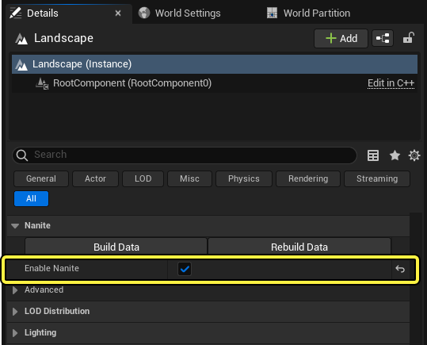
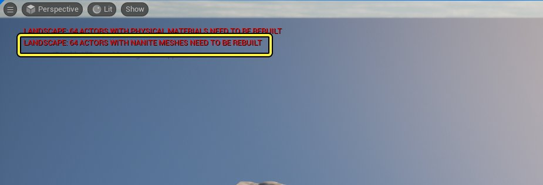
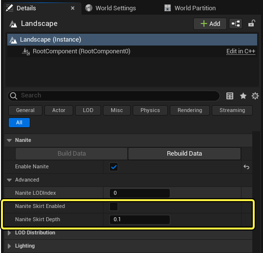

# 在地形中使用Nanite

> 路径：虚幻引擎5.7文档 / 构建虚拟世界 / 地形户外地貌 / 在地形中使用Nanite

> 原始页面：https://dev.epicgames.com/documentation/unreal-engine/using-nanite-with-landscapes-in-unreal-engine

Nanite是虚幻引擎的虚拟化几何体系统。Nanite使用内部网格体格式和渲染技术来渲染像素级别的细节以及海量对象。Nanite采用压缩的数据格式，支持具有自动细节级别的高细节网格体和细粒度流送。

你可以在地形上使用Nanite以提高Nanite渲染的性能，尤其是在虚拟阴影贴图方面。使用非Nanite地形时的编辑器内性能不代表在Nanite网格体完全重新编译之前你的项目中启用了Nanite的地形的运行时性能。由于源数据完全相同，产品最终用户不会在视效上发觉有所改善或恶化。

如需详细了解Nanite及其优势，请参阅[Nanite虚拟化几何体](https://dev.epicgames.com/documentation/404)。

> [!TIP]
> 有时，一部分地形可能会使用标准渲染，或者Nanite网格体未完全更新。这属于预料之中的现象。要使此类问题消失，请保存或烘焙你的项目。

## 技术注意事项

Nanite地形在现有地形数据流送上进行流送，因为Nanite和非Nanite数据在运行时都是必要的。非Nanite地形数据对于运行时虚拟纹理、水渲染等是必需的。

这意味着会流送两倍数量的数据。一组数据用于Nanite流送，另一组用于纹理流送。启用Nanite会使两组数据都位于内存中。

分层细节级别（HLOD）和地形代理流送的行为与非Nanite地形完全相同。

## 在地形上启用Nanite

要将Nanite用于你的地形地貌，请选择你的地形，并在 **细节（Details）** 面板勾选 **启用Nanite（Enable Nanite）** 旁边的框。

要将Nanite用于你的地形地貌：

- 在视口中选择你的地形。
- 在

  细节（Details）

  面板中，找到

  启用Nanite（Enable Nanite）

  ，然后勾选旁边的框。

通过细节面板为地形启用Nanite功能。

可以使用两种方法根据地形数据构建Nanite网格体表示：

- 在地形的 **细节（Details）** 面板中，转至 **Nanite** 分段，并点击 **重新编译的数据（Rebuilt Data）** 。

  或
- 使用 **构建（Build）** 菜单选择 **仅构建Nanite（Build Nanite Only）** 。

地形的编译时间取决于地形的大小和图块数量。完成后，你可以使用Nanite可视化模式查看Nanite几何体。

如果地形Actor显示以下视口消息：

Nanite错误消息。

其Nanite网格体不是最新的（例如，此前有过塑造操作）。

重新编译Nanite数据或保存地形代理网格体会去除该消息。

## Nanite裙子

Nanite地形依赖LOD和顶点消减的标准Nanite技术。除非非常靠近摄像机，否则生成的网格体不会使用常规网格拓扑，但它将在必要时包含更多顶点，以保留形状。因此，地形代理Actor之间的边界的顶点可能不会在边界的每一侧均匀分布。在远处，这可能会引入接缝瑕疵，看起来像穿透地形的细孔。这些通常足够小，可通过时间抗锯齿来纠正。

你可以使用"Nanite裙子（Nanite Skirt）"启用选项来避免接缝。此功能会在网格体边缘处将Nanite地形网格体扩展额外一行/列的顶点，并将这些新顶点下移 **Nanite裙子深度（Nanite Skirt Depth）** 指定的数量：

通过细节面板为地形启用Nanite 裙子（Nanite Skirt）功能。

这会导致相邻Nanite地形网格体彼此交叉，防止出现接缝瑕疵。

## 有用的控制台命令

以下控制台命令适合用于处理启用了Nanite的地形：

| **控制台命令** | **说明** |
| --- | --- |
| **Landscape.RenderNanite** | 为地形启用Nanite渲染。 默认值为1。 |
| **Landscape.Nanite.LiveRebuildOnModification** | 每当执行修改时触发重新编译Nanite表示。 这是试验性功能。 默认值为0。 |
| **Landscape.Nanite.MultithreadedBuild** | 使用多个处理器线程启用重新编译启用了Nanite的地形网格体，以提高处理多个地形组件时的性能。 默认值为1。 |

> [!WARNING]
> 编辑启用了Nanite的地形时，我们建议你将Nanite网格体的实时重新编译保持关闭（ `Landscape.LiveRebuildNaniteOnModification 0` ），因为这可能会显著降低性能。地形渲染依赖非Nanite地形，直至Nanite网格体重新编译为最新。虚幻引擎将该版本用于渲染，直至完全重新编译，因此编辑体验与处理非Nanite地形Actor完全相同。
