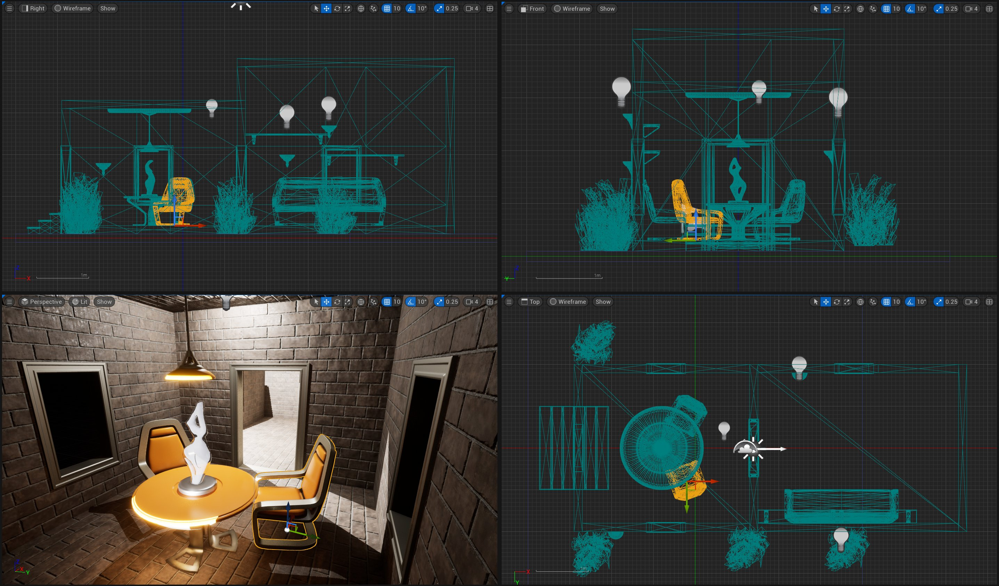

# 编辑器视口

> 路径：虚幻引擎5.7文档 / 构建虚拟世界 / 关卡编辑器 / 编辑器视口

> 原始页面：https://dev.epicgames.com/documentation/unreal-engine/editor-viewports-in-unreal-engine

点击查看大图。

**视口（Viewports）** 是你在虚幻引擎中创建世界的窗口。你可以像在游戏中那样在视口中移动，也可以像建筑蓝图那样用于设计各种方案。虚幻编辑器的视口包含各种工具和可视化选项，能帮助你准确查看所需的数据。

## 视口相关的话题

下列话题有助于你快速了解虚幻编辑器视口中的各个部分。

- [使用编辑器视口](https://dev.epicgames.com/documentation/unreal-engine/using-editor-viewports-in-unreal-engine) - 虚幻编辑器中视口的基本概念和功能。

- [视口显示标志](viewport-show-flags/index.md) - 所有可用于视口的显示选项的介绍。

- [视图模式](viewport-modes/index.md) - 本文提供视口内可用视图模式的说明。

- [视口控制方式](../../../get-started/unreal-engine-for-new-users/viewport-controls/index.md) - 了解编辑器视口的各种控制方案。
