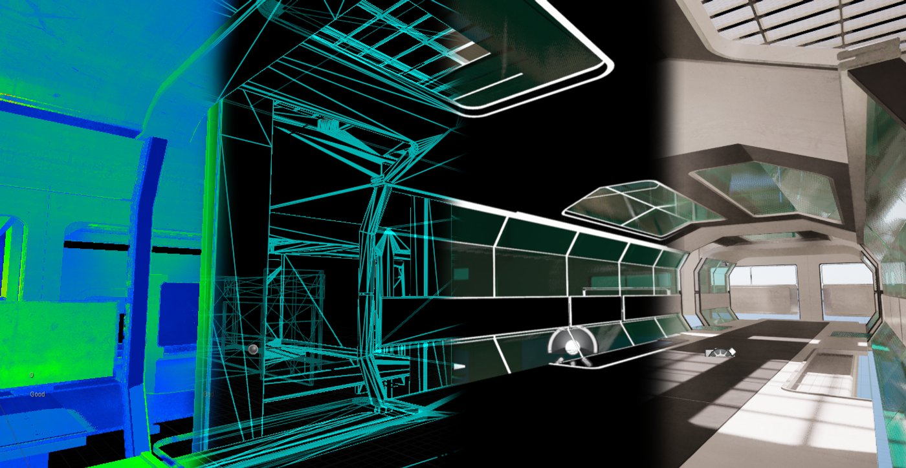
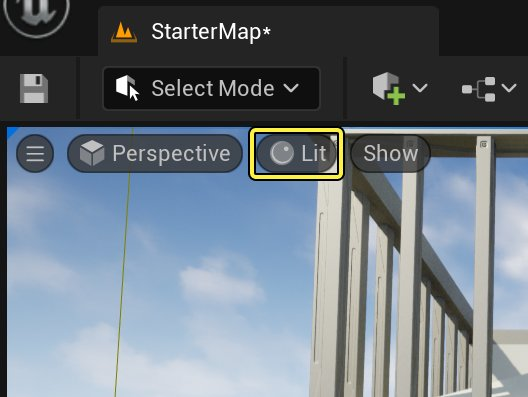
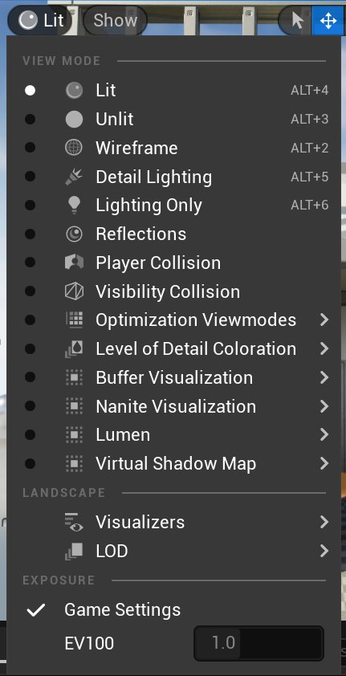
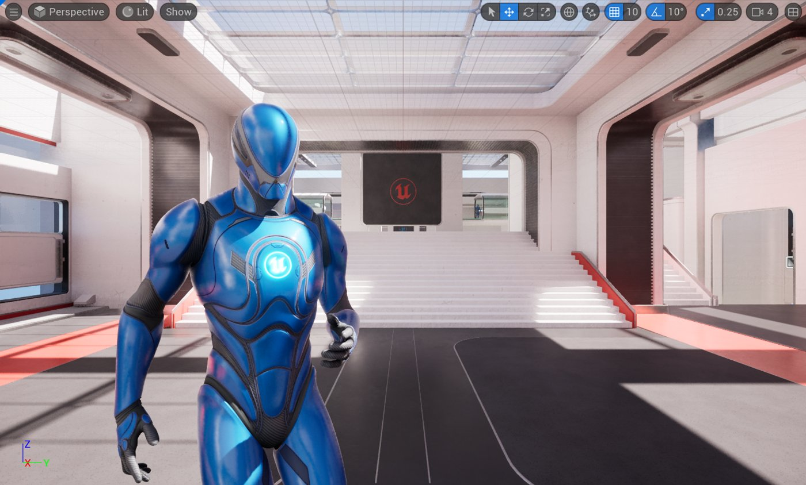
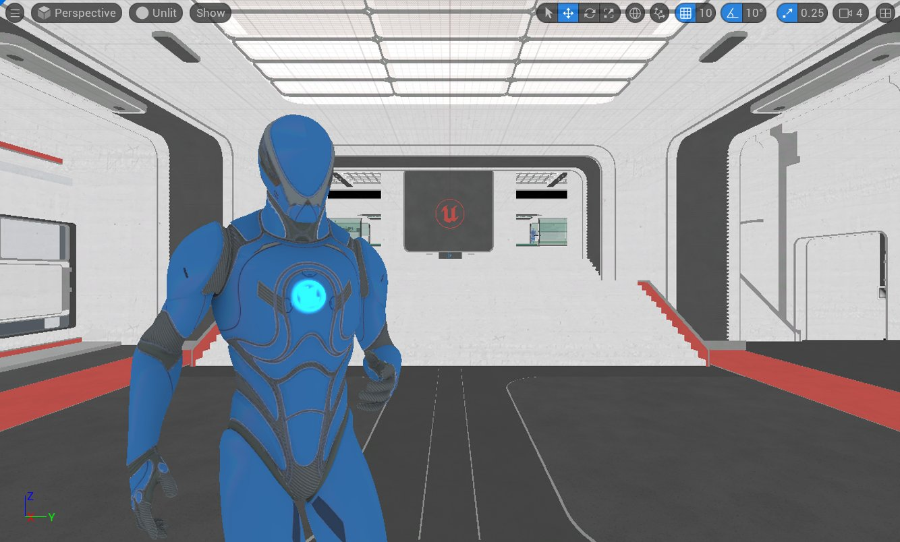
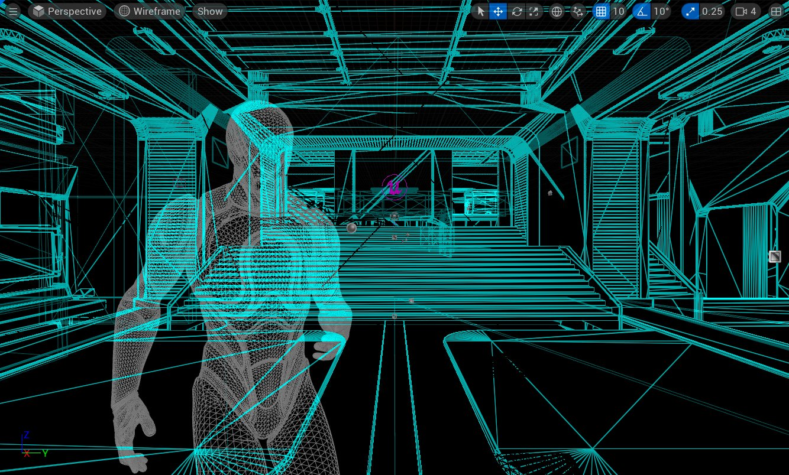
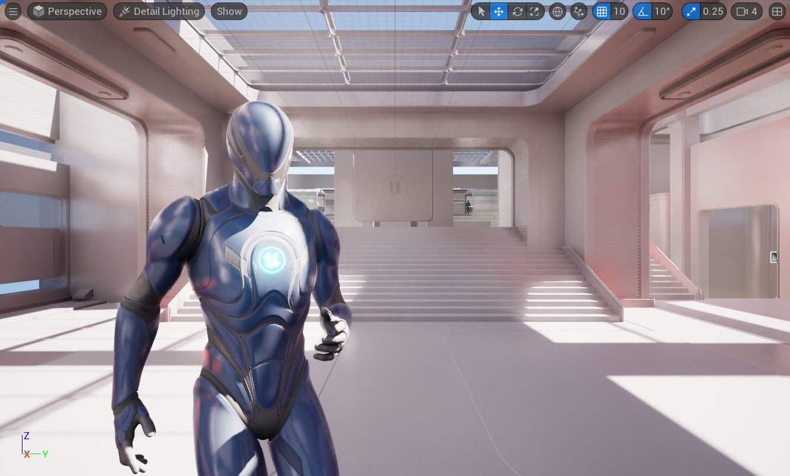
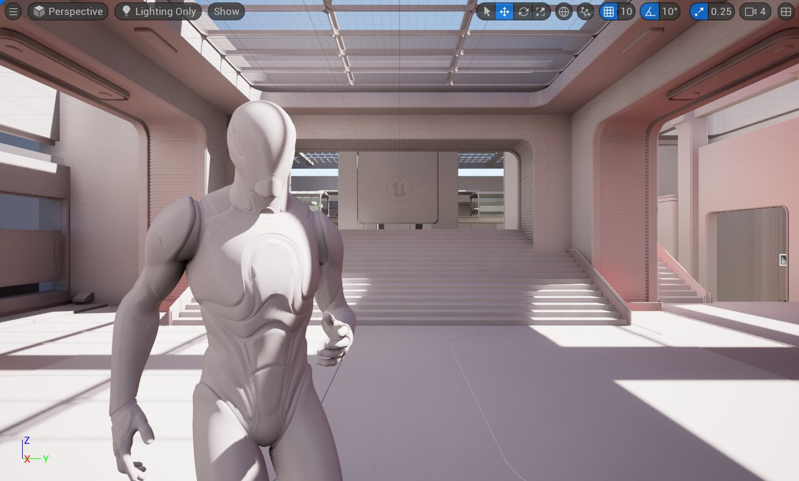

# 视图模式

> 路径：虚幻引擎5.7文档 / 构建虚拟世界 / 关卡编辑器 / 编辑器视口 / 视图模式

> 原始页面：https://dev.epicgames.com/documentation/unreal-engine/viewport-modes-in-unreal-engine



The Unreal Editor viewports have a large number of visualization modes to help you see the type of data being processed in your scene, as well as to diagnose any errors or unexpected results. The more common view modes have their own hotkeys, but all can be accessed from the viewport within the **View Mode** menu.



Click image for full size.



Click image for full size.

## 光照（Lit）



点击查看大图。

- 视图模式热键：**Alt + 4**
- 控制台命令：`viewmode lit`

**有光照（Lit）**视图模式将显示在应用所有材质和光照之后的场景最终效果。

## 无光照



点击查看大图。

- 视图模式热键：**Alt + 3**
- 控制台命令：`viewmode unlit`

**无光照（Unlit）**视图模式会从场景中移除所有光照，只显示基础颜色。

## 线框



点击查看大图。

- 视图模式热键：**Alt + 2**
- 控制台命令：`viewmode wireframe`

**线框**模式会显示场景中所有多边形的边框。 对于"画刷"，您将看到所产生的几何体。

## 细节照明



点击查看大图。

- 视图模式热键：**Alt + 5**
- 控制台命令：`viewmode lit_detaillighting`

**细节照明（Detail Lighting）**会使用原始材质的法线贴图在整个场景内激活中性材质。 这对于进行隔离而言非常有用，而无论底色是否因为过暗或噪声过高而遮蔽了光线。

## 仅光照



点击查看大图。

- 视图模式热键：**Alt + 6**
- 控制台命令：`viewmode lightingonly`

**仅光照（Lighting Only）**模式会显示仅受照明影响的中性材质。 此模式与*细节照明*模式的区别在于，你不会看到法线贴图。

## 光照复杂度

> 图片已省略：优化视图模式菜单

点击查看大图。

> 图片已省略：光照复杂度

点击查看大图。

- 视图模式热键：**Alt + 7**
- 控制台命令：`viewmode lightcomplexity`

"光线复杂性"显示影响几何体的非静态光线数目。 这对于跟踪照明成本而言非常有用 - 影响表面的光线越多，进行明暗处理的成本越高。

| 光线复杂性着色 |  |  |  |  |  |  |
| --- | --- | --- | --- | --- | --- | --- |
| **颜色** | LightComplexity_0 | LightComplexity_1 | LightComplexity_2 | LightComplexity_3 | LightComplexity_4 | LightComplexity_5 |
| **影响表面的光源数量** | **0** | **1** | **2** | **3** | **4** | **5+** |

此颜色方案是在着色器代码中定义的。

## 着色器复杂度

> 图片已省略：着色器复杂度

点击查看大图。

- 视图模式热键：**Alt + 8**
- 控制台命令：`viewmode shadercomplexity`

**着色器复杂度（Shader Complexity）**模式用于显示计算场景中各像素所用的着色器指令数。 通常，这可以很好地指示场景的性能状况。 一般来说，此模式用来测试基本场景的整体性能以及优化粒子效果，这些效果可能会导致短时间内发生大量过度绘制，从而导致性能突降。

只有指令计数用来计算着色器复杂性，这可能不一定准确。 例如，在所有平台上，含有 16 条指令（全部都是纹理查找）的着色器都会比含有 16 条算术指令的着色器慢得多。 并且，包含未展开的循环的着色器无法由指令计数准确表示，此问题主要与顶点着色器相关。 总的来说，指令计数在大部分情况下是一个良好的指标。

此视图模式使用色谱来指示场景的成本。 绿色到红色表示"成本非常低"到"成本高"的线性关系，而粉红色和白色表示快速跳跃至"成本非常高"的像素。 较小的白色区域可以容忍，但如果屏幕的大部分区域都显示为鲜红色或白色，那么表示性能不佳。

|  |  |  |  |  |  |  |  |  |
| --- | --- | --- | --- | --- | --- | --- | --- | --- |
| 着色器复杂性着色 |  |  |  |  |  |  |  |  |
|  |  |  |  |  |  |  |  |  |
| **理想** |  |  | **中度** |  |  | **成本高** | **成本非常高** |  |

**+ShaderComplexityColors**由`BaseEngine.ini`文件定义；它会根据给定像素的指令总数进行线性插值（内插）。

C++

```
+ShaderComplexityColors=(R=0.0,G=1.0,B=0.127,A=1.0)  +ShaderComplexityColors=(R=0.0,G=1.0,B=0.0,A=1.0)  +ShaderComplexityColors=(R=0.046,G=0.52,B=0.0,A=1.0)  +ShaderComplexityColors=(R=0.215,G=0.215,B=0.0,A=1.0)  +ShaderComplexityColors=(R=0.52,G=0.046,B=0.0,A=1.0)  +ShaderComplexityColors=(R=0.7,G=0.0,B=0.0,A=1.0)  +ShaderComplexityColors=(R=1.0,G=0.0,B=0.0,A=1.0)  +ShaderComplexityColors=(R=1.0,G=0.0,B=0.5,A=1.0)  +ShaderComplexityColors=(R=1.0,G=0.9,B=0.9,A=1.0)
```

**MaxPixelShaderAdditiveComplexityCount**的默认范围被设为2000，但你可以在`BaseEngine.ini`文件中更改该值，以优化项目中的材质。

C++

```
MaxPixelShaderAdditiveComplexityCount=2000
```

**MaxES3PixelShaderAdditiveComplexityCount**定义了ES3预览模式中的范围，默认范围被设置为800。

C++

```
MaxES3PixelShaderAdditiveComplexityCount=800
```

你可以在`BaseEngine.ini`文件中修改这些颜色。 你也可以在项目的`DefaultEngine.ini`文件中修改"最大像素着色器加算复杂度计数"变量。

## 固定光源重叠

> 图片已省略：固定光源重叠

点击查看大图。

- 视图模式热键：**无（默认只能通过菜单访问）**

## 光照贴图密度

> 图片已省略：光照贴图密度

点击查看大图。

视图模式热键：**Alt + 0**

**光照贴图密度（Lightmap Density）**模式会显示使用纹理贴图的对象的光照贴图密度，按其与理想/最大密度设置的关系对其进行颜色编码，并显示映射到实际光照贴图纹素的网格。 在整个场景内使用偶数纹素密度以获得一致的光照贴图照明十分重要。

|  |  |  |
| --- | --- | --- |
| 光照贴图密度：轻度 | 光照贴图密度：中度 | 光照贴图密度：重度 |
| 低于理想纹素密度 | 理想纹素密度 | 最大或大于理想纹素密度 |

> [!NOTE]
> 骨骼网格将以浅棕色显示，此计算不会对其加以考虑。

## 反射

> 图片已省略：反射

点击查看大图。

- 视图模式热键：**无（默认只能通过菜单访问）**

**反射（Reflections）**视图模式会用平面法线和粗糙度0（即镜面）重载所有材质。 这对于诊断反射细节十分有用，还使您得以将更多反射捕获 Actor 放入需要更多细节的区域。

## 玩家碰撞

> 图片已省略：玩家碰撞

点击查看大图。

- 控制台命令：`viewmode CollisionPawn`

**玩家碰撞（Player Collision）**视图模式会突出显示与角色或Pawn碰撞的资产，并使用以下颜色：

| 玩家碰撞颜色 |  |  |  |  |  |  |
| --- | --- | --- | --- | --- | --- | --- |
| **颜色** |  |  |  |  |  |  |
| **说明** | **静态网格体（Static Mesh）** | **固定静态网格体** | **可移动静态网格体** | **体积（Volume）** | **触发器体积** | **笔刷（Brush）** |

## 可见性碰撞

> 图片已省略：可见性碰撞

点击查看大图。

- 控制台命令：`viewmode CollisionVisibility`

**碰撞可见性（Collision Visibility）**视图模式会突出显示遮挡视线的Actor。 它使用以下颜色：

| 碰撞可视性颜色 |  |  |  |  |  |
| --- | --- | --- | --- | --- | --- |
| **颜色** |  |  |  |  |  |
| **说明** | **静态网格体（Static Mesh）** | **固定静态网格体** | **可移动静态网格体** | **体积（Volume）** | **笔刷（Brush）** |

## LOD着色

> 图片已省略：着色细节级别菜单

点击查看大图。

> 图片已省略：LOD着色

点击查看大图。

- 控制台命令：`viewmode LODColoration`

**LOD着色**视图模式会显示图元的当前LOD索引。 这对于诊断任何 LOD 问题或了解 LOD 的切换距离非常有用。

| LOD图元颜色 |  |  |  |  |  |  |  |  |
| --- | --- | --- | --- | --- | --- | --- | --- | --- |
| **颜色** | [LOD Coloration_0](https://dev.epicgames.com/community/api/documentation/image/2a42f115-aced-44af-9480-2e72afada7a0?resizing_type=fit) | [LOD Coloration_1](https://dev.epicgames.com/community/api/documentation/image/8236e19f-1fdb-473c-97e3-407909aff793?resizing_type=fit) | [LOD Coloration_2](https://dev.epicgames.com/community/api/documentation/image/7d5295d9-2702-4d02-b6cd-63d04e182711?resizing_type=fit) | [LOD Coloration_3](https://dev.epicgames.com/community/api/documentation/image/baa29ab7-c9df-45cf-af49-f4b52e71afee?resizing_type=fit) | [LOD Coloration_4](https://dev.epicgames.com/community/api/documentation/image/3a010cfd-5339-45c1-82d8-8285db06aec3?resizing_type=fit) | [LOD Coloration_5](https://dev.epicgames.com/community/api/documentation/image/d17e52b5-29e4-4d5b-9136-22603acc56d2?resizing_type=fit) | [LOD Coloration_6](https://dev.epicgames.com/community/api/documentation/image/f39e9c8e-2d8e-46bd-9cb9-9da5a98ced3f?resizing_type=fit) | [LOD Coloration_7](https://dev.epicgames.com/community/api/documentation/image/8d6cce59-2e66-4b07-8c8b-250b069bdfa9?resizing_type=fit) |
| **LOD图元颜色** | **0** | **1** | **2** | **3** | **4** | **5** | **6** | **7** |

C++

```
+LODColorationColors=(R=1.0,G=1.0,B=1.0,A=1.0)     +LODColorationColors=(R=1.0,G=0.0,B=0.0,A=1.0)     +LODColorationColors=(R=0.0,G=1.0,B=0.0,A=1.0)     +LODColorationColors=(R=0.0,G=0.0,B=1.0,A=1.0)     +LODColorationColors=(R=1.0,G=1.0,B=0.0,A=1.0)     +LODColorationColors=(R=1.0,G=0.0,B=1.0,A=1.0)     +LODColorationColors=(R=0.0,G=1.0,B=1.0,A=1.0)     +LODColorationColors=(R=0.5,G=0.0,B=0.5,A=1.0)
```

> [!NOTE]
> 默认情况下，引擎仅使用 4 个 LOD，但可在源代码中增加此数目。

## HLOD着色

> 图片已省略：分层LOD着色

点击查看大图。

- 控制台命令：`viewmode hlodcoloration`

**HLOD着色（HLOD Coloration）**视图模式会显示图元的"分层LOD群集（Hierarchial LOD Cluster）"索引。

| HLOD图元着色 |  |  |  |  |  |
| --- | --- | --- | --- | --- | --- |
| **颜色** | [LOD Coloration_3](https://dev.epicgames.com/community/api/documentation/image/781c1bc9-b61f-4e75-a8b8-92681bb70734?resizing_type=fit) | [LOD Coloration_4](https://dev.epicgames.com/community/api/documentation/image/700d7c63-dfb7-4713-86a4-29ae30376efe?resizing_type=fit) | [LOD Coloration_7](https://dev.epicgames.com/community/api/documentation/image/02d1331e-89c4-405b-9c63-962971ada101?resizing_type=fit) | [LOD Coloration_6](https://dev.epicgames.com/community/api/documentation/image/e8c14a89-aec3-4685-b9f8-543e1ae62644?resizing_type=fit) | [LOD Coloration_8](https://dev.epicgames.com/community/api/documentation/image/ce6bd3b6-f0dd-4601-b3e9-7d85a286b37c?resizing_type=fit) |
| **HLOD图元颜色** | **0** | **1** | **2** | **3** | **4** |

C++

```
+HLODColorationColors=(R=1.0,G=1.0,B=1.0,A=1.0)  //white (not part of HLOD)   +HLODColorationColors=(R=0.0,G=1.0,B=0.0,A=1.0)  //green (part of HLOD but being drawn outside of it)   +HLODColorationColors=(R=0.0,G=0.0,B=1.0,A=1.0)  //blue (HLOD level 0)   +HLODColorationColors=(R=1.0,G=1.0,B=0.0,A=1.0)  //yellow (HLOD level 1)   +HLODColorationColors=(R=1.0,G=0.0,B=1.0,A=1.0)  //purple   +HLODColorationColors=(R=0.0,G=1.0,B=1.0,A=1.0)  //cyan   +HLODColorationColors=(R=0.5,G=0.5,B=0.5,A=1.0)  //grey
```

## 缓冲可视化

> 图片已省略：缓冲可视化

点击查看大图。

**缓冲区可视化**区域使你能够访问图形卡中的各个缓冲区，这可以帮助你诊断场景的外观问题。 要最大限度地利用缓冲区可视化模式，了解[材质输入](../../../../designing-visuals-rendering-and-graphics/unreal-engine-materials/material-inputs/index.md)和[材质属性](../../../../designing-visuals-rendering-and-graphics/unreal-engine-materials/unreal-engine-material-properties/index.md)的基础知识会对你有帮助。

### 缓冲区概览

> 图片已省略：缓冲区概览

点击查看大图。

**缓冲区概览（Buffer Overview）**可视化模式让你能查看显卡GBuffer中的多个图像。 其中许多图像与材质上的输入相关，这意味着您可以在仅使用单个材质输入的情况下查看场景的外观。

### 基础颜色

> 图片已省略：基础颜色

点击查看大图。

- 视图模式热键：**无（默认只能通过菜单访问）**

**基础颜色（Base Color）**模式让你能仅查看场景中材质的基础颜色。

### 贴花遮罩

> 图片已省略：贴花遮罩

点击查看大图。

- 视图模式热键：**无（默认只能通过菜单访问）**

**贴花遮罩（Decal Mask）**模式会以白色显示所有可接收延迟贴花的表面。 无法显示的对象将显示为黑色。

### 漫反射颜色

> 图片已省略：漫反射颜色

点击查看大图。

- 视图模式热键：**无（默认只能通过菜单访问）**

**漫反射颜色（Diffuse Color）**会显示基础颜色与材质的环境光遮蔽输入的结果。

### 着色模型

> 图片已省略：着色模型

点击查看大图。

- 视图模式热键：**无（默认只能通过菜单访问）**

**着色模型（Shading Model）**模式会显示场景中各个材质的"着色模型"属性的值。

| 光线复杂性着色 |  |  |  |  |
| --- | --- | --- | --- | --- |
| **颜色** | 光源模型：有光照 | 光源模型：无光照 | 光源模型：次表面 | 光源模型：预集成蒙皮 |
| **材质的着色模型** | **默认光照** | **无光照** | **次表面** | **预集成蒙皮** |

### 材质环境光遮蔽

> 图片已省略：有光照模式下的场景（游戏视图开启）

> 图片已省略：缓冲区材质环境光遮蔽模式中的场景（游戏视图开启）

有光照模式下的场景（游戏视图开启）

缓冲区材质环境光遮蔽模式中的场景（游戏视图开启）

- 视图模式热键：**无（默认只能通过菜单访问）**

**材质环境光遮蔽（Material AO）**可视化模式会显示所有与材质的*环境光遮蔽（Ambient Occlusion）*输入相连接的纹理处理或材质表达式节点的结果。

### 金属感（Metallic）

> 图片已省略：金属感（Metallic）

点击查看大图。

- 视图模式热键：**无（默认只能通过菜单访问）**

**金属感（Metallic）**可视化模式会显示所有与材质的*金属感（Metallic）*输入相连接的纹理处理或材质表达式节点的结果。

注：通常，材质的"金属感"（Metallic）值为 0 或 1，而不是两者之间的值。 介于 0 与 1 之间的值将会因为层混合而产生，但物理材质始终为金属或非金属。

### 不透明度（Opacity）

> 图片已省略：有光照模式下的场景

> 图片已省略：缓冲区材质不透明度模式下的场景（游戏视图开启）

有光照模式下的场景

缓冲区材质不透明度模式下的场景（游戏视图开启）

- 视图模式热键：**无（默认只能通过菜单访问）**

**不透明度（Opacity）**可视化模式会显示所有与材质的"不透明度（Opacity）"输入相连接的纹理处理或材质表达式节点的结果。 在上面的图中，您可以看到人物的长发绺有点透明。

"不透明"视图模式仅显示使用了"不透明"（Opacity）的不透明材质，这对于次表面散射材质来说十分重要，因为"不透明"（Opacity）控制着光线可以穿透的距离。

### 粗糙度（Roughness）

> 图片已省略：粗糙度（Roughness）

点击查看大图。

- 视图模式热键：**无（默认只能通过菜单访问）**

**粗糙度（Roughness）**可视化模式会显示所有与材质的"粗糙度（Roughness）"输入相连接的纹理处理或材质表达式节点的结果。 粗糙度变化是许多反射变化的根源。

### 场景颜色

> 图片已省略：场景颜色

点击查看大图。

- 视图模式热键：**无（默认只能通过菜单访问）**

**场景颜色（Scene Color）**会显示执行后期处理之前的场景结果。 即，在进行任何曝光、高光处理、颜色校正或抗锯齿之前的场景结果。 在上图中，场景显得非常暗，因为曝光尚未使其变亮。

### 场景深度

> 图片已省略：场景深度

点击查看大图。

- 视图模式热键：**无（默认只能通过菜单访问）**

**场景深度（Scene Depth）**会以白色（最远）到黑色（最近）的常量梯度显示场景的深度。

### 单独半透RGB

> 图片已省略：单独半透RGB

点击查看大图。

- 视图模式热键：**无（默认只能通过菜单访问）**

**单独半透明RGB（Separate Translucency RGB）**会显示所有呈半透明且使用了"单独半透明（Separate Translucency）"的材质的颜色信息。

### 单独半透明A

> 图片已省略：单独半透明A

点击查看大图。

- 视图模式热键：**无（默认只能通过菜单访问）**

**单独半透明A（Separate Translucency A）**仅显示任何呈半透明且使用了"单独半透明（Separate Translucency）"的材质的Alpha信息。

### 高光度颜色

> 图片已省略：高光度颜色

点击查看大图。

- 视图模式热键：**无（默认只能通过菜单访问）**

**高光度颜色（Specular Color）**显示施加于材质的高光度反射的颜色。 通常，此颜色是根据基础颜色和金属感值的组合来确定的。

### 高光度（Specular）

> 图片已省略：高光度（Specular）

点击查看大图。

- 视图模式热键：**无（默认只能通过菜单访问）**

**高光度（Specular）**会显示所有输送到材质的高光度（Specular）输入的纹理处理或材质表达式节点的结果。

### 次表面颜色

> 图片已省略：次表面颜色

点击查看大图。

- 视图模式热键：**无（默认只能通过菜单访问）**

**次表面颜色（Subsurface Color）**会显示所有输送到材质的次表面颜色（Subsurface Color）输入的纹理处理或材质表达式节点的结果。

### 世界法线

> 图片已省略：世界法线

点击查看大图。

- 视图模式热键：**无（默认只能通过菜单访问）**

**世界法线（World Normal）**显示所有不透明表面的世界空间法线。

### 环境光遮蔽

> 图片已省略：环境光遮蔽

点击查看大图。

- 视图模式热键：**无（默认只能通过菜单访问）**

**环境光遮蔽（Ambient Occlusion，AO）**显示场景中发生的所有环境光遮蔽计算的结果。 此计算与任何应用于材质的 AO 纹理无关，因为这是引擎根据表面和法线贴图进行的计算。

## 地形查看器

> 图片已省略：地形查看器

点击查看大图。

### 法线（Normal）

> 图片已省略：地形法线

点击查看大图。

**法线（Normal）**地形可视化模式会以法线的有光照状态显示地形。

### LOD

> 图片已省略：地形LOD

点击查看大图。

**LOD**地形可视化模式会将地形划分为颜色编码的面板，这些面板代表其当前的LOD状态。

### 层密度

> 图片已省略：层密度

点击查看大图。

**层密度（Layer Density）**地形可视化模式会以颜色编码模式显示地形，随着越来越多的层被添加到地形中，颜色将从绿色变为红色。

## 曝光

> 动图已省略：曝光

曝光是一种后处理效果，用于控制场景的整体亮度。 您可将其设置为固定值或保持自动调整。

### 自动曝光与 固定曝光

在后处理期间激活曝光的情况下游戏时，您会注意到从较亮区域移至较暗区域（反之亦然）会导致摄像机临时进行调整，这类似于我们的眼睛在注视不同光线环境时发生的调整。 在大多数情况下，这是期望的结果。 但是，如果特定关卡中不断变化会分散玩家的注意力，那么您可将视图设置为采用固定曝光。 这将锁定曝光，使其不再随着您从较亮区域移至较暗区域或者从较暗区域移至较亮区域而自动变化，但也意味着很容易产生光线对于您需要完成的工作而言过亮或过暗的情况。
