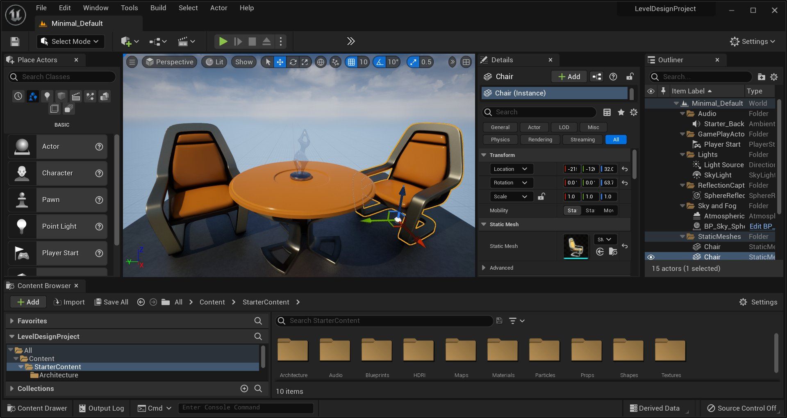
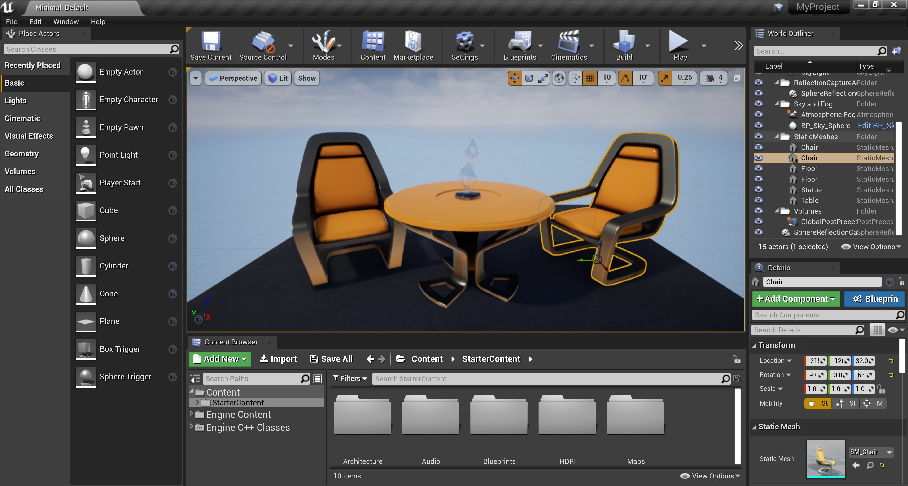
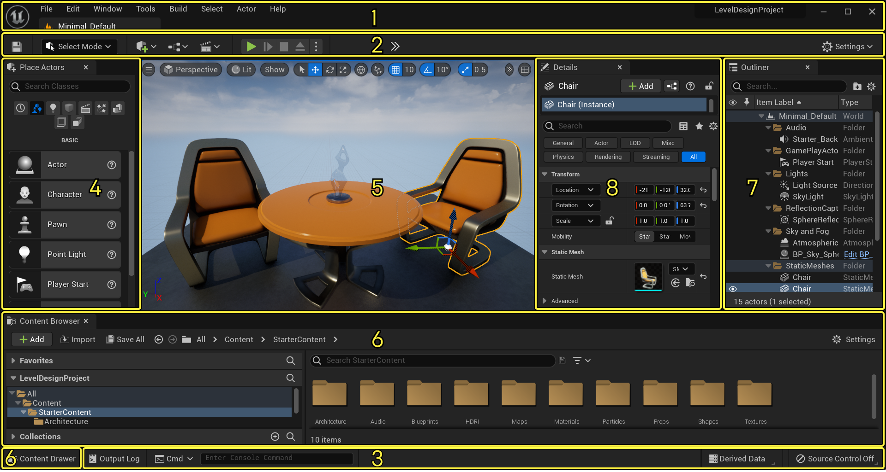
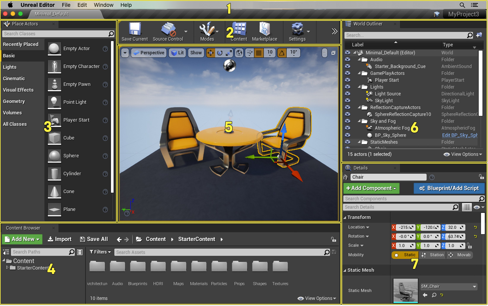
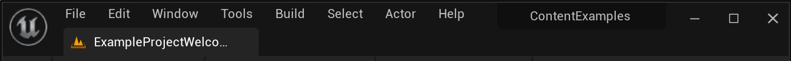
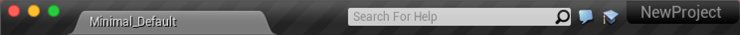
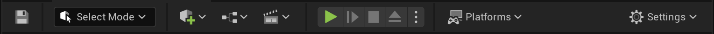
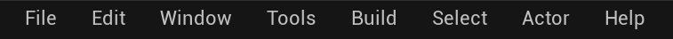

# 关卡编辑器

> 路径：虚幻引擎5.7文档 / 构建虚拟世界 / 关卡编辑器

> 原始页面：https://dev.epicgames.com/documentation/unreal-engine/level-editor-in-unreal-engine

**关卡编辑器** 为虚幻编辑器提供了关卡创建方面的核心功能。你可以用它创建、查看并修改关卡。你主要通过放置和变换Actor以及编辑 [**Actor**](../../understanding-the-basics/actors-and-geometry/index.md) 的属性来修改关卡。

在虚幻编辑器中，你创建游戏体验所在的场景一般称之为 [关卡](../../understanding-the-basics/levels/index.md) 。你可以把关卡想象成为一个三维场景，在该场景中你可以放置一系列的对象和几何体来定义你的玩家将要体验的世界。你放置到世界中的任何对象都认为是Actor，无论该对象是一个光源、网格物体还是一个角色。从技术上讲， Actor是虚幻引擎中使用的一个编程类，用于定义一个具有三维位置、旋转度及缩放比例数据的对象。把Actor理解成任何可以被你放置到关卡中的对象。

点击查看大图。

创建关卡可以归结为在虚幻编辑器中向地图中放置对象。这些对象可能是世界几何体、以画刷形式出现的装饰物、静态网格物体、光源、玩家起点、武器或载具。什么时候添加哪些对象通常是由关卡设计团队使用的特定工作流程规定的。

## 默认界面

由于虚幻编辑器的界面可以进行高度化的自定义，所以可能你这次启动时看到的界面和下次启动时看到的界面是不一样的。以下，你可以看到默认的界面布局：

点击查看大图。

1. 选卡栏和菜单栏
2. 工具栏
3. 底部工具栏
4. 放置Actor/模式面板
5. 视口
6. 内容浏览器/内容侧滑菜单
7. 世界大纲视图
8. 细节面板

### 选卡栏

关卡编辑器的顶部有一个选项卡，名称是当前关卡的名称。其他编辑器窗口的选卡可以停靠在该选卡的旁边，以便快速地、方便地进行导航，这和网页浏览器类似。

点击查看大图。

选卡名称本身将会反应出当前正在编辑的是哪个关卡。这种方式在整个编辑器中都是一致的 - 以当前正在编辑的资源命名编辑器选卡。

选卡栏的右侧是当前项目的名称。

### 工具栏

点击查看大图。

**工具栏** 面板会显示一组命令，以便你快速访问一些常用工具和操作。

请参照[**工具栏**](level-editor-toolbar/index.md)页面获得关于工具栏上每项功能的介绍。

### 菜单栏

如果你接触过Windows应用，就应该对编辑器中的 **菜单栏** 很熟悉。它允许你访问常用的工具和命令，用于处理编辑器中的关卡。

点击查看大图。

> 图片已省略：undefined

**控制台（Console）**（**`**）是个文本框，允许你输入编辑器可以识别的特殊控制台命令。该文本框有自动补全的功能，它可以自动列出和文本框中文本匹配的所有命令。

如果你在运行版本控制，菜单栏最右侧的按钮会显示其状态。

| 按钮 | 名称 | 描述 |
| --- | --- | --- |
| Button Source Control On = On Button Source Control Off = Off | **源码控制状态** | 你可以把鼠标悬停到该按钮上方来获得连接详情。可以点击绿色图标来登录连接。红色图标表示版本控制未启用。Perforce和Subversion都支持。请参照[源码控制文档](../../production-pipeline/collaboration-and-version-control/using-source-control-in-the-unreal-editor/index.md)获得详情。 |

### 模式面板

**关卡编辑器（Level Editor）** 可以进入不同的编辑模式，以启用特定的编辑界面和工作流程，从而编辑特定类型的Actor或几何体。

为了显示可显示的模式，在关卡编辑器工具栏中，打开 **模式（Modes）** 下拉菜单。

> 图片已省略：Modes dropdown

点击查看大图

| 图标 | 模式 | 快捷键 | 说明 |
| --- | --- | --- | --- |
| LE工具选择 | **选择（Select）** | **Shift + 1** | 激活[**选择** 模式](level-editor-modes/select-mode/index.md)以便在场景中选择Actor。 |
| LE工具地形 | **地形** | **Shift + 2** | 激活[**地形（Landscape）** 模式](../landscape-outdoor-terrain/index.md)以便编辑地貌地形。 |
| LE工具植被 | **植被（Foliage）** | **Shift + 3** | 激活[**植被** 模式](../open-world-tools/foliage-mode/index.md)以便绘制实例化的植被。 |
| LE工具网格体绘制 | **网格体绘制（Mesh Paint）** | **Shift + 4** | 激活 [**网格体绘制（Mesh Paint）** 模式](level-editor-modes/mesh-paint-mode/index.md)以便使用视口在静态网格体Actor上直接绘制顶点颜色和纹理。 |
| LE工具建模 | **建模（Modeling）** | **Shift + 5** | 激活 **建模（Modeling）** 编辑模式。 |
| LE工具破碎 | **破碎（Fracture）** | **Shift-6** | 激活 [**破碎（Fracture）** 莫斯](https://dev.epicgames.com/documentation/404)以便创建可破坏的物体和环境。 |
| LE工具笔刷 | **笔刷编辑（Brush Editing）** | **Shift + 7** | 激活 [**笔刷编辑（Brush Editing）** 模式](../../understanding-the-basics/actors-and-geometry/unreal-engine-actors-reference/geometry-brush-actors/index.md)以便修改几何体笔刷。 |
| LE工具动画 | **动画（Animation）** | **Shift + 8** | 激活 **动画（Animation）** 编辑模式。 |

**模式（Modes）** 会针对特定任务，更改关卡编辑器主要行为，例如在场景中移动变换某个资产，雕刻地形，生成植被，创建几何笔刷和体积，以及在网格体上绘制。模式（Modes）面板包含一组工具，并且这些工具会根据你选择的编辑模式而调整。

> 图片已省略：Landscape Panel

点击查看大图。

地形面板

> [!TIP]
> 你可以通过点击标签页右上角的"X"来关闭面板，也可以右键点击标签页，然后在出现的上下文菜单中点击 **隐藏标签页** 来隐藏面板。要重新打开已关闭的面板，请在 **窗口** 菜单中点击该面板的名称。

### 视口

**Viewport（视口）** 面板是你进入虚幻引擎世界的窗口。

> 图片已省略：Viewport Panel

点击查看大图。

该面板包含了一组视口，每个视口都可以最大化,使其填充整个面板，且提供了在其中一种正交视图(顶视图、侧视图、前视图)或透视图显示世界的功能，使你可以充分地控制显示的内容及显示方式。

请参照[**视口**](editor-viewports/index.md)页面获得关于应用视口的更多信息。

### 细节面板

> 图片已省略：Details Panel

点击查看大图。

**细节（Details）** 面板包含了关于视口中当前选中对象的信息、工具及功能。它包含了用于移动、旋转及缩放Actor的变换编辑框，显示了选中Actor的所有可编辑属性，并提供了和视口中选中Actor类型相关的其他编辑功能。比如，选中的Actor可以导出到FBX文件中，并可以转换为另一种兼容类型。选项细节允许你查看这些被选中的Actor所使用的材质（如果存在），并可以快速地打开它们进行编辑。

请参照 [细节](level-editor-details-panel/index.md)页面获得关于使用关卡编辑器中的 **细节** 面板的完整概述和指南。

### 世界大纲视图

> 图片已省略：Scene Outliner Panel

点击查看大图。

**世界大纲视图（World Outliner）** 面板以层次化的树状图形式显示了场景中的所有Actor。你可以在 **世界大纲视图** 中直接选择及修改Actor。你也可以使用 **Info(信息)** 下拉菜单来显示额外的竖栏，以便显示关卡、图层或ID名称。

请参照[**世界大纲视图**](outliner/index.md)页面获得关于使用 **世界大纲视图** 的详细内容。

### 底部工具栏

> 图片已省略：Bottom Toolbar Panel

点击查看大图

包含前往命令控制台的快捷方式、输出日志以及派生数据功能，还可现实源码控制状态。

关于工具栏项目的详细描述，请参阅[**工具栏**](level-editor-toolbar/index.md) 页面。

### 图层

**层级（Layers）** 面板允许您组织关卡中的Actor。

> 图片已省略：Layer Infra

点击查看大图。

层级提供了快速选择和控制相关Actor组可视性的能力。 您可以使用您的层级来快速整理一个场景， 只留下您正在处理的几何体和Actor。例如，您可能正在处理一个由多个模块组成的 多层建筑。通过将每个楼层分配到一个层级，您可以隐藏您不在处理的每个楼层， 使顶视图更易于管理。

请参阅 **[层级面板](layers-panel/index.md)页面** 获得关于使用 **图层** 面板的详细内容。
