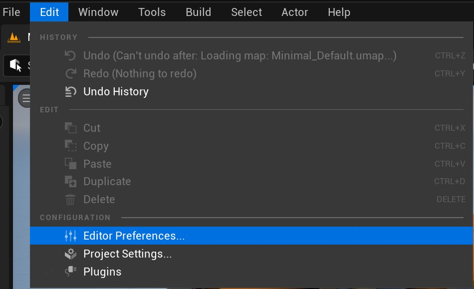
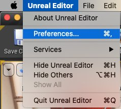
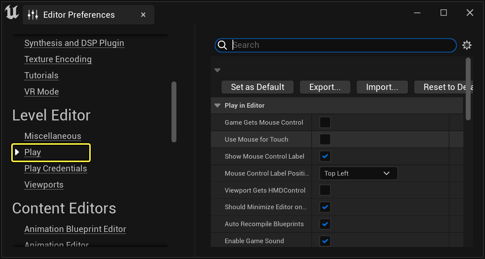
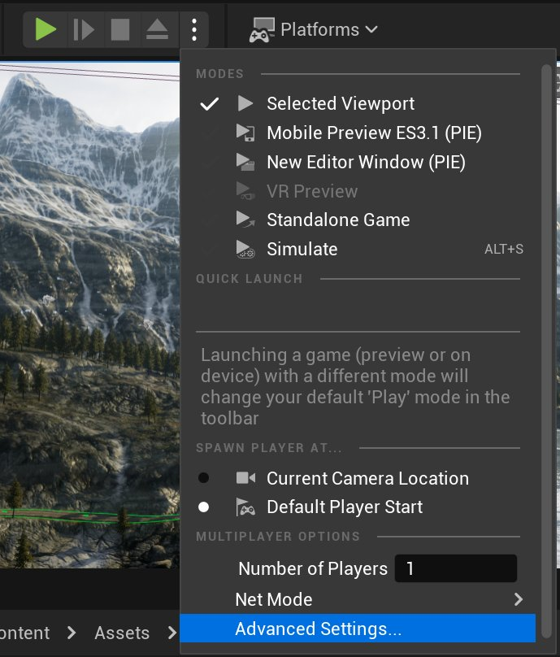

# PIE设置

> 路径：虚幻引擎5.7文档 / 构建虚拟世界 / 关卡编辑器 / 在编辑器中进行测试(运行&模拟) / PIE设置

> 原始页面：https://dev.epicgames.com/documentation/unreal-engine/play-in-editor-settings-in-unreal-engine

选择操作系统：

Windows

macOS

Linux

有两种方式可以打开 **运行（Play）** 设置面板。

- 点击 **编辑（Edit）** > **编辑器偏好（Editor Preferences）** 打开 **运行（Play）** 设置面板。

  

  点击查看大图。

  

  然后选择编辑器偏好（Editor Preferences）窗口的 **运行（Play）**。

  

  点击查看大图。
- 或者打开 **运行（Play）** 下拉菜单，点击 **高级设置（Advanced Settings）**。

  

  点击查看大图。

## Play In Editor

**编辑器中播放（Play In Editor）** 设置允许你在会话期间更改不同的行为。这些设置只应用于 **关卡视口** 中显示的"编辑器中播放"会话。 因此，没有需要设置的默认窗口大小。

| **设置** | **描述** |
| --- | --- |
| **游戏获取鼠标控制（Game Gets Mouse Control）** | PIE开始后，启用游戏鼠标控制。 |
| **使用鼠标模拟触控（Use Mouse for Touch)** | 在PIE期间，将鼠标移动和点击事件作为触控事件发送 |
| **显示鼠标控制提示文本（Show Mouse Control Label）** | 在PIE过程中，显示 "点击鼠标控制" 和 "Shift + F1显示鼠标光标" 等字样。 |
| **鼠标控制文本位置（Mouse Control Label Position）** | 确定在PIE过程中，鼠标控制文本在屏幕上的位置。 |
| **视口获取HMD控制（Viewport Gets HMDControl）** | 决定在视口中播放时，是否使用HMD的朝向信息。 |
| **在VRPIE模式下最小化编辑器（Should Minimize Editor on VRPIE）** | 在VR PIE上最小化编辑器。 |
| **自动重新编译蓝图（Auto Recompile Blueprints）** | 确定在启动Play In Editor会话时，是否自动重新编译关卡中使用的蓝图。 |
| **启用游戏声音（Enable Game Sounds）** | 在PIE会话期间，启用游戏声音。 |
| **PIE音质级别（Play In Editor Sound Quality Level）** | 确定PIE会话中声音的品质级别。 |
| **在PIE中流送子关卡（Stream Sub-Levels during Play in Editor）** | 从磁盘中流送子关卡，而非复制编辑器的子关卡。 |
| **启用PIE的进入退出音效（Enable PIE Enter and Exit Sounds）** | 退出或进入PIE时播放声音。 |

## 游戏视口设置

| **设置** | **描述** |
| --- | --- |
| **新视窗分辨率（New Viewport Resolution）** | 设置浮动PIE窗口的宽度和高度（按像素计）： 从常见窗口大小的列表中进行选取，其中包含手机和平板等设备的设置。 **新窗口宽度（New Window Width）**：设置新视口窗口的宽度（像素）。如果为0，则使用桌面窗口的屏幕分辨率。 **新窗口高度（New Window Height）**：设置新视口窗口的宽度（像素）。如果为0，则使用桌面窗口的屏幕分辨率。 |
| **新窗口位置（New Window Postion）** | 设置浮动PIE窗口左上角的屏幕空间坐标（按像素计）。这会对PIE和Standalone两种播放模式都产生影响： **左侧位置**: 设置屏幕中新视口的位置，从左边开始（按像素计）。 **顶部位置**: S设置屏幕中新视口的位置，从顶部开始（按像素计）。 **视口居中位置**: 启用后，始终将首个视口居于屏幕中间位置。 |
| **安全区预览（Safe Zone Preview）** | 启用设备安全区的可视化预览，用于UI测试。 |

## 在新窗口中运行

在新窗口中开始一个PIE会话后，这些设置将决定出现的新窗口的大小和初始位置。

| **设置（Setting）** | **描述（Description）** |
| --- | --- |
| **始终在上方（Always On Top）** | 始终让PIE窗口位于父窗口的上方 |

## 以Standalone游戏模式运行

当你用"编辑器中运行"模式打开一个独立窗口时，这些设置会决定新窗口的大小和初始位置。你可以使用这些选项将额外的命令行设置传递给游戏客户端。

| 设置 | 描述 |
| --- | --- |
| **客户端命令行选项（Client Command Line Options）** | 为传递给游戏客户端的其他设置生成一段命令行。 **禁用音效（Disable Sound (~nosound)）**：在你的独立进程游戏中禁用声音。 |
| **其他启动参数（Additional Launch Parameters）** | 在独立进程游戏的命令行中添加其他参数。 |
| **用于移动端的其他启动参数（Additional Launch Parameters for Mobile）** | 为独立进程游戏（PC上的移动端模拟游戏）的命令行添加其他参数. |

## 多人游戏选项

这些是[PIE多人游戏选项](../play-in-editor-multiplayer-options/index.md)的基础和高级选项。 除玩家数和专属服务器选项外，**Play In** 下拉菜单中还包含URL参数、游戏手柄路由，以及返回多进程测试法的设置。

| **设置** | **描述** |
| --- | --- |
| **启动独立服务器（Launch Separate Server）** | 启动一个单独的服务器，即便网络模式不需要它。这允许你通过让离线游戏连接服务器，来测试离线服务器的工作流程。 |
| **游戏网络模式（Play Net Mode）** | 设置PIE会话使用的网络模式。 作为独立进程游戏播放（Play Standalone）**: 启动一个独立进程游戏。这样不会创建一个专用服务器，也不会自动连接到一个服务器。 **作为监听服务器播放（Play As Listen Server）**: 让编辑器同时充当服务器和客户端。根据客户端的数量，可以打开额外的客户端。 **作为客户端播放（Play As Client）**: 让编辑器充当客户端。在后端生成一个专用服务器以便连接用。 |
| **在单个进程下运行（Run Under One Process）** | 在一个单一的UE5实例下生成多人游戏窗口。这样加载速度会快很多，但有可能出现更多问题。 |
| **启用网络模拟（Enable Network Emulation）** | 在启动游戏时应用所选的网络模拟设置，用于测试你的游戏如何处理网络问题。 **模拟目标（Emulation Target）**：将模拟设置仅用于服务器（Server Only）、仅用于客户端（Clients Only）、或用于所有人（Everyone）。 **网络模拟配置（Network Emulation Profile）**。对输入流量和外发流量应用预设。选项包括 "平均（Average）"、"糟糕（Bad）" 或 "自定义（Custom）"。 **输入流量（Incoming traffic）**。可以为所有输入的数据包添加延迟和数据包丢失的设置。可以添加最小和最大延迟，以及数据包丢失的百分比。 **外发流量（Outgoing traffic）**: 可以为所有外发数据包添加延迟和数据包丢失的设置。可以添加最小和最大延迟，以及数据包丢失的百分比。 |
| **客户端（Client）** | 启动游戏时应用所选的客户端设置。 **游戏客户端数量（Play Number of Clients）**：打开多个客户端窗口。第一个窗口将遵循在"编辑器模式中播放"（Play In Editor）的选项，其余的将遵循"在一个进程下运行"（Run Under One Process）的设置。 **将游戏手柄路由给第二个窗口（Route Gampad to Second Window）**: 在多人游戏会话中，路由游戏手柄的输入。如未勾选，则第一个游戏手柄绑定第一个多人游戏窗口，第二个绑定第二个窗口，依此类推。如勾选，游戏手柄绑定第二个多人游戏窗口，第一个窗口则由键盘和鼠标控制。 **为每个玩家创建音频设备（Create Audio Device for Every Player）**。控制创建多少个音频设备。如果勾选，将为每个玩家创建一个单独的音频设备。这能为每个玩家的视角提供准确匹配的音频效果，但代价是CPU开销变大。如果不勾选，则只为前两个玩家创建单独的音频设备。 **客户端固定FPS（Client Fixed FPS）**。将各个客户端的帧率设置为列表中的元素。包括监听服务器。 |
| **服务器（Server）** | 启动游戏时，应用选定的服务器设置： **服务器端口（Server Port）**。打开所选端口，进行简单服务器联网。 **服务器地图名称重载（Server Map Name Override）**。重载服务器启动的地图。目前只有PIE_StandaloneWithServer网络模式使用。 **其他服务器游戏选项（Additonal Server Game Options）**: 添加其他参数，作为URL参数传递给服务器。 **其他服务器启动参数（Additonal Server Launch Parameters）**: 添加其他参数，以便作为参数传递给服务器。 **服务器固定FPS（Server Fixed FPS）**: 让服务器以指定帧率运行。不影响监听服务器。 **多人游戏视口大小（按像素计）（Multiplayer Viewport Size (in pixels)）**: 以指定的宽度和高度生成额外的客户端。当你需要多个客户端但只想与一个窗口交互时，这会很有用。 |

## 在设备上运行

| **设置** | **描述** |
| --- | --- |
| **启动前生成游戏（Build Game Before Launch）** | 设备上启动游戏之前先构建游戏： **始终（Always）**：始终构建。 **从不（Never）**: 从不构建。 **如果项目包含代码，或本地运行，则构建编辑器（If project has code, or running locally build editor）**。根据项目类型进行构建。 **如果运行本地构建的编辑器（If running a locally built editor）**。如果使用本地构建的编辑器，则进行构建。 |
| **启动配置（Launch Configuration）** | 在设备上启动时，使用选定的构建配置。 **与编辑器相同（Same as Editor）**：在设备上启动时使用与编辑器相同的编译配置。 **调试（Debug）**: 在设备上启动时，使用调试编译配置。 **开发（Development）**: 在设备上启动时，使用开发编译配置。 **测试（Test）**: 在设备上启动时，使用测试编译配置。 **发布（Ship）**: 在设备上启动时，使用发布编译配置。 |
| **启动时自动编译蓝图（Auto Compile Blueprints on Launch）** | 启动前重新编译"问题"蓝图（dirty Blueprint）。 |

> [!NOTE]
> 有关构建配置的更多信息，请参见[构建配置参考](https://dev.epicgames.com/documentation/404)页面。

## 多人玩家选项（服务器调试设置）

| **设置** | **描述** |
| --- | --- |
| **默认显示服务器调试绘制（Show Server Debug Drawing by Default）** | 控制显示标志ServerDrawDebug的默认值。 |
| **显示服务器调试绘制颜色色调强度（Show Server Debug Drawing Color Tint Strength）** | 控制源自服务器的调试绘制偏向色调的强度。 |
| **显示服务器调试绘制颜色色调（Show Server Debug Drawing Color Tint）** | 源自服务器的调试绘制将偏向于这个颜色。 |
