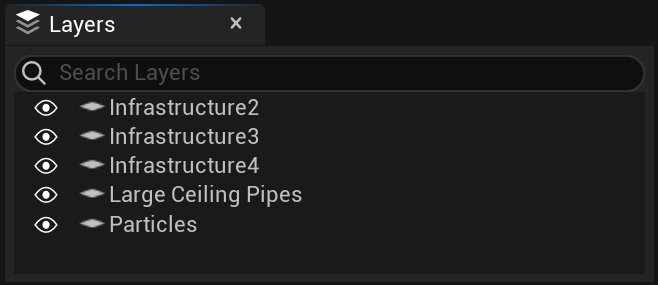
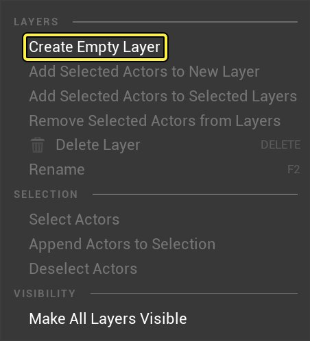
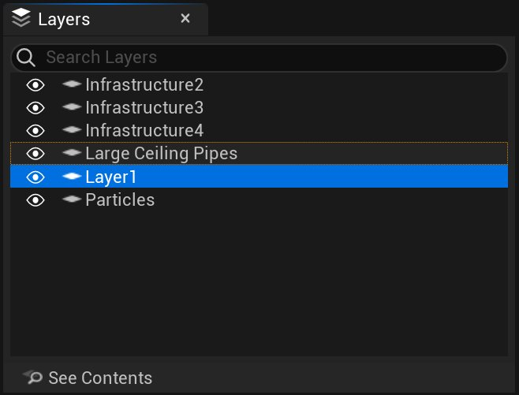
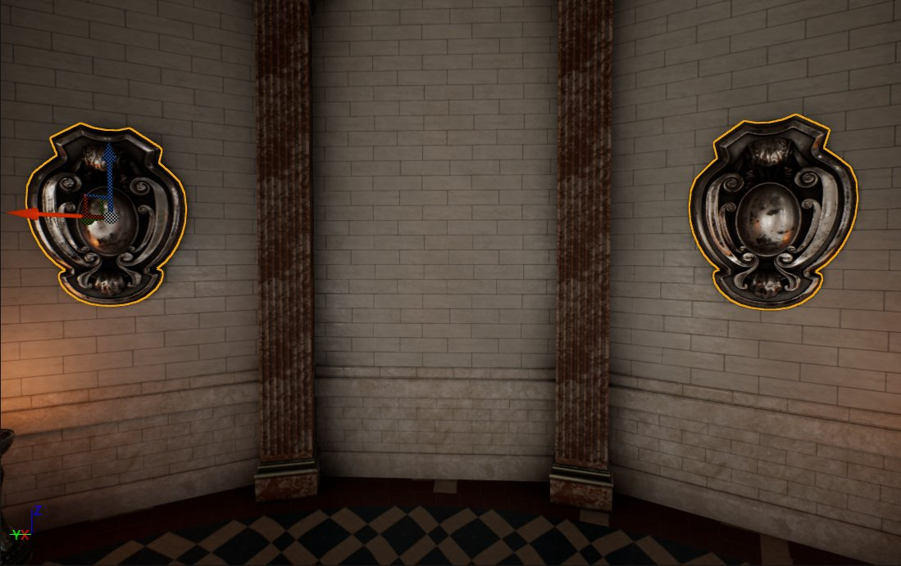
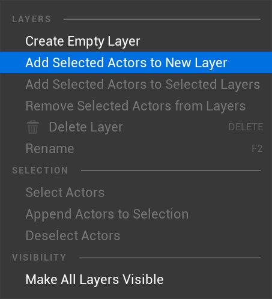
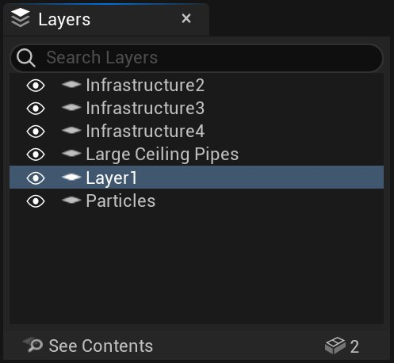
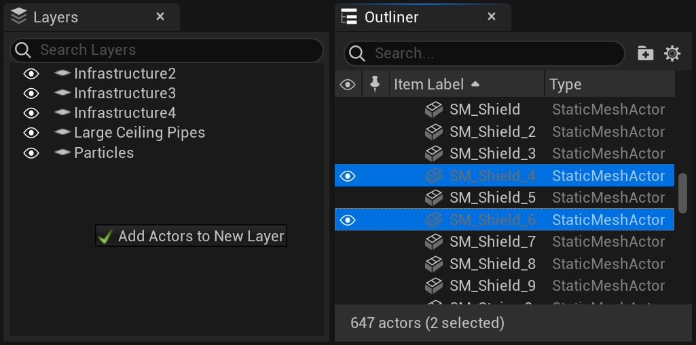
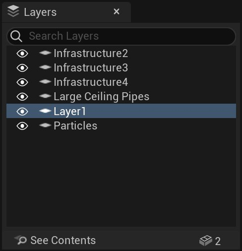

# 层级面板

> 路径：虚幻引擎5.7文档 / 构建虚拟世界 / 关卡编辑器 / 层级面板

> 原始页面：https://dev.epicgames.com/documentation/unreal-engine/layers-panel-in-unreal-engine

**层级（Layers）** 面板允许您组织关卡中的Actor。

点击查看大图。

层级提供了快速选择和控制相关Actor组可视性的能力。 您可以使用您的层级来快速整理一个场景， 只留下您正在处理的几何体和Actor。例如，您可能正在处理一个由多个模块组成的 多层建筑。通过将每个楼层分配到一个层级，您可以隐藏您不在处理的每个楼层， 使顶视图更易于管理。

一个Actor可以在任意多个层级中。如果有不同Actor集归入重叠层级下， 这可能会很有用。例如，您可以通过将特定 *区域* 内的所有内容分配给一个层级来组织您的层级， 并让另一个层包含您关卡中的所有门。

在创建大关卡时，使用层级的范围越广，工作就越容易。记住， 从一开始就使用层级总是比在您已经深入到关卡创建的时候 再去整合它们要容易的多。

## 层级创建

可以在 **Layers（层级）** 面板中创建为空层级，也可以使用当前选择。

**要创建空层级，请执行以下操作：**

1. 在 **层级（Layers）** 面板中 **右键单击**，并选择 *创建空层级（Create Empty Layer）*。

   
2. 新层级将显示在列表中。

   

**要从选择中创建层级，请执行以下操作：**

1. 在视口中选择要添加到层级中的对象。

   
2. 在 **层级（Layers）** 面板中 **右键单击**，并选择 *将选定Actor添加到新层级（Add Selected Actors to New Layer）*。

   
3. 包含Actor的新层级将显示在列表中。

   

**要通过拖放创建层级，请执行以下操作：**

1. 选择要添加到层级的Actor。
2. 将Actor从 **世界大纲视图（World Outliner）** 拖到 **层级（Layers）** 面板中的空白区域。

   
3. 包含Actor的新层级将显示在列表中。

   

## 层级命名

默认情况下，使用 *层级（Layer）[编号]* 命名方案为新层级指定一个名称。每增加一个新层， 这个编号就会增大。最好确保使用描述性名称命名层级， 并且永远不要保留默认名称。例如，一个包含散落在地板上的小物品的层级可能被命名为 *地面杂物（Ground Clutter）*。这不仅可以方便地快速查看每个层级包含的内容， 而且使使用[搜索](#%E6%90%9C%E7%B4%A2%E5%B1%82%E7%BA%A7)特性过滤层级成为可能。

> [!TIP]
> 层级名称可以包含任何字母数字字符，也可以包含空格、连字符和下划线。

**要重命名层级，请执行以下操作：**

1. **右键单击** 层级并从上下文菜单中选择 **重命名（Rename）**。

   > 图片已省略：Rename layer
2. 在包含当前名称的文本框中输入名称。

   > 图片已省略：Layer new name
3. 该层级以新名称显示。

   > 图片已省略：Layer new name

## 搜索层级

可以使用 **层级（Layers）** 面板顶部的搜索框过滤层级。过滤是基于 搜索框中输入的文本与层级的名称之间的匹配进行的。当您在框中输入时， 层级列表会被实时过滤；只显示名称与文本匹配的层级。

| Unfiltered Layer List | Filtered Layer List |
| --- | --- |
| 未过滤的层级列表 | 已过滤的层级列表 |

按"X"按钮清除当前搜索项。

## 层级内容

层级的内容可以直接在 **层级（Layers）** 面板中查看。层级内容视图显示 层级的名称、包含在层级中的所有Actor的列表以及有关层级内容的信息。 要进入层级内容视图，选中要查看的层级， 再按 **层级（Layers）** 面板底部的 **查看内容（See Contents）** 按钮，

> 图片已省略：Layer Contents view

点击查看大图。

该层级的名称和一组按钮一起显示在顶部， 这些按钮显示了该层级中包含的Actor的各种类型和数量。

> 图片已省略：Layer Contents View Title Bar

点击查看大图。

层级名称右侧的各种按钮显示了层级中包含的各个Actor类型的数量 。例如，层级（Layers）面板右下角的按钮通知用户 层级中包含139个静态网格体Actor。

> [!TIP]
> 这些按钮还可以用来执行[特定于类型的选择](#%E7%89%B9%E5%AE%9A%E4%BA%8E%E7%B1%BB%E5%9E%8B%E7%9A%84%E9%80%89%E6%8B%A9)。

要返回到层级列表，请按Back button按钮。

### 添加Actor

Actor可以作为选择添加到一个或多个层级中，也可以从 **世界大纲视图（World Outliner）** 中拖放。

**要添加Actor的选择，请执行以下操作：**

1. 选择要添加到层级的Actor。

   > 图片已省略：Select Actors to add
2. **右键单击** 要添加Actor的层级，并选择 *将选定Actor添加到选定层级（Add Selected Actors to Selected Layers）*。

   > 图片已省略：Add Selected Actors to Selected Layers

**要通过拖放添加，请执行以下操作：**

1. 选择要添加到层级的Actor。
2. 将Actor从 **世界大纲视图（World Outliner）** 拖到 **层级（Layers）** 面板中的某个层级。

   > [!TIP]
   > 您还可以拖到 **层级（Layers）** 面板底部的内容栏， 将Actor分配到选定层级。

   > 图片已省略：Layers drag and drop

   > [!NOTE]
   > 在拖放时，已经分配Actor的层级会变灰。 此外，如果已将被拖动的Actor分配到目标层级，则会有一条消息 通知您这一点： All Actors already Assigned to Layer
3. Actor被添加到层级。

### 移除Actor

Actor可以单独或作为一组选定Actor从层级中移除。

**要移除单独的Actor，请执行以下操作：**

1. 按层级内容视图中的Actor旁的"X"按钮。

   > 图片已省略：Remove Actor button
2. 从层级中移除Actor，并更新列表。

   > 图片已省略：Remove Actor button

**要移除一组选定Actor，请执行以下操作：**

1. 选择要从层级中移除的Actor。

   > 图片已省略：Select Actors to remove
2. **右键单击** 该层级，并选择 *从层级中移除选定Actor（Remove Selected Actors from Layers）*。

   > 图片已省略：Remove Selected Actors menu option
3. 从层级中移除Actor。

### 搜索层级内容

可以使用顶部的搜索框在层级内容视图中过滤层级中的Actor。过滤是基于 搜索框中输入的文本与Actor的名称之间的匹配进行的。当您在框中输入时， Actor列表会被实时过滤；只显示名称与文本匹配的Actor。

| Unfiltered Layer Contents | Filtered Layer Contents |
| --- | --- |
| 未过滤的层级内容 | 已过滤的层级内容 |

按"X"按钮清除当前搜索项。

## 可视性

通过在层级列表中切换层级的可视性（眼睛）按钮， 可以显示或隐藏任何层级的内容。

| Layer Visible | Layer Hidden |
| --- | --- |
| 可视 Visibility | 隐藏 Visibility |

## 选择方法

层级中的Actor可以作为一个组选择、单独选择或基于类型选择。层级中的Actor也可以添加到当前选择项中或从当前选择项中移除。

**要选择层级中的所有Actor，请执行以下操作：**

1. 在层级列表中 **双击** 该层级，或 **右键单击** 该层级并选择 *选择Actor（Select Actors）*。

   > 图片已省略：Select Actors menu option
2. 层级中的所有Actor都被选中，替换当前的选择集。

   > 图片已省略：Actors Selected

**要将层级Actor附加到选项，请执行以下操作：**

1. **右键单击** 该层级，并选择 *将Actor附加到选项（Append Actors to Selection）*。

   > 图片已省略：Select Actors menu option
2. 选中层级中的所有Actor，将它们附加到当前选择集。

   | Initial Actors Selected | Layer Actors Appended |
   | --- | --- |
   | 初始选择 | 附加的层级Actor |

**要从选择中移除层级Actor，请执行以下操作：**

1. **右键单击** 该层级，并选择 *取消选择Actor（Deselect Actors）*。

   > 图片已省略：Select Actors menu option
2. 该层级中的所有Actor将从已取消选择项中移除，从当前选择集中移除它们。

   | Initial Actors Selected | Layer Actors Removed |
   | --- | --- |
   | 初始选择 | 移除的层级Actor |

### 特定于类型的选择

特定于类型的选择允许您快速地选择层级中包含某种类型的所有Actor。这可以使用主层级列表的内容栏或层级内容视图的标题栏中的按钮来执行。

| Contents Bar | Title Bar |
| --- | --- |
| 层级列表内容栏 | 层级内容视图标题栏 |

按实例按钮选择层级中的所有静态网格体Actor。

> 图片已省略：Selected StaticMeshActors

## 细节层级分段

**层级（Layers）** 类别采用标签风格的布局，能显示所选Actor所属的层级。

> 图片已省略：Layer cloud

> [!NOTE]
> 只有所有被选中的Actor共有的层级才会被显示。

点击某个层级的 Remove 按钮，会将所有选中的Actor从该层级中删除。
