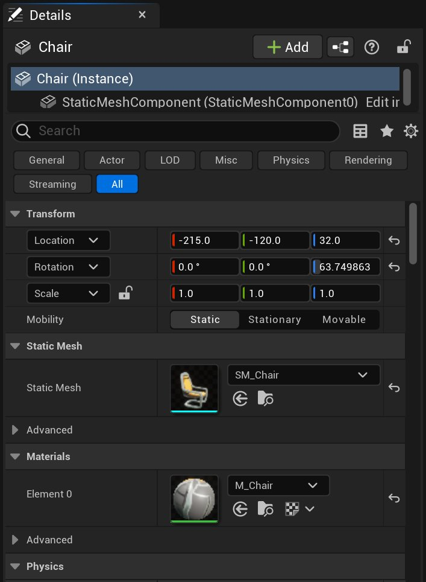
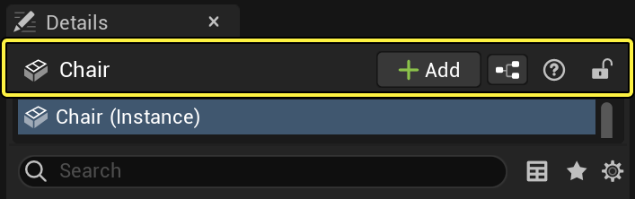
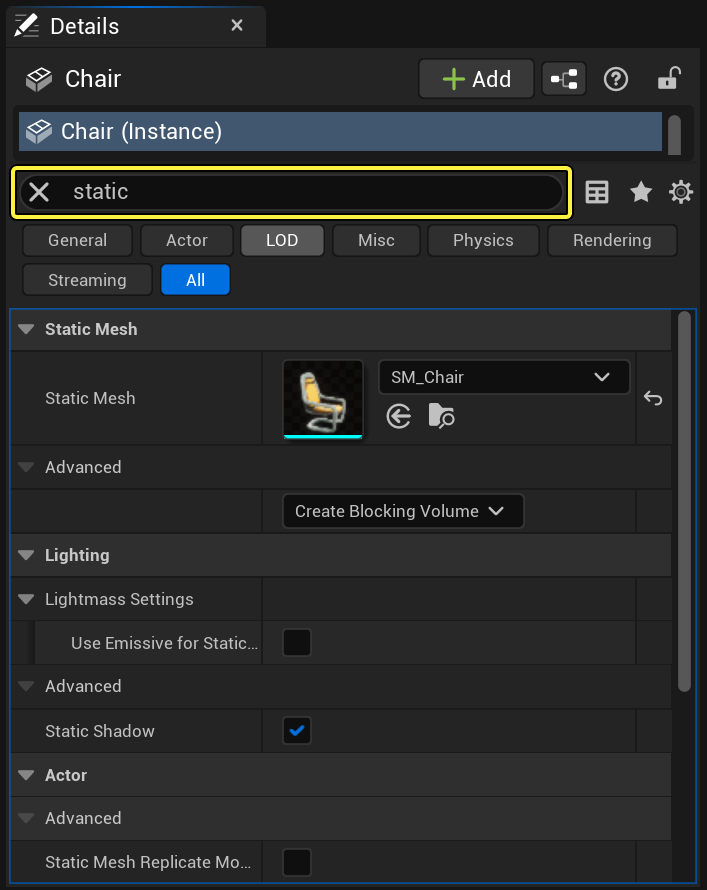
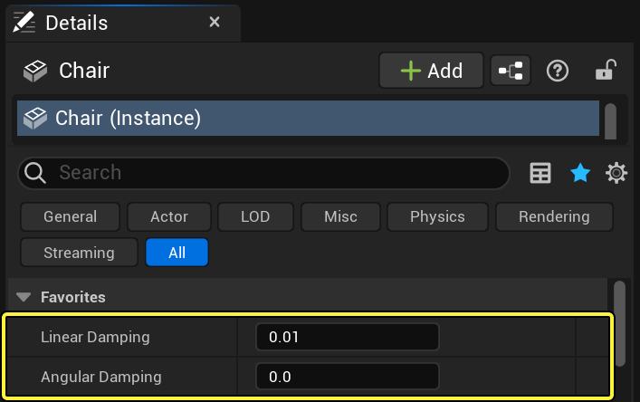
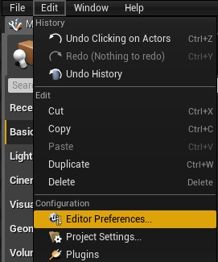
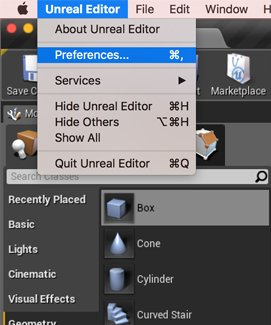
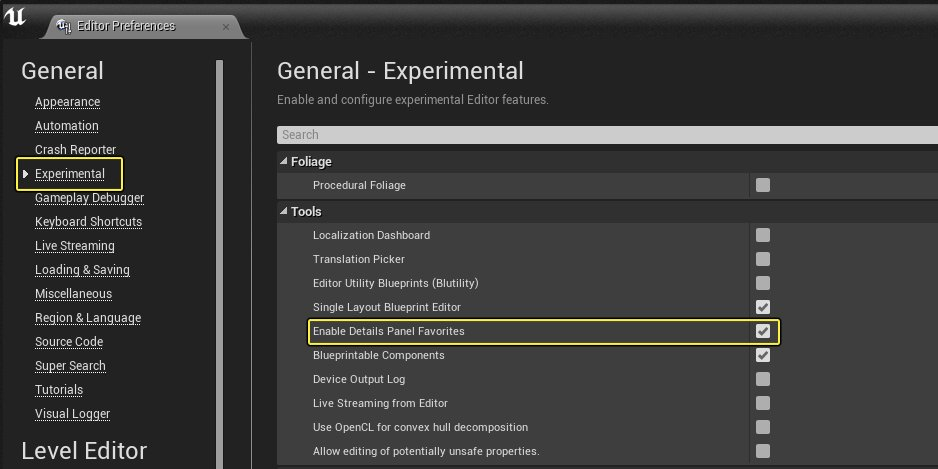
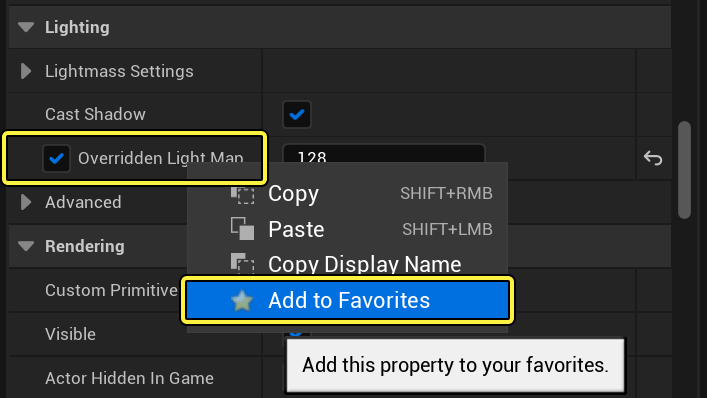

# 关卡编辑器细节面板

> 路径：虚幻引擎5.7文档 / 构建虚拟世界 / 关卡编辑器 / 关卡编辑器细节面板

> 原始页面：https://dev.epicgames.com/documentation/unreal-engine/level-editor-details-panel-in-unreal-engine

选择操作系统：

Windows

macOS

Linux

**细节（Details）** 面板包含特定于视口中的当前选项的信息、工具和函数。 它包含用于移动、旋转和缩放Actor的转换编辑框，显示选定Actor的所有可编辑属性， 并根据视口中选定Actor的类型提供对附加编辑功能的快速 访问。例如，可以将选定Actor导出到FBX并转换为另一种兼容类型。细节（Details） 面板还允许您查看选定Actor使用的材质（如有）并快速打开它们进行编辑。

点击查看大图。

## Actor名称

可以直接在编辑器中为Actor设置友好名称。可以使用这些名称访问相关Actor，也可以 使用 **[世界大纲视图（World Outliner）面板](../outliner/index.md)** 中的搜索功能找到它们。

要编辑Actor名称，只需在 **细节（Details）** 面板顶部的文本框中键入名称。

点击查看大图。

## 搜索过滤器

可以使用 **搜索细节（Search Details）** 框过滤细节面板中显示的属性。当您键入时，将自动过滤属性， 只显示与文本匹配的属性。

点击查看大图。

要清除过滤器，单击 **搜索（Search）** 框右侧的 Clear Search 按钮。

> [!TIP]
> 因为此文本框数据隐藏了与搜索条件不匹配的所有属性， 所以如果没有看到要查找的属性，请检查以确保清除了这些细节。

## 收藏夹

> [!WARNING]
> 该选项目前被认为是实验性的，一些功能可能不如预期有效。

如果Actor中有您经常更改或者想要快速访问的属性，您可以使用 **收藏夹（Favorites）** 属性来标记它们，以便它们显示在 **细节（Details）** 面板的顶部。

点击查看大图。

上面，我们选择了两个选项作为 收藏夹（Favorites），在它们的属性名旁边设置星号图标指示。

**启用收藏夹：**

1. 在 **编辑（Edit）** 菜单中，选择 **编辑器偏好设置（Editor Preferences）**。

   

   
2. 在 **试验性（Experimental）** 下，选中 **启用细节面板偏好（Enable Details Panel Favorites）** 选项。

   

> [!NOTE]
> 可能需要重启编辑器，才会应用所做更改。

**将属性标记为收藏夹：**

1. 启用此选项后，在任何细节（Details）面板中单击属性旁边的星号图标。

   

   点击查看大图。

> [!NOTE]
> 由于自定义的复杂性，有些属性可能无法提供收藏它们的功能。

1. 该属性（以及所有其他标记的收藏夹）将列在面板的 **收藏夹（Favorites）** 部分下。

   > 图片已省略：Marked Favorites

   点击查看大图。

## 默认值

当属性被修改为其默认值以外的值时，将显示一个指示器。

> 图片已省略：Property not set to default

点击查看大图。

通过单击重置为默认（Reset to Default） 指示器并从菜单中选择重置值， 可以将所有属性重置为默认值。

> 图片已省略：Reset to Default Menu

点击查看大图。

属性的值被重置为默认值，如菜单所示，指示器不再存在。

> 图片已省略：Property set to default

点击查看大图。

## 编辑条件

可以启用或禁用属性。属性只有在启用后才能进行编辑。默认情况下， 所有属性都已启用，除非它们有编辑条件。有编辑条件的属性 依赖于另一个变量的值来确定它们是否启用、可否进行编辑。

在某些情况下，编辑条件用于确定属性是否会覆盖某些其他值，或者是否有 任何影响。其他时候，除非满足某些条件，否则某些属性可能根本没有意义。例如，您可能有 一组与间接光照有关的属性，以及一个能够全局切换是启用还用禁用间接光照的 "bool"属性。组中的每个属性都可以以全局切换为条件，以便只有在使用间接光照时才 启用它们。

有简单的编辑条件的属性将在左侧空白处显示一个复选框。当该复选框被选中时， 该属性将被启用。当未选中时，该属性将被禁用并显示为灰色。

> 图片已省略：Edit Consition Properties

点击查看大图。

## EditConst属性

声明为"editconst"的属性（不能在编辑器中修改）显示它们的值，并高亮显示以表明它们不能编辑。

> 图片已省略：Edit Const Property

点击查看大图。

> 图片已省略：Edit Const Property

点击查看大图。

## 类别

在 **细节（Details）** 面板中，属性按类别显示。通常，诸如 **渲染（Rendering）**、**光照（Lighting）** 和 **碰撞（Collision）** 等类别由属性在代码中的声明方式决定，并用作将相关属性组织成组的一种方法。其他类别，诸如 **转换（Transform）**、**静态网格体（Static Mesh）**、**材质（Materials）**、**Actor**、**代码视图（Code View）** 和 **图层（Layers）**，则是自定义控件，专门设计用于公开某些属性或功能，使它们易于查找、修改或使用。
