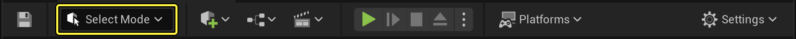
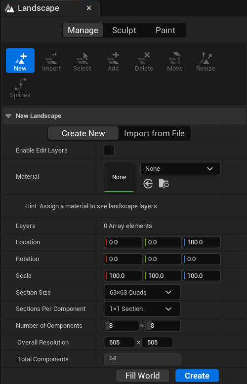

# 关卡编辑器模式

> 路径：虚幻引擎5.7文档 / 构建虚拟世界 / 关卡编辑器 / 关卡编辑器模式

> 原始页面：https://dev.epicgames.com/documentation/unreal-engine/level-editor-modes-in-unreal-engine

**关卡编辑器（Level Editor）** 可以进入不同的编辑模式，以启用特定的编辑界面和工作流程，从而编辑特定类型的Actor或几何体。

为了显示可显示的模式，在关卡编辑器工具栏中，打开 **模式（Modes）** 下拉菜单。

点击查看大图

| 图标 | 模式 | 快捷键 | 说明 |
| --- | --- | --- | --- |
| LE工具选择 | **选择（Select）** | **Shift + 1** | 激活[**选择** 模式](select-mode/index.md)以便在场景中选择Actor。 |
| LE工具地形 | **地形** | **Shift + 2** | 激活[**地形（Landscape）** 模式](../../landscape-outdoor-terrain/index.md)以便编辑地貌地形。 |
| LE工具植被 | **植被（Foliage）** | **Shift + 3** | 激活[**植被** 模式](../../open-world-tools/foliage-mode/index.md)以便绘制实例化的植被。 |
| LE工具网格体绘制 | **网格体绘制（Mesh Paint）** | **Shift + 4** | 激活 [**网格体绘制（Mesh Paint）** 模式](mesh-paint-mode/index.md)以便使用视口在静态网格体Actor上直接绘制顶点颜色和纹理。 |
| LE工具建模 | **建模（Modeling）** | **Shift + 5** | 激活 **建模（Modeling）** 编辑模式。 |
| LE工具破碎 | **破碎（Fracture）** | **Shift-6** | 激活 [**破碎（Fracture）** 莫斯](https://dev.epicgames.com/documentation/404)以便创建可破坏的物体和环境。 |
| LE工具笔刷 | **笔刷编辑（Brush Editing）** | **Shift + 7** | 激活 [**笔刷编辑（Brush Editing）** 模式](../../../understanding-the-basics/actors-and-geometry/unreal-engine-actors-reference/geometry-brush-actors/index.md)以便修改几何体笔刷。 |
| LE工具动画 | **动画（Animation）** | **Shift + 8** | 激活 **动画（Animation）** 编辑模式。 |

**模式（Modes）** 会针对特定任务，更改关卡编辑器主要行为，例如在场景中移动变换某个资产，雕刻地形，生成植被，创建几何笔刷和体积，以及在网格体上绘制。模式（Modes）面板包含一组工具，并且这些工具会根据你选择的编辑模式而调整。

点击查看大图。

地形面板

> [!TIP]
> 你可以通过点击标签页右上角的"X"来关闭面板，也可以右键点击标签页，然后在出现的上下文菜单中点击 **隐藏标签页** 来隐藏面板。要重新打开已关闭的面板，请在 **窗口** 菜单中点击该面板的名称。
