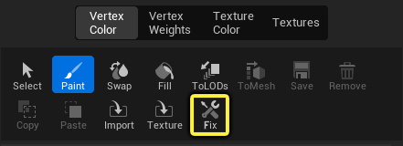

# 用修复工具解决顶点数据不匹配问题

> 路径：虚幻引擎5.7文档 / 构建虚拟世界 / 关卡编辑器 / 关卡编辑器模式 / 网格体绘制模式 / 用修复工具解决顶点数据不匹配问题

> 原始页面：https://dev.epicgames.com/documentation/unreal-engine/vertex-color-matching-in-unreal-engine

在处理网格体时，你有时可能会在编辑器外更新网格体。这可能包括修改网格体的拓扑结构，向其添加或删除顶点。如果你已经花费时间在网格体上绘制了顶点颜色或顶点权重，这可能导致你将修改后的网格体再次导入时出现顶点颜色数据错误，弹出类似下面这种贴图检查错误：

StaticMeshActor_73 (LOD 0) has hand-painted vertex colors that no longer match the original StaticMesh

网格体绘制模式的 **修复（Fix）**工具可以解决这类顶点颜色与原始网格体顶点不匹配，从而导致网格体外观不正确的错误。

在使用 **顶点颜色（Vertex Color）**、**顶点权重（Vertex Weights）** 和 **纹理颜色（Texture Color）** 绘制方法时，可以使用 **修复（Fix）** 工具。

> [!NOTE]
> 修复工具只有在网格体上存在需要解决的绘制顶点数据问题时才可用。默认情况下，该工具是被禁用的，显示为灰色。

该工具的设计目的是即使网格体修改巨大，也始终能够用它匹配上一些颜色。该工具对于修复网格体的小改动非常有效。但大量改动的修复会更具挑战性，因为它们增加了颜色不匹配的可能性。

以下示例展示了在网格体上绘制的顶点颜色及其线框，以及用于对比的RGB顶点绘制可视化效果。左边的是带顶点颜色的原始网格体，右边的是重新导入后的、顶点数量减少并使用修复工具修复了顶点颜色的网格体。

| 列 1 | 列 2 |
| --- | --- |
| [undefined](https://d1iv7db44yhgxn.cloudfront.net/documentation/images/0b1c9260-84ac-41f4-85d5-51cc7ab814aa/fix-tool-high.png) | [undefined](https://d1iv7db44yhgxn.cloudfront.net/documentation/images/456382e6-f8b8-49dc-beb9-583f997460e5/fix-tool-low.png) |
| 绘制了顶点颜色的原始网格体，顶点数较多。 | 重新导入的绘制了顶点颜色的网格体，顶点数较少且应用了修复工具。 |
