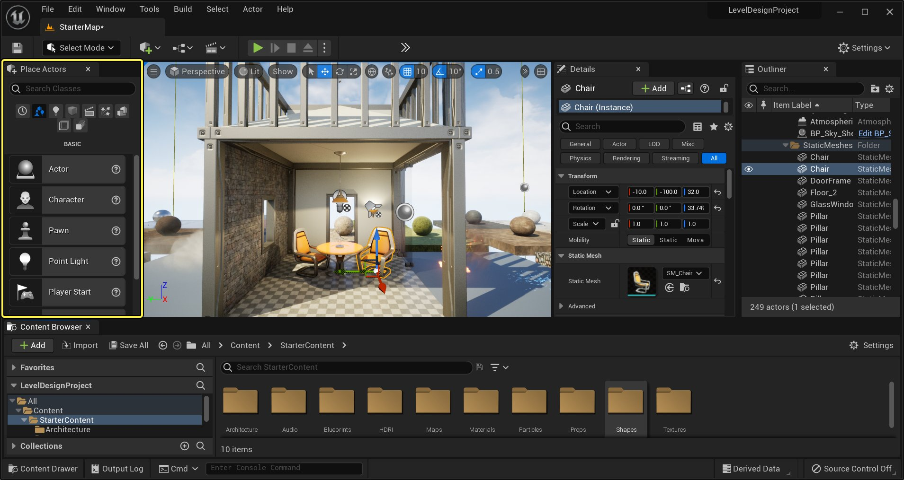

# 选择模式

> 路径：虚幻引擎5.7文档 / 构建虚拟世界 / 关卡编辑器 / 关卡编辑器模式 / 选择模式

> 原始页面：https://dev.epicgames.com/documentation/unreal-engine/select-mode-in-unreal-engine

选择操作系统：

Windows

macOS

Linux

点击查看大图。

**选择模式（Select Mode）** 是在 **虚幻引擎5** 中专门用于加快和简化场景创建的工具。选择模式本质上类似于 **内容浏览器**，它仅着眼于可以直接放置在关卡中的 **Actor**。启用后，选择模式允许你立即获取所有已经放置在关卡中的对象。

选择模式的存在旨在极大加快你的设计速度，让你在关卡中放置和编辑各类道具时变得更方便。

选择模式启用后，当你从 **放置Actor** 面板（默认位于主界面的左上角）拖入某个资产的实例后，你就能马上在关卡中变换和编辑该Actor。请参阅[放置Actor](../../../../understanding-the-basics/actors-and-geometry/placing-actors/index.md)了解其他放置Actor的方法。
