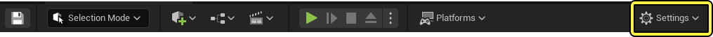

# 快速设置

> 路径：虚幻引擎5.7文档 / 构建虚拟世界 / 关卡编辑器 / 关卡编辑器工具栏 / 快速设置

> 原始页面：https://dev.epicgames.com/documentation/unreal-engine/quick-settings-in-the-unreal-engine-level-toolbar

**关卡编辑器工具栏** 中的 **设置（Settings）** 菜单有一组属性可用于控制关卡视口中的选择、编辑和预览。请从主工具栏（也称为[关卡编辑器工具栏](../index.md)）中打开"设置（Settings）"菜单。

"设置（Settings）"菜单包含以下几组设置：

- 选择（Selection）
- 可扩展性（Scalability）
- 实时音频（Real Time Audio）
- 吸附（Snapping）
- 视口（Viewport）
- 预览（Previewing）

## 选择

| **选项** | **描述** |
| --- | --- |
| **允许选择半透明对象（Allow Translucent Selection）** | 如果启用，单击应用了半透明材质的几何体将选择相应的Actor。 启用此选项可以选择透明网格体，例如玻璃对象。在其他情况下禁用此选项或许很有用。例如，如果房间内充满了半透明粒子，则启用此选项后会很难选择房间中的其他对象，因为单击粒子会选到发射器Actor。 |
| **允许选择群组（Allow Group Selection）** | 如果启用，在群组中选择一个Actor将选择整个群组，而不是单个Actor。 |
| **严格框选（Strict Box Selection）** | 如果启用，Actor必须完全位于矩形选框中才能被选中。 |
| **框选被遮挡对象（Box Select Occluded Objects）** | 如果启用，矩形框选操作同时会选择被其他对象遮挡的对象。 |
| **显示变换控件（Show Transform Widget）** | 切换视口中的变换控件的可视性。 |

## 可扩展性

| **选项** | **描述** |
| --- | --- |
| **引擎可扩展性设置（Engine Scalability Settings）** | 快速访问用于控制各种渲染功能保真度的[可扩展性](../../../../designing-visuals-rendering-and-graphics/optimizing-and-debugging-projects-for-realtime-rendering/scalability/index.md)设置。 启用 **监控引擎性能？（Monitor Engine Performance?）** 选项可实时查看更改此设置对项目性能的影响。 |
| **材质质量级别（Material Quality Level）** | 设置用于在视口中预览的材质质量级别。 请参阅[材质质量切换表达式](../../../../designing-visuals-rendering-and-graphics/unreal-engine-materials/unreal-engine-material-expressions-reference/utility-material-expressions/index.md#%E8%B4%A8%E9%87%8F%E5%88%87%E6%8D%A2)，了解关于设置材质以搭配该设置一起使用的更多信息。 |
| **预览渲染级别（Preview Rendering Level）** | 设置编辑器使用的渲染级别。可将渲染质量限制到特定于设备的功能，包括不同版本的： Android iOS D3D |

## 实时音频

| **选项** | **描述** |
| --- | --- |
| **音量（Volume）** | 控制当视口设置为实时时播放关卡音频的音量。 |

## 吸附

| **选项** | **描述** |
| --- | --- |
| **启用Actor吸附（Enable Actor Snapping）** | 如果启用，当Actor在指定的距离内时会吸附到其他Actor的位置处。 |
| **距离（Distance）** | 如果启用了 **启用Actor吸附（Enable Actor Snapping）**，Actor必须在指定的距离内才能相互吸附，此选项用于指定这一距离。 |
| **启用插槽吸附（Enable Socket Snapping）** | 如果启用，Actor可以吸附到插槽。 |
| **启用顶点吸附（Enable Vertex Snapping）** | 如果启用，Actor会吸附到运动方向上遇到的另一个Actor的最近顶点处。 |
| **启用平面吸附（Enable Planar Snapping）** | 如果启用，Actor会吸附到约束平面上的最近位置。此功能仅在透视图中才能正确工作。 |

## 视口

| **选项** | **描述** |
| --- | --- |
| **隐藏视口UI（Hide Viewport UI）** | 隐藏视口工具栏和所有视口UI控件。 |

## 预览

| **选项** | **描述** |
| --- | --- |
| **绘制笔刷多边形（Draw Brush Polys）** | 如果启用，则会对选中的CSG（构造实体几何）笔刷面渲染半透明多边形。 |
| **在游戏预览中仅加载可见关卡（Only Load Visible Levels in Game Preview）** | 如果启用，在游戏预览开始时仅加载可见关卡。 |
| **启用粒子系统LOD切换（Enable Particle System LOD Switching）** | 如果启用，粒子系统将在透视图视口中使用距离LOD切换。 |
| **切换粒子系统辅助工具（Toggle Particle System Helpers）** | 如果启用，在视口中显示粒子系统辅助工具。 |
| **冻结粒子模拟（Freeze Particle Simulation）** | 如果启用，粒子系统将冻结其模拟状态。 |
| **启用LOD视图锁定（Enable LOD View Locking）** | 如果启用，同类型视口将使用同一LOD。 |
| **启用自动关卡流送（Enable Automatic Level Streaming）** | 如果启用，视口将在摄像机移动时自动流送关卡。 |
