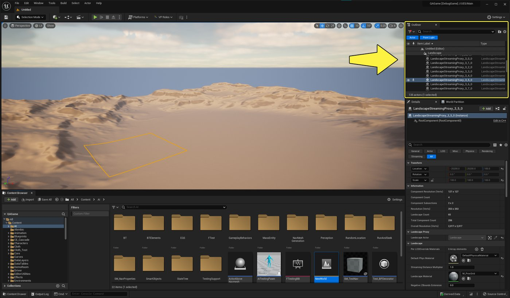
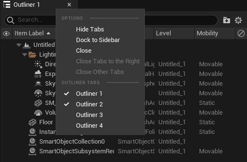
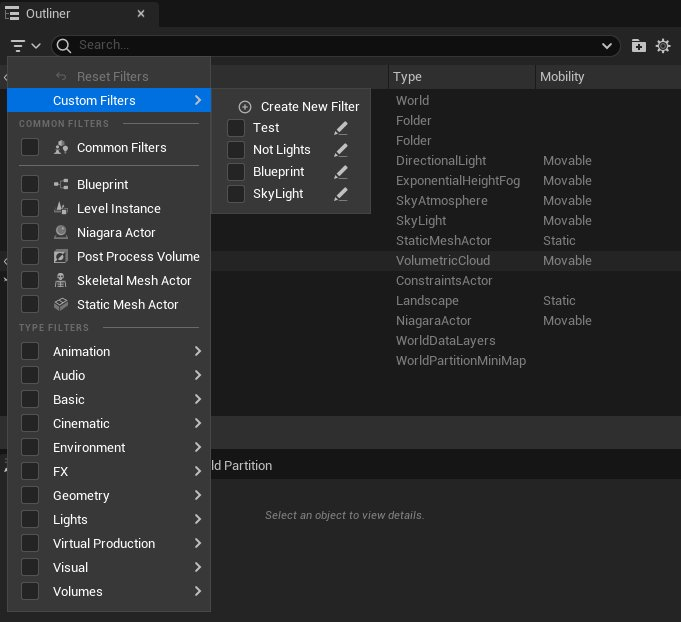
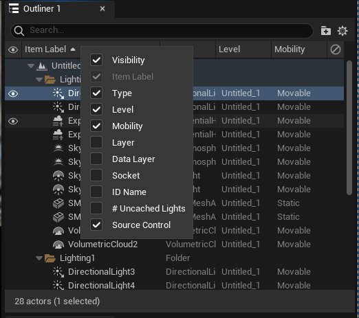

# 大纲视图

> 路径：虚幻引擎5.7文档 / 构建虚拟世界 / 关卡编辑器 / 大纲视图

> 原始页面：https://dev.epicgames.com/documentation/unreal-engine/outliner-in-unreal-engine

**大纲视图（Outliner）**面板以层级树状图显示场景中的所有Actor。 使用大纲视图，你可以：

- 选择并修改Actor。
- 按名称、类型和其他特征搜索并筛选Actor。
- 使用高级搜索运算符进一步优化Actor搜索。
- 定制要显示的Actor信息。

大纲视图面板默认位于虚幻编辑器窗口的右侧。 点击图像查看大图。

你最多可以拥有四个大纲视图实例，可以单独为每个实例自定义设置。 要在不同大纲视图实例之间切换，请右键点击"大纲视图（Outliner）"选项卡并选择不同的大纲视图，或在虚幻引擎的主菜单中转到**窗口（Window） > 大纲视图（Outliner）**。

在不同的大纲视图实例之间切换。

## 大纲视图操作

你可以在大纲视图中对Actor执行以下操作：

| 操作 | 说明 |
| --- | --- |
| **左键单击** | 选择该Actor。 |
| **右键单击** | 显示在视口中右键点击Actor所弹出的相同上下文菜单。 用于快速修改Actor，而不必在视口中寻找该Actor。 |
| **左键单击并拖动** | 将所拖动的Actor附加到另一个Actor。 |
| 键盘快捷方式**F**键 | 在大纲视图中选择Actor后：在视口中聚焦该Actor。 在视口中选择Actor后：在大纲视图中将Actor列表滚动到所选Actor。 |

## 在大纲视图中搜索和筛选

使用大纲视图中的**搜索**框搜索并快速筛选场景中的Actor列表。 默认情况下，搜索会显示与搜索词部分匹配的所有Actor。 如果你使用多个搜索词，只有匹配所有词的Actor才会显示。

在大纲视图中搜索时，你可以使用所有[高级搜索语法](../../../understanding-the-basics/content-browser/advanced-search-syntax/index.md)运算符。

最常见的一些运算符有：

| 运算符 | 操作 | 示例 |
| --- | --- | --- |
| `-` | 排除与特定词匹配的Actor。 | `-Sky` |
| `+` | 强制词完全匹配，而不是部分匹配。 | `+Sky`将匹配`Sky`，但排除`Skylight` |

你可以将搜索保存为**自定义过滤器**，并通过**过滤器（Filter）**下拉菜单的**自定义过滤器（Custom Filters）**类别访问自定义过滤器。 每个用户的自定义筛选器将全局保存，这意味着，用户只要创建了自定义筛选器，就可以在所有目录和项目中使用。

大纲视图中的筛选器菜单。

在大纲视图中**筛选**Actor的方式与在内容浏览器中[筛选资产](../../../understanding-the-basics/content-browser/filters-and-collections/index.md)的方式相同。

## 自定义大纲视图

**右键单击**任意列标题即可弹出上下文菜单，启用或禁用列名称旁边的复选框，即可选择要在大纲视图中显示或隐藏的列。

显示和隐藏大纲视图列。

> [!NOTE]
> 搜索会匹配大纲视图中所有列中的词，无论它们是否可见。

**左键单击并拖动**列标题边缘即可调整该列的大小。

当你在视口中选择Actor时，大纲视图总是会滚动到该Actor。 在大纲视图的**设置（Settings）**菜单中切换**始终帧选择（Always Frame Selection）**，即可禁用该行为。

总是帧选择（Always Frame Selection）选项在切换为开或关时的动画演示。
