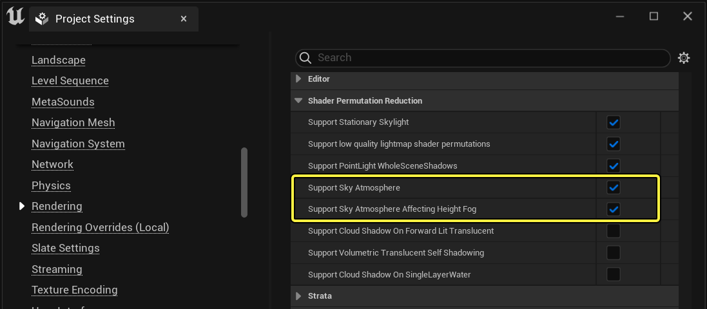
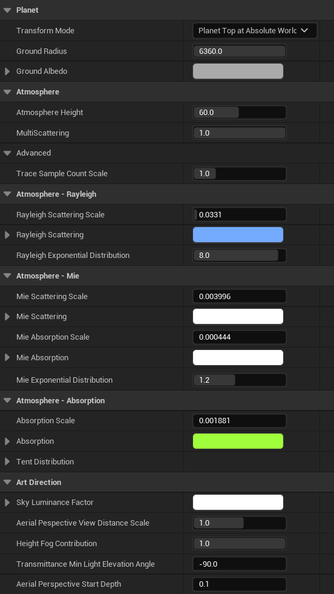
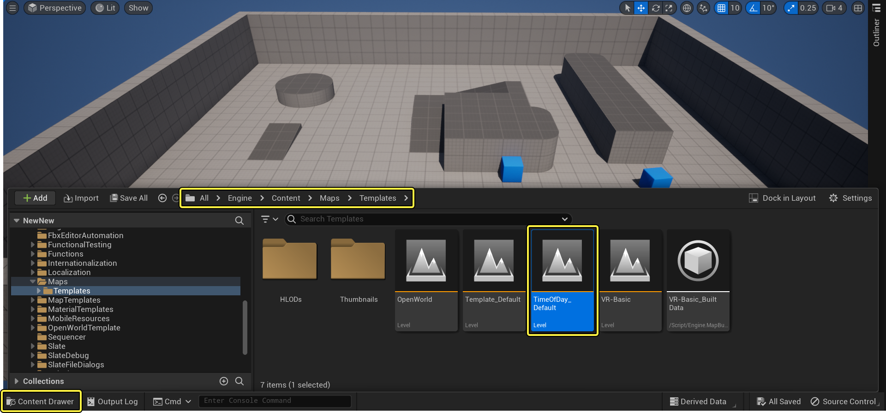
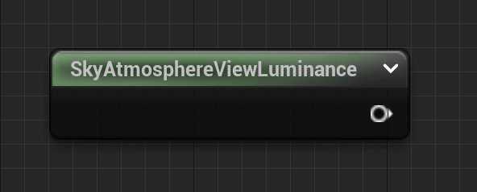
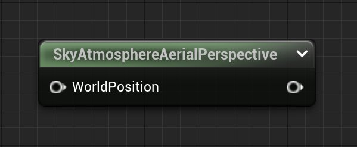
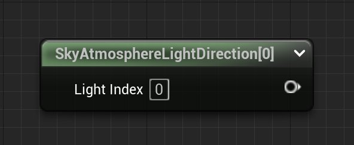
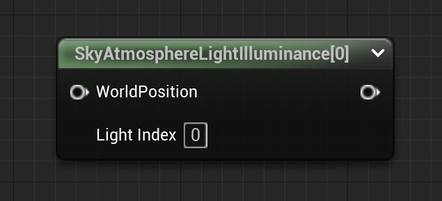
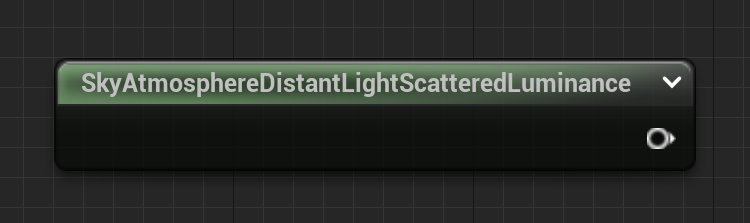

# 天空大气组件属性

> 路径：虚幻引擎5.7文档 / 构建虚拟世界 / 为场景设置光照 / 雾、云、天空和大气的环境光源 / 天空大气组件 / 天空大气组件属性

> 原始页面：https://dev.epicgames.com/documentation/unreal-engine/sky-atmosphere-component-properties-in-unreal-engine

本页包括天空大气系统的参考信息。它包括项目设置、组件属性、控制台命令和天空大气材质表达式的相关信息。

## 项目设置

以下项目设置会影响项目中的天空大气组件。

| 属性 | 说明 |
| --- | --- |
| **支持天空大气（Support Sky Atmosphere）** | 天空大气组件需要约束额外的采样器/纹理，以便在透明表面（以及通过每个顶点计算在移动的所有表面）上应用空气透视。 |
| **支持影响高度雾的天空大气（Support Sky Atmosphere Affecting Height Fog）** | 天空大气组件可照亮高度雾，但需要约束额外的采样器/纹理，以便在透明表面（以及通过每个顶点计算在移动的所有表面）上应用空气透视。需要启用 **支持天空大气（Support Sky Atmosphere）**。 |

## 天空大气属性

可在关卡详细信息面板中找到天空大气组件的以下设置。

| 属性 | 说明 |
| --- | --- |
| 星球（Planet） |  |
| **变换模式（Transform Mode）** | 选择天空大气组件在关卡中的变换放置和移动方式。点击下拉菜单，从以下选项中选择一个： **星球表面位于绝对世界原点（Planet Top at Absolute World Origin）:** 将大气的地表面放置在世界原点坐标(0,0,0)。如果选择该选项，则无法移动天空大气。 **星球表面位于组件变换位置（Planet Top at Component Transform）:** 将大气的地表面以相对组件变换原点的方式放置。可以移动天空大气组件的变换或其子组件的变换，可以在关卡内移动大气。 **星球中心位于组件变换位置（Planet Center at Component Transform）:** 让大气的中心位于组件的变换原点。可以移动天空大气组件的变换或其子组件的变换，可以在关卡内移动大气。 |
| **地面半径（Ground Radius）** | 从中心到地平面测得的星球半径，单位为千米。 |
| **地面反射率（Ground Albedo）** | 当太阳光反射到大气时给大气着色的地面反射率。仅在 **多散射（MultiScattering）** 大于0时才考虑此属性。 |
| 大气（Atmosphere） |  |
| **大气高度（Atmosphere Height）** | 大气层距离地面的高度，单位为千米。 |
| **多散射（MultiScattering）** | 将多散射渲染为像太阳光在大气中反射一样。这是利用双散射方法实现的。 |
| **追踪取样数范围（Trace Sample Count Scale）** | 大气追踪取样数的范围。 |
| 大气 - Rayleigh（Atmosphere - Rayleigh） |  |
| **Rayleigh散射比例（Rayleigh Scattering Scale）** | Rayleigh散射系数角度。 |
| **Rayleigh散射（Rayleigh Scattering）** | 在0千米高度处空气中分子产生的Rayleigh散射系数。 |
| **Rayleigh指数分布（Rayleigh Exponential Distribution）** | Rayleigh散射效应降低到40%时所处的高度，单位为千米。 |
| 大气 - Mie（Atmosphere - Mie） |  |
| **Mie散射比例（Rayleigh Scattering Scale）** | Mie散射系数比例。 |
| **Mie散射（Mie Scattering）** | 在0千米高度处空气中分子产生的Mie散射系数。光越多，散射的就越多。 |
| **Mie散射吸收（Rayleigh Scattering Scale）** | Mie吸收系数比例。 |
| **Mie吸收（Mie Absorption）** | 在0千米高度处空气中粒子产生的Mie吸收系数。光越多，吸收的就越多。 |
| **Mie各向异性（Mie Anisotropy）** | 值为0表示表示光均匀散射。值越接近1，表示光越向前散射，从而在光源周围产生光晕。 |
| **Mie指数分布（Mie Exponential Distribution）** | Mie效应降低到40%处所处的高度，单位为千米。 |
| 大气 - 吸收（Atmosphere - Absorption） |  |
| **吸收比例（Absorption Scale）** | 另一大气层的吸收系数。在10到25千米之间密度从0增大到1，在25到40千米之间密度从1减小到0。这近似于地球大气中的臭氧分子分布。 |
| **吸收（Absorption）** | 另一大气层的吸收系数。在10到25千米之间密度从0增大到1，在25到40千米之间密度从1减小到0。默认值表示地球大气中的臭氧分子吸收。 |
| **帐篷（Tent）** | 表示大气中吸收粒子基于高度的帐篷分布。 **顶端高度（Tip Altitude）：** 帐篷函数达到峰值所处的高度。 **顶端值（Tip Value）：** 帐篷顶端高度的密度。 **宽度（Width）：** 帐篷函数线性减小到0时的宽度或高度变化。 |
| 艺术方向（Art Direction） |  |
| **天空亮度系数（Sky Luminance Factor）** | 调整表示天空的像素的亮度。例如，不属于任何表面。 |
| **空气透视距离比例（Aerial Perspective Distance Scale）** | 通过调整从视图到表面（不透明和半透明）的距离，让空气透视看起来更厚重。 |
| **高度雾贡献（Height Fog Contribution）** | 当项目设置（Project Settings）中启用 **支持影响高度雾的天空大气（Support Sky Atmosphere Affecting Height Fog）** 后，调整天空和大气对高度雾的光贡献。 |
| **透射率的最小光仰角（Transmittance Min Light Elevation Angle）** | 应用于计算太阳对地面的透射率的最小仰角。对于在网格体上保持可见太阳光和在网格体上显示很有用，即使是太阳已经开始落到地平线以下时。此属性不会影响空气透视。 |
| **空气透视开始深度（Aerial Perspective Start Depth）** | 开始对空气透视求值的距离，以千米为单位。默认值设置为100米。 |

## 天空大气材质表达式

创建天空材质时，可能想要在其中创建天空、日轮、云和空气透视，会用到以下材质表达式。需要以下表达式的帮助来计算天空中的云和其他元素的光照。

要探索在材质中使用这些应用于skydome网格体的表达式的工作示例，参见可在 `Engine/Content/Maps/Templates` 文件夹中找到的 **TimeOfDay_default** 图。

点击查看大图

另外，欲了解更多详情，参见[天空大气](../../../environmental-light-with-fog-clouds-sky-and-atmosphere/sky-atmosphere-component/index.md)页面中的"Skydome网格体"部分。

> [!WARNING]
> 使用其中一些表达式时，由于它们将推动skydome网格体形状的值的计算，此网格体形状非常重要。例如，若用这些函数计算云上的光照，可假定skydome像素场景位置表示云在大气中的场景位置。

### SkyAtmosphereViewLuminance

**SkyAtmosphereViewLuminance** 表达式输出与大气中的大气光相互作用产生的天空亮度。

### SkyAtmosphereAerialPerspective

**SkyAtmosphereAerialPerspective** 表达式输出RGBA颜色的散射亮度（用RGB表示）以及skydome在大气中的场景位置的灰度透射率。

> [!NOTE]
> 由于它将推动skydome网格体形状的值的计算，此网格体形状很重要。例如，若用这些函数计算云上的光照，可假定skydome像素场景位置表示云在大气中的场景位置。但有一个覆盖来提供采样位置。

### SkyAtmosphereLightDirection

**SkyAtmosphereLightDirection** 表达式接受定向光源的大气光指数，并输出此光的光方向。

在 **详细信息（Details）** 面板中，设置被引用的定向光源的 **光指数（Light Index）**。它应与定向光源的 **大气太阳光指数（Atmosphere Sun Light Index）** 属性一致。

### SkyAtmosphereLightIlluminance

**SkyAtmosphereLightIlluminance** 表达式采用定向光源的大气光指数，并输出到达skydome场景位置的照度（见下文注释）。它是照度，因此它需要与BxD/相位函数相结合来获取累积的亮度。乘法加上统一的相位函数1/(4π)是个良好的起点。

在 **详细信息（Details）** 面板中，设置被引用的定向光源的 **光指数（Light Index）**。它应与定向光源的 **大气太阳光指数（Atmosphere Sun Light Index）** 属性一致。

> [!NOTE]
> 由于它将推动skydome网格体形状的值的计算，此网格体形状很重要。例如，若用这些函数计算云上的光照，可假定skydome像素场景位置表示云在大气中的场景位置。但有一个覆盖来提供采样位置。

### SkyAtmosphereDistantLightScatteredLuminance

SkyAtmosphereDistanceLightScatteredLuminance 表达式输出单位球体上天空散射的整体亮度，同时假设一个统一的相位函数。样本是在DistanceSkyLight LUT(r.SkyAtmosphere.DistanceSkyLightLUT.Altitude)的指定高度处采集的。

### SkyAtmosphereLightDiskLuminance

SkyAtmosphereLightDiskLuminance 表达式采用定向光源的大气光指数，并输出日轮亮度及应用的大气透射率。

> 图片已省略：SkyAtmosphereLightDiskLuminance表达式

在 **详细信息（Details）** 面板中，设置被引用的定向光源的 **光指数（Light Index）**。它应与定向光源的 **大气太阳光指数（Atmosphere Sun Light Index）** 属性一致。

## 控制台命令

使用以下控制台命令，能控制大气的性能和视觉质量。

> [!NOTE]
> 欲了解更多详情，参见[天空大气](../../../environmental-light-with-fog-clouds-sky-and-atmosphere/sky-atmosphere-component/index.md)页面中的"天空渲染选项（Sky Rendering Options）"部分。

| 控制台变量 | 说明 |
| --- | --- |
| 系统（System） |  |
| `r.SkyAtmosphere` | 不为0时，渲染天空大气组件，否则忽略。 |
| `r.SupportSkyAtmosphere` | 支持天空大气渲染和着色器代码。 |
| `r.SupportSkyAtmosphereAffectsHeightFog` | 支持影响高度雾的天空大气。需要r.SupportSkyAtmosphere为true。 |
| `r.SkyAtmosphere.LUT32` | 所有的天空查找表（LUT）都使用完整的32位逐通道精度。 |
| `r.SkyAtmosphere.EditorNotifications` | 启用编辑器内通知的渲染，向用户警告屏幕上缺少sky dome像素的情况。最好将其保持启用，发售时将删除。 |
| `r.SkyAtmosphereASyncCompute` | 异步计算时的SkyAtmosphere。默认值为false。 |
| 快速天空视图LUT（Fast Sky View LUT） |  |
| `r.SkyAtmosphere.FastSkyLUT` | 启用后，使用查找纹理渲染天空。这速度更快，但若天空中有地影、散射光晕等若干高频细节，会导致视觉瑕疵。 |
| `r.SkyAtmosphere.FastSkyLUT.SampleCountMin` | 用于计算天空/大气散射和透射率的快速天空最小样本计数。默认值限定为1。 |
| `r.SkyAtmosphere.FastSkyLUT.SampleCountMax` | 用于计算天空/大气散射和透射率的快速天空最大样本计数。最小值限定为r.SkyAtmosphere.FastSkyLUT.SampleCountMin+1。 |
| `r.SkyAtmosphere.FastSkyLUT.DistanceToSampleCountMax` | 快速天空距离（以千米为单位），在此之后使用SampleCountMax样本对大气进行光线步进。 |
| `r.SkyAtmosphere.FastSkyLUT.Width` | FastSky LUT的宽度。 |
| `r.SkyAtmosphere.FastSkyLUT.Height` | FastSky LUT的高度。 |
| 空气透视（Aerial Perspective） |  |
| `r.SkyAtmosphere.AerialPerspective.StartDepth` | 我们开始计算空气透视所处的距离。默认值设为100米。 |
| `r.SkyAtmosphere.AerialPerspective.DepthTest` | 启用后，使用深度测试，以便不写入比StartDepth更接近摄像机的像素，从而有效提高性能。 |
| 空气透视LUT（Aerial Perspective LUT） |  |
| `r.SkyAtmosphere.AerialPerspectiveLUT.DepthResolution` | 空气透视体体积纹理使用的深度切片数。 |
| `r.SkyAtmosphere.AerialPerspectiveLUT.Depth` | LUT长度（以千米为单位）（默认值为96公里，以便默认天空在此距离内获得良好的云/大气相互作用）。在比此距离更远的位置使用最后一个切片。 |
| `r.SkyAtmosphere.AerialPerspectiveLUT.SampleCountPerSlice` | 每个切片用于计算摄像机视锥空间froxel中的空气透视散射和透射率的样本计数。 |
| `r.SkyAtmosphere.AerialPerspectiveLUT.SampleCountMaxPerSlice` | 每个切片中用于对空气透视求值的取样数。有效取样数通常较低，取决于组件上的SampleCountScale以及 `.ini` 文件、摄像机视锥空间froxel中的散射和透射率。 |
| `r.SkyAtmosphere.AerialPersepctiveLUT.Width` | 空气透视LUT在屏幕上的宽度和高度。 |
| `r.SkyAtmosphere.AerialPerspectiveLUT.FastApplyOnOpaque` | 启用后，包含大气雾的低分辨率摄像机视锥体/Froxel体积（通常用于半透明的雾）将用于渲染透明的雾。这样速度会更快，但是假如有一些高频细节，例如地面阴影或散射Lob，则可能会导致一些瑕疵。 |
| 光线步进天空（Raymarching Sky） |  |
| `r.SkyAtmosphere.SampleCountMin` | 用于计算天空/大气散射和透射率的最小样本计数。最小值限定为1。 |
| `r.SkyAtmosphere.SampleCountMax` | 用于计算天空/大气散射和透射率的最大样本计数。最小值限定为r.SkyAtmosphere.SampleCountMin+1。 |
| `r.SkyAtmosphere.SampleLightShadowmap` | 启用大气光源阴影贴图的采样，以便生成体积阴影。 |
| `r.SkyAtmosphere.DistanceToSampleCountMax` | 距离（以千米为单位），在此之后使用SampleCountMax样本对大气进行光线步进。 |
| 透射率LUT（Transmittance LUT） |  |
| `r.SkyAtmosphere.TransmittanceLUT` | 启用天空透射率的生成。 |
| `r.SkyAtmosphere.TransmittanceLUT.SampleCount` | 用于计算透射率的样本计数。 |
| `r.SkyAtmosphere.TransmittanceLUT.UseSmallFormat` | 若为true，透射率使用较小的R8BG8B8A8格式以较低质量存储数据。 |
| `r.SkyAtmosphere.TransmittanceLUT.LightPerPixelTransmittance` | 启用天空大气光源逐像素透明度，但仅对延迟渲染器中的不透明对象有效。这种方法开销更大，但是启用后，太空/行星视图会更加精确。 |
| `r.SkyAtmosphere.TransmittanceLUT..Width` | 透射率LUT的宽度。 |
| `r.SkyAtmosphere.TransmittanceLUT.Height` | 透射率LUT的高度。 |
| 多散射LUT（Multi-Scattering LUT） |  |
| `r.SkyAtmosphere.MultiScatteringLUT.SampleCount` | 用于计算多散射的样本计数。 |
| `r.SkyAtmosphere.MultiScatteringLUT.HighQuality` | 启用后，将使用64个样本，而不是2个样本，从而获得更精确的多散射近似（但开销也会略高一些）。 |
| `r.SkyAtmosphere.MultiScatteringLUT.Width` | 多散射LUT的宽度。 |
| `r.SkyAtmosphere.MultiScatteringLUT.Height` | 多散射LUT的高度。 |
| 远距离天光LUT（Distance Sky Light LUT） |  |
| `r.SkyAtmosphere.DistantSkyLightLUT` | 支持生成天空环境光照值。 |
| `r.SkyAtmosphere.DistantSkyLightLUT.Altitude` | 采集天空样本以融合天空光照的高度。默认为6千米，典型卷云高度。 |
