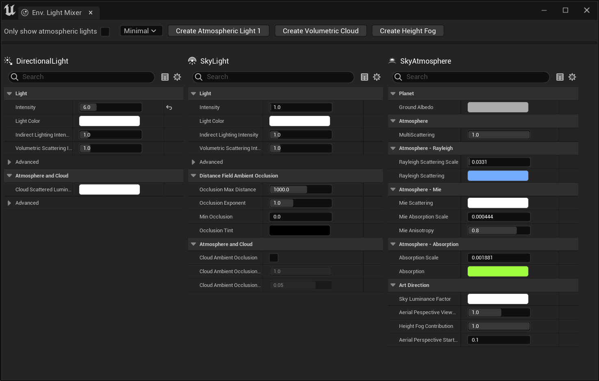
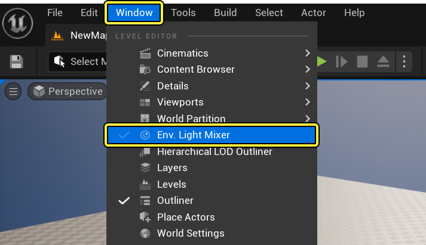
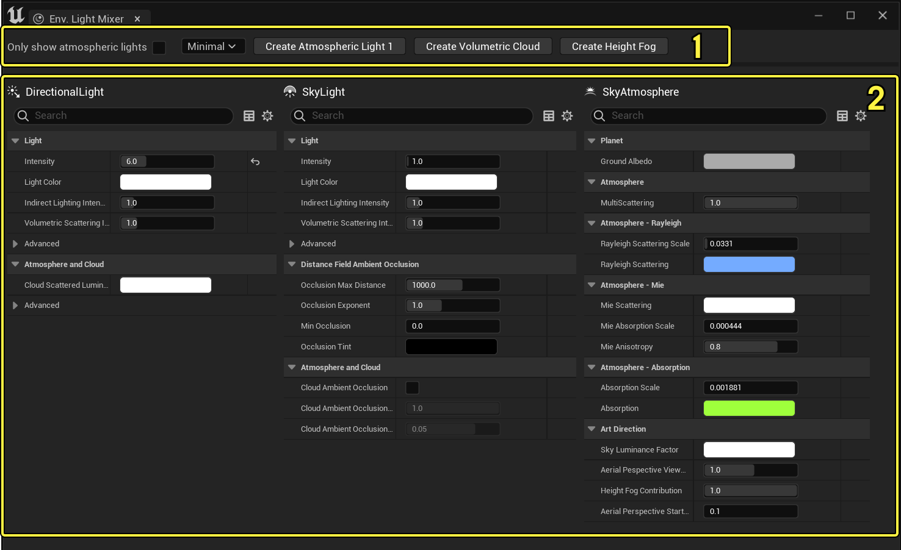
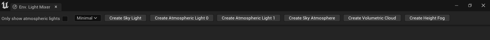
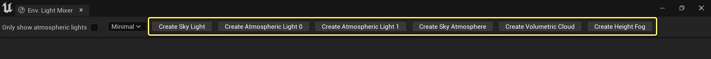
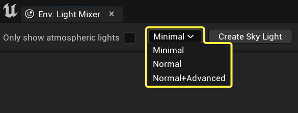
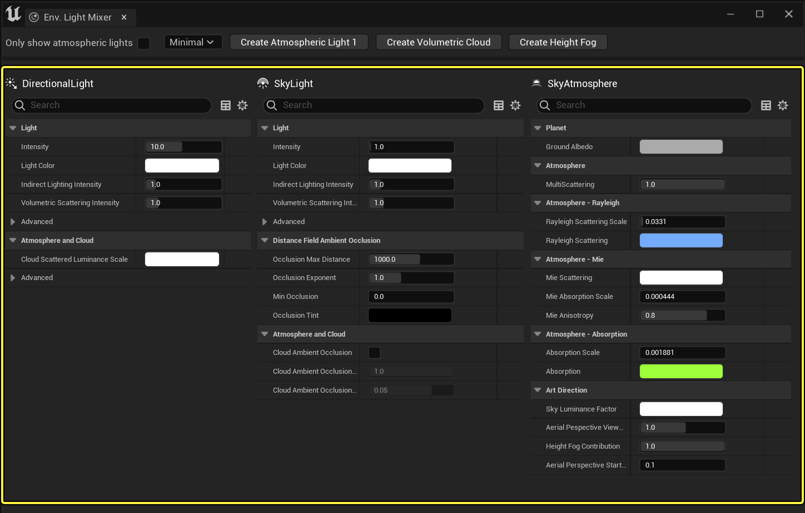

# 环境光源混合器

> 路径：虚幻引擎5.7文档 / 构建虚拟世界 / 为场景设置光照 / 雾、云、天空和大气的环境光源 / 环境光源混合器

> 原始页面：https://dev.epicgames.com/documentation/unreal-engine/environment-light-mixer-in-unreal-engine

**环境光源混合器（Environment Light Mixer）** 是一个编辑器窗口，你可以在其中创建和编辑关卡的天空、云、大气光源和天空光照的环境光照组件。对于设计师和美术师而言，只需通过这一个窗口即可快速编辑这些组件，并选择你要访问的属性细节的数量。

点击查看大图。

## 打开环境光源混合器

在 **主菜单** 中选择 **窗口（Window） > 环境光源混合器（Env.Light Mixer）**，打开环境光源混合器（Environment Light Mixer）。

## 环境光源混合器界面

环境光源混合器的界面包含两个主要元素：

点击查看大图。

1. 工具栏
2. 组件面板

### 工具栏

你可以在 **工具栏** 中添加和配置组件面板（Components Panels）中可见属性的详细级别。

点击查看大图。

#### 添加场景组件

当你打开环境光源混合器（Environment Light Mixer）窗口时，如果从空关卡开始，会看到如下组件：

点击查看大图。

1. 天空光照
2. 大气光源（用于太阳和月亮的两个定向光源或两个代表太阳的光源）
3. 天空大气
4. 体积云

如果其中任一组件从放置Actor（Place Actors）面板添加，或者已经存在于场景中，则列表将自动反映当前未添加的内容。同样，当你从场景中删除组件时，创建按钮在工具栏中再次变为可用。

### 控制属性细节数量

当你的关卡中引用了一个可用组件时，无论该组件是你通过环境光源混合器添加的还是本就存在的，该组件的属性都会添加到组件面板中，你可以在其中调整和编辑每个组件的各种属性。

如果想要最大程度地控制组件编辑，你可以使用 **属性细节（Property Details）** 下拉列表更改显示的属性数量：

1. 最低（Minimal）

   提供了组件的基本要素。
2. 常规（Normal）

   提供组件的通用属性。
3. 常规+高级（Normal+Advanced）

   提供组件的通用和高级属性。

下面是使用各个细节数量的定向光源的属性数量示例：

| 列 1 | 列 2 | 列 3 |
| --- | --- | --- |
| [undefined](https://d1iv7db44yhgxn.cloudfront.net/documentation/images/722e4075-808e-49fc-8681-ada94ebd416c/07-elm-toolbar-minimal.png) | [undefined](https://d1iv7db44yhgxn.cloudfront.net/documentation/images/f9ce8055-139e-4ff5-9d3f-d193f564493a/08-elm-toolbar-normal.png) | [undefined](https://d1iv7db44yhgxn.cloudfront.net/documentation/images/44f6d654-8b10-46a3-9c13-aa3ebdcd2d1a/09-elm-toolbar-advanced.png) |
| 最低（Minimal） | 常规（Normal） | 常规+高级（Normal+Advanced） |

点击查看大图。

### 组件面板

**组件面板（Components Panels）** 列出了工具栏中任何可添加到场景中的组件。其中包括天空大气、体积云组件，最多两个定向光源和一个天空光照组件。

默认情况下，每个组件的显示属性仅限于其 **最低（Minimal）** 设置，但可以使用工具栏中的[属性细节](#controllingtheamountofpropertiesdetail)下拉菜单进行扩展，以便显示更多属性。

