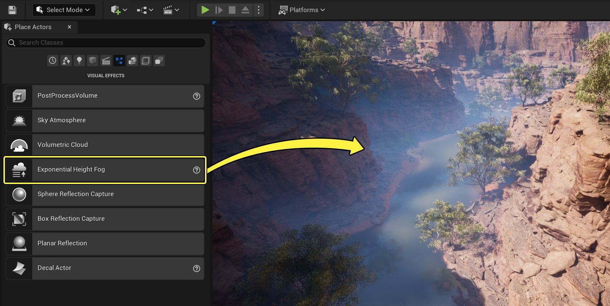
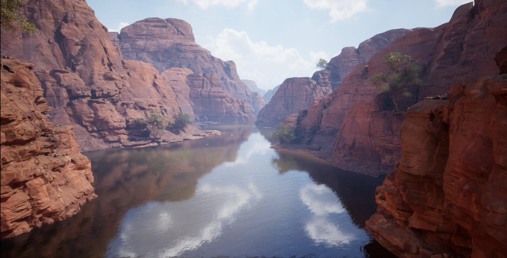
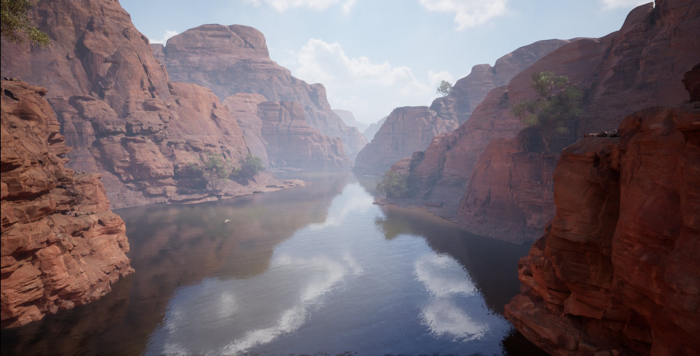
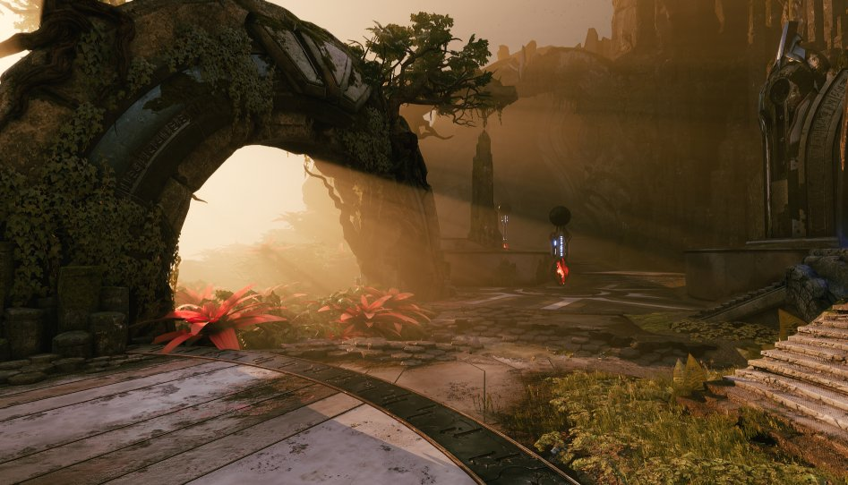
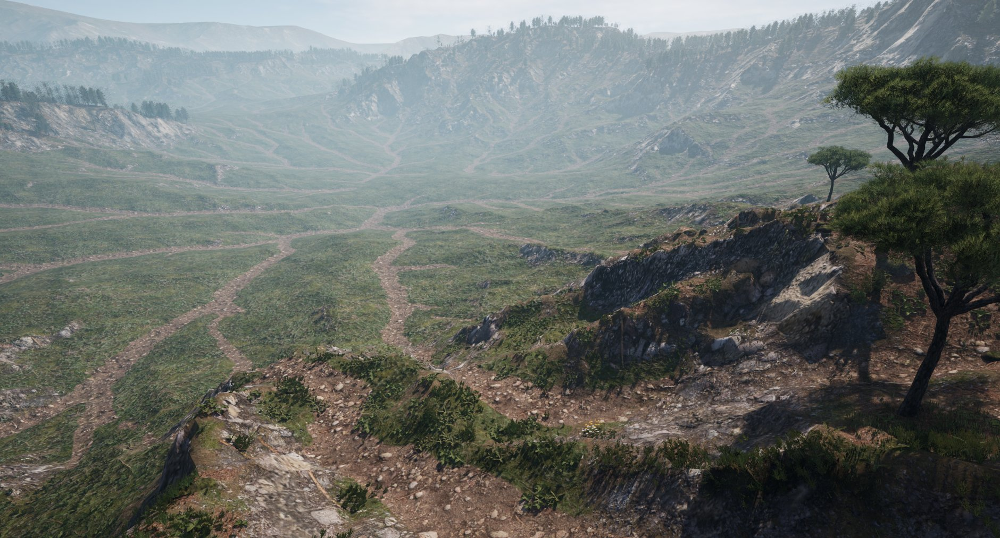

# Exponential Height Fog

> 路径：虚幻引擎5.7文档 / 构建虚拟世界 / 为场景设置光照 / 雾、云、天空和大气的环境光源 / Exponential Height Fog

> 原始页面：https://dev.epicgames.com/documentation/unreal-engine/exponential-height-fog-in-unreal-engine

该页面没有可用的官方中文版本；以下内容保留原文，并按本项目人工译文规则逐步回译。

**指数高度雾** 会在地图低处产生更高密度，在高处产生更低密度。过渡是平滑的，因此随着海拔升高不会出现硬切断。Exponential Height Fog 还提供两种雾颜色：一种用于面向主导方向光的半球（如果没有方向光则朝正上方），另一种用于相反半球。

## 使用指数高度雾

在 **Place Actors** 面板中选择 **指数高度雾** Actor，位置在 **Visual Effects**下。左键单击并拖拽，将其放置到 World 中。

Exponential Height Fog Actor 的位置会决定雾的高度。使用 **Fog Height Falloff** 进一步调整高度。

指数高度雾：禁用

指数高度雾：启用

### 指数高度雾属性

在 **Exponential Height Fog Component** 部分中，可以编辑与该组件相关的以下属性：

| **属性** | **说明** |
| --- | --- |
| Exponential Height Fog Component |  |
| **Fog Density** | 这是全局密度因子，可理解为雾层厚度。 |
| **Fog Height Falloff** | 高度密度因子控制密度如何随高度降低而增加。较小值会让过渡范围更大。 |
| **Second Fog Data** | 这些设置控制第二层雾。将此第二层雾的 **Fog Density** 设置为 **0** 将不会产生影响。 **Fog Density：** 第二层雾的全局密度因子，可用于增加另一层雾厚度。 **Fog Height Falloff：** 第二层雾的高度密度因子，控制密度如何随高度降低而增加。较小值会让过渡范围更大。 **Fog Height Offset：** 相对于 Actor 在 World 中 Z 高度位置的高度偏移。 |
| **Fog Inscattering Color** | 设置雾的内散射颜色。本质上，这是雾的主颜色。 |
| **Sky Atmosphere Ambient Contribution Color Scale** | 该颜色用于调制 Sky Atmosphere 组件对雾的非方向性分量的贡献。 |
| **Fog Max Opacity** | 控制雾的最大不透明度。值为 1 表示雾完全不透明，值为 0 表示雾基本不可见。 |
| **Start Distance** | 雾开始出现处距离摄像机的距离。 |
| **Fog Cutoff Distance** | 超过此距离的场景元素不会应用雾。这对于排除已烘焙雾的天空盒很有用。 |
| Inscattering Texturing |  |
| **Inscattering Color Cubemap** | 可为雾颜色指定的 Cubemap；这有助于让远处重雾场景元素与天空匹配。指定 Cubemap 时， **Fog Inscattering Color** 会被忽略，并且 Directional inscattering 会禁用。 |
| **Inscattering Color Cubemap Angle** | 围绕 Z（高度）轴旋转 **Inscattering Color Cubemap** 的角度。 |
| **Inscattering Texture Tint** | 当使用 **Inscattering Color Cubemap**时使用的色调颜色；这有助于快速编辑，而无需重新导入由以下项指定的 Cubemap： **Inscattering Color Cubemap**. |
| **Fully Directional Inscattering Color Distance** | 达到该距离时， **Inscattering Color Cubemap** 应直接用于 Inscattering Color。 |
| **Non-Directional Inscattering Color Distance** | 达到该距离时，只应将 **Inscattering Color Cubemap** 的平均颜色用作 Inscattering Color。 |
| Directional Inscattering |  |
| **Directional Inscattering Exponent** | 控制方向性内散射锥体的大小，用于近似来自方向光源的内散射。 |
| **Directional Inscattering Start Distance** | 控制方向性内散射相对观察者的起始距离，用于近似来自方向光的内散射。 |
| **Directional Inscattering Color** | 设置方向性内散射颜色，用于近似来自方向光的内散射。这类似于调整方向光源的模拟颜色。 |
| Volumetric Fog |  |
| **Volumetric Fog** | 是否启用 Volumetric Fog。可扩展性设置会控制雾模拟分辨率。 Volumetric Fog 当前不支持 **Start Distance**, **Fog Max Opacity**, and **Fog Cutoff Distance**。总体而言，它无法完全匹配 Exponential Height Fog，因为后者具有非物理行为。 |
| **Scattering Distribution** | 控制散射相位函数，即入射光向各方向散射的程度。分布值为 0 时会向所有方向均匀散射，值为 0.9 时主要沿光照方向散射。若要从侧面看到可见的体积雾光束，分布值需要更接近 0。 |
| **Albedo** | Volumetric Fog 使用的高度雾粒子反射率。空气中的水粒子反照率接近白色，而灰尘值稍暗。 |
| **Emissive** | Exponential Height Fog 发出的光。这是一个密度值，因此视线穿过雾的距离越远，发光越多。多数情况下，Sky Light 是更好的选择。不过 Volumetric Fog 当前不支持预计算光照，因此 Stationary Sky Light 不会投射阴影，Static Sky Light 完全不会影响 Volumetric Fog。 |
| **Extinction Scale** | 缩放 Volumetric Fog 使用的高度雾粒子消光量。大于 1 的值会让各处雾粒子吸收更多光。 |
| **View Distance** | 应计算 Volumetric Fog 的距离范围。较大值会将效果延伸到更远处，但会在细节中暴露欠采样伪影。 |
| **Start Distance** | Volumetric Fog 开始处距离摄像机的距离，单位为世界单位。 |
| **Near Fade in Distance** | Volumetric Fog 从起始距离淡入所用的距离。 |
| **Static Lighting Scattering** | 控制 Volumetric Fog 中散射静态光照的强度。 |
| **Override Light Color with Fog Inscattering Colors** | 是否使用 **Fog Inscattering Color** 作为 Sky Light 的 **Volumetric Scattering Color** and **Directional Inscattering Color** 以及作为 Directional Light 的 **Scattering Color**。请确保 Directional Light 启用了 **Atmosphere Sun Light** 。这会让 Volumetric Fog 在远处更好地匹配 Exponential Height Fog，但会产生非物理体积光照，可能与表面光照不匹配。 |

## 使用指数高度雾功能

以下章节介绍 Exponential Height Fog 体积中部分功能的用法：

### 第二层雾

使用 **Second Fog Data** 分类下的属性向关卡添加第二层雾。它使你可以通过密度、高度衰减和高度偏移控制，更好地定义和控制地图中第二个 Z（高度）层级的雾。

指数高度雾：| 单雾层

指数高度雾：| 已添加第二雾层

### Volumetric Fog

通过在 Exponential Height Fog 的 **Details** 面板中启用 Volumetric Fog，位置在 **Volumetric Fog** category.

Unreal Engine 的 Volumetric Fog 会在摄像机视锥体中的每一点计算参与介质密度和光照，从而支持变化密度以及任意数量影响雾的光源。

请参阅 [Volumetric Fog](../volumetric-fog/index.md) 以了解更多详情和用法。

## 性能

Exponential Height Fog 的渲染成本类似于两层恒定密度高度雾，并带有额外优化；雾 **Start Distance**。起始距离用于人为保持观察者前方某个定义区域无雾。这也有助于提升性能，因为像素可由 Z-buffer 剔除。

以下是实际示例：

- Fog Start Distance：0
- Fog Start Distance：5000
- Fog Start Distance：5000，且雾密度较高

Fog Start Distance 预览

根据场景内容不同，在使用较远雾 **Start Distance**时，渲染成本可以降低到 50% 或更少。该优化通过渲染一个带 Z 值并启用深度测试的全屏四边形实现。

### 云渲染开销

当 `r.PostProcessing.PropagateAlpha` 启用，并且 Volumetric Cloud、Sky Atmosphere、Exponential Height Fog 等任何功能启用了 alpha holdout 时，会导致云渲染使用高开销渲染路径。
