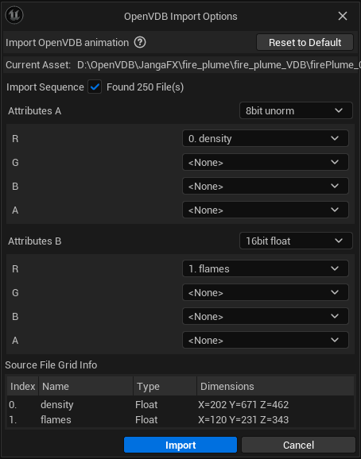
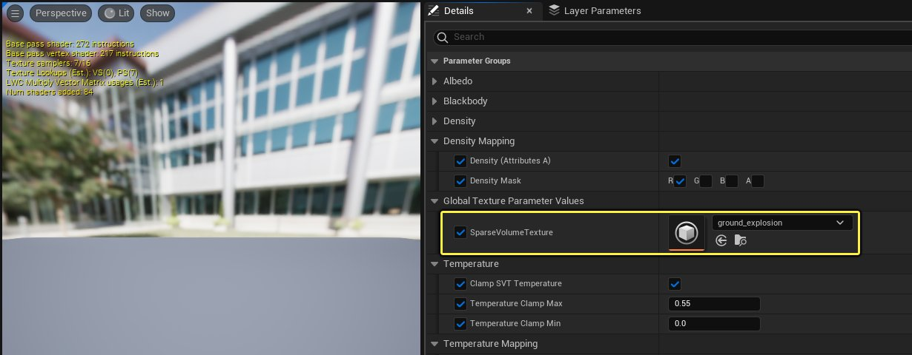
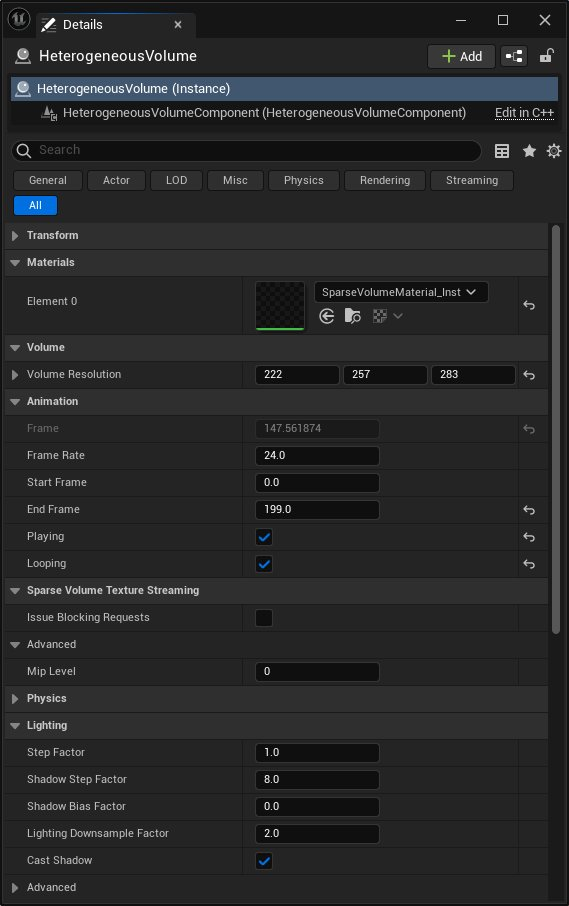
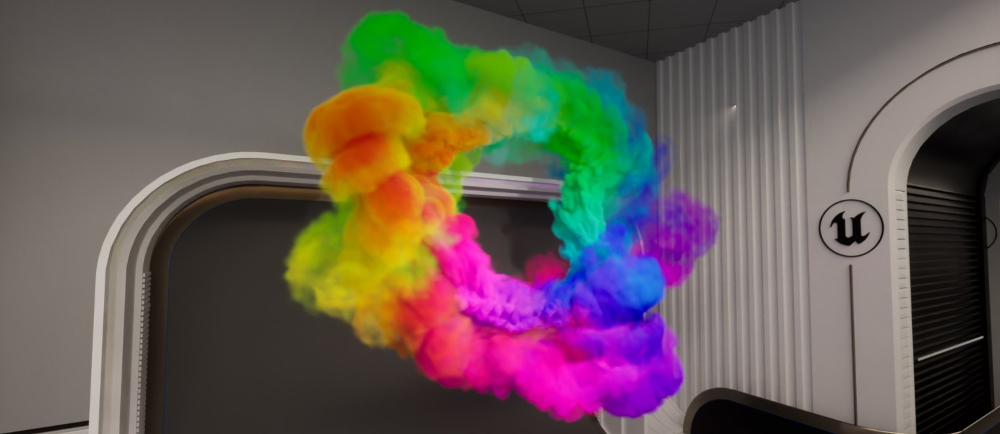

# 异类体积

> 路径：虚幻引擎5.7文档 / 构建虚拟世界 / 为场景设置光照 / 雾、云、天空和大气的环境光源 / 异类体积

> 原始页面：https://dev.epicgames.com/documentation/unreal-engine/heterogeneous-volumes-in-unreal-engine

异类体积Actor用于渲染对[稀疏体积纹理](../sparse-volume-textures/index.md)取样的体积域材质。此Actor支持实时渲染体积以及使用[路径追踪器](../../ray-tracing-and-path-tracing-features/path-tracer/index.md)渲染体积。异类体积Actor可以渲染静态或动画稀疏体积纹理材质。

> 动图已省略：带静态和动画SVT的异类体积Actor

左：静态单体积SVT；右：动画SVT。

## 使用异类体积Actor

使用以下工作流程在项目中使用异类体积：

- 导入VDB以在虚幻引擎中创建稀疏体积纹理资产。
- 设置对SVT资产取样的体积域材质。
- 将异类体积Actor添加到场景并向其分配SVT材质。

### 导入VDB文件

你需要将[VDB（即体素数据库）](https://en.wikipedia.org/wiki/OpenVDB#What_does_VDB_stand_for)文件导入到内容浏览器中才能开始。

要导入VDB文件，请执行以下操作：

- 将VDB直接拖放到内容浏览器中。
- 使用内容浏览器中的

  导入（Import）

  按钮。

VDB有自己的导入窗口，用于导入 *静态（Static）**和 *动画（Animated）** VDB文件。

你可以选择导入静态或动画VDB文件。静态VDB仅包括单个文件及其存储的体积数据，而动画VDB是一组按顺序编号的单独文件。动画VDB只需要导入任意一个按顺序编号的VDB文件，即可导入全部动画VDB。

VDB可以包括随其数据存储的不同属性。它们可以在被拆分为属性A和属性B。一般的建议是将传入的数据拆分两个采样属性，其中第一个属性数据为8位unorm数据，第二个属性数据为16位浮点数据。

> [!NOTE]
> 对于Epic Games的项目，我们偏好在导入期间将密度作为8位unorm数据推送，而通过16位浮点数据属性列表传递其他所有数据。

导入的变换将被自动应用于异类体积。如果进行变换时其枢轴位于原点（通常是体积的某个角），你可以勾选"枢轴位于质心（Pivot at Centroid）"，将枢轴移动到体积中心。但请注意，将至将枢轴位于体积中心可能会破坏变换。

如需关于导入和使用稀疏体积纹理的更多信息，请参阅[稀疏体积纹理](../sparse-volume-textures/index.md)。

### 设置SVT材质

> [!NOTE]
> 如需详细了解如何设置带有SVT的材质并将其用于材质中，请参阅[稀疏体积纹理](../sparse-volume-textures/index.md)。

异类体积需要从稀疏体积纹理取样的基于体积的材质。这些材质使用 **Sparse Volume Texture Sample** 节点对SVT取样，后者可以与异类体积、体积雾和体积云或基于体积的任何材质一起使用。

虚幻引擎内有已经设置好的空示例SVT材质，你可以对其应用SVT资产。你可以在内容浏览器的 **引擎（Engine）> 引擎材质（Engine Materials）** 下找到它，名为 **SparseVolumeMaterial** 。复制此材质并创建其实例。

打开材质实例后，重载 **SparseVolumeTexture** 参数，并将你自己导入的SVT资产应用到分配插槽。

### 设置异类体积

要设置一类体积，请按以下步骤操作：

1. 使用

   放置Actor（Place Actors）

   面板，搜索

   异类体积（Heterogeneous Volume）

   Actor并将其添加到场景。
2. 选择Actor后，使用

   细节（Details）

   面板将SVT材质分配给Actor。
3. [可选]如果你导入了动画VDB，就需要在

   动画（Animation）

   分段下勾选

   播放（Playing）

   和

   循环（Looping）

   的复选框。

## 异类体积Actor属性

异类体积Actor有以下属性：

| 属性 | 说明 |
| --- | --- |
| 材质 |  |
| **元素[N]（Element [N]）** | 材质分配插槽，供从稀疏体积纹理取样的基于体积的材质使用。 |
| 体积 |  |
| **体积分辨率（Volume Resolution）** | 体积的分辨率将自动确定，在使用SVT渲染时无法修改。 |
| **枢轴位于质心（Pivot at Centroid）** | 将枢轴移动到体积中心。请注意在进行变换时其枢轴位于原点的情况（通常是体积的一个角），具体取决于变换是如何进行的。强制将枢轴置于体积中心可能会破坏变换。 |
| 动画 |  |
| **帧（Frame）** | 显示所渲染的SVT的当前帧。未勾选 **播放（Playing）** 复选框时，你可以指定动画SVT的特定帧。 |
| **帧率（Frame Rate）** | 帧的播放速度。 |
| **开始帧（Start Frame）** | 动画SVT应该从哪个帧开始。这由导入的SVT的可用范围限定。 |
| **结束帧（End Frame）** | 动画SVT应该在哪个帧结束。这由导入的SVT的可用范围限定。 |
| **播放（Playing）** | 启用后，会完整播放一次动画SVT。 |
| **循环（Looping）** | 启用后，会从开始帧到结束帧重复播放动画SVT。 |
| **帧变换（Frame Transform）** |  |
| 稀疏体积纹理流送 |  |
| **发出阻止请求（Issue Blocking Requests）** | 流送系统获得通知，在更新每帧的稀疏体积纹理数据时阻止。不推荐用于实时播放，但可以用于过场动画渲染，否则流送系统将以更高的MIP级别播放以保持实时帧率。 |
| **流送Mip偏移（*Streaming Mip Bias）** | 设置所渲染的SVT的纹理级别。值越低，体积密度和质量越高。值越高，密度和质量越低。 |
| 光照 |  |
| **步长因子（Step Factor）** | 此因子可将光线步进集成器的步长调整为按体积分辨率的倍数发生。此因子越大，步进器采用的步进越长，牺牲质量来提高性能。 |
| **阴影步长因子（Shadow Step Factor）** | 此因子可调整光线步进器的阴影计算的步长。此因子越大，步进器采用的步进越长，牺牲质量来提高性能。 |
| **阴影偏差因子（Shadow Bias Factor）** | 此因子可调整在计算阴影时应用的初始体素偏差。此因子越大，自投影越少，但可能会造成漏光。 |
| **光照下采样因子（Lighting Downsample Factor）** | 此因子可调整内部光照缓存的体积分辨率。该因子越大，实际上会降低运行分辨率，减少系统内存并提高性能。这会降低质量。虽然SVT本质上稀疏，但内部光照缓存当前密集。内部光照缓存当前不会分配大于1024 x 1024 x512体素的体积分辨率。 |

### 动画

**动画（Animation）** 属性提供了播放的自定义规则。默认情况下， **开始帧（Start Frame）** 和 **结束帧（End Frame）** 属性限定在导入的SVT的可用范围内，但可以通过修剪以实现仅播放一部分SVT动画的效果。播放预期按24帧/秒的"过场动画"速率发生，但可以根据需要调整。

勾选 **播放（Playing）** 复选框后，SVT在场景中交互式播放，勾选 **循环（Looping）** 后，它将持续重复。若不勾选“播放”复选框，你可以鼠标左键点击 **帧（Frame）** 文本字段，并向左或向右拖动，在SVT的可用帧间快进。

### 光照

延迟渲染模型在使用异类体积Actor渲染高质量体积资产时使用光线步进。每个可调整因子属性随 **体积分辨率（Volume Resolution）** 属性发生变化。导入的SVT的分辨率与运行时性能直接相关。

### 蓝图

在蓝图中，你可以使用 **Play** 和 **Set Playing** 节点触发动画数据开始和停止。

## 将异类体积用于路径追踪器

你可以使用Niagara流体插件，或在场景中实例化异类体积Actor来创建异类体积。这些体积在启用路径追踪器时开始渲染。

使用路径追踪器渲染的Niagara流体异类体积示例。

要使用路径追踪器渲染异类体积，请启用以下内容：

- 项目设置（Project Settings）

  - 将默认RHI设置为

    DirectX 12

    。
  - 启用

    支持硬件光线追踪（Support Hardware Ray Tracing）

    。
  - 启用

    路径追踪（Path Tracing）
- 插件（Plugin）

  - [可选] Niagara流体

有关规格的完整列表，请参阅[路径追踪器](../../ray-tracing-and-path-tracing-features/path-tracer/index.md)。

### 使用Niagara流体创建异类体积

> [!WARNING]
> 必须启用Niagara流体插件才能使用此功能。更多信息请参阅[Niagara流体](../../../../visual-effects/niagara-fluids/index.md)。

要使用[Niagara流体](../../../../visual-effects/niagara-fluids/index.md)渲染，请按照以下步骤操作：

1. 在内容浏览器中创建新Niagara流体。
2. 在Niagara选取器窗口中，选择

   基于模板或行为示例的新系统（New system from a template or behavior example）

   ，然后点击

   下一步（Next）

   。
3. 在窗口中的

   3D气体（3D Gas）

   列表中选择一个示例。
4. 双击该Niagara流体资产，打开Niagara编辑器。
5. 选择图表中的Niagara流体系统节点。
6. 在

   细节（Details）

   面板中，设置以下内容：

   - 将

     循环行为（Loop Behavior）

     设置为

     无限（Infinite）

     。
   - 循环时长（Loop Duration）

     应该短于5秒。
7. 编译并保存Niagara流体资产。
8. 将Niagara流体放在场景中。
9. 打开控制台窗口并输入

   r.PathTracing.HeterogeneousVolumes 1

   ，为异类体积渲染启用路径追踪器支持。

### 使用稀疏体积纹理渲染异类体积

要使用[稀疏体积纹理](../sparse-volume-textures/index.md)渲染，请按照以下步骤操作：

1. 导入VDB文件并设置稀疏体积纹理材质以显示它。
2. 在关卡编辑器中，使用

   放置Actor（Place Actors）

   面板将

   异类体积（Heterogeneous Volume）

   Actor添加到场景。
3. 将稀疏体积纹理材质分配到其材质插槽。
4. 打开控制台窗口并输入

   r.PathTracing.HeterogeneousVolumes 1

   ，为异类体积渲染启用路径追踪器支持。

### 实用的控制台变量

| 控制台变量 | 说明 | 默认值 |
| --- | --- | --- |
| `r.PathTracing.HeterogeneousVolumes` | 启用异类体积的路径追踪。 | 0 |
| `r.HeterogeneousVolumes.IndirectLighting` | 为异类体积启用间接光照。此项默认禁用。 | 0 |
| `r.HeterogeneousVolumes.OrthoGrid` | 启用世界空间体素网格。 | 1 |
| `r.HeterogeneousVolumes.OrthoGrid.MaxBottomLevelMemoryInMegabytes` | 确定用于体素化（发射、消光和反射率）的每个底部级别体素网格的内存限制（以兆字节为单位）。推荐的过场动画默认值是512。 | 128 |
| `r.HeterogeneousVolumes.OrthoGridShadingRate` | 确定世界空间体素网格的活动着色速率，其中值大致对应像素宽度。使用的着色速率越低，曲面细分的质量越高，但需要的内存越多。推荐的过场动画默认值是1。 | 4 |
| `r.HeterogeneousVolumes.FrustumGrid` | 启用视锥体对齐的体素网格。 | 1 |
| `r.HeterogeneousVolumes.FrustumGrid.MaxBottomLevelMemoryInMegabytes` | 确定用于体素化（发射、消光和反射率）的每个底部级别体素网格的内存限制（以兆字节为单位）。推荐的过场动画默认值是512。 | 128 |
| `r.HeterogeneousVolumes.FrustumGrid.ShadingRate` | 确定视锥体对齐的体素网格的活动着色速率，其中值大致对应像素宽度。使用的着色速率越低，曲面细分的质量越高，但需要的内存越多。推荐的过场动画默认值是1。 | 4 |
| `r.HeterogeneousVolumes.FrustumGrid.DepthSliceCount` | 确定在使用着色速率1渲染时视锥体对齐的体素网格的深度切片数量。使用着色速率2渲染对应的发射深度切片数量为256。推荐的过场动画默认值是512或1024。 | 512 |
| `r.HeterogeneousVolumes.Tessellation.FarPlaneAutoTransition` | 当视锥体对齐的体素网格的体素大小对应世界空间体素网格的体素大小时，截断视锥体对齐的网格的远平面。 | 1 |
| 伸缩性变量 |  |  |
| `r.HeterogeneousVolumes.DownsampleFactor` | 对渲染后的视口进行下采样。 | 1.0 |
| `r.HeterogeneousVolumes.MaxStepCount` | 用于渲染异类体积的最大光线步进数。 | 512 |
| `r.HeterogeneousVolumes.Shadows.Resolution` | 设置构建体积阴影贴图时使用的分辨率。 | 512 |

## 异类体积项目设置

异类体积Actor具有以下项目设置。你可以在 **异类体积（Heterogeneous Volumes）** 类别中的 **引擎（Engine）> 渲染（Rendering）** 分段下找到这些设置。

| 属性 | 说明 |
| --- | --- |
| **异类体积（Heterogeneous Volumes）** | 允许使用异类体积子系统进行渲染。 |
| **阴影投射（Shadow Casting）** | 允许异类体积在环境中投射阴影。 |
| **与半透明合成（Composite with Translucency）** | 允许在渲染半透明对象时与异类体积进行合成。 |

## 其他注意事项

**实时渲染:**

- 实时渲染 vs 在路径追踪器中渲染

  - 路径追踪器现在对渲染体积的支持更加完整，可以精确模拟全局光照。
- 在环境中投射阴影

  - 此为实验性功能。
  - 你可以在项目设置中启用异类体积阴影投射。

**路径追踪器渲染**

> [!WARNING]
> 此为实验性功能。

- 斑驳或模糊的异类体积

  - 异类体积渲染的默认着色速率为4，以支持交互式路径追踪。将着色速率降低到1会去除可感知的瑕疵，但需要增加内存才能正确渲染。推荐的过场动画默认着色速率为1，推荐的默认内存限制为512。渲染时，我们推荐在

    影片渲染队列

    设置中设置这些值。
- 渲染中缺少体素

  - 若降低世界空间和视锥体对齐的体素网格的着色速率，可能会尝试分配更多的底部级别体素，超过所设内存限制允许的值。在这些情况下，不会分配体素，并且体积的一些部分将缺失。此时，你必须使用更多底部级别内存或提高着色速率。
- 重叠的异类体积看起来斑驳

  - 如果区域被确定是均匀的，世界空间体素网格中的底部级别体素数据会聚合。均匀检测在单个体积的界限内执行，如在相同区域中存在重叠体积，可能会不当聚合。要防止聚合，你可以将

    r.HeterogeneousVolumes.Tessellation.BottomLevelGrid.HomogeneousAggregation

    设置为

    0

    将其禁用。
- Niagara流体的纱窗效应

  - Niagara系统仅在Niagara编辑器打开时触发路径追踪失效事件。让编辑器保持打开，才能在路径追踪器中正确查看动画。编辑器关闭时，路径追踪器会继续在整个动画中累积示例。
- 异类体积Actor的纱窗效应

  - 异类体积Actor目前不会触发路径追踪失效事件。在Actor上取消选中

    制作动画（Animate）

    属性以暂停动画。

### 对异类体积使用间接光照

你可以使用控制台变量 `r.HeterogeneousVolumes.IndirectLighting 1` 启用异类体积对间接光照的支持。该功能适用于高端PC以及 **影视级（Cinematic）** 伸缩性设置。

|  |  |
| --- | --- |
| No Indirect Lighting | With Indirect Lighting |
| 无间接光照 | 有间接光照 |

## 其他资源

- Niagara流体插件

  - Niagara流体插件包含一些可用于异类体积渲染的示例。你可以在项目中启用该插件并用提供的模板新建一个Niagara系统。更多详情，请参阅

    Niagara流体
- 本页面中的示例中使用的VDB文件来自使用EmberGen创建的JangaFX免费VDB集。
- 点击

  此处

  下载其免费示例。
