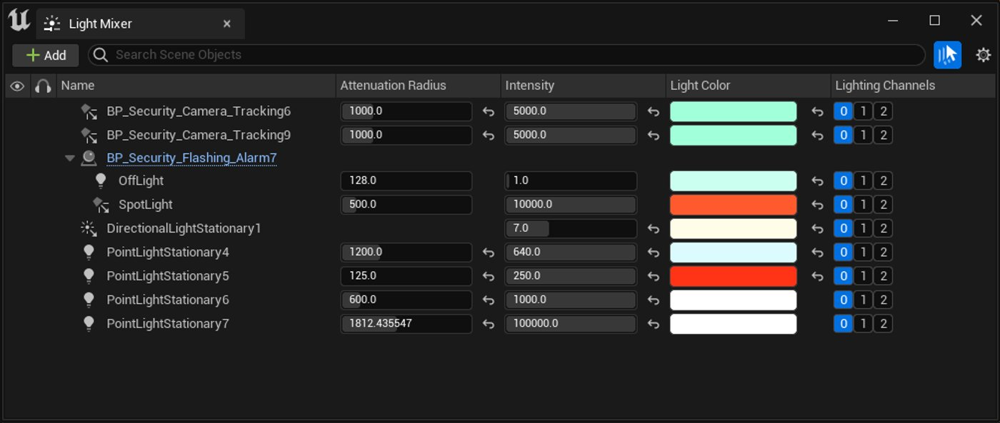
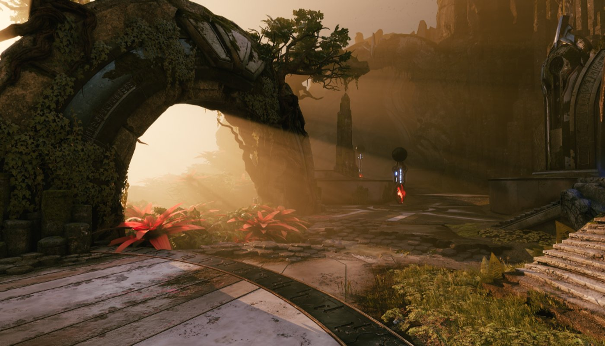
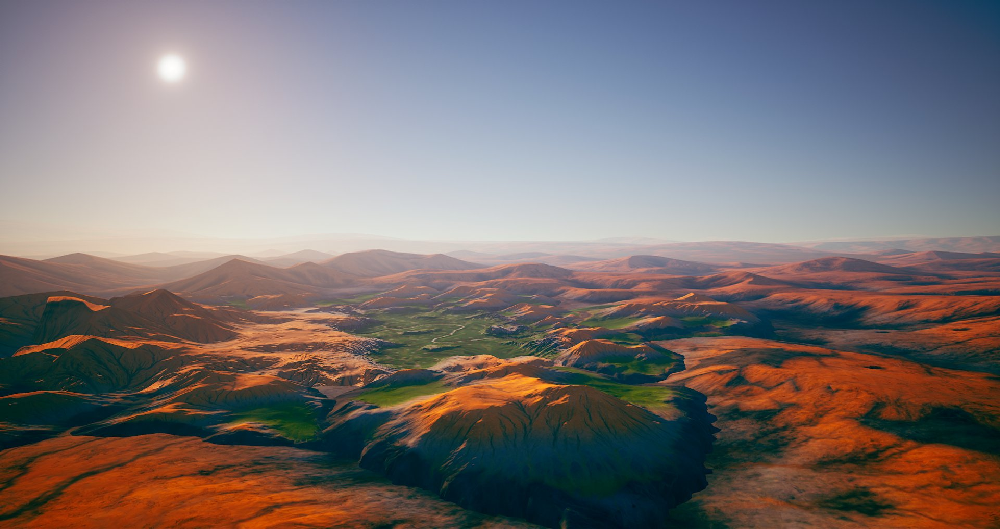
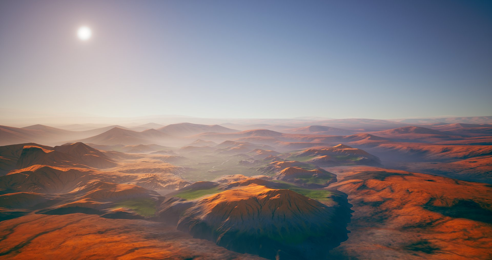
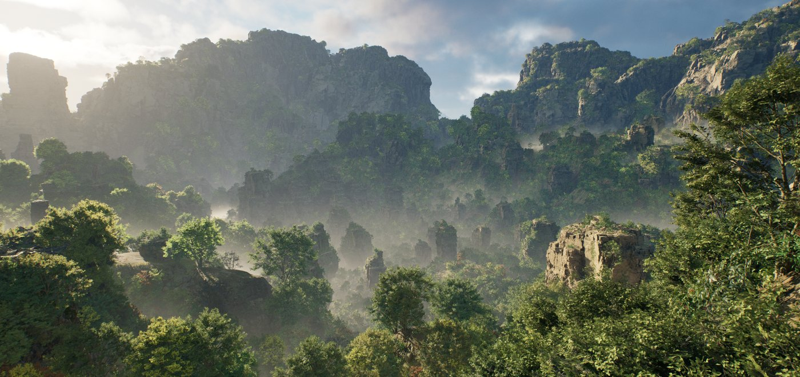
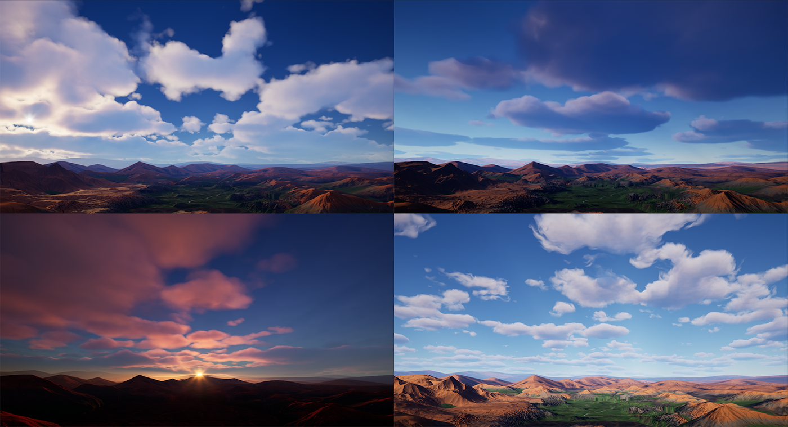

# 雾、云、天空和大气的环境光源

> 路径：虚幻引擎5.7文档 / 构建虚拟世界 / 为场景设置光照 / 雾、云、天空和大气的环境光源

> 原始页面：https://dev.epicgames.com/documentation/unreal-engine/environmental-light-with-fog-clouds-sky-and-atmosphere-in-unreal-engine

虚幻引擎提供了一系列组件，让设计师和美术师能够利用基于物理的光照来创建大规模（甚至小规模）沉浸式世界，同时保证工作高效性。 这些针对大气、云、雾和光照的环境光照组件可无缝协作，打造统一的体验，让人领略到完全动态光照的世界。

此页面中的工具和功能将帮助你了解入门知识，学会创建自己的世界。

## 光源混合器

**光源混合器（Light Mixer）**是可停靠的编辑器窗口，你可以在其中添加、编辑和引用关卡中的定向光源、点光源、聚光源和矩形区域光源的属性。

此窗口将属性全部集中在一个位置以供编辑，可以简化美术师和设计师的工作，加快工作流程。 其中包括作为场景Actor组件或蓝图组件的光源。 你也可以以合集的形式组织它们。

更多详情，请参阅[光源混合器](using-the-light-mixer/index.md)。

## 环境光源混合器

**环境光源混合器（Environment Light Mixer）**是可停靠的编辑器窗口，你可以在其中添加、编辑和引用天空、云、环境光源和天空光照的环境光照组件的属性。

此窗口将属性全部集中在一个位置，可以简化美术师和设计师的工作，加快工作流程。

更多详情，请出参阅[环境光源混合器](environment-light-mixer/index.md)。

## 雾效果

雾效果可用于为世界增添氛围，并为环境营造气氛。 这包括为高耸和低洼区域创建多层雾，以及为光轴创建体积效果。

[天空大气](sky-atmosphere-component/index.md)包括它本身的散射和高度雾模拟，但也可以很好地与指数高度雾配合使用，支持场景中所有类型的光源。

天空大气的高度雾

天空大气 | 带指数高度雾

当项目设置**支持影响高度雾的天空大气（Support Sky Atmosphere Affecting Height Fog）**启用时，来自指数高度雾的所有影响都是附加的。 天空大气的高度雾应用于指数高度雾颜色的顶部。 但是，如果**雾内散射颜色（Fog Inscattering Color）**和**定向内散射颜色（Directional Inscattering Color）**设置为黑色，则天空大气将直接影响场景中所有指数高度雾的着色。

此外，你也可以使用本地放置的雾体积来为场景的大小区域创建雾效果。 这些本地雾体积支持所有平台和体积雾效果（如启用）。

### 雾效果主题

- [Exponential Height Fog](exponential-height-fog/index.md) - An overview of the height-based, distant fog system.

- [局部雾体积](local-fog-volumes/index.md) - 概述如何局部放置体积以创建基于高度的雾效果。

- [体积雾](volumetric-fog/index.md) - 有关体积雾以及指数高度雾中的光照选项的介绍。

## 大气、云和世界光照效果

天空大气、体积云、定向光源和天空光照的光照组件构成了环境光照的大部分。 这些组件均能无缝协作，可以动态照亮大型世界。

在关卡中，你可以使用以下组件：

- 最多两个用于太阳和月亮、两个太阳或任意组合的定向光源。
- 具有可选实时捕获功能的单个天空光照。
- 具有自身高度雾的天空大气。
- 带有或不带有天空球网格体的体积云。

在天空光照上启用**实时捕捉（Real Time Capture）**后，使用键盘快捷键**右Ctrl + L**（第一个定向光源）或**右Ctrl + 右Shift + L**（第二个定向光源），同时移动鼠标，可动态改变光照，并立即查看结果。

### 大气、云和世界光照主题

- [天空大气组件](sky-atmosphere-component/index.md) - 天空大气系统用于创建基于物理的天空和大气渲染，提供一天时间功能以及具有空气透视的地面到太空视图过渡。

- [体积云组件](volumetric-cloud-component/index.md) - 使用体积材质进行实时云渲染

- [定向光源](../light-types-and-their-mobility/directional-lights/index.md) - 虚幻引擎中定向光源的基础说明。

- [天空光照](../light-types-and-their-mobility/sky-lights/index.md) - 理解天空光照的基本概念。

- [异类体积](heterogeneous-volumes/index.md) - 使用异类体积组件渲染从稀疏体积纹理取样的体积域材质。

### 大气、云和世界光照属性参考

- [天空大气组件属性](../environmental-light-with-fog-clouds-ea754305/sky-atmosphere-component/sky-atmosphere-component-properties/index.md) - 天空大气组件的选项和属性说明。

- [体积云组件属性](volumetric-cloud-component-properties/index.md) - 体积云组件设置和属性说明

## 材质和稀疏体积纹理资产

- [稀疏体积纹理](sparse-volume-textures/index.md) - 该资产将存储烘焙的模拟数据来表示体积介质，例如烟雾、火焰和水。

- [体积云材质](../volumetric-cloud-material/index.md) - 用于创建各种云类型、形状和效果的默认体积材质。
