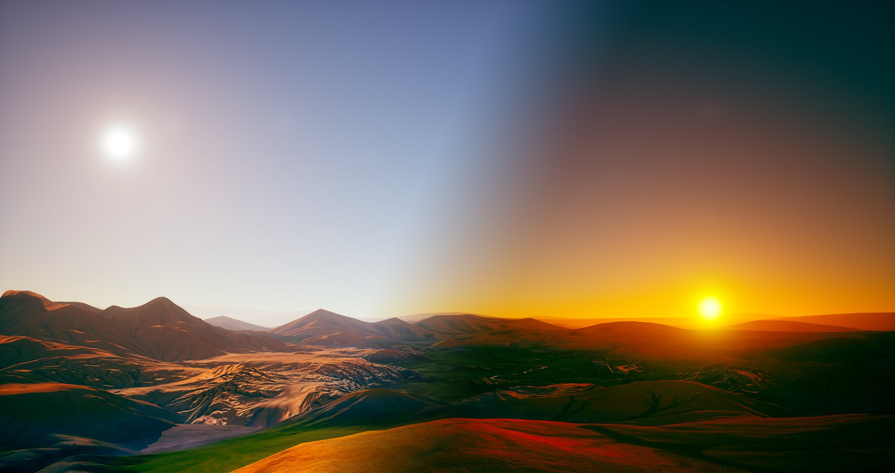
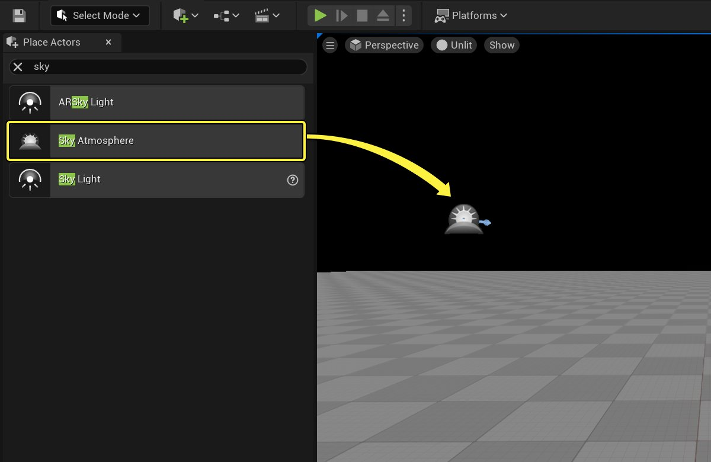
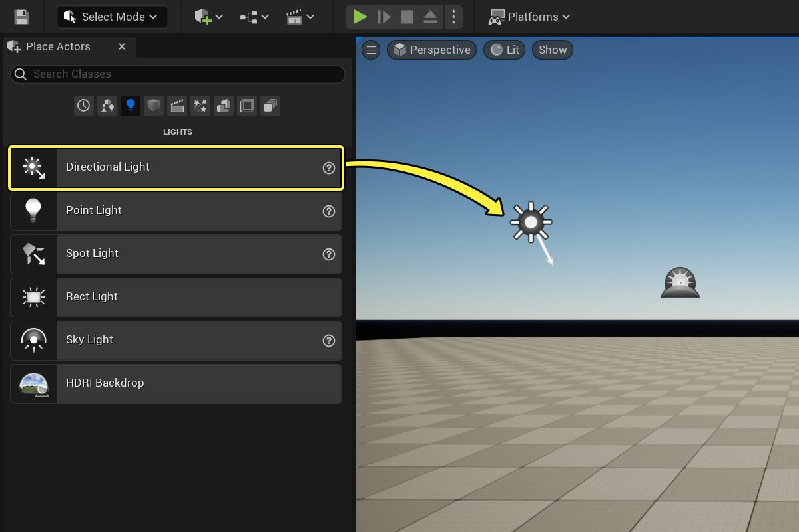
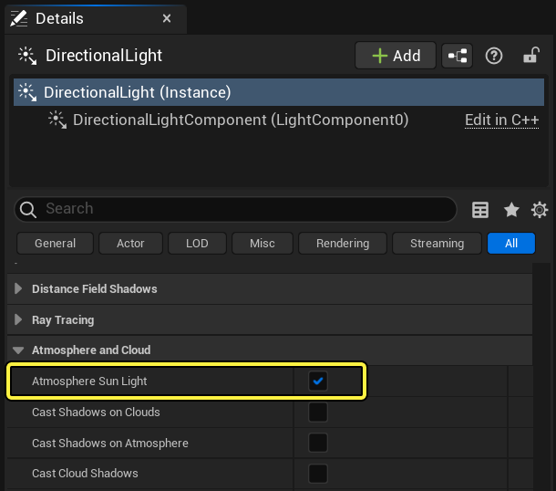
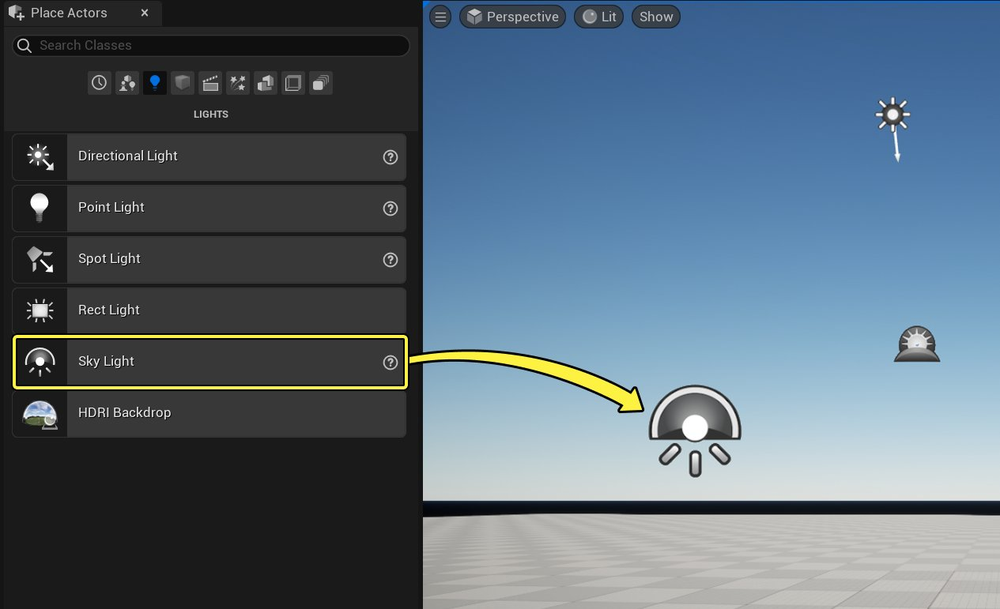
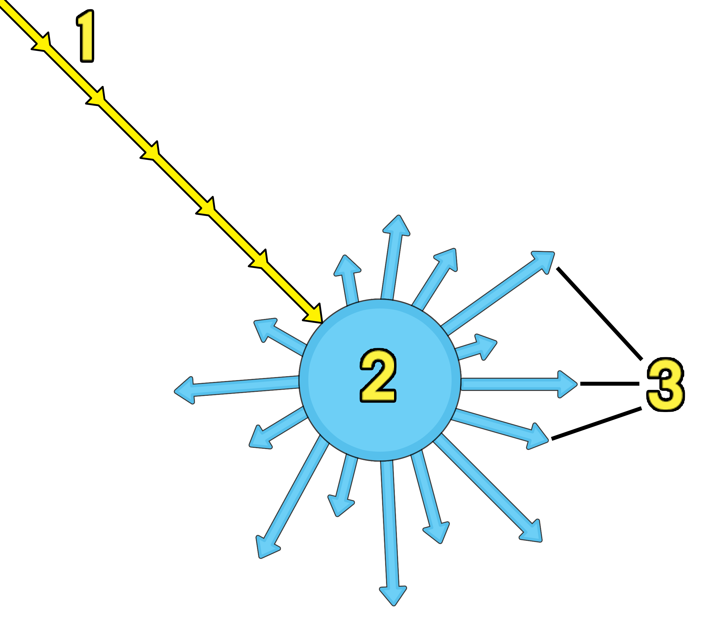
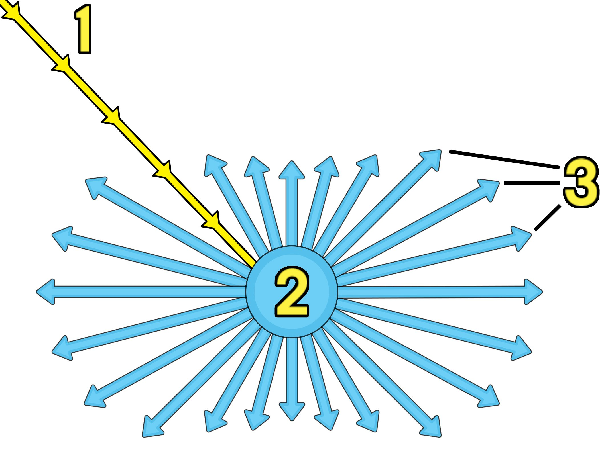
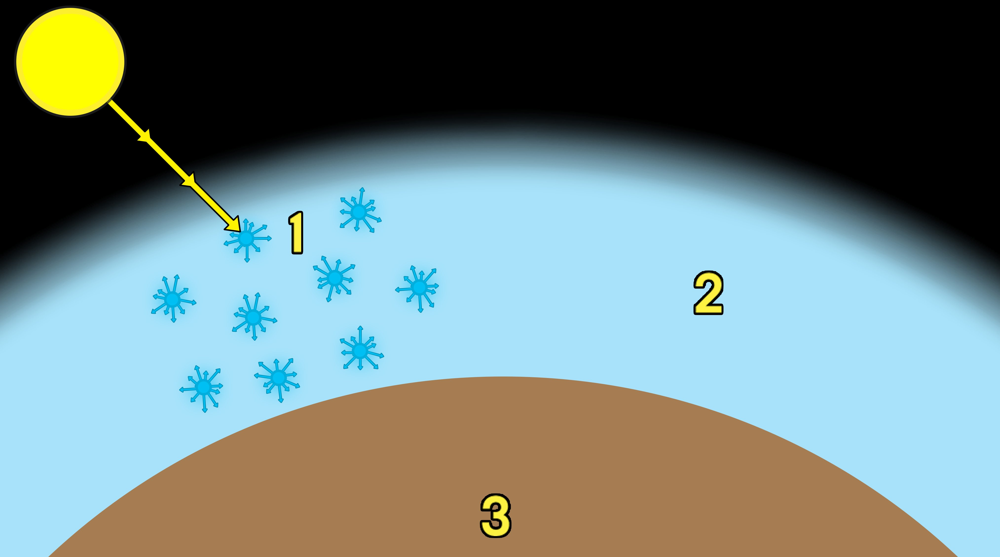

# 天空大气组件

> 路径：虚幻引擎5.7文档 / 构建虚拟世界 / 为场景设置光照 / 雾、云、天空和大气的环境光源 / 天空大气组件

> 原始页面：https://dev.epicgames.com/documentation/unreal-engine/sky-atmosphere-component-in-unreal-engine

虚幻引擎中的 **天空大气** 组件是一种基于物理的天空和大气渲染技术。它相当灵活，可以创造类似地球的大气层，同时提供包括日出和日落的一天时间，还可以创造奇特的外星大气层。它还提供空气透视，从中可利用相关行星曲率来模拟从地面到天空再到外太空的过渡。



天空大气提供一种光经过行星大气层中的参与介质发生的散射的近似散射，因而为户外关卡提供更逼真或更奇特的外观，包括以下内容：

- 可有两个大气定向光源接收日轮在大气中的表现，其中天空颜色取决于太阳光和大气属性。
- 天空颜色将随着太阳高度而变化，即随主要定向光源的矢量与地面平行程度而变化。
- 控制散射和模糊设置，从而完全控制大气密度。
- 从地面到天空再到太空过渡时，空气透视可模拟场景的曲率。

## 启用天空大气组件

利用关卡编辑器中的 **放置Actor（Place Actors）** 面板执行以下步骤以启用天空大气组件：

1. 在场景中放置 **天空大气** 组件。

   
2. 在场景中放置一个 **定向光源**。

   
3. **细节（Details）** 面板启用 **大气太阳光（Atmosphere Sun Light）**。

   

   1. 若使用多个

      定向光源

      ，则为每个定向光源设置

      大气太阳光照指数（Atmosphere Sun Light Index）

      ；例如，0表示太阳，1代表月亮。
4. 在场景中放置 **天空光照** 以采集天空大气并让它为场景光照做贡献。

   

### 调整大气定向光源

在 **定向光源** 上启用 **大气/雾太阳光（Atmosphere/Fog Sun Light）** 并为每个定向光源设置 **大气太阳光照指数（Atmosphere Sun Light Index）** 后，可利用以下快捷方式快速调整每个定向光源的位置：

- 使用

  Ctrl + L

  并移动鼠标将调整已设为指数0的定向光源。它通常是太阳。
- 使用

  Ctrl + L + Shift

  并移动鼠标将调整已设为指数1的定向光源。它通常是月亮。

根据天空大气组件中为各个定向光源设置的属性，移动这些光源将影响大气。

## 天空大气模型

模拟天空和大气时，需要几个属性来模拟真实大气的外观和感觉。通过准确恰当地散射光，这些属性可用于定义天空和大气的外观。天空大气组件默认显示为地球。

对于类地行星，大气由多个气体层组成。它们本身由粒子和分子组成，而粒子和分子又有各自的形状、大小和密度。光子（或光能）在进入大气与大气中的粒子和分子碰撞时，或被散射（反射），或被吸收（见下文）。



(1) 来自太阳的入射光；(2) 大气中的粒子； (3) 重定向的光能。

天空大气系统利用Mie散射和Rayleigh散射模拟吸收。这些散射效应通过模拟入射光与大气中的粒子和分子相互作用，让天空在一天时间过渡中适当地改变颜色。

使用天空大气组件时，天空颜色将根据一天时间模拟的变化而变化。

### Rayleigh散射

光与更小粒子（例如空气分子）的相互作用产生了 **Rayleigh散射**。这种类型的散射主要依赖于光波长。例如，在地球的天空中，蓝色比其他颜色散射得更多，因此白天天空呈现蓝色。但在日落时，由于光线需要在大气中传播得更远，因此天空呈现红色。经过长距离传播，所有蓝色光都比其他颜色先散射开来，因而导致日落时天空中充满黄色、橙色、红色，五彩缤纷。



(1) 入射光；(2) 大气中的小粒子；(3) Rayleigh散射的光能。

在类地大气中，当太阳光与大气(2)中的小粒子(1)相互作用时，将在整个大气中发生Rayleigh散射。与地表(3)附近的下层大气相比，上层大气的密度更低。



增大或减小大气中粒子的密度会使光散射增加或减少。

> 图片已省略：拖动滑块可查看Rayleigh散射比例（Rayleigh Scattering Scale）减小或增大后的效果。（从左到右，1-3）

**拖动滑块可查看Rayleigh散射比例（Rayleigh Scattering Scale）减小或增大后的效果。（从左到右，1-3）**

1. 减小

   散射会导致光经过大气时散射减少。它的密度比地球大气的密度小10倍。
2. 它代表类地大气密度。
3. 增大

   散射会导致光经过大气时散射更多。它的密度比地球大气的密度大10倍。

### Mie散射

光与大气中悬浮的灰尘、花粉、空气污染物等更大粒子的相互作用会产生 **Mie散射**。这些粒子称为悬浮微粒，可能是自然产生的，也可能是人为活动造成的。符合Mie散射理论的入射光通常会吸收光，从而导致天空的清晰度因遮光而变得模糊。光通常也会更加向前散射，从而在光源周围产生明亮的光晕，例如空中日轮周围的光晕。

> 图片已省略：Mie Scattering

(1) 入射光；(2) 大气中的大粒子；(3) Mie散射的光能。

增大或减小悬浮微粒密度会导致天空清晰度提高或降低，因而影响天空的模糊程度。

> 图片已省略：拖动滑块可查看Mie散射比例（Mie Scattering Scale）减小或增大后的效果。（从左到右，1-3）

**拖动滑块可查看Mie散射比例（Mie Scattering Scale）减小或增大后的效果。（从左到右，1-3）**

1. 粒子密度

   降低

   会导致天空看起来更清晰。天空雾霾减少，光定向散射减少。
2. 默认Mie散射比例。
3. 粒子密度

   增大

   会导致天空变得闭塞。还会使天空显得模糊，同时入射光方向周围将产生强烈的前向散射光晕。

### Mie相位

与大气中较大的悬浮微粒粒子相互作用时，*Mie相位* 控制光散射的均匀程度。通过Mie散射，光通常会更加向前散射，从而在光源周围产生明亮的光晕，例如空中日轮周围的光晕。

> 图片已省略：Mie Phase

(1) 入射光；(2) 大气中的大粒子；(3) Mie散射的更强光能。

使用 **Mie各向异性（Mie Anisotropy）** 属性控制大气中发生Mie散射的均匀程度。

> 图片已省略：拖动滑块可查看Mie各向异性（Mie Anisotropy）减小或增大后的效果。（从左到右，1-3）

**拖动滑块可查看Mie各向异性（Mie Anisotropy）减小或增大后的效果。（从左到右，1-3）**

1. 减小

   Mie各向异性（Mie Anisotropy）会导致在大气中更均匀地散射光。本例使用值0。
2. 默认设置模拟类地大气。本例使用值0.8。
3. 增大

   Mie各向异性（Mie Anisotropy）会导致光散射更加定向，从而导致光在光源周围更强烈。本例使用值0.9。

### 大气吸收

利用 **吸收比例（Absorption Scale）** 和 **吸收（Absorption）** 取色器属性控制吸收量和吸收颜色。以下示例展示了通过增大吸收比例（Absorption Scale）消除单一RGB颜色。

> 图片已省略：拖动滑块可查看大气的吸收比例（Absorption Scale）减小或增大后的效果。（从左到右，1-3）

**拖动滑块可查看大气的吸收比例（Absorption Scale）减小或增大后的效果。（从左到右，1-3）**

1. 无

   大气吸收。
2. 默认地球臭氧吸收比例。
3. 增大

   臭氧吸收比例。

利用 **吸收比例（Absorption Scale）** 和 **吸收（Absorption）** 取色器属性控制吸收量和吸收颜色。以下示例展示了通过增大大气吸收消除单一RGB颜色。

| 列 1 | 列 2 | 列 3 |
| --- | --- | --- |
| Green Absorbed | Red Absorbed | Blue Absorbed |
| 吸收绿色 | 吸收红色 | 吸收蓝色 |

> [!NOTE]
> 由于光线经过大气的散射方式，在一天中的不同时间，某些颜色的吸收可能不是很明显。

### 高度分布

利用天空大气组件，不仅可从地面视角控制大气，还可从空中和太空视角控制大气。这意味着可以有效地定义场景的曲率，以便从地面到天空再到太空的过渡看起来像真实的大气。

使用以下属性来实现这一点：

- 使用 **地面半径（Ground Radius）** 定义星球的大小。
- 使用 **大气高度（Atmosphere Height）** 定义大气的高度，高于此高度，我们将停止计算光与大气的相互作用。
- 使用 **Rayleigh指数分布（Rayleigh Exponential Distribution）** 定义Rayleigh散射效应因密度降低而降低到40%时所处的高度，单位为千米。
- 使用 **Mie指数分布（Mie Exponential Distribution）** 定义Mie散射效应因密度降低而降低到40%时所处的高度，单位为千米。

> 图片已省略：拖动滑块可查看大气Rayleigh高度降低和提高后的效果。（从左到右，1-3)

**拖动滑块可查看大气Rayleigh高度降低和提高后的效果。（从左到右，1-3)**

1. Rayleigh大气高度为

   0.8

   千米。
2. 默认的Rayleigh大气高度为

   8

   千米。
3. Rayleigh大气高度为

   80

   千米。

### 美术方向

想要为项目定义特定 *外观* 时，天空大气组件还支持美术控制。

#### 空气透视比例

***空气透视距离比例（Aerial Perspective Distance Scale）** 属性调整从视图到表面的距离，以便在足够高的高度观察地面时，大气会变得更稠密。

> 图片已省略：拖动滑块可更改空气透视视图距离比例（Aerial Perspective View Distance Scale）属性。（从左到右，1-3）

**拖动滑块可更改空气透视视图距离比例（Aerial Perspective View Distance Scale）属性。（从左到右，1-3）**

1. 此场景的一些大气属性设置。
2. 同一场景，但空气透视视图距离比例（Aerial Perspective View Distance Scale）略有增大。
3. 同一场景，但空气透视视图距离比例（Aerial Perspective View Distance Scale）增大一倍。

#### 指数级高度雾

Mie散射是大气的组成部分，它本身就是高度雾模拟，这意味着，无需使用指数级高度雾组件即可在场景中创建高度雾（见下文）。

> 图片已省略：Sky Atmosphere's Height Fog

> 图片已省略：Sky Atmosphere | with Exponential Height Fog

Sky Atmosphere's Height Fog

Sky Atmosphere | with Exponential Height Fog

通过天空大气组件生成的高度雾，没有指数级高度雾组件。

如果你的项目需要 **指数高度雾（Exponential Height Fog）**，可以在渲染类别下的项目设置中通过设置 **支持天空大气影响高度雾（Support Sky Atmosphere Affecting Height Fog）** 来启用它。 高度雾的贡献是加成的；它会在指数高度雾组件提供的现有"伪造颜色"上应用天空大气高度雾。要想让天空大气组件影响指数高度雾，你需要分别将"雾散射颜色"（Fog Inscattering Color）和"定向非散射颜色"（Directional Inscattering Color）设置为黑色。

> 图片已省略：Set Fog Inscattering Color and Directional Inscattering Color to Black using their respective color pickers

设置完毕后，你就可以通过天空大气 **美术方向（Art Direction）** 分类下的 **高度雾贡献（Height Fog Contribution）**，对穿过大气层的光线如何影响高度雾进行美术效果上的控制。 以下是调整高度雾贡献的示例。

> 图片已省略：拖动滑块可看到高度雾对天空大气组件的贡献的增大和减小。（从左到右，1-3）

**拖动滑块可看到高度雾对天空大气组件的贡献的增大和减小。（从左到右，1-3）**

1. 来自天空大气组件的默认高度雾贡献。
2. 来自天空大气组件的一半高度雾贡献(0.5)。
3. 来自天空大气组件的双倍高度雾贡献(2.0)。

## 天空渲染选项

天空和空气透视在屏幕上使用光线行进渲染。但若对每个像素都这样做，开销会很大，尤其现在的标准趋势是采用4K或8K的分辨率。所以才在几个查找表(LUT)中均以低分辨率计算天空。这些LUT是：

> [!NOTE]
> 默认情况下将计算所有这些LUT，但通过以下示例，可确定自己项目的需求。

| 使用LUT类型 | 描述 |
| --- | --- |
| **FastSkyViewLUT** | 存储围绕视角行进天空亮度的光线的经度/纬度纹理。它仅适用于天空像素。 |
| **AerialPerspectiveLUT** | 将透射率和散射亮度存储到froxel（摄像机视锥体素）中。用于在不透明和透明网格体上应用 **空气透视**。 |
| **MultipleScatteringLUT** | 在光线行进过程中，用于计算多个散射贡献。 |
| **TransmittanceLUT** | 在光线行进过程中，用于计算太阳光在大气中和行星上任意位置的剩余照度。 |
| **DistanceSkyLightLUT** | 用统一的相位函数存储散射事件后的非遮挡亮度。 |

> [!NOTE]
> 利用上述许多设置，可控制项目的LUT性能和视觉质量。欲了解更多详情，参见[天空大气属性](../../environmental-light-with-fog-clouds-ea754305/sky-atmosphere-component/sky-atmosphere-component-properties/index.md)页面。

## 使用Skydome网格体渲染天空

在某些项目中，需要在场景周围放置Skydome网格体，以便美术师控制如何用云星星、太阳和任何其他天体组建天空。

要设置Skydome网格与天空大气组件一起使用，你需要如下设置材质：

- 混合模式（Blend Mode）：

  不透明（Opaque）

  。
- 着色模型（Shading Model）：

  无光照（Unlit）

  。

*天空* 材质在基础通道中渲染为最后一个不透明网格体，这意味着不会对其应用空气透视，以避免双重作用。但若使用了高度雾和体积雾，将继续应用。

在此材质中，你可以自由地构建天空、日轮、云和空气透视。此外，你还需计算天空中云和其他元素的光照。可以使用几种材质表达式在你的材质中实现此目的。你可以在材质编辑器中搜索"天空大气"找到它们。

#### 自定义天空材质

创建具有自定义云、行星、太阳或其他对象的 *天空* 材质时，你应在 **材质（Material）** 高级属性中启用 **是天空（Is Sky）** 标记。但是要记住，这样会禁用天空大气组件空气透视（大气雾）的效果，并同时通过指数高度雾组件将高度雾和体积雾应用于场景。

> [!NOTE]
> 欲了解这些材质表达式的更多信息，参见[天空大气属性](../../environmental-light-with-fog-clouds-ea754305/sky-atmosphere-component/sky-atmosphere-component-properties/index.md)页面。

> [!WARNING]
> 使用其中一些表达式时，由于它们将推动skydome网格体形状的值的计算，此网格体形状非常重要。例如，若你使用这些函数计算云上的光照，你可以假定skydome像素场景位置表示云在大气中的场景位置。

### 一天时间关卡示例

虚幻引擎提供了可行的模板图示例，展示了材质中使用天空大气材质表达式的skydome网格体。

> 图片已省略：Time of Day Example Level

可在Engine Content文件夹中的 `Engine/Maps/Templates` 下找到此关卡，你也可使用主菜单来创建新关卡并选择TimeOfDay_Default Level。

## 从太空看到的行星大气层

除了创建行星表面美丽的大气层外，天空大气系统还能够创建从太空看到的行星大气层。无需任何特殊设置，你甚至可以从行星表面穿过大气层无缝移动到外太空。

> [!NOTE]
> 本视频使用不属于天空大气系统的资产和材质，例如代表行星表面的星场和网格体。

设置从外太空（或者只是非常高的高度）观察到的行星时，以下属性很有用：

- 地面半径（Ground Radius）

  定义行星的大小（以千米为单位）。
- 大气高度（Atmosphere Height）

  定义行星表面上方的大气高度（以千米为单位）。
- Rayleigh指数分布（Rayleigh Exponential Distribution）

  定义Rayleigh效应降低到40%时所处的高度。

下面是部分示例，这些示例通过以下三个属性的变化演示不同的行星大气层：

| 列 1 | 列 2 | 列 3 | 列 4 | 列 5 |
| --- | --- | --- | --- | --- |
| [undefined](https://d1iv7db44yhgxn.cloudfront.net/documentation/images/a8085c40-2e34-4398-87c0-ff3455790eac/39-planetary-atmosphere.png) | [undefined](https://d1iv7db44yhgxn.cloudfront.net/documentation/images/efa45daf-c562-4a33-82e5-f09f9405289f/40-planetary-atmosphere2.png) | [undefined](https://d1iv7db44yhgxn.cloudfront.net/documentation/images/38e22b1e-a38b-477f-b980-d343a39905c5/41-planetary-atmosphere3.png) | [undefined](https://d1iv7db44yhgxn.cloudfront.net/documentation/images/43f0bdea-55d4-407b-9dc7-019e60414cc1/42-planetary-atmosphere4.png) | [undefined](https://d1iv7db44yhgxn.cloudfront.net/documentation/images/bcd284b1-3c7b-4462-924b-b505f3b7cd21/43-planetary-atmosphere5.png) |
| **地面半径（Ground Radius）：**6360 千米 | **地面半径（Ground Radius）：**300 千米 | **地面半径（Ground Radius）：**300 千米 | **地面半径（Ground Radius）：**300 千米 | **地面半径（Ground Radius）：**300 千米 |
| **大气层高度（Atmosphere Height）：**100 千米 | **大气层高度（Atmosphere Height）：**100 千米 | **大气层高度（Atmosphere Height）：**100 千米 | **大气层高度（Atmosphere Height）：**100 千米 | **大气层高度（Atmosphere Height）：**300 千米 |
| **Rayleigh分布（Rayleigh Distribution）：**8 千米 | **Rayleigh分布（Rayleigh Distribution）：**8 千米 | **Rayleigh分布（Rayleigh Distribution）：**2 千米 | **Rayleigh分布（Rayleigh Distribution）：**32 千米 | **Rayleigh分布（Rayleigh Distribution）：**32 千米 |

点击查看大图。

### 移动大气层

你可以使用可选的 **变换模式（Transform Mode）** 在关卡内自由移动天空大气组件。从以下选项中选择：

- 行星位于绝对场景位置顶部（Planet Top at Absolute World Position）

  将大气层的最高地平面放置在场景中原点坐标（0,0,0）处。选择此选项后，天空大气不可移动。
- 行星位于组件变换顶部（Planet Top at Component Transform）

  ，相对于组件的变换原点放置大气层的最高地平面。移动天空大气组件或其父组件的变换，即可在水平面内移动大气层。
- 行星位于组件变换中心（Planet Center at Component Transform）

  将大气层置于组件变换原点的中心。移动天空大气组件或其父组件的变换，即可在水平面内移动大气层。

> [!TIP]
> 天空大气组件可以作为场景中对象的父元素，例如 *行星* 网格体。

### 大气透射率

光线透射率已经针对地平面视角进行了优化。评估平面顶部的单一透射率，但是对于行星视角，需要逐像素评估透射率，以便使大气晨昏圈看起来合适。这还能让大气在附近的卫星或其他天体上投下阴影。

> 图片已省略：Transmittance: | Look-up Table (LUT)

> 图片已省略：Transmittance: | Per Pixel

Transmittance: | Look-up Table (LUT)

Transmittance: | Per Pixel

逐像素透射率还支持根据天空大气组件上设置的属性，对外太空中的其他对象（例如附近的卫星或其他天体）进行阴影处理。

> 图片已省略：Transmittance Disabled

> 图片已省略：Transmittance Enabled

Transmittance Disabled

Transmittance Enabled

勾选 **逐像素大气透射（Per Pixel Atmosphere Transmittance）**，启用 **定向光源** 的逐像素透射功能。

### 从地面移动到外太空

天空大气系统针对地平面进行了优化。但是，没有什么可以阻止你从地面穿行到高航空视角甚至是外太空。虽然从查找表（LUT）到逐像素跟踪的大气穿越过渡是无缝的，即没有明显的过渡，但有时你可能会遇到障碍。

将以下控制台命令值设置为 **0**，可以禁用此优化：

- r.SkyAtmosphere.FastSkyLUT
- r.SkyAtmosphere.AerialPerspectiveLUT.FastApplyOnOpaque

禁用后，值得注意的是，你可能会遇到以下问题。这些建议可以帮助你解决在项目中遇到的问题，从而找到最适合你项目的平衡点。

- 在需要由临时抗锯齿（TAA）吸收时，高频模式变得可见。但是，在非常快速地移动摄像机时，会出现摄像机切换（重新启动TAA），因此在太空视野中可见。
- 由于样本根据距离计数，因此样本在大气层中明显变大（如圆形）。样本的可视性是大气层中介质密度较高，非常集中且靠近地面产生的副作用，这是典型的光线步进问题。有几种方法可以解决此问题：

  - 用

    r.SkyAtmosphere.SampleCountMax

    或

    r.SkyAtmosphere.DistanceToCountMax

    增加样本数量，从而以质量提高换取性能。
  - 设置逻辑以便调整外太空的大气属性，减少靠近地面的粒子，使粒子更均匀且分布于较高的位置。

## 大气阳光光束和品质

**定向光源** 的阴影可以在大气内为创造阳光光束，以便地面和空间视角观测。

**地面视角的大气阳光光束：**

> 图片已省略：不透明对象的阴影｜在大气层上

> 图片已省略：不透明对象和云层的阴影｜在大气层上

不透明对象的阴影｜在大气层上

不透明对象和云层的阴影｜在大气层上

**空间观大气层阳光光束：**。

> 图片已省略：不透明物体的阴影｜在大气层上

> 图片已省略：不透明物体和云层阴影｜大气层

不透明物体的阴影｜在大气层上

不透明物体和云层阴影｜大气层

使用以下属性来启用和控制阳光光束。

- 启用

  Cast Shadow on Atmosphere

  ，让不透明对象投射阴影。另外，启用

  Cast Cloud Shadows

  ，可以在使用

  体积云

  系统时从云材质投射阴影。
- 为

  动态阴影距离（Dynamic Shadow Distance）

  设置一个较高值。例如，下方示例使用了100000000单位（或1000公里）的阴影距离。
- 对于外太空视图，启用

  Per Pixel Atmosphere Transmittance

  可以应用精确的行星阴影，也可以在附近的天体（如月球）上投射阴影。

你可以通过以下方法进一步提高光束的品质。

- 大气的追踪质量可以借助天空大气组件的 **追踪取样数规模（Trace Sample Count Scale）** 属性进行调整。该属性对于LUTS的生成或逐像素追踪非常重要。最大取样数存在限制，但可以通过控制台命令 `r.SkyAtmosphere.SampleCountMax` 来增加。另外请注意，取样数量只能达到 `r.SkyAtmosphere.DistanceToSamplesCountMax` 设置的指定公里数。
- 如果要提高大气阳光光束的整体质量，可以增加 `r.SkyAtmosphere.FastSkyLUT.Width` 和 `r.SkyAtmosphere.FastSkyLUT.Height`。通过增加`r.SkyAtmosphere.AerialPerspectiveLUT.Width`，可以进一步提高不透明和半透明表面雾的品质。

  > [!NOTE]
  > 如果要使用快速天空LUT命令，则不能禁用 `r.SkyAtmosphere.FastSkyLUT`。
  >
  > 增加空中透视LUT（Aerial Perspective LUT）时，请保持谨慎。它使用的是3D体积纹理。增加它的大小会显著增加内存占用。
- 你可以禁用"Sky View"和"Aerial Perspective LUTs"这两个优化来实现电影品质的大气渲染效果，因为这两种优化会通过降低分辨率来提高性能。将 `r.SkyAtmosphere.FastSkyLUT` 和 `r.SkyAtmosphere.AerialPerspectiveLUT.FastApplyOnOpaque` 设置为 **0** 来禁用它们。大气渲染速度会变慢，但产生的视觉瑕疵会减少，某些区域会出现一些高频细节，比如行星的阴影或它的散射叶（scattering lobe）。你还可以提高天空大气组件的跟踪质量（见上文）。

## 使用定向光源的体积云阴影质量

在调整使用定向光源的体积云阴影质量的设置时，有一些注意事项。

- 需要提高体积云属性

  追踪样本数规模（Trace Sample Count Scale）

  。
- 需要提高定向光源属性

  云阴影光线样本数规模（Cloud Shadow Ray Sample Count Scale）

  。
- 需要对控制台变量

  r.SkyAtmosphere.FastSkyLUT.Width

  和

  r.SkyAtmosphere.FastSkyLUT.Height

  进行补偿，以调整云阴影质量的默认低分辨率，以提供更清晰的阴影。

  - 推荐将宽度和高度都设置为256，作为起始点。

## 可视化和调试

借助天空大气的可视化和调试视图，可实时查看对大气设置所做的更改。

> 图片已省略：The Sky Atmosphere visualization and debugging view is enabled

1. 半球视图

   显示大气的可视化表示，同时考虑Rayleigh和Mie散射以及吸收。
2. 一天时间预览（Time-of-Day Preview）

   根据天空大气组件所应用的设置显示一天内的不同时间。
3. 图表视图（Graph View）

   显示在天空大气组件所设的地面高度和大气高度范围内的Rayleigh值、Mie值和吸收值的表示。

利用以下命令来支持在屏幕上绘制天空大气形象：

```
	ShowFlag.VisualizeSkyAtmosphere 1
```

## 支持平台

天空大气组件支持在以下平台上实现可扩展的大气系统：

| 功能 | 移动端 | XB1 / PS4 | XBX / PS5 | 低端/高端 PC |
| --- | --- | --- | --- | --- |
| **天空大气（Sky Atmosphere）** | 是* | 是 | 是 | 是 |

* 需要一个天空球网格体，且该网格体的材质启用了 **是天空（Is Sky）** 属性。

## 其他注意事项

- 设置基于物理的天空光照

  - 太阳位于最高点时，若角度直径为0.545度，应设为120000勒克斯（即cd:sr*m^2）。
  - 太阳垂直位于最高点时，白色漫反射表面的总亮度应设为150000勒克斯左右。

    - 天空贡献将占总贡献的20%。
    - 在引擎中用亮度/照度计测量此值时，应禁用环境遮挡，可在HDR（眼部适应）可视化工具（显示（Show）> 可视化（Visualize））中找到此工具。
    - 天空大气组件中的

      多散射（Multiscattering）

      应等于1，地球反射率（Earth Albedo）默认为0.4（线性）。
  - 月亮位于最高点时，若角度直径为0.568度，应设为0.26勒克斯。
- **为什么地面/下半球看起来很暗？**

  接近地面时，没有任何雾，因此没有散射效应，也没有任何雾颜色。这意味着，虚拟星球的下半球是黑色的。要解决这一问题，请尝试以下方法：

  - 填充场景时用地形或网格体表示行星表面。
  - 用指数级高度雾组件作为下半球颜色填充。
  - 将地形或网格体表面置于较高的高度。
- **为什么次要定向光源对天空的影响较小？**

  目前未为次要光源计算多重散射。
- **为什么skydome上可看到纹素？**

  若天空上出现了纹素，尝试增大FastSkyViewLUT (`r.SkyAtmosphere.FastSkyViewLUT.SampleCountMax`)的分辨率。若雾化元素上出现了纹素，增大AerialPerspectiveCameraVolumeLUT (`r.SkyAtmosphere.AerialPerspectiveLUT.DepthResolution`)的分辨率。
- **当摄像机未接近星球的+Z北极时，大气光发挥作用吗？**

  作为优化，仅计算表面光照上的太阳光投射效应，就好像摄像机位于行星顶部（超过+Z位置）一样。在未来的版本中将根据反馈对此进行改进。
- **能否在屏幕上一次性渲染多个行星大气？**

  该版本的天空大气系统目前不支持此功能。
- **出现噪点、失真和一些不同颜色的圆环**

  当高频元素或数值在接近地面的大气中产生难以发觉的高峰值时，用以下两种方法之一来解决此问题：

  - 使用

    r.SkyAtmosphere.SampleCountMax

    增大天空大气样本计数。
  - 若要使用FastSky LUT而非逐像素光线行进，使用

    r.SkyAtmosphere.FastSkyLUT.SampleCountMax

    。欲了解更多详情，参见本页的

    天空渲染选项

    部分。
- 云渲染开销

在启用了 `r.PostProcessing.PropagateAlpha`，且有任何功能（如指数高度雾、体积云、和天空大气）启用了Alpha Holdout时，云的渲染将使用高开销的路径。
