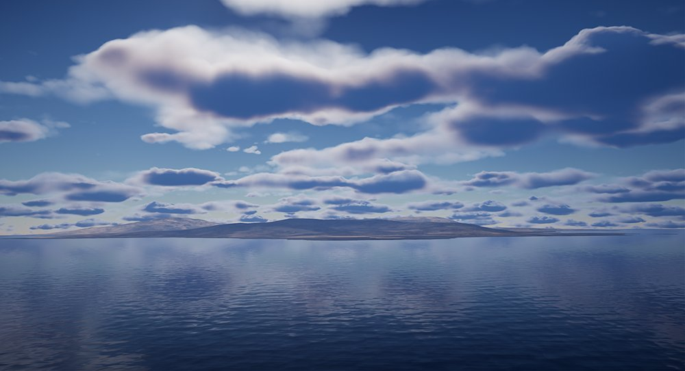
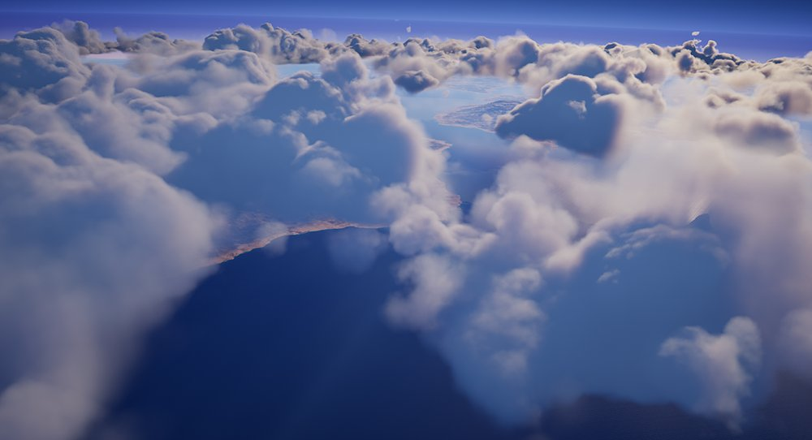
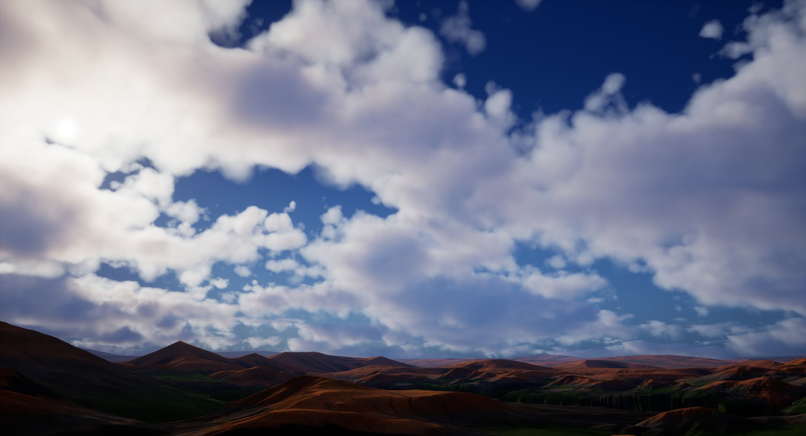
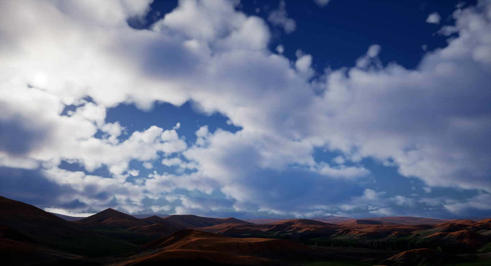
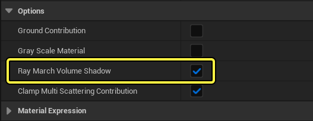
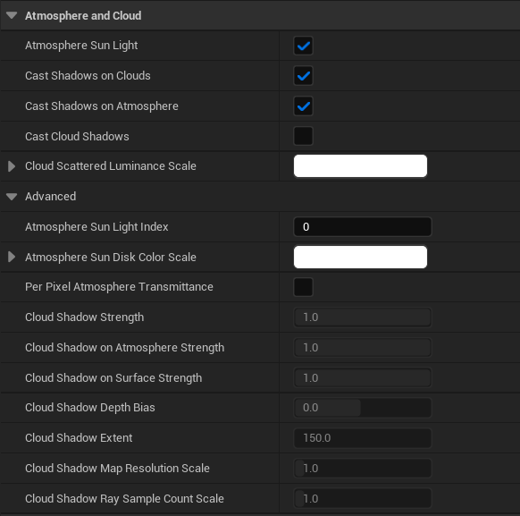
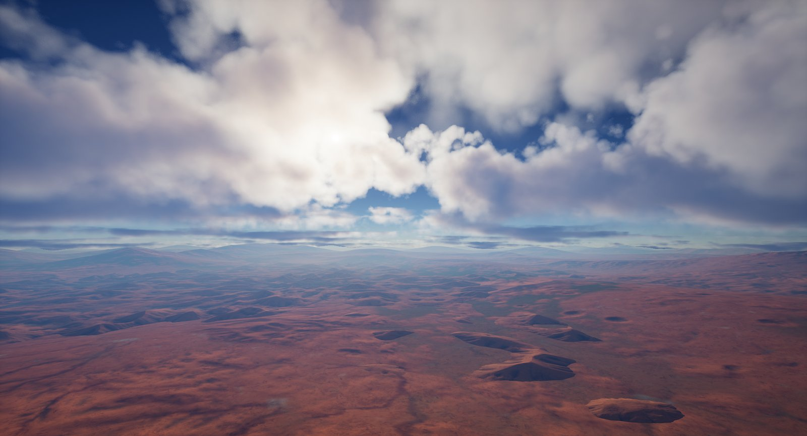
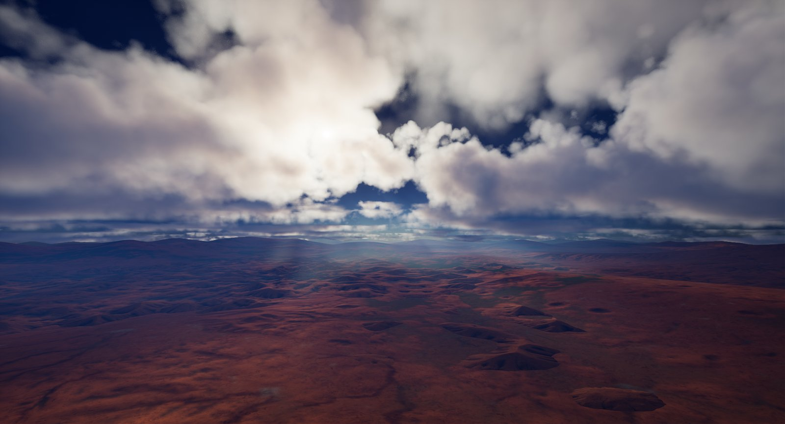

# 体积云组件

> 路径：虚幻引擎5.7文档 / 构建虚拟世界 / 为场景设置光照 / 雾、云、天空和大气的环境光源 / 体积云组件

> 原始页面：https://dev.epicgames.com/documentation/unreal-engine/volumetric-cloud-component-in-unreal-engine

体积云组件是基于物理的云渲染系统，该系统使用材质驱动方法，让美术师和设计师可以自由地创建项目所需的任意类型的云。云系统处理动态实时设置，并通过使用实时捕获模式的[天空大气（Sky Atmosphere）](../sky-atmosphere-component/index.md)和[天空光照（Sky Light）](../../light-types-and-their-mobility/sky-lights/index.md)进行补充。该系统提供可伸缩的、美术师定义的云，适用于使用地面视角、飞行、以及地面到外太空过渡的项目。

## 如何渲染云？

之前，在游戏和电影中进行实时云渲染主要通过将静态材质应用到天空球网格体或者类似方法来实现。现在，体积云系统使用支持光线步进的三维体积纹理来表示实时云层。材质驱动方法为美术师和设计师提供了极大的灵活性，让他们可以创建在天空中飘动的各种各样的云，还能够反映一天之中的不同时间段。

下面各分段将浏览并拆解云系统中的元素，这些元素在实时渲染中进行云的渲染。

### 云体积中的光线步进

参与介质要形成云，需要复杂的光照模拟。在消费级硬件上进行实时模拟，会难以实现或者开销太大。体积云系统采用光线步进和近似算法来模拟云渲染，具有可伸缩的实时性能，并支持多种平台和设备。体积云让实时模拟昼夜变换成为可能，支持光照的多重光源散射效果、云投射阴影和投射到云上的阴影、地面对云层底部产生的光照效果等。

### 光源多重散射

在到达人眼或摄像机传感器之前，穿过体积的光线可能在体积内的粒子上发生散射。这种光效应被称为多重散射，我们看到的云的形状，就是这种效果引起的。在云里，组成云的小水滴上的反射率通常接近1，意味着光线几乎不能在体积内被吸收。射入云体但在途中未被吸收的光线会产生非常复杂的散射效应。参与介质的多重散射效应会影响光线在云体中的传播路径；让云层看起来浓厚光亮。

在实时渲染中，复杂的多重散射效果是通过对实际散射过程的近似模拟来实现的，具体来说，通过在体积材质中追踪透光率的多个倍频（或步骤）来实现。**体积高级材质输出（Volumetric Advanced Material Output）** 表达式让你可以设置倍频的数量，以及多重散射贡献度、遮蔽、离心率等参数。

下面的例子展示了在多重散射近似过程中没有使用倍频（单次散射）、1倍频、2倍频之间的差别。高倍频可以将附加的散射应用到近似到云材质上，但在处理过程中着色器的开销也随之增加。

> [!NOTE]
> 对于游戏项目，考虑到性能问题，推荐在光线多重散射处理中只使用单倍频。然而，你可以在云材质中的 **体积高级材质（Volumetric Advanced Material）** 表达式上使用高贡献和低遮蔽值，从而在不影响性能的前提下达到类似效果。参见下面的体积材质分段。

**地面视角：**

拖动滑动条，改变多重散射近似倍频的数量（0-2）。

**高海拔视角：**

拖动滑动条，改变多重散射近似倍频的数量（0-2）。

### 云遮蔽和阴影

有关云渲染的一个重要方面是云如何遮蔽光线以及在表面上投射阴影。云遮蔽和阴影主要由用来代表云的大气光源和体积材质来处理。你可以通过这些组件控制不同的参数，从而决定云的外观，比如拥有阳光轴或者云自身阴影。

#### 体积光线步进和阴影贴图

在云阴影方面有两种可用模式，可以在所用的云材质内切换。这两种模式是：默认所用 **光线步进（Ray Marched）** 以及 **Beer阴影贴图（Beer Shadow Maps）** (BSM)。

光线步进

Beer阴影贴图

- 光线步进体积阴影

  使用次级光线步进来获得锐利且颜色丰富的阴影，但是因为所用采样个数有限，仅限于在阴影的追踪距离内使用。尽管开销较大，光线步进阴影非常适合从地面到天空乃至太空的过渡。
- Beer阴影贴图

  使用级联阴影贴图，为云层提供更远的阴影距离支持，并支持向地面投射阴影。上述方法在渲染时都很快，但缺点是不够精确，并且缺乏体积自身阴影颜色。Beer阴影贴图通常足以满足从地面视角观察云的需求。

> [!NOTE]
> 对于主机平台，比如Xbox One、PlayStation 4，或者使用同类硬件规格的其他系统，推荐使用Beer阴影贴图来实现云阴影。

要在云体积材质中切换上述模式，可以在材质图表中添加 **体积高级材质输出（Volumetric Advanced Material Output）** 表达式。选中该节点，通过在细节面板中切换 **光线步进体积阴影（Ray March Volume Shadow）** 属性复选框的选中状态来切换以上两种阴影类型。

#### 定向光源交互和阴影

大气光源（如太阳和月亮）提供了对云和大气阴影的控制。使用大气光源，你可以控制阴影的强度、产生云阴影的地方与当前摄像机位置的距离（km）、云能否产生自身阴影并把阴影投射到大气中等等。

在大气光源中启用 **投射云阴影（Cast Cloud Shadows）** 选项将使云体积可以在场景元素上投射阴影并在大气中投射太阳光轴（也称"上帝之光"），太阳光轴由天空大气组件定义。

云阴影：禁用

云阴影：启用

> [!TIP]
> **云阴影贴图分辨率范围（Cloud Shadow Map Resolution Scale）** 属性决定太阳光轴的分辨率以及性能开销。使用 **云阴影范围（Cloud Shadow Extent）** 属性来降低环绕摄像机的云阴影贴图半径，可以帮助聚焦阴影贴图分辨率，从而实现更锐利、更好的效果。

使用 **投射阴影到大气（Cast Shadows on Atmosphere）** 和 **投射阴影到云（Cast Shadows on Clouds）** 属性可以把不透明对象的阴影投射到大气和云上。对于大型物体的阴影生成，可以在定向光源的属性上设定足够大的 **动态阴影距离（Dynamic Shadow Distance）** 值或者使用 **远距离阴影（Far Shadow Distance）** 属性，为启用了 **远阴影（Far Shadow）** 的物体生成阴影。

使用倍频近似方法在参与介质中模拟光源多重散射可能导致一些能量损失。大气光源的属性 **云散射亮度范围（Cloud Scattering Luminance Scale）** 提供了一个不错的弥补方法，让你可以使用取色器来缩放光源的贡献值，有可能在不增加开销的情况下生成更有趣更自然的光线散射效果。

> 图片已省略：undefined

这是一些具有不同云散射亮度范围设定的例子。

点击查看大图。

#### 实时天空光照捕获

天空光照组件提供了实时捕获模式，可以处理与以下组件的交互：大气、云、高度雾、使用已标记为天空的无光照材质的不透明网格体。该模式在可以不牺牲性能的前提下，实现更自然的画面以及动态昼夜交替模拟。

> [!NOTE]
> 可在天空光照页面中了解更多有关实时捕获模式和其他优化的信息。

#### 天空光照云环境光遮蔽

柔和的环境光阴影是让云看起来更自然的一个重要因素。[天空光照（Sky Light）](../../light-types-and-their-mobility/sky-lights/index.md)组件使用 **云环境光遮蔽（Cloud Ambient Occlusion）** 属性来控制云层能够阻挡多少来自天空和大气的光源。你可以在天空光照细节面板中的 **大气与云（Atmosphere and Cloud）** 分段中找到这些属性。

下面的对比展示了启用后逐渐增加强度的环境光遮蔽效果，通过逐步降低发生多散射的光源数量，可以控制天空和大气光源的贡献程度。

> 图片已省略：禁用环境光遮蔽

> 图片已省略：启用环境光遮蔽

禁用环境光遮蔽

启用环境光遮蔽

天空光照AO对大气和云层的贡献如下所述：

- 阴影追踪开销：

  - 在使用逐采样次级步进时，开销由具有

    阴影视图采样数范围（Shadow View Sample Count Scale）

    的体积云组件中设置的值决定。
  - 当云对定向光源Beer阴影贴图（其也被用于向网格体投射阴影）进行采样，则将在每个光线步进位置完成一次对阴影贴图的求值。光源Beer阴影贴图的生成由来自具有

    云阴影光线采样数范围（Cloud Shadow Ray Sample Count Scale）

    的定向光源组件的设置信息驱动。

## 设置并使用体积云

体积云系统是现有大气组件的核心部分，大气组件可以构造出天空和行星的大气层。下面各分段将帮助你入门设置并与云系统一起使用这些组件。

### 初始关卡设置

创建一个新关卡（或使用已有关卡），关卡内包含以下组件：

- 定向光源（Directional Light）

  组件，启用

  大气太阳光（Atmosphere Sun Light）

  属性，代表太阳或月亮。
- 天空大气（Sky Atmosphere）

  组件，代表行星大气层。
- 天空光照（Sky Light）

  组件，如果你想要模拟动态昼夜变换，则可选择启用

  实时捕获（Real Time Capture）

  属性。
- 体积云（Volumetric Cloud）

  组件，指定体积材质，代表天空中的云。

> [!TIP]
> 使用环境光源混合器，可以在关卡中方便地创建并编辑这些大气组件。混合器使用单个面板显示出了每个组件的相关设置。
>
> 更多信息，参见[环境光源混合器（Environment Light Mixer）](../environment-light-mixer/index.md)。

### 天空光照云反射质量

[天空光照（Sky Light）](../../light-types-and-their-mobility/sky-lights/index.md)组件为体积云提供了场景反射。通过设置细节面板上 **云追踪（Cloud Tracing）** 分段里属性的值，你可以通过体积云组件控制场景中用于光线步进反射表面的采样个数。你可以调整用于云反射和云阴影反射的采样个数。

> 图片已省略：拖动滑条，查看采样值逐渐增大的情况，这些采样值将用于追踪云反射光线采样个数：0.25、0.5、0.75、1（默认值）、2、4、8。

拖动滑条，查看采样值逐渐增大的情况，这些采样值将用于追踪云反射光线采样个数：0.25、0.5、0.75、1（默认值）、2、4、8。

> [!TIP]
> **反射采样数范围（Reflection Sample Count Scale）** 和 **阴影反射采样数范围（Shadow Reflection Sample Count Scale）** 属性的值将被限制。你可以使用命令 **r.VolumetricCloud.ReflectionRaySampleMaxCount** 和 **r.VolumetricCloud.Shadow.ReflectionRaySampleMaxCount** 来增加各自采样数的范围。
>
> - r.VolumetricCloud.ReflectionRaySampleMaxCount
> - r.VolumetricCloud.Shadow.ReflectionRaySampleMaxCount
> - r.VolumetricCloud.ViewRaySampleMaxCount
> - r.VolumetricCloud.SampleMinCount
> - r.VolumetricCloud.DistanceToSampleMaxCount

> [!NOTE]
> 更多有关实时捕获模式和反射质量属性的信息，请参见[天空光照](../../light-types-and-their-mobility/sky-lights/index.md)。

### 光线步进质量模式

云系统提供了可伸缩的质量模式，适合多种游戏类型，从标准模式到需要从地面向太空运动的快节奏游戏模式。该系统还支持电影级别的质量，适合不注重实时性的项目。

质量模式通过命令 **r.VolumetricRenderTarget** 来设定。

- "反应（Reactive）"模式支持云与不透明表面相交，但是只能在更低分辨率下实现追踪。

  - 推荐质量选项是

    r.VolumetricRenderTarget.Mode 0

    。该模式支持快节奏游戏，可能包含从地面到太空的过渡，或者云中飞行。云层的追踪操作很快，但是只能呈现低分辨率效果。追踪在四分之一分辨率上进行，在二分之一分辨率上重建，然后在全分辨率时进行界面上采样。
  - r.VolumetricRenderTarget.Mode 1

    平衡了质量和性能，适合多种主要为地面视角的游戏。该模式开销较高，但是具有质量更高的视觉效果。该模式在半分辨率下进行追踪，在全分辨率下进行重建和界面上采样。
- 全分辨率显示的弱反应模式：

  - r.VolumetricRenderTarget.Mode 2

    模式注重更高的质量，同时仍支持实时游戏的地面视角。该模式追踪速度很快，可以产生高分辨率效果，但是不支持云与不透明物体相交。
- 要达到电影级质量，首先设置

  r.VolumetricRenderTarget 0

  ，然后遵循"获得电影级质量工作流"中的建议（见下文）。

根据你想要部署的平台，质量可以进一步提升或者降低。相关操作可以通过控制台命令r.SkyAtmosphere.*和r.VolumetricClouds.*来完成。此外，在体积材质（Volume Material）、体积云（Volumetric Cloud ）、定向光源（Directional Light）组件中，也有一些面向用户的属性。

## 使用定向光源的体积云阴影质量

在调整使用定向光源的体积云阴影质量的设置时，有一些注意事项。

- 需要提高体积云属性

  追踪样本数规模（Trace Sample Count Scale）

  。
- 需要提高定向光源属性

  云阴影光线样本数规模（Cloud Shadow Ray Sample Count Scale）

  。
- 需要对控制台变量

  r.SkyAtmosphere.FastSkyLUT.Width

  和

  r.SkyAtmosphere.FastSkyLUT.Height

  进行补偿，以调整云阴影质量的默认低分辨率，以提供更清晰的阴影。

  - 推荐将宽度和高度都设置为256，作为起始点。

### 获得电影级质量

> [!WARNING]
> 这是一个高级工作流，该工作流绕过了引擎为云和天空的实时渲染所做的优化，会大幅度影响性能。

要让天空大气和体积云组件达到电影级（或者说每像素）质量，可以通过一些命令行来设置云材质的属性，并增加用于追踪大气和云体积的采样数量。

> 图片已省略：应用实时品质设置

> 图片已省略：应用影视级品质设置

应用实时品质设置

应用影视级品质设置

要在项目中获得最高质量的云和大气，下面的步骤是基本起点。

1. 设置

   r.VolumetricRenderTarget

   为

   0

   ，开始启用电影级质量效果。
2. 设置

   r.VolumetricCloud.HighQualityAerialPerspective

   为

   1

   ，为云启用电影级别空中视角，使用高质量光线追踪代替低分辨率LUT。
3. 在体积云组件上设置以下属性值：

   - 在

     云追踪（Cloud Tracing）

     分段里，加大

     视图（View）、反射（ Reflections）

     、

     阴影（Shadows）

     采样数范围。可以使用每个属性的提示信息中所显示的命令来增加各自的采样数范围。
   - 启用

     使用逐采样大气光源透光（Use Per Sample Atmospheric Light Transmittance）

     属性，用逐采样大气透射代替定向光源全局透射。
4. 在使用

   体积高级材质输出（Volumetric Advanced Material Output）

   表达式的体积云材质中设置如下属性：

   - 应用地面光照射云层底部，让场景中的云具有更多形状和颜色。

     - 在细节面板中启用

       地面贡献（Ground Contribution）

       。在体积云组件上，使用

       地面反射率（Ground Albedo）

       属性来设置除太阳光和大气之外，从下方照射云的地面颜色。
   - 设置用于模拟穿过云体积光源多重散射的近似数量:

     - 如果你要更好地模拟穿过云体积光源的多重散射效果，可以加大

       多重散射近似倍频（Multi Scattering Approximation Octaves）

       的值，最大为

       2

       。
     - 应用额外的倍频后，将有更多穿过云体积的光源发生散射。可以通过调整体积高级输出表达式的

       多重散射贡献（Multi Scattering Contribution）

       和

       多重散射遮蔽（Multi Scattering Occlusion）

       属性值来补偿损失。
5. 启用大气光源的以下阴影属性：

   - 设置

     投射云阴影（Cast Cloud Shadow）

     ，将云阴影投射到场景元素和大气上。
   - 设置 **投射阴影到云（Cast Shadows on Clouds）**，将不透明对象的阴影投射到云层上。

     > [!NOTE]
     > 定向光源的 **阴影动态距离（Shadow Dynamic Distance）** 属性值必须足够大，才能真正把大型对象的阴影投射到云上。

     * 根据项目需求，可以在下列天空大气质量提升方法中选择一种：
6. 根据项目需求，在下列

   天空大气（Sky Atmosphere）

   质量提升方法中选择一种：

   - 提升大气渲染的整体质量。

     - 设置

       r.SkyAtmosphere.FastSkyLUT

       为

       0

       。禁用此优化将导致渲染变慢，但会产生较少的带有高频细节的视觉伪像，适用于地球阴影或散射波瓣等场景。
   - **在大气组件中提升大气和太阳光轴的追踪质量。**

     > [!NOTE]
     > 需要启用 `r.SkyAtmosphere.FastSkyLUT`。

     - 设置

       r.SkyAtmosphere.AerialPerspectiveLUT.FastApplyOnOpaque

       为

       0

       。
     - 在天空大气组件上，使用

       追踪采样数范围（Trace Sample Count Scale）

       属性的质量滑条来调整所用的采样数量。如果最大范围值还不够，使用

       r.SkyAtmosphere.SampleCountMax

       命令来设置一个更高的限制值，然后在属性字段中手工输入值。
     - 使用

       r.SkyAtmosphereFastSkyLUT.Width

       和

       r.SkyAtmosphere.FastSkyLUT.Height

       命令来增加LUT的大小，从而提升天阳光轴的质量。
     - 增加

       r.SkyAtmosphere.AerialPerspectiveLUT.Width

       的值，可改善不透明和半透明表面的质量。

     > [!WARNING]
     > 在调大该值时一定要谨慎，因为该值对应的是3D体积纹理，会消耗大量内存。

### 体积材质

使用 **体积（Volume）** 材质域的材质类型，可用体积纹理来呈现云的外观。体积纹理是一种3D纹理，可拆分为一系列对齐到网格的2D纹理。材质中的此类纹理用于不同的体积效果，比如烟雾和云，适合于表现光源穿过体积等场景的效果。

下面的体积纹理代表一个网格中的一系列二维图像（左），当堆叠到一起时，将会构成一个三维体积（右）。

使用纹理编辑器打开并查看体积纹理，可以显示该纹理的二维图像视图（左），或者三维视图（右）。

除了在体积云组件和材质中可以控制的属性之外，体积纹理是生成云初始外观的最基本元素，并且有助于定义可能的效果。体积纹理开启了通过云材质创建多种不同类型的云和效果的可能性。

下面的例子展示了用单个体积材质生成几种不同的云，只需要在每个实例上调整一些参数即可。

体积材质有材质表达式输入和输出节点，这些节点提供了可编辑的属性，从而构成云材质的基础。部分设置可以影响性能，可能会增大或降低着色器的开销。

> [!TIP]
> 使用这些表达式时，推荐参数化这些表达式的值，以便在[材质实例](../../../../designing-visuals-rendering-and-graphics/unreal-engine-materials/instanced-materials/index.md)中快速方便地调整这些值。

### 体积云材质

`Engine/Content` 文件夹包含体积云组件使用的默认体积材质。该材质包含的参数可被用于创建其他类型、形状的云，以及额外的效果，如暴风云。

> 图片已省略：Example Volumetric Cloud

关于此材质的用法，以及如何控制它创建各类云，请参阅[体积云材质](../../volumetric-cloud-material/index.md)。

### 放置云蓝图

使用此插件文件夹中的示例设置将单个云蓝图Actor放置到场景中。场景中单个放置的蓝图可以缩放、旋转、沿X轴和Y轴移动。场景中要有体积云组件和相关的云材质供使用。蓝图云Actor可以激活场景中附加的自定义选项和云放置位置。

你可以在 **Composite_Cloud_Object 关卡** 中的 `/Tools/CloudCompositing/Maps` 文件夹里找到配置示例。查看一下 **BP_CloudMask_Object** 和 **BP_CloudMask_Generator**，了解本场景是如何配置的，以及此Actor上的可调节属性。

### 蓝图绘制云

使用此示例设置开始为你的天空绘制云，在场景中添加稀疏或者稠密的云彩。此示例使用编辑器内运行游戏模式，以及一个简单的用户界面，使用鼠标光标绘制云，可以缩放笔刷、调整笔刷密度等等。

你可以在 **Paint_Clouds** 关卡中的 `/Tools/CloudCompositing/Maps` 文件夹里找到配置示例。选择 **BP_PaintClouds** Actor,查看你可更改的一些属性，这些属性定义了如何绘制云。

要开始绘制云，在主工具栏中按 **运行（Play）**，开始在编辑器内运行。使用下列操作在场景中绘制云：

- 使用 *鼠标左键** 绘制云体积
- 使用 *鼠标滚轮** 缩放绘制笔刷大小。
- 使用

  Shift + 鼠标滚轮

  改变绘制时的笔刷强度。
- 在绘制时按

  Shift

  ，可擦除已绘制的区域。
- 当你在

  BP_PaintCloud

  属性的

  绘制模式（Paint Mode）

  下拉菜单中选择了

  速度（Velocity）

  选项后，可以使用

  鼠标右键 + 鼠标滚轮

  缩放绘制速度。

## 性能和可延展性

在项目开发中，处理性能和跨平台可延展性非常重要。下面各分段包含了有关调整云质量和捕获和点亮项目中的云相关其他功能的信息。

### 支持平台

体积云和天空大气组件支持通过以下平台提供可扩展的大气系统：

| 功能 | 移动终端 | XB1/PS4 | XBX/PS5 | 低端/高端 PC |
| --- | --- | --- | --- | --- |
| **天空大气（SkyAtmosphere）** | 支持 | 支持 | 支持 | 支持 |
| **体积云（Volumetric Clouds）** | 不支持 | 支持* | 支持 | 支持 |

* 需要一个天空球网格体且该网格体启用了 **是天空（Is Sky）** 选项。 ** 要在这些平台上获得可接受的性能，推荐使用阴影贴图方法来计算云自身阴影，而不要使用[体积光线步进和阴影贴图](#volumeraymarchingandshadowmaps)分段中所述的次级追踪方法。

### 控制云追踪质量

云系统通过体积材质执行几种追踪操作。追踪质量取决于所用的采样数量。采样数量越多，质量越高。反之亦然，采样数量越少，质量越低。

> 图片已省略：默认采样数（1.0）

> 图片已省略：较低采样数（0.25）

默认采样数（1.0）

较低采样数（0.25）

对于不同平台，在性能和质量之间取得平衡很重要。**云追踪（Cloud Tracing）** 属性让你可以调节关键云属性的追踪质量，比如云反射、云和云反射的阴影采样数、从摄像机出发的云阴影停止距离等。

> 图片已省略：The Cloud Tracing properties

> [!TIP]
> 每种属性都有自己的控制台命令，根据不同平台，可以使用设备描述配置文件（*.ini）进行单独配置。在跨越不同平台设置目标可延展性时，这种机制带来了极大的灵活性。

### 优化体积云材质

云渲染的基础是体积材质，以及在材质图表中所用的 **体积高级输出（Volumetric Advanced Output）** 和 **体积高级输入（Volumetric Advanced Input）** 表达式。你可以参数化云材质的很多方面，来控制材质实例化的一些属性，但是部分属性只能在基础材质节点上设置。

在考虑如何优化项目中的云材质时，下面是一些建议（适用于 **体积高级输出（Volumetric Advanced Output）** 表达式，也可以单独使用）：

- 在求值过程中，如果使用

  灰阶范围材质（Gray Scale Material）

  ，将只考虑材质输入参数中的

  R

  （红色）信道。在场景中，云对应的材质将为灰阶材质，但材质光照仍将为彩色。
- 如果帧预算允许，启用

  地面贡献（Ground Contribution）

  。此操作将增加一些开销，用于追踪地面光源对于云层底部进行阴影光照的采样。
- 限制

  多重散射倍频数（Multi Scattering Approximation Octave Counts）

  的值，可以节省着色器中的部分性能开销。默认情况下，该操作使用单散射（0），但是也可以使用最大为2的近似倍频，在云体积中模拟光线的多重散射效果。
- 使用

  光线步进体积阴影（Ray March Volume Shadow）

  复选框在云体积次级光线步进和使用级联阴影贴图之间切换。启用级联阴影贴图（不检测盒体）提供了一种性能增强方法，可以带来无限长度的阴影，尽管该方法不太精确并且会导致颜色灰阶化。
- 守恒密度（Conservative Density）

  属性用于跳过先前耗时的材质求值过程，从而加速光线步进。浮点向量（Vector3）的

  X

  分量表示参与介质的守恒密度。如果该值大于

  0

  ，表示该材质已求值，否则将直接对下一个采样求值。更多细节，参见体积云参考。
- 在启用了

  r.PostProcessing.PropagateAlpha

  ，且有任何功能（如指数高度雾、体积云、和天空大气）启用了Alpha Holdout时，云的渲染将使用高开销的路径。

### 天空光照实时捕获模式预算

天空光照实时捕获模式可启用9帧时间段，让单帧捕获对应到多个帧上。此优化可提升昼夜变换模拟的性能，让性能开销大幅降低，因为时间分段的成本与其最昂贵的帧一样昂贵。该特性让你有机会在不增加每帧性能负担的前提下提升其他方面的质量。

例如，如果你拆开分析捕获的场景元素以及各自的帧开销，发现高光度卷积（Specular Convolution）每帧耗费了0.8毫秒，但是天空和云只耗费了0.6毫秒，那么你仍然有可能略微提升天空和云的质量，而无须付出额外成本。

### 守恒密度计算

**守恒密度（Conservative Density）** 作为优化光线步进过程的一种手段而添加。为大气中每一个光线步进采样计算整个云材质图表是很耗时的，可能开销很快就变得不堪重负。为了减轻开销，可以使用用户设置的恒定密度。例如，在使用 **体积高级输入（Volumetric Advanced Input）** 表达式进行材质运算时，可能使用一个自上而下的二维纹理，该纹理描述了云密度，这里唯一的规则是，当大气中有云存在时，守恒密度必须大于0。

当在大气中执行光线步进时，如果使用了使用守恒密度输入，云材质采样将通过两步获得：

1. 在

   体积高级输出（Volumetric Advanced Output）

   节点中计算守恒密度输入（矢量3量）图表。
2. 如果守恒密度的X分量（矢量3）大于0：

   1. 决定求值插入

      主材质（Main Material）

      节点中的开销更大的材质图表（求值反射率、发射颜色和消光）。
   2. 可以使用

      体积高级输入（Volumetric Advanced Input）

      节点来获取这些值，这样可以避免计算在第一步中已经求值的守恒密度值。
3. 否则，如果守恒密度的X分量等于或者小于0，将跳过开销更大的材质估值，开始处理下一个采样。

> [!NOTE]
> 虚幻引擎的材质图表中不支持动态分支。守恒密度输入让动态分支可以跳过开销可能很大的材质求值。当虚幻引擎在材质中原生支持动态分支之后，此类输入将废弃，让技术美术师决定哪些部分可以动态跳过。

### 光线追踪和体积云

云层系统不支持[光线追踪](../../ray-tracing-and-path-tracing-features/hardware-ray-tracing/index.md)，并且只考虑渲染进天光的云。跟踪体积云的反射会对性能造成很大开销。

假如你希望让天空中的对象出现反射，请将天光Actor放得离它近一些（天空中），这样会有帮助。
