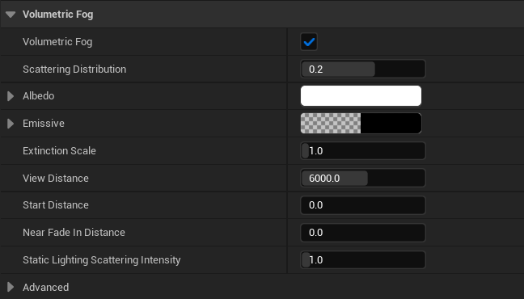
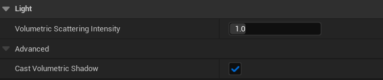
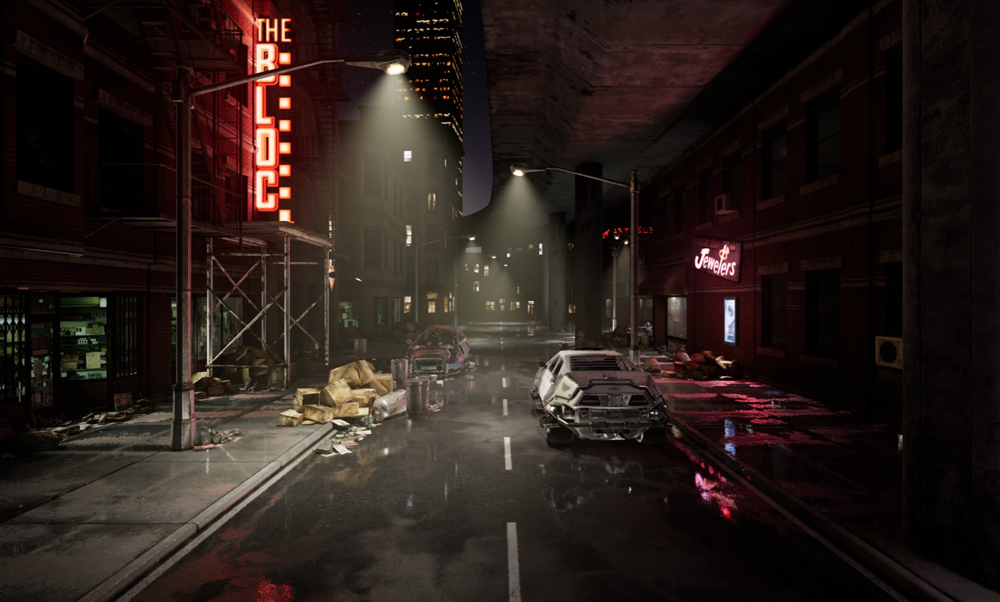
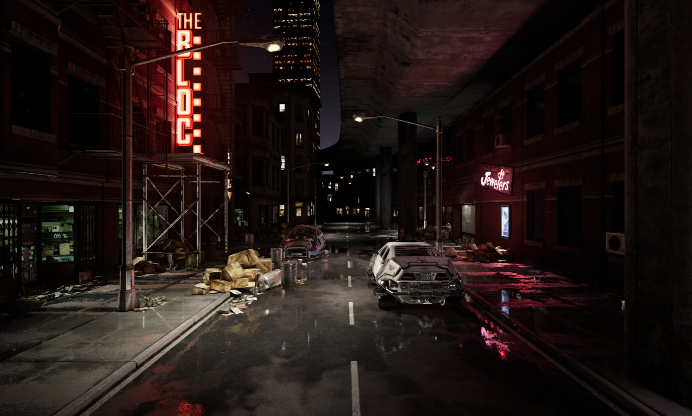
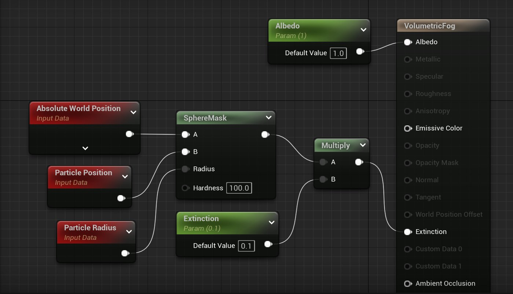
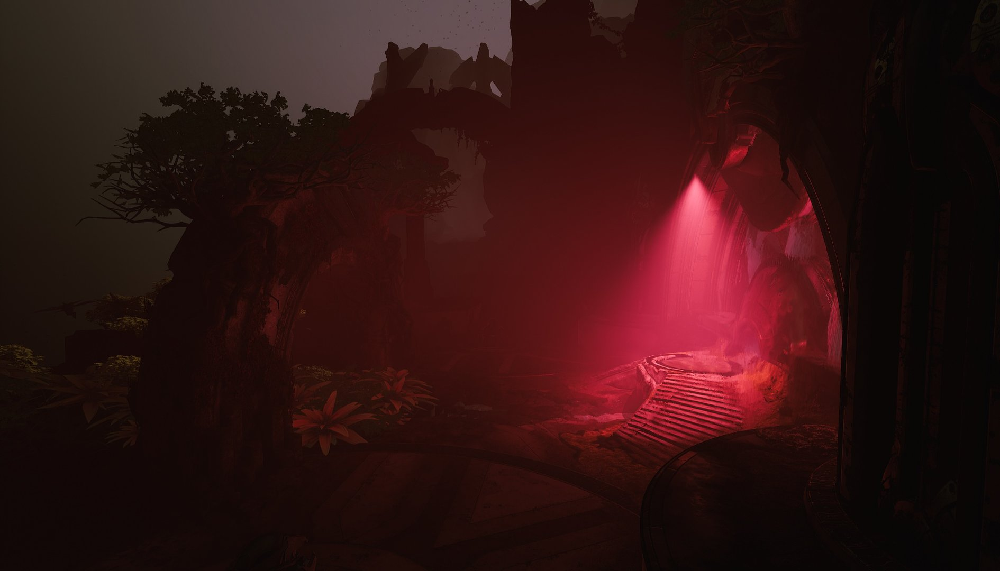
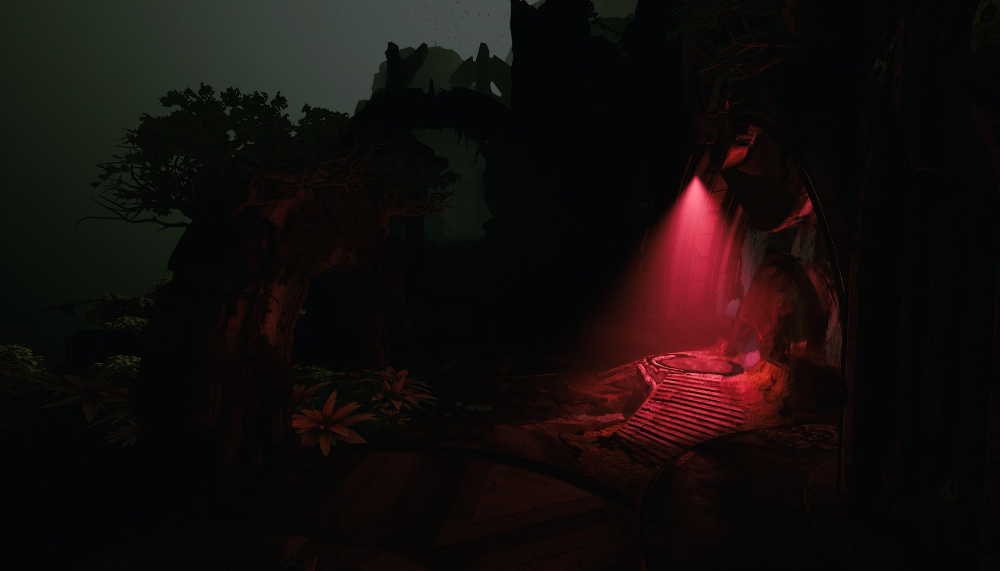
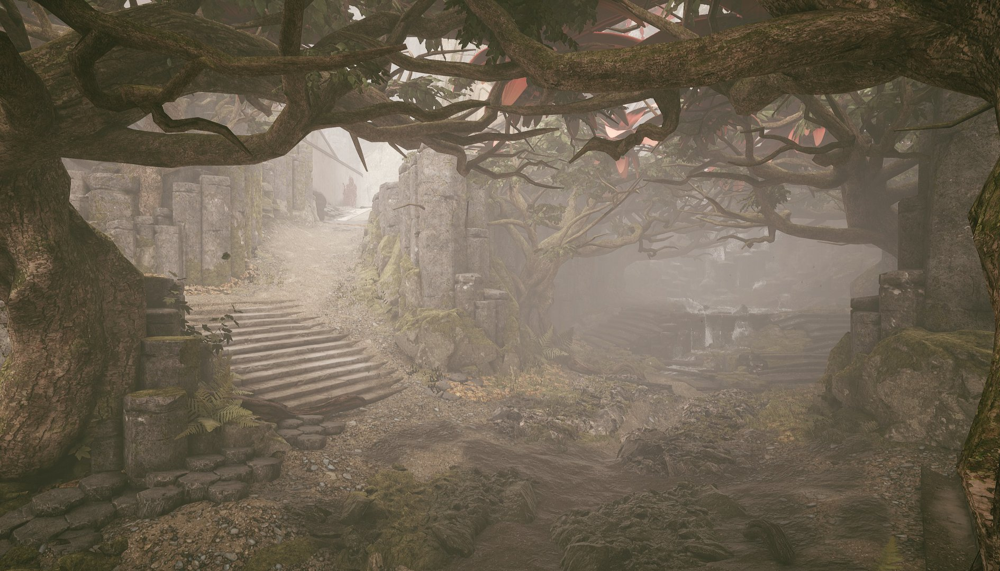

# 体积雾

> 路径：虚幻引擎5.7文档 / 构建虚拟世界 / 为场景设置光照 / 雾、云、天空和大气的环境光源 / 体积雾

> 原始页面：https://dev.epicgames.com/documentation/unreal-engine/volumetric-fog-in-unreal-engine

**体积雾**是[指数高度雾](../exponential-height-fog/index.md)组件的可选部分。 体积雾（Volumetric Fog）将计算摄像机视锥体中每个点的参与介质密度和照明，以支持不同的密度和影响雾的任意数量光源。

此场景中的体积雾来自于穿过拱门的定向光源，在周边区域中生成带阴影效果的雾气。

## 体积雾控制

设置和调整体积雾时，你可以全局控制它，也可以在场景中局部控制它。 全局控制功能使你能够使用指数高度雾（Exponential Height Fog）组件控制整个场景的雾。 局部控制功能使你能够通过在可以生成粒子的区域中使用粒子系统的方式控制雾。

### 全局控制

要控制体积雾，你可以调整**指数高度雾（Exponential Height Fog）**中的属性和各**光源**的属性，以控制光源的贡献量。

#### 指数高度雾

体积雾的功能按钮位于**指数高度雾（Exponential Height Fog）**组件的**体积雾（Volumetric Fog）**分段下。 指数高度Distribution规定体积雾的全局密度。

| 属性 | 说明 |
| --- | --- |
| **散射分布（Scattering Distribution）** | 此属性决定体积散射的定向程度；如果值为0，光线将在所有方向上平均散射，如果值接近1，光线主要在光源方向上散射（你必须看着光源才能看到其散射的光线）。 |
| **反射率（Albedo）** | 此为参与媒介的总体反光度。 云、雾及基于水粒子的水雾的反射率都接近1。 |
| **自发光（Emissive）** | 这是高度雾发射的光的密度。 |
| **消光比例（Extinction Scale）** | 控制参与媒介阻挡光线的程度。 |
| **视野距离（View Distance）** | 距摄像机的距离，将计算两者之间的体积雾。 在为雾创建的体积纹理中，Z轴切片的数量有限，具体取决于此距离。 增大此距离会导致欠采样，从而导致出现瑕疵。 可以使用r.VolumetricFog.GridSizeZ调整Z轴切片的数量，数值越大，质量越高，但是渲染成本也会越高。 |
| **起始距离（Start Distance）** | 距离摄像机多少距离后（世界单位），体积雾将开始。 |
| **近淡入距离（Near Fade In Distance）** | 从开始距离算起，体积雾在多少距离后开始淡入。 |
| **静态光照散射强度（Static Lighting Scattering Intensity）** | 缩放体积雾静态光照散射的强度。 |
| **使用雾内散射颜色重载光源颜色（Override Light Colors with Fog Inscattering Colors）** | 启用后，将使用**雾内散射颜色（Fog Inscattering Color）**、**定向内散射颜色（Directional Inscattering Color）**和**内散射纹理（Inscattering Texture）**属性重载体积雾的光源颜色。 |

#### 光源

分别调整各光源的"细节（Details）"面板中的**光源（Light）**分段的下列属性，即可控制各光源对场景的贡献量（以及它是否向雾投射阴影）。

| 属性 | 说明 |
| --- | --- |
| **体积散射强度（Volumetric Scattering Intensity）** | 控制此光源对体积雾的贡献量。 设为0时，则无贡献。 |
| **投射体积阴影（Cast Volumetric Shadow）** | 为对体积雾进行贡献的光源切换是否投射体积阴影。 启用阴影投射时，点光源和聚光源的渲染成本要高出大约三倍，因为它们对体积纹理阴影投射进行贡献，而不投射阴影的光源仅对雾进行贡献，但不投射阴影。 |

体积散射强度：1（默认值）

体积散射强度：0

在本示例中，我们已通过将**体积散射强度（Volumetric Scattering Intensity）**设置为0禁用了聚光源对体积雾的贡献。

### 本地控制

使用**体积**域的材质会为空间中给定的点描述反射率（Albedo）、自发光（Emissive）和消光（Extinction）。 反射率（Albedo）介于[0-1]的范围中，而自发光（Emissive）和消光（Extinction）是 值大于0的全局空间密度。

本示例展示了用于粒子系统的最简单的体积材质。

> [!NOTE]
> 当前，体积材质只能在粒子上使用，位于粒子半径（通常由SphereMask处理）内的位置为有效位置。

放置使用该材质的单个粒子系统会导致密度球体添加到体积雾。 效果完全是三维（3D）的，不涉及公告板。

你可以更进一步，通过将多个球体雾粒子与纹理噪点配合使用来将雾限制在场景的特定区域之内。

在此场景中，雾粒子填充了那些地势较低的区域，以创建使用体积雾投射阴影的局部雾效果。

## 时序二次投影

体积雾使用的体积纹理（体素）的分辨率相对较低，而且与摄像机视锥一致。 体积雾逐帧使用具有不同次体素抖动的极强临时二次投影过滤器， 以平滑锯齿。 但它也会产生负面影响——闪光灯和枪口火舌等变化速度快的光源将会留下光线轨迹。 要禁用这些光源的贡献，请将**体积散射强度（Volumetric Scattering Intensity）**设为0。

## 体积雾上的预计算光照

体积光照贴图使每个雾体素都有预计算光照内插到其在空间中的位置，从而支持了体积雾的静态光照应用。

聚光源启用 | 无间接光线反射

聚光源启用 | 间接光线反射

固定光源的间接光照存储在光照贴图中，现在会影响雾。

> 图片已省略：天空光照体积光照贴图

带自发光颜色的天空光照

天空光照体积光照贴图

天空光照现在也可以正确地投射阴影，防止室内区域变成大雾效果。

> 图片已省略：间接光照缓存： | 静态光照的静态和自发光 | （老方法）

> 图片已省略：体积光照贴图： | 静态光照的静态和自发光 | （新方法）

间接光照缓存： | 静态光照的静态和自发光 | （老方法）

体积光照贴图： | 静态光照的静态和自发光 | （新方法）

静态光照的静态和自发光对雾的影响没有任何开销，因为它们全部都合并到体积光照贴图中了。

## 性能

体积雾的GPU开销主要通过体积纹理分辨率控制，可在[引擎可延展性](../../../../designing-visuals-rendering-and-graphics/optimizing-and-debugging-projects-for-realtime-rendering/scalability/scalability-reference/index.md)的阴影级别中设置它。 设置为**高（High）**时，体积雾在PlayStation 4上需要花费1毫秒， 设置为**超高（Epic）**时，在NVIDIA 970 GTX上需要花费3毫秒（因为需要运算的体素量是八倍之多）。

- 使用**体积（Volume）**域的粒子会导致GPU开销显著增高，具体取决于它们的3D过度绘制和指令数。 使用控制台命令`profilegpu`即可查看此开销。
- 启用了**投射体积阴影（Cast Volumetric Shadow）**的点光源和聚光源的开销约为不投射阴影的点光源和聚光源的开销的三倍。

若启用`r.PostProcessing.PropagateAlpha`，且存在启用了Alpha维持的功能（如指数高度雾、体积云、天空大气），那么云的渲染将使用高开销的路径。

## 当前受支持的功能

以下列表中包含了体积雾的当前受支持的功能：

- 单个定向光源，具有来自级联阴影贴图的阴影投射或静态阴影投射，带光源函数。
- 任意数量的点光源和聚光源，具有动态或静态阴影投射（如果启用**投射体积阴影（Cast Volumetric Shadowing）**）。
- 静止天空光照的阴影投射。
- 通过体积光照贴图实现的预计算光照（静态光源的直接光照，固定光源的间接光照）。
- 单一天空光照，具有来自距离场环境光遮蔽（Distance Field Ambient Occlusion）（如启用）的阴影投射。
- 粒子光源（如果**体积散射强度（Volumetric Scattering Intensity）**大于0）。

另外，半透明度可能会受到体积雾影响，具体取决于它在场景中的位置。 默认情况下，半透明度按顶点计算雾，因此曲面细分低的水平面可能导致 瑕疵。 要解决此问题，可将这些材质设置为逐像素计算雾，方法是在"材质细节（Material Details）"中启用**逐像素计算雾（Compute Fog Per-Pixel）**。

## 已知问题

使用体积雾时，下列功能**尚不受支持**：

- 在点光源和聚光源上使用IES配置文件和光源函数。
- 从光线追踪距离场阴影（Ray Traced Distance Field Shadows）投射阴影。
- 从体积雾（本身）投射阴影。
- 在点光源和聚光源上使用源半径（Source Radius）。
- "指数高度雾（Exponential Height Fog）"中的"雾中断距离（Fog Cutoff Distance）"、"开始距离（Start Distance）"和"雾最大不透明度（Fog Max Opacity）"等设置。

### 常见问题

以下是使用体积雾时可能会碰到的部分常见问题。

- **如何在不使用全局浓雾的情况下实现更强的光束？**

  - 增强雾的全局密度时，雾气更强，因此只有在雾气浓密到严重笼罩一切时你才会注意到光束（光影）。 不使用浓雾就可实现更强的光束的方法有两种：

    1. 降低全局雾密度，但是为定向光源使用较高**体积散射强度（Volumetric Scattering Intensity）**。 另外，将指数高度雾Actor的**散射分布（Scattering Distribution）**调整为接近**0.9**。
    2. 降低全局雾密度，但是使用体积粒子在特定区域中增强它。
- **可以同时使用指数高度雾和体积雾吗？**

  - 现在，体积雾会在体积雾**视野距离（View Distance）**内替换**雾内散射颜色（Fog Inscattering Color）**。 因为体积雾基于物理而指数雾并不基于物理，所以无法在远处混合两个系统，以使它们精确匹配。 精确匹配。 这也意味着指数高度雾（Exponential Height Fog）组件中的部分设置对体积雾没有影响。
- **能否将体积雾的中心从摄像机处分离？ 这对俯视角游戏十分有用……**

  - 当前不行，但可以使用独立体积来实现这一目的。 但是，此方法的缺点是无法高效将它们与半透明度融合。

## 培训视频

体积雾 | 功能亮点 | 虚幻引擎
