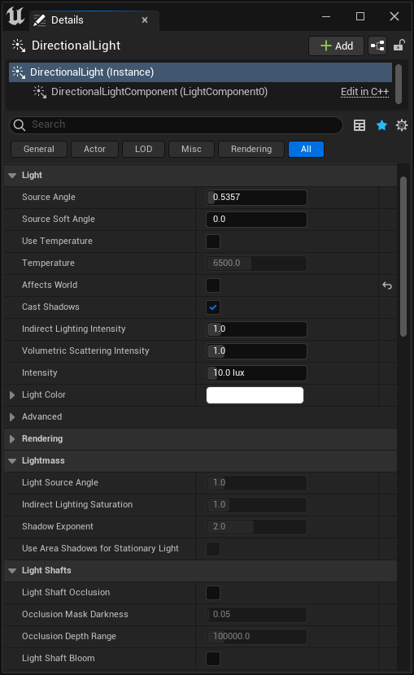

# 直接光照

> 路径：虚幻引擎5.7文档 / 构建虚拟世界 / 为场景设置光照 / 直接光照

> 原始页面：https://dev.epicgames.com/documentation/unreal-engine/features-and-properties-of-lights-in-unreal-engine

虚幻引擎中的光源包含大量属性，这些属性一定程度上取决于[光源的移动性和类型](../light-types-and-their-mobility/index.md)。

在关卡中选择光源时，可以在 **细节（Details）** 面板中找到光源属性。根据光源 **移动性（Mobility）** 是 **静态（Static）** 、**固定（Stationary）** 或 **可移动（Movable）**，光源特性和属性会各有不同。

定向光源的光源属性。

## 光源属性相关的注意事项

在深入了解光源的专有特性和属性之前，你需要考虑以下事项：

- 你的场景需要什么类型的光源照亮？
- 光源应该具备什么样的移动性？
- 可以根据需求混合和匹配具有不同移动性的光源来照亮场景。但是，必须考虑这对关卡内的光照、阴影和资产有什么影响。并非所有属性都支持每种移动性或光源类型。
- 阴影

  是与光照相关的一个广泛主题。项目设置中的移动性、光源类型甚至启用的光照特性都会影响项目中光照的工作方式。
- 某些类型的光源可以补充其他独立特性，例如用于

  环境光照

  的光源。

## 设置光源属性

在关卡中选择光源时，可以在 **细节（Details）** 面板中找到光源属性和特性。

每个光源都必须将其 **移动性（Mobility）** 设置为 **静态（Static）** 、**固定（Stationary）** 或 **可移动（Movable）** 。

无论选择何种光源，其所有属性都会列出，但移动性会决定哪些属性受支持。例如，Lightmass设置仅影响移动性为静态（Static）或固定（Stationary）的光源。

浏览以下主题，了解适用于场景和项目中光源的一些特性和属性。

### 光源特性和属性相关的常见话题

下文列出了所有（或大多数）类型的光源会涉及的常见概念和特性。它们可能是某种单独的光源特性，或者适用于更大规模特性（如全局光照）的光源属性。

%building-virtual-worlds/lighting-and-shadows/features-of-lights/mega-lights:Topic%

- [物理光照单位](using-physical-lighting-units/index.md)

- [全局光照](../global-illumination/index.md) - 介绍可供选择的全局光照选项。

- [阴影](../shadowing/index.md) - 介绍可用的阴影方法以及它们提供的属性。

- [反射环境](../reflections-environment/index.md) - 捕捉并显示局部光泽反射的系统。

- [光源类型及其可移动性](../light-types-and-their-mobility/index.md) - 可供选择的可用光源类型及其移动性设置如何影响场景中的光照。

- [网格体距离场](../mesh-distance-fields/index.md) - 概述网格体距离场以及你在开发游戏可以用到的相关功能。

- [光照通道](using-lighting-channels/index.md) - 通过设置光源的光照通道来选择性地照亮表面。

- [IES光源描述文件](using-ies-light-profiles/index.md) - 介绍如何设置光源使用IES纹理。

%building-virtual-worlds/lighting-and-shadows/features-of-lights/light-functions:Topic%

## 定向光源特性和属性主题

以下特性适用于[定向光源](../light-types-and-their-mobility/directional-lights/index.md)。

%building-virtual-worlds/lighting-and-shadows/features-of-lights/light-shafts:Topic%

- [天空大气组件](../environmental-light-with-fog-clouds-sky-and-atmosphere/sky-atmosphere-component/index.md)

- [体积云组件](../environmental-light-with-fog-clouds-sky-and-atmosphere/volumetric-cloud-component/index.md) - 使用体积材质进行实时云渲染

## 天空光照特性和属性主题

以下特性适用于[天空光照](../light-types-and-their-mobility/sky-lights/index.md)。

%building-virtual-worlds/lighting-and-shadows/environmental-lighting:Topic%
