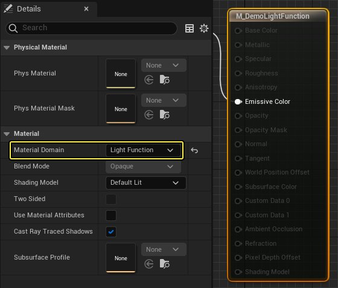
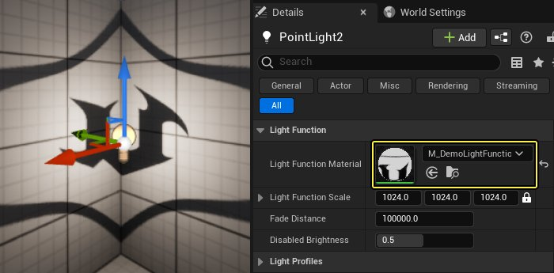
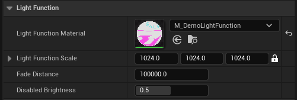
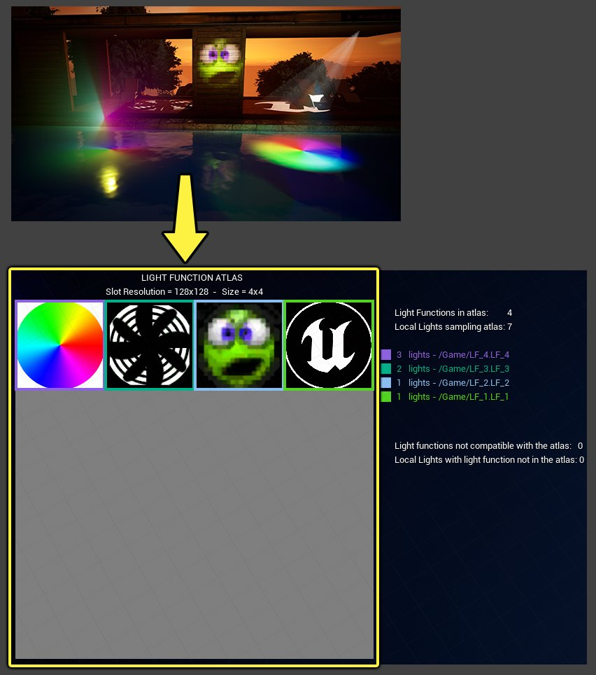
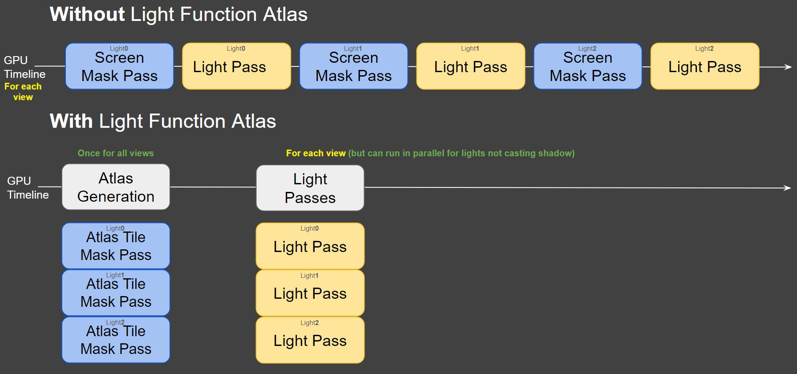
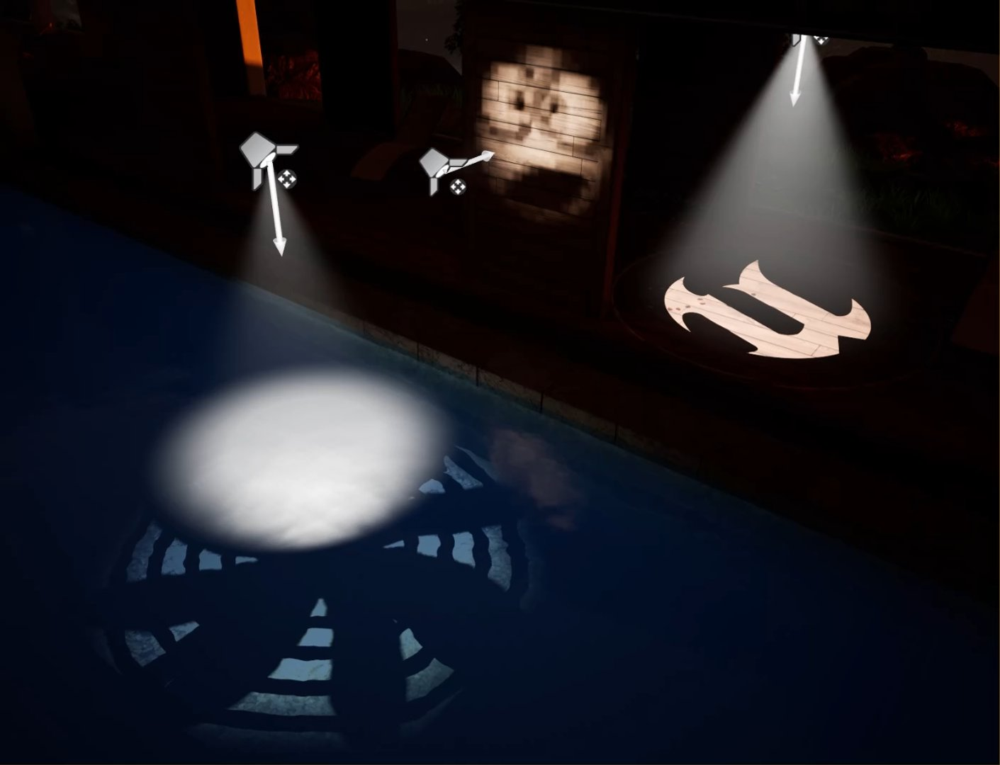
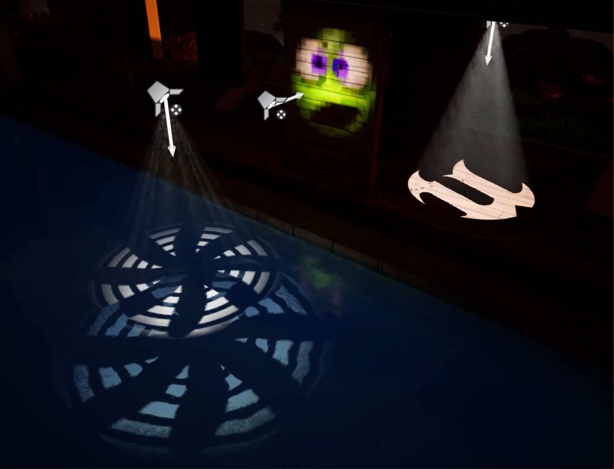
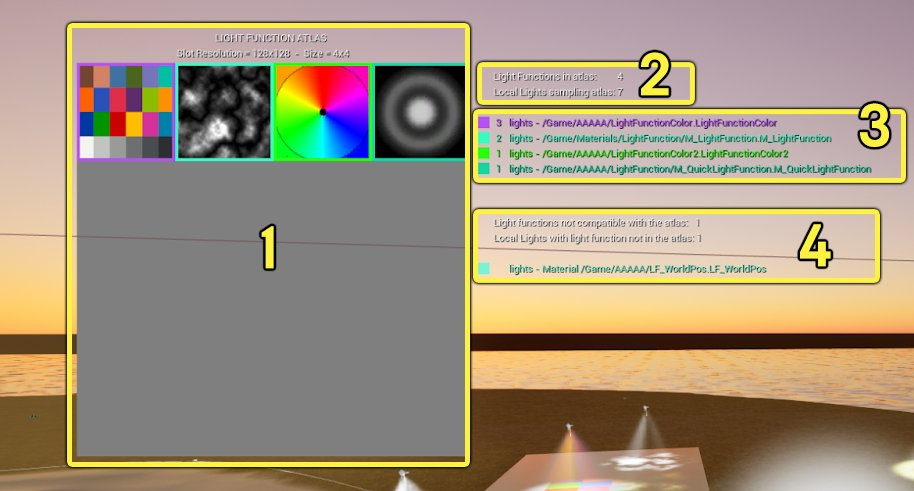

# 光源函数

> 路径：虚幻引擎5.7文档 / 构建虚拟世界 / 为场景设置光照 / 直接光照 / 光源函数

> 原始页面：https://dev.epicgames.com/documentation/unreal-engine/using-light-functions-in-unreal-engine

光源函数是可应用于光源以遮蔽和过滤光源强度的材质。 这是一种材质驱动型方法，也就是当应用于不透明网格体时，可以实现与光源一起发挥作用的动画效果。 光源函数还支持使用体积雾形成阴影，这使得光照函数最适用于创造光照变体，例如水中的焦散、云和投影模板。

*内容示例项目中的光源函数展示了使用带体积雾的光源函数的材质驱动型动画。*

光源函数仅可应用于移动性设置为**可移动（Movable）**或 **固定（Stationary）**的光源，并且不能烘焙到光照贴图中。 光源函数遵循与投射动态阴影的光源相同的高开销渲染通道，因为光源函数的作用需要首先在屏幕空间中累积。 光源函数的第二个通道会对屏幕空间中的光照进行求值。 这是在GPU上发生的顺序操作，并且会因为资源同步和缓存清空而花费更多时间。

以下是一些结合不同光源类型使用的光源函数的示例。

|  |  |  |
| --- | --- | --- |
|  | 采用动画焦散光源函数的聚光源。 | [采用带体积雾的彩色光源函数的聚光光源和点光源。](https://dev.epicgames.com/community/api/documentation/image/4ea54064-50df-48b8-b894-748fa232bdfa?resizing_type=fit) |
| 采用云阴影光源函数的定向光源 | 采用焦散光源函数的聚光光源 | 采用带体积雾的彩色光源函数的聚光源和点光源 |

## 创建光源函数

将**材质域（Material Domain）**设置为**光源函数（Light Function）**，即可在材质中创建光源函数。 所有节点均输入到主材质节点上的**自发光颜色（Emissive Color）**输入。

## 将光源函数应用到光源

要将光源函数材质与光源结合使用，请使用光源的**细节（Details）**面板，将其分配到光源的**光源函数材质（Light Function Material）**插槽。

一旦将光源函数分配给光源，就不需要启用**投射阴影（Cast Shadows）**来显示光源函数材质。

光源函数包含以下光源属性：

| 属性 | 说明 |
| --- | --- |
| **光源函数材质（Light Function Material）** | 将光源函数材质应用到此光源的插槽。光源函数只能对非光照贴图光源应用。 |
| **光源函数缩放（Light Function Scale）** | 缩放正在投射的光源函数。 X和Y沿垂直于光源的方向缩放。 Z沿光源方向缩放。 |
| **淡化距离（Fade Distance）** | 设置光源函数完全淡化到**禁用亮度（Disabled Brightness）**值的距离。 这很适合用来隐藏远处应用的光源函数产生的锯齿。 |
| **禁用亮度（Disabled Brightness）** | 当已指定但未启用光源函数时，应用于光源的亮度因子，例如在使用禁用阴影的视图的场景捕获中。 该项应设置为光源函数材质自发光输入的平均亮度，范围应在0到1之间。 |

## 光源函数图集

光源函数使用与投射动态阴影的光源相同的高开销渲染通道。 光源函数的作用需要首先在屏幕空间中累积，然后第二个通道对屏幕空间中的光照进行求值。 这是GPU上的顺序操作，并且会因为资源同步和缓存清空而花费更多时间。

为了减少此过程中高昂的GPU开销，你可以使用**光源函数图集（Light Function Atlas）**生成性流程，将动画光源函数烘焙到组成图集的图块（或2D纹理）中。 这些2D纹理被存储并投射到场景中。 为了使该操作获得更好的效果，你可以使用光源函数图集可视化查看场景中的每个光源函数是如何作为图块被存储到图集中的。

下面的实力场景包含4个被烘焙到2D纹理图块并存储到图集中的光源函数。

示例场景使用光源函数图集可视化展示了光源函数如何被烘焙到光源函数图集中的。

将光源函数烘焙到Atlas 2D纹理的过程可在GPU上完全并行完成，并且结果在场景的所有视图之间共享。 然后，在**光源通道（Light Pass）**中，所有具有光源函数材质且未启用阴影投射的光源都可以在屏幕上并行累积。 这样可以显著节省GPU时间。 例如，Unreal Engine Fortnite特别版（UEFN）中的[Talisman环境模板](https://dev.epicgames.com/documentation/uefn/talisman-environment-template-in-unreal-editor-for-fortnite)测得GPU时间减少了2毫秒（ms）以上。

与旧版光源函数不同，光源函数图集可以支持灰阶或彩色光源函数材质。

使用旧版管线和通道的光源函数

具有8位灰阶的光源函数图集（GPU开销降低）

### 光源函数图集限制

为了使光源函数材质有效并烘焙到光源函数图集中，光源函数材质有一些限制。 为你的项目启用光源函数图集时，注意以下事项：

- 你无法对深度缓冲区或世界位置进行取样。
- 你无法对GBuffer进行取样。
- 要对纹理进行取样，则不应操控UV。 然而，如果你这样做，注意UV操控要与光源函数的纹理空间边缘对齐。 否则，图集插槽不可重复。

  > [!NOTE]
  > 该问题在定向光源和矩形光源，或所有从细节面板中使用缩放控制的光源上可见。
- 定向光源当前强制不对图集进行取样。

当满足这些限制条件时，可以将光源函数烘焙到光源函数图集中，用于快速光照求值通道。 光源函数会被自动检测并路由进出光源函数图集。

### 光源函数图集可视化

你可以使用命令`ShowFlag.VisualizeLightFunctionAtlas 1`来直观显示哪些光源函数已被包含在光源函数图集中，或哪些已被从光源函数图集中排除

这是一个光源函数图集可视化的示例。 其中包括一个报告为不兼容的单独光源函数。

在此可视化中，显示了以下信息：

1. **光源函数图集（Light Function Atlas）**显示了属于其图集的所有光源函数。
2. 场景中光源函数的信息：

   - **图集中光源函数**的数量。
   - **本地光源取样图集**的数量。
3. 将图集中影响光源函数的光源数量关联起来的彩色图表。
4. 与光源函数图集不兼容的光源函数列表。

### 光源函数图集项目设置

在项目设置（Project Settings）窗口的**引擎（Engine）> 渲染（Rendering）**下的**光源函数图集（Light Function Atlas）**类别中，可以找到以下属性：

> 图片已省略：光源函数图项目设置。

| 属性 | 说明 | 默认状态 |
| --- | --- | --- |
| **光源函数图集（Light Function Atlas）** | 选择光源函数图集纹理的格式。 | 8位灰阶（8 bits Gray Scale） |
| **体积雾使用光源函数图集（Volumetric Fog Uses Light Function Atlas）** | 当启用光源函数图集时，在体积雾上启用对光源函数的支持。 | 启用 |
| **延迟光照使用光源函数图集（Deferred Lighting Uses Light Function Atlas）** | 当启用光源函数图集时，在延迟光照（多通道和群集）上启用对光源函数的支持。 | 启用 |
| **单层水体使用光源函数图集（Single Layer Water Uses Light Function Atlas）** | 当启用光源函数图集时，在单层水体上启用对光源函数的支持。 | 禁用（Disabled） |
| **半透明材质使用光源函数图集（Translucent Uses Light Function Atlas）** | 当启用光源函数图集时，在使用前向着色模式的半透明材质上启用对光源函数的支持。 | 禁用（Disabled） |

### 设置光源函数图集格式

默认情况下，光源函数图集会将灰阶用于光源函数，但你可以在项目设置中对此进行更改，方法是将**光源函数图集格式（Light Function Atlas Format）**设置为**8位RGB颜色（8 bits RGB Color）**，使其采用彩色。 彩色光源函数可与体积雾、Lumen全局光照、反射以及被设置为半透明或单层水体的材质配合使用。

|  |  |
| --- | --- |
| [光源函数图集设置为8位灰阶。](https://dev.epicgames.com/community/api/documentation/image/aa9744a5-98a5-4ee0-9ba1-86a81689c954?resizing_type=fit) | [光源函数图集设置为8位RGB颜色。](https://dev.epicgames.com/community/api/documentation/image/26341ad0-e231-4b40-8fcf-36ab4bd61723?resizing_type=fit) |
| 光源函数图集格式：8位灰阶（默认） | 光源函数图集格式：8位RGB颜色 |

> [!NOTE]
> 彩色光源函数需要启用项目设置**延迟光照使用光源函数图集（Deferred Lighting Uses Light Function Atlas）**。 使用光源函数图集时，此设置默认开启。

### 半透明材质和单层水体材质上的光源函数图集

默认情况下，光源函数图集用于延迟光照、[体积雾](../../environmental-light-with-fog-clouds-sky-and-atmosphere/volumetric-fog/index.md)和[Lumen全局光照和反射](../../global-illumination/lumen-global-illumination-and-reflections/index.md)。 通过启用光源函数以支持在半透明和[单层水体](../../../../designing-visuals-rendering-and-graphics/unreal-engine-materials/unreal-engine-material-properties/shading-models/single-layer-water-shading-model/index.md)材质上进行取样，你可以进一步提高项目的保真度。

你可以在项目设置的**引擎（Engine）> 渲染（Rendering）**下的**光源函数图集（Light Function Atlas）**类别中，通过**半透明材质使用光源函数图集（Translucent Uses Light Function Atlas）**和**单层水体使用光源函数图集（Single Layer Water Uses Light Function Atlas）**选项，切换对半透明和单层水体材质的支持。

|  |  |
| --- | --- |
| [禁用"半透明材质使用光源函数图集"后的效果。](https://dev.epicgames.com/community/api/documentation/image/c2eb40c9-e9e4-428e-8386-d2800488f9ec?resizing_type=fit) | [启用"半透明材质使用光源函数图集"后的效果。](https://dev.epicgames.com/community/api/documentation/image/14cd9189-804f-40b5-b4be-7c2aa77f5ff1?resizing_type=fit) |
| 半透明材质使用光源函数图集（Translucent Uses Light Function Atlas）：禁用 | 半透明材质使用光源函数图集（Translucent Uses Light Function Atlas）：启用 |

启用**半透明材质使用光源函数图集（Translucent Uses Light Function Atlas）**后，所有将**光照模式（Lighting Mode）**设置为**表面前向着色（Surface ForwardShading）**的半透明材质都可以在其表面接收光源函数。 虽然光源会投射到半透明材质的表面上，但是仅当材质设置成这样时，光源函数才在表面可见（以灰阶或彩色显示）。

|  |  |
| --- | --- |
| [半透明材质的光照模式设为"表面半透明体积"。](https://dev.epicgames.com/community/api/documentation/image/edf16bac-91e7-4b3a-bec0-d032ebe1e847?resizing_type=fit) | [半透明材质的光照模式设为"表面前向着色"。](https://dev.epicgames.com/community/api/documentation/image/f21a838b-d5d6-4b86-ac1c-492fb0264f21?resizing_type=fit) |
| 半透明材质的光照模式设置为"表面半透明体积（Surface TranslucencyVolume）"。 | 半透明材质的光照模式设置为"表面前向着色（Surface ForwardShading）"。 |

启用**单层水体使用光源函数图集（Single Layer Water Uses Light Function Atlas）**后，使用单层水体材质的水体将接收从光源投射的光源函数。 单层水体材质的[吸收系数](../../../../designing-visuals-rendering-and-graphics/unreal-engine-materials/unreal-engine-material-properties/shading-models/single-layer-water-shading-model/index.md)和[散射系数](../../../../designing-visuals-rendering-and-graphics/unreal-engine-materials/unreal-engine-material-properties/shading-models/single-layer-water-shading-model/index.md)会影响水面下光源函数的外观。 这些属性会影响光在介质中的传播方式，默认情况下蓝光散射会导致红色频谱中的颜色变得暗淡。

|  |  |
| --- | --- |
| [自定义水体不支持单层水体光源函数图集的效果。](https://dev.epicgames.com/community/api/documentation/image/9655d34b-e227-4e66-ae18-9f81cfeb5301?resizing_type=fit) | [自定义水体支持单层水体光源函数图集的效果。](https://dev.epicgames.com/community/api/documentation/image/ccdc07c9-876f-440f-9768-b3f19bec4649?resizing_type=fit) |
| 单层水体使用光源函数图集（Single Layer Water Uses Light Function Atlas）：禁用 | 单层水体使用光源函数图集（Single Layer Water Uses Light Function Atlas）：启用 |

> [!NOTE]
> 如果你在水体中使用默认的单层水体材质，则可以调整粗糙度来增加或减少光照函数的可见程度。

### 其他光源函数图集说明

以下是一些其他说明，以及你在使用光源函数图集时可以使用的控制台变量：

- 纹理图集中的光源函数将根据光源组件上设置的参数正确地平铺和淡出。
- 实例化光源函数材质将使用与其实例化的材质无关的自有插槽。
- 对于彩色光源函数，当格式设置为8位灰阶时，使用R8纹理格式。 设置为其他时，将采用R8G8B8纹理格式。
- 实用的控制台变量：

  - `r.LightFunctionAtlas`：使用此变量可以启用/禁用光源函数图集和使用旧版光源函数。
  - `r.LightFunctionAtlas.SlotResolution`：设置烘焙光源函数材质的分辨率。 你可以在光源函数图集可视化中查看分辨率。
  - `r.LightFunctionAtlas.Size`：设置光源函数图集的大小。 值为4（4x4）表示最多有供16种光源函数材质烘焙到图集中的空间。 你可以在光源函数图集可视化中查看图集大小。
