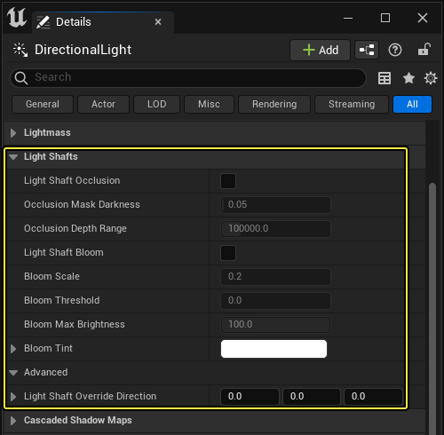
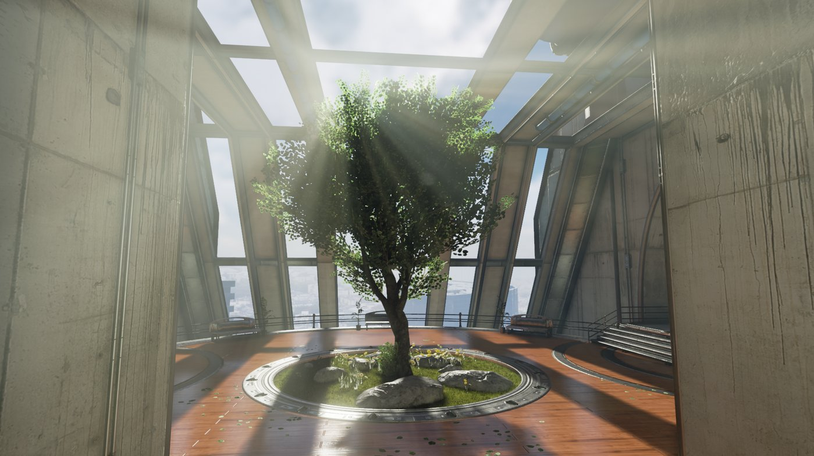

# 光束

> 路径：虚幻引擎5.7文档 / 构建虚拟世界 / 为场景设置光照 / 直接光照 / 光束

> 原始页面：https://dev.epicgames.com/documentation/unreal-engine/using-light-shafts-in-unreal-engine

利用定向光源模拟真实曙暮光效果或大气散射的阴影，即可生成**光束**。 这些光线为场景添加深度和真实度。

## 属性

定向光源在其属性中有一个**光束（Light Shaft）**类别。

下表提供了这些属性的信息。

| 属性 | 说明 |
| --- | --- |
| 定向光源 |  |
| **启用光束遮挡（Enable Light Shaft Occlusion）** | 确定此光源是否对雾气和大气散射形成屏幕空间模糊遮挡。 |
| **遮挡遮罩暗度（Occlusion Mask Darkness）** | 确定遮挡遮罩的颜色深度。 数值**1**表示无深色调。 可使用大于**1**和小于**0**的数值，打造更专业的效果。 |
| **遮挡深度范围（Occlusion Depth Range）** | 在此距离到摄像机之间的物体均会对光束构成遮挡。 |
| **启用光束泛光（Enable Light Shaft Bloom）** | 确定是否渲染此光源的光束泛光。 就定向光源而言，光源方向周围的颜色将呈放射性模糊，然后重新添加至场景中。 |
| **泛光缩放（Bloom Scale）** | 调整泛光的加色，使其更明显/不明显。 |
| **泛光阈值（Bloom Threshold）** | 场景颜色必须大于此阈值，方可在光束中形成泛光。 |
| **泛光最高亮度（Bloom Max Brightness）** | 应用曝光后，如场景颜色的亮度大于**泛光最高亮度**，则将其向下重新调整到**泛光最高亮度**。 |
| **泛光色调（Bloom Tint）** | 与场景颜色一同构成泛光颜色。 它为光束泛光效果着色。 |
| **光束重载方向（Light Shaft Override Direction）** | 可使光束来自光源实际方向以外的其他位置（必须在非零时使用，无需进行标准化）。 |

## 遮挡法

遮挡法从屏幕上物体的深度创建遮罩，将其从光线中模糊掉，并将其用于雾气和大气的遮罩。 它和现实生活中的光束类似 - 光束由雾气的阴影所生成。 请注意：这也意味着光束的强弱度只能和雾气/大气相同。 它用于游戏中，旨在获得更真实的效果。

太阳定向光源可稍微偏离屏幕并产生遮挡光束。然而与太阳之间的角度接近 90 度时，光束将逐渐淡出。

## 泛光法

泛光法将在世界空间中的光源周围捕捉场景颜色（包括半透明度和雾内散射），并从光源进行放射性模糊。 此法并非对真实世界中发生的一切进行模拟，但可控性较高（不受雾气密度限制），视觉效果震撼。 太阳周围存在突出的明亮区域（如明亮的云朵）时泛光法的使用效果最佳。 明亮的太阳过小，因此将形成一定程度的锯齿，而模糊是一个图像空间操作。

## GPU开销

这些效果（**遮挡**和**泛光**）都分别存在开销，因此只启用必要的效果方为上策。 使用 680GTX 显卡运行 1080p 画面时，遮挡为 0.5ms，单个光源上的泛光为 0.68ms。
