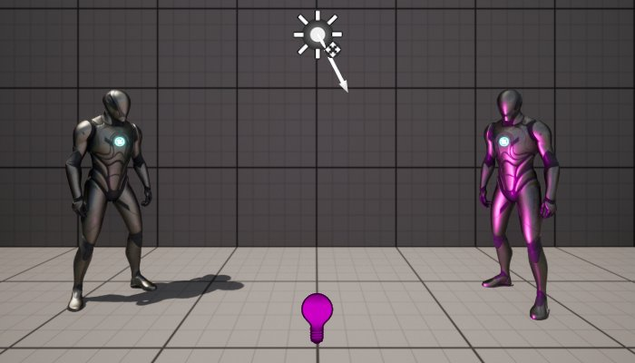
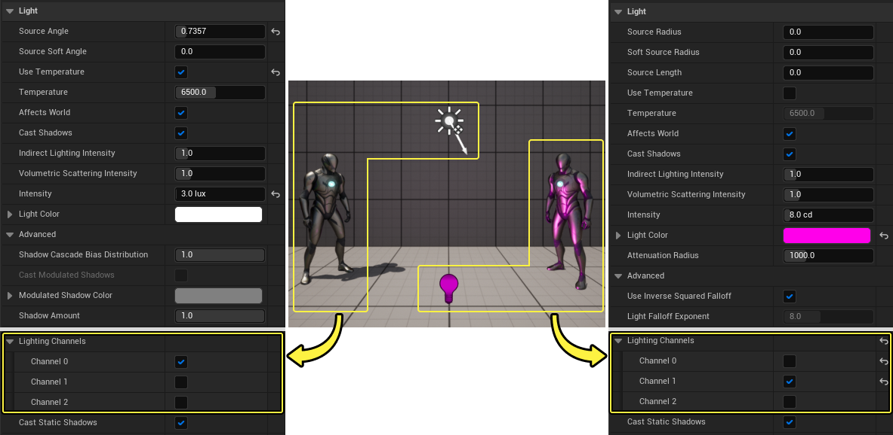

# 光照通道

> 路径：虚幻引擎5.7文档 / 构建虚拟世界 / 为场景设置光照 / 直接光照 / 光照通道

> 原始页面：https://dev.epicgames.com/documentation/unreal-engine/using-lighting-channels-in-unreal-engine

**光照通道（Lighting Channels）** 使动态光源仅在其光照通道发生重叠时才对物体产生影响。它主要用于动画，使用户能更自如地掌握 **Actor** 的照亮。当前 **虚幻引擎** 支持最多3种光照通道。

## 用法

定向光源、聚光源、点光源和可被光源影响的所有 Actor（静态网格体、骨架网格体等）均默认启用 **Lighting Channel 0**。如果需要一个可照亮的 **Actor** 受另一 **光照通道** 的影响，必须在 Actor 和光源上同时启用该通道。

### 范例

在上图中，白色定向光源只影响 **Channel 0**，包括左侧的人体模型和背景静态网格体；而蓝色点光源只影响 **Channel 1**，只包括右侧的人体模型。

属性设置如下所示：

点击查看大图

可在 **细节** 面板的 **光源（Light）** 类别下的 **高级（Advanced）** 下拉菜单中查看光源属性。可在 **细节** 面板的 **光照（Lighting）** 类别下查看可照亮Actor的 **光照通道（Lighting Channels）** 属性。

## 限制

光照通道的影响为动态应用。这意味着它无法用于静态光源或具有静态移动性（Static Mobility）的静态网格体Actor。但可用于 **移动性（Mobility）** 设为 **可移动（Movable）** 的静态网格体Actor。需要使用 **固定（Stationary）** 或 **可移动（Movable）** 光源。

光照通道只影响不透明材质上的直接光照。因此无法用于半透明或遮罩材质。

## 性能

使用 **光照通道** 的性能影响很小，但并非毫无影响。举例而言，使用 Radeon 7870 显卡对拥有 1 个定向光源的场景执行精度为 1080p 的渲染：

| 光照通道状态 | 毫秒 |
| --- | --- |
| **off** | 0.42ms StandardDeferredLighting 1 draws 1 prims 3 verts |
| **on** | 0.08ms CopyStencilToLightingChannels 1 draws 1 prims 3 verts 0.45ms StandardDeferredLighting 1 draws 1 prims 3 verts |

## 移动平台

从虚幻引擎 4.13 开始，光照通道可用于支持以下功能的移动渲染器：

- 不同通道中支持多个定向光源。
- 每个图元只受一个定向光源影响，且它将使用设置的首个光照通道的定向光源。
- 静止或移动定向光源 CSM 阴影只投射在拥有匹配光照通道的图元上。
- 动态点光源完全支持光照通道。
