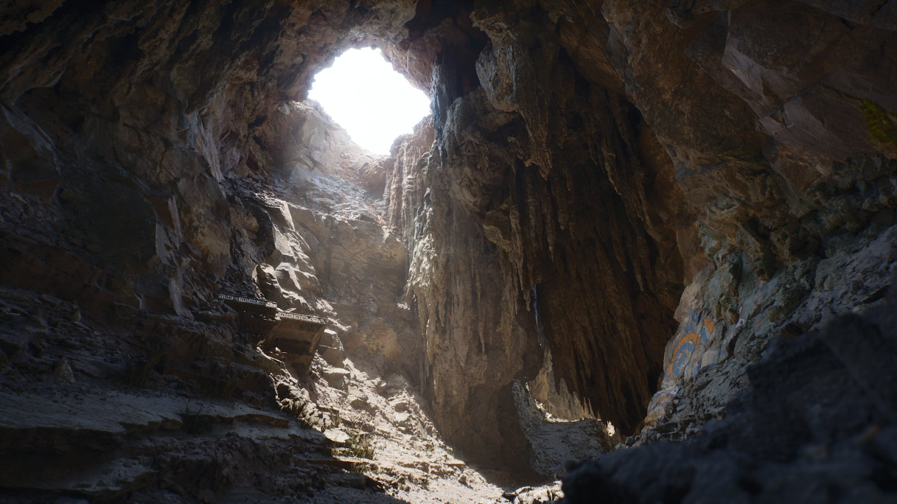

# 全局光照

> 路径：虚幻引擎5.7文档 / 构建虚拟世界 / 为场景设置光照 / 全局光照

> 原始页面：https://dev.epicgames.com/documentation/unreal-engine/global-illumination-in-unreal-engine

**全局光照（Global illumination）**（有时也称为间接照明和间接光照）能够模拟光照与几何体及材质表面的交互效果，从而为场景添加真实的照明效果。此外，全局光照还考虑到与之相互作用的材质光线吸收性和反射性。

有两种方法可以在3D世界中模拟光线运动：一是使用支持移动和交互的光照；二是使用预计算的光照，不需要场景有过于动态或交互的光照。

虚幻引擎为全局光照解决方案提供多种光照方法，通常它们彼此互不排斥，可以无缝地混合使用。例如，在同一个场景中，可以同时存在动态光照和烘焙光照。

为方便比较，以下列表介绍了使用预计算或动态全局光照两种方法的各自亮点：

| 列 1 | 列 2 |
| --- | --- |
| 非常适合无需变更光照的场景。 性能成本与加载和存储光照贴图纹理所需的内存有关。 结果的质量和精确度是由被烘焙和应用到几何体的光照贴图纹理的纹理分辨率所决定的。 默认支持静态网格体和BSP几何体。 静态网格体需要设置光照贴图UV来存储光照数据。 可与动态光照结合使用。 | 非常适合需要变更光照的场景，如开灯或关灯，或昼夜变换系统。 大型的开放世界环境对烘焙光照提出了不切实际的要求（即使没有昼夜变换系统）。烘焙时间、内存使用率、纹理存储和播放是使用动态GI时需要考量的重要因素。 实时计算的性能成本可能要昂贵得多，具体取决于所使用的方法。 经常需要在质量和精确度以及性能之间寻找平衡。一些动态GI方法会受到实时使用情况的限制。 默认支持所有几何体类型。 可与预计算的光照结合使用。 |

## 预计算的全局光照

虚幻引擎中的光照烘焙系统使用Lightmass全局光照系统在CPU或GPU上计算光照数据。使用此方法预计算光照旨在获得高质量结果，可以将信息存储在将要应用至几何体的纹理中，不受实时限制因素的影响。使用此方法，光照无法动态修改，对于那些无需改变光照效果的项目来说十分理想，对于动态光照受限的移动平台项目也是非常好的选择。

- 基于CPU的Lightmass

  使用CPU和名为

  Unreal Swarm

  的独立进程来计算和生成光照数据。此方法可使用单个机器或将光照分配到构建场。
- 基于GPU的Lightmass

  使用当前计算机上支持DirectX 12和光线追踪的NVIDIA GPU来计算和生成光照数据。

### 预计算的全局光照方法

- [CPU Lightmass全局光照](cpu-lightmass-global-illumination/index.md)

- [GPU Lightmass全局光照](gpu-lightmass-global-illumination/index.md) - 了解如何采用基于GPU的系统来生成预计算光照数据。

### 预计算的全局光照相关内容

- [间接光照缓存](indirect-lighting-cache/index.md)

- [体积光照贴图](volumetric-lightmaps/index.md) - 用于模拟动态对象及预览未构建场景的全局光照效果的体积光照采样。

- [Lightmass门户](lightmass-portals/index.md) - 提升室内光照烘焙的质量。

- [Unreal Swarm](unreal-swarm/index.md) - 介绍了Unreal Swarm——用于计算开销较大的应用的任务分配系统，其中包括高质量静态全局光照解决方案Unreal Lightmass。

- [Lightmass基础知识](lightmass-basics/index.md) - 关于Lightmass的概述。

- [预计算光照情景](using-precomputed-lighting-scenarios/index.md) - 介绍如何再单个场景中使用多种光照设置。

## 动态全局光照

虚幻引擎中的动态光照方法提供了实时可扩展的全局光照解决方案，可以为项目提供动态间接光照。这意味着你可以放置、移动并点亮世界中的对象，无需额外花费烘焙光照成本或进行额外的设置。动态间接光照也能够精确模拟昼夜变换过渡或开关灯等一些简单的操作，实现光线的精确反射。

- Lumen

  是一套全动态全局光照和反射系统，专为次世代主机而设计。Lumen作为默认的全局光照系统，可以使用多种光线追踪方法，解决大规模全局光照和反射。
- **屏幕空间全局光照（Screen Space Global Illumination）** （SSGI）是一种后期处理效果，为仅限于摄像机视图中的当前可见的对象生成全局光照。此方法成本较低，可以作为附加效果与现有的预计算或动态全局光照方法结合使用，这样效果最好。

  > [!WARNING]
  > 此功能已废弃。未来的引擎版本中会删除此功能。

### 动态全局光照相关内容

%building-virtual-worlds/lighting-and-shadows/global-illumination/lumen:Topic%

- [Lumen技术细节](lumen-global-illumination-and-reflections/lumen-technical-details/index.md)

- [屏幕空间全局光照](screen-space-global-illumination/index.md) - 介绍基于屏幕空间效果的动态全局光照。

- [硬件光线追踪](../ray-tracing-and-path-tracing-features/hardware-ray-tracing/index.md) - 介绍基于硬件的实时光追功能。
