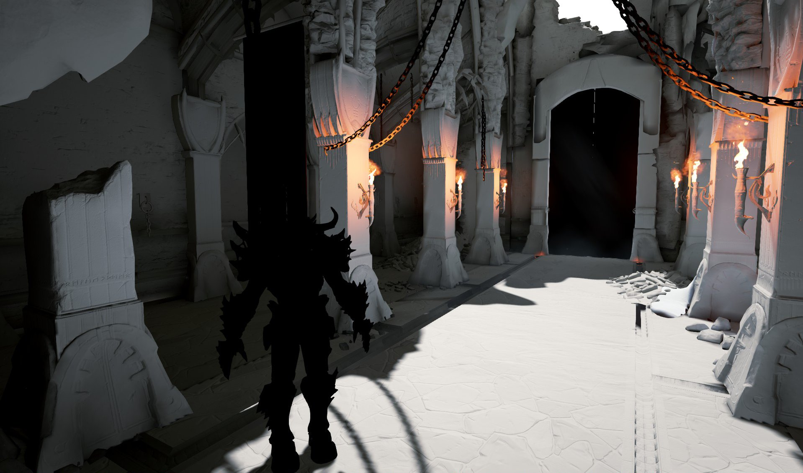
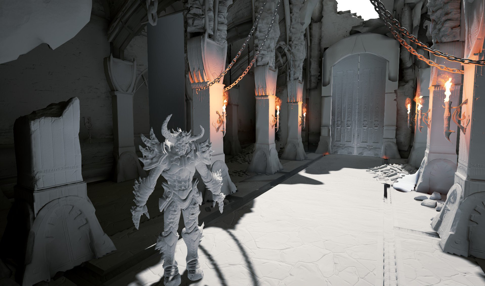
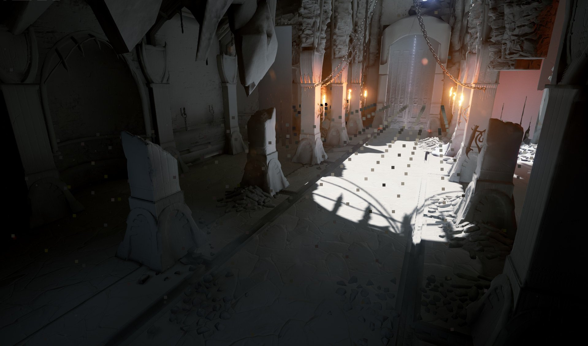
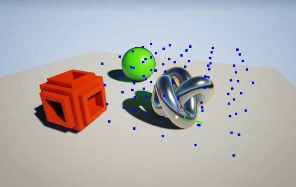
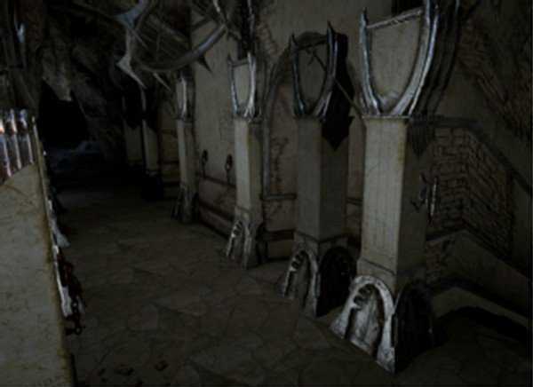

# 间接光照缓存

> 路径：虚幻引擎5.7文档 / 构建虚拟世界 / 为场景设置光照 / 全局光照 / 间接光照缓存

> 原始页面：https://dev.epicgames.com/documentation/unreal-engine/indirect-lighting-cache-in-unreal-engine

[CPU Lightmass](../cpu-lightmass-global-illumination/index.md)可以在静态对象上生成间接光照的光照贴图，但角色之类的动态对象同样需要一种接收间接光照的方法。这能通过 **间接光照缓存（Indirect Lighting Cache）** 来解决，其在光照构建时用Lightmass生成的采样来计算动态对象在运行时的间接光照。

下图显示了带与不带间接光照缓存渲染的效果差异：

Elemental关卡中的漫反射光照，不带 间接光照缓存。

采用了 间接光照缓存 的漫反射光照。

## 工作原理

从高层次的观点来看：

- Lightmass在关卡中放置光照采样，并在光照构建中计算其间接光照。
- 当涉及到动态对象的渲染时间时，**间接光照缓存** 将确认此对象是否已拥有可用光照；如有，则进行使用。
- 如无光照可用（对象为全新、或移动量过大），**间接光照缓存** 将从预计算光照采样内插光照。

Lightmass将以高密度将光照采样放置在朝上的表面上，其余处则以低密度放置。采样将被限制在 **Lightmass Importance Volume** 中，其只放置在静态表面上。

使用 展示（Show）-> 显示（Visualize）-> 体积光照采样（Volume Lighting Samples） 来显示Lightmass生成的光照采样。

此工作流的目的是尽量减少内容设置。但有时这种放置启发法会使漂浮在空中的区域缺少细节（例如玩家乘坐的升降电梯或飞行物）。可将 **Lightmass Character Indirect Detail Volumes** 放置在这些区域的周围来获取更多细节。

运行时，**间接光照缓存** 将把光照采样内插到每个可移动对象周围的位置。可移动对象即是 **移动性** 设为 **可移动** 的所有组件。

图中的螺绕环便是一个可移动静态网格体，显示了5x5x5的插值位置。

对象移动距离足以触发内插时才会进行内插，因此缓存会进行命名。注意：这些位置离对象的边界很远。以便对象在场景中移动时形成连续而稳定的光照。多数对象实际将获得3x3x3的插值分辨率。体积光照采样保存定向间接光照（其使法线贴图能正常工作）。

## 预览未构建的光照

间接光照缓存还能预览未构建光照的对象。它在较小的物体上效果极佳，但在较大的网格体上效果不佳（如建筑或地面）。移动已构建光照的静态网格体时，其将自动切换至间接光照缓存，直至下次光照构建。

此处有一根复制的柱子，其获得间接光照以便预览，而非完全隐藏在黑暗之中。

