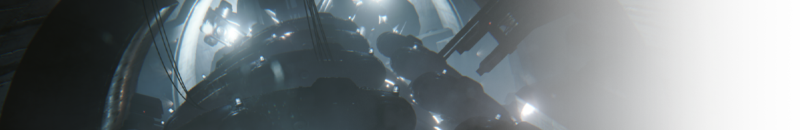
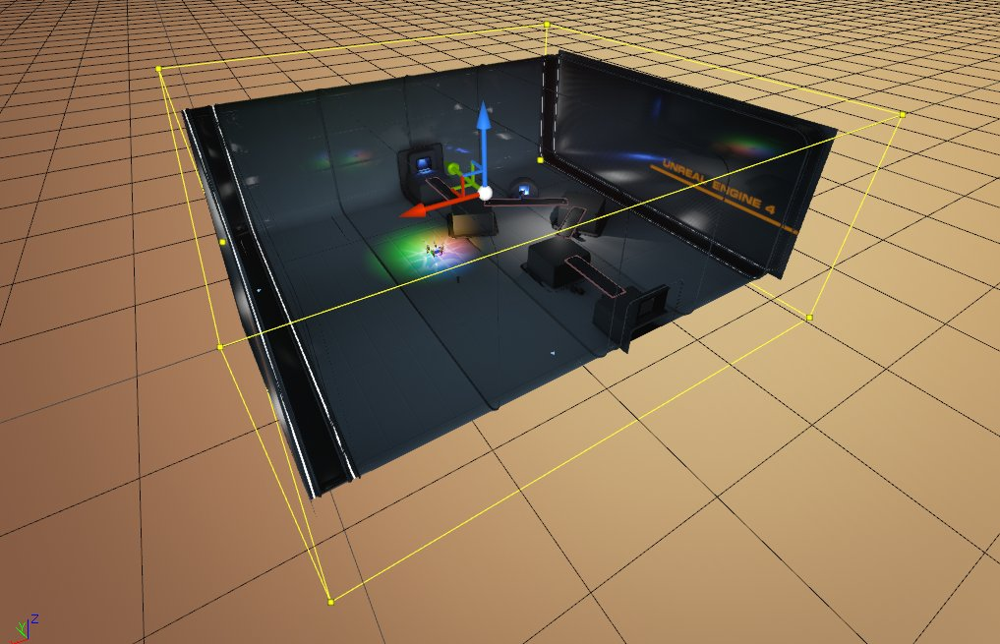
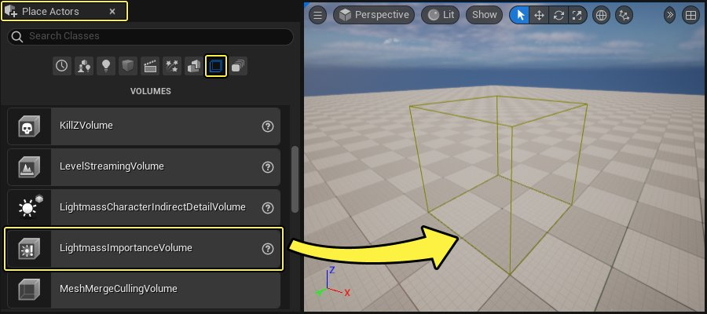
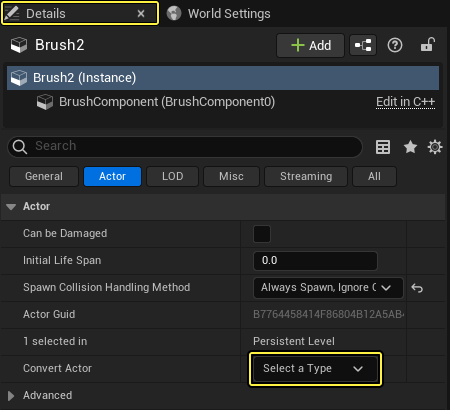
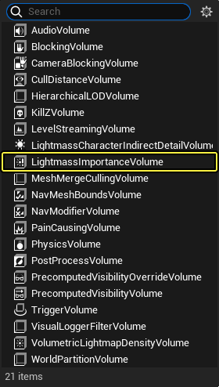
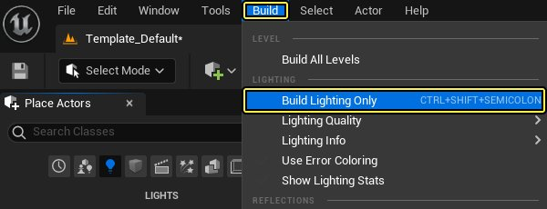
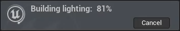

# Lightmass基础知识

> 路径：虚幻引擎5.7文档 / 构建虚拟世界 / 为场景设置光照 / 全局光照 / Lightmass基础知识

> 原始页面：https://dev.epicgames.com/documentation/unreal-engine/lightmass-basics-in-unreal-engine

**全局光照（Lightmass）** 创建具有复杂光交互作用的光照图，例如区域阴影和漫反射。它用于预计算具有固定和静态运动性的光源的光照贡献部分。

## Lightmass重要体积

许多贴图在编辑器中已经网格化到网格的边缘，但是需要高质量光照的实际可玩区域要小得多。全局光照取决于关卡的大小发射光子，因此这些背景网格体将大大增加需要发射的光子数量，而光照构建时间也将增加。全局光照重要体积控制全局光照发射光子的区域，允许你将其集中在需要清晰间接光照的区域。在重要体积之外的区域在较低的质量下只能得到一次间接光照的反射。

要将一个全局光照重要体积添加到某个关卡中，你可以从 **放置Actor（Place Actors）** 菜单的 **体积（Volume）** 选项卡中将这个 **全局光照重要体积（Lightmass Importance Volume）** 对象拖动到关卡中，然后将其缩放到所需的大小。

你还可以通过单击 **Actor** 下的 **细节（Details）** 面板中的 **转换Actor（Convert Actor）** 下拉框，将画笔转换为全局光照重要体积。

单击该下拉框后，将出现一个菜单，你可以在其中选择要替换画笔的Actor类型。

如果你放置多个全局光照重要体积，那么大多数光照工作将通过包含所有这些体积的边界框来完成。但是，体积光照样本仅放置在较小的体块中。

## 构建

1. 点击 **主** 菜单面板上的 **构建 Build** 并选择 **仅构建光照（Build Lighting Only）**，你也可以选择 **构建所有关卡（Build All Levels）** 。

   
2. 类似于这样的一个对话框将会出现在屏幕的右下角

   
3. 当构建完成时，点击 **保留 Keep** 。

   

就这么简单。根据光源数量、质量模式、关卡大小、Lightmass 重要体积所包含的部分、Swarm 客户端是否有其他计算机可用，这个过程可能会花费几分钟或者更长的时间。

## 画质模式

> 图片已省略：Lighting quality build modes

这些预置模式是时间花费和获得画质之间的平衡。**预览级（Preview）** 将会快速地进行渲染，并提供大部分直接光照烘培后的一般效果，而 **产品级（Production）** 的渲染较慢，但是可以提供更加真实的效果，并且可以校正各种光照渗透错误。

- 产品级（Production）

  - 看上去非常棒，需要花费一些时间
- 高级（High）

  - 看上去很好，需要一些时间
- 中级（Medium）

  - 看上去较好，需要稍微长一点的时间进行计算
- 预览级（Preview）

  - 只是可以接受，但渲染速度很快

这些仅是预置，还有很多设置可以调整，以便在你的游戏中获得满意的光照，请参照 [Lightmass](../cpu-lightmass-global-illumination/index.md) 文档获得关于如何调整 **Lightmass** 设置的更多信息。
