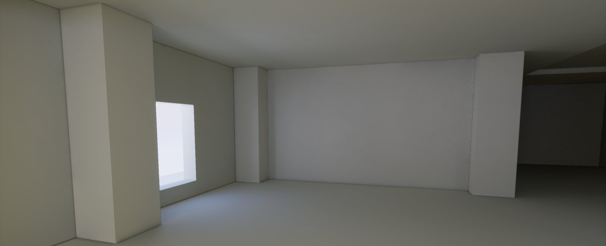
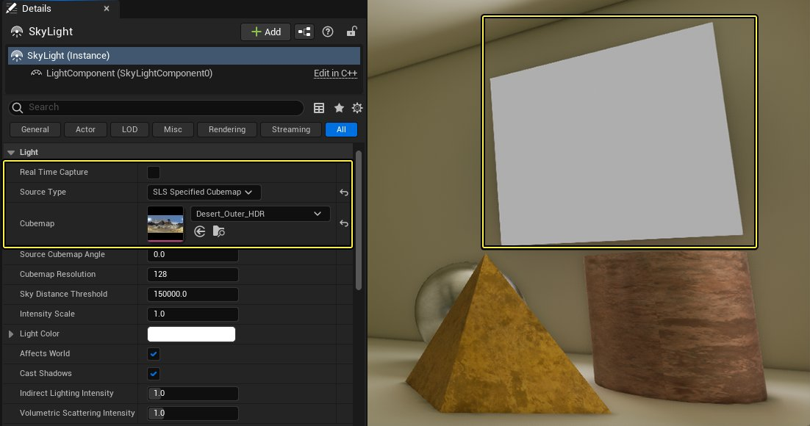
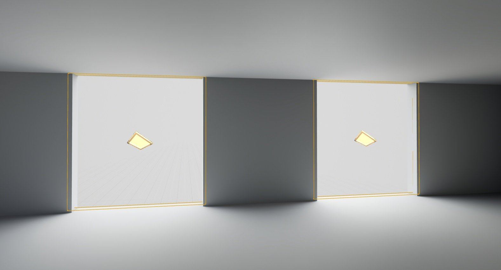
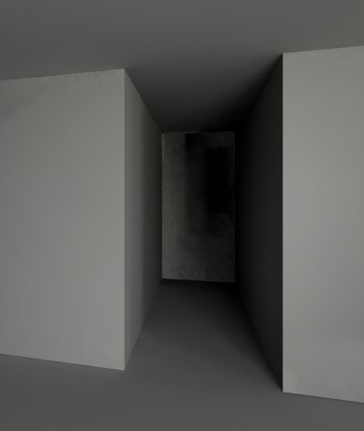
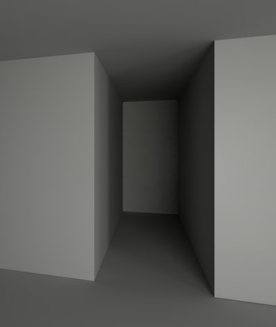
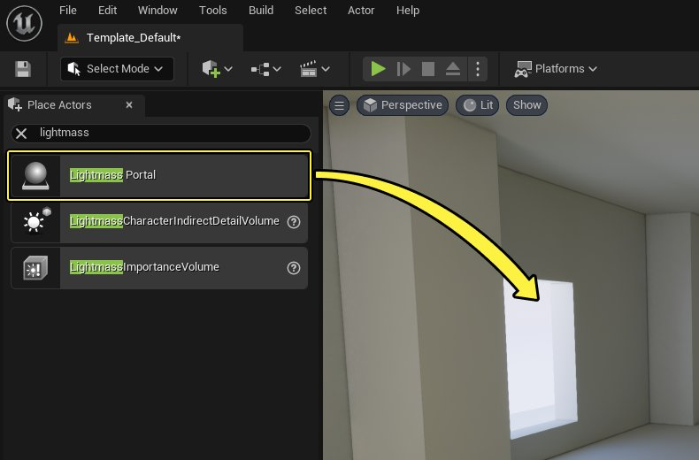
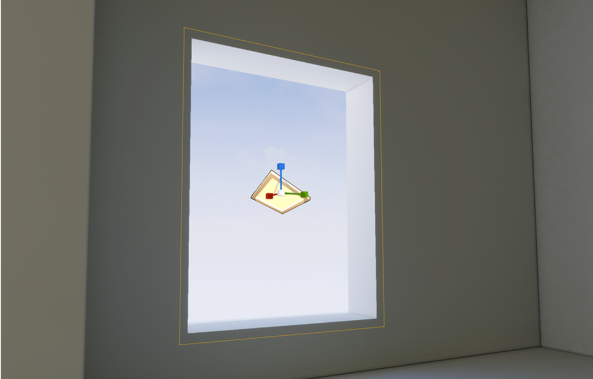
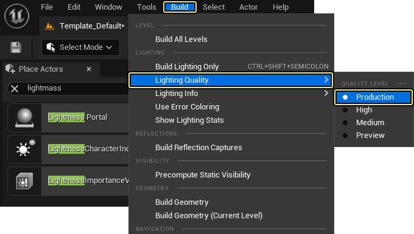

# Lightmass门户

> 路径：虚幻引擎5.7文档 / 构建虚拟世界 / 为场景设置光照 / 全局光照 / Lightmass门户

> 原始页面：https://dev.epicgames.com/documentation/unreal-engine/lightmass-portals-in-unreal-engine

在收集光线时，Lightmass可以使用来自光子映射技术的光子追溯到聚光源、点光源和定向光源。 这意味着它可以找到这些类型的光源来自哪个小窗户，并以高品质解析射入的光线。 但是，天空光照和自发光网格体不能有效地支持光子发射，所以Lightmass只能强行查找微小的重要光照特性。 这导致了室内角落的污迹失真（splotchy artifact）现象。为了帮助Lightmass更好地理解光线的来源，可以在重要的光照区域周围放置 **Lightmass门户** Actors。 以下文档将介绍如何在虚幻引擎 项目中设置并使用Lightmass门户。

## 工作方式

概括起来，Lightmass门户是按下列方式工作的：

- 使用[天空光照](../../light-types-and-their-mobility/sky-lights/index.md)、HDR影像或设置为启用[将自发光用于静态照明（Use Emissive for Static Lighting）](../../../../designing-visuals-rendering-and-graphics/unreal-engine-materials/unreal-engine-materials-tutorials/using-the-emissive-material-input/index.md#usingemissivematerialstolighttheworld)选项的静态网格体对场景照明时，Lightmass门户用处最大。

  

  点击查看大图。
- Lightmass门户放置在关卡中，并调整比例以适应对最终光照有重要意义的任何开放区域。

  
- 当Lightmass构建光源时，Lightmass门户会告诉Lightmass，应该有更多光线来自此区域，从而产生更高质量的光照和阴影。

  

  

  不使用门户

  使用门户

## 步骤

要在项目中使用Lightmass门户，需要执行下列操作。

1. 在 **放置Actor（Place Actors）** 面板中搜索 **Lightmass门户（Lightmass Portal）**，找到以后，将 **Lightmass门户Actor** 拖入 **关卡**中。

   

   点击查看大图。
2. 使用 **移动（Move）**、**旋转（Rotate）** 和 **缩放（Scale）** 工具放置和缩放Lightmass门户，使它的大小与你希望聚焦更多光线的开口或区域大致相同或略小一点。

   
3. 点击 **主** 菜单面板中的 **构建（Build）**，选择 **构建（Build）**，将 **光照质量（Lighting Quality）** 改为 **产品级（Production）**。

   
4. 完成所有设置后，点击 **主** 菜单面板中的 **构建（Build）** 并选择 **构建所有关卡（Build All Levels）**， 开始Lightmass光照构建。

   > 图片已省略：Build the Lightmass lighting

## 最终结果

完成Lightmass构建之后，就会得到与下列图像类似的效果。

> 图片已省略：不使用门户

> 图片已省略：使用门户

不使用门户

使用门户

如果细看 **不使用门户** 的图像，你会注意到与 **使用门户** 的图像相比，该图像中有许多噪点，特别是在比较暗的区域。

## 已知问题与限制

- Lightmass门户是通过强制Lightmass向门户发射光线来工作的。因此，应该只将Lightmass门户用于小型关卡，而且只用于对场景很关键的光照。如果不遵循这一原则，（且添加了太多Lightmass门户）就可能大大增加Lightmass构建次数。
- 只可将Lightmass门户用在非常小的关卡中，因为Lightmass门户不会被任何物体遮挡。如果将它们用在大型的开放世界场景类关卡中，就会不必要地延长光源烘焙时间。
- 如果将静态网格体用于自发光的光线投射体，且结果存在大量噪点，一定要在应该发射该静态网格体光线的区域周围放置Lightmass门户。
