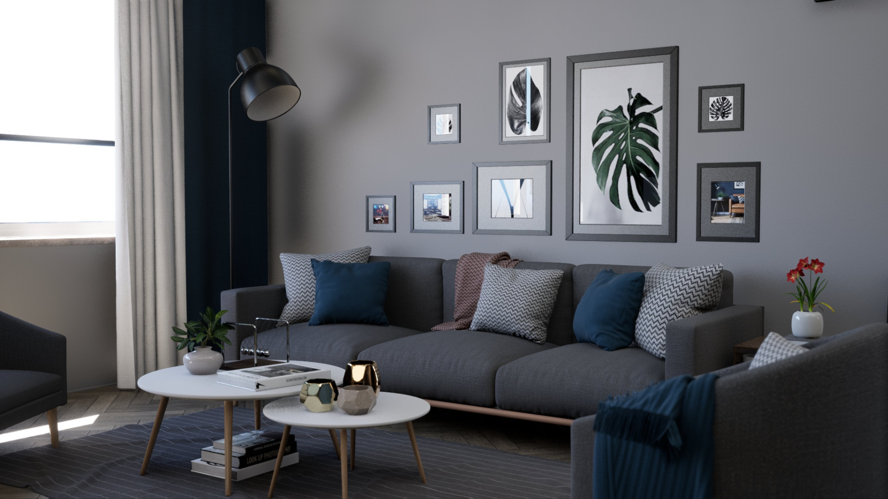
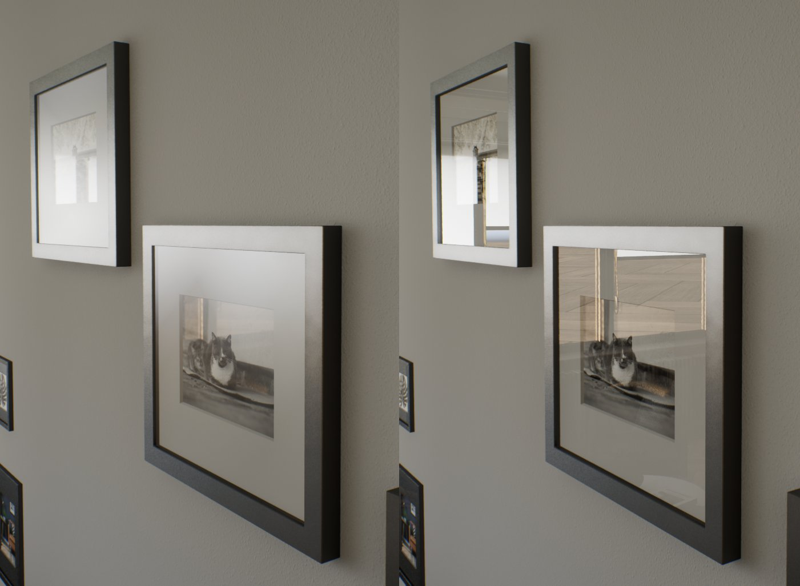
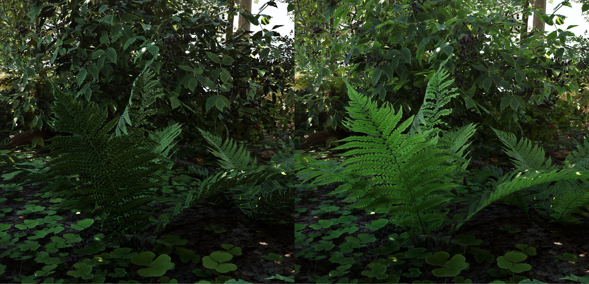
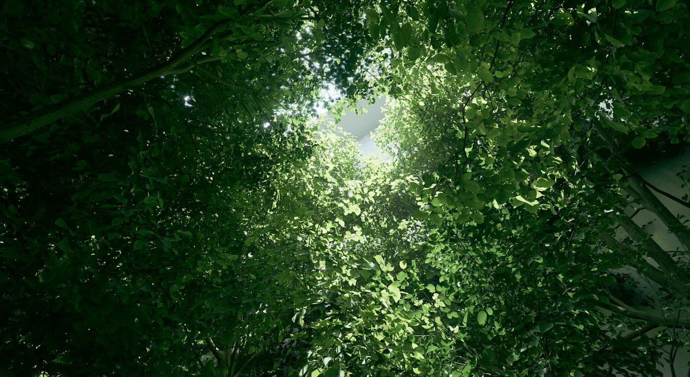
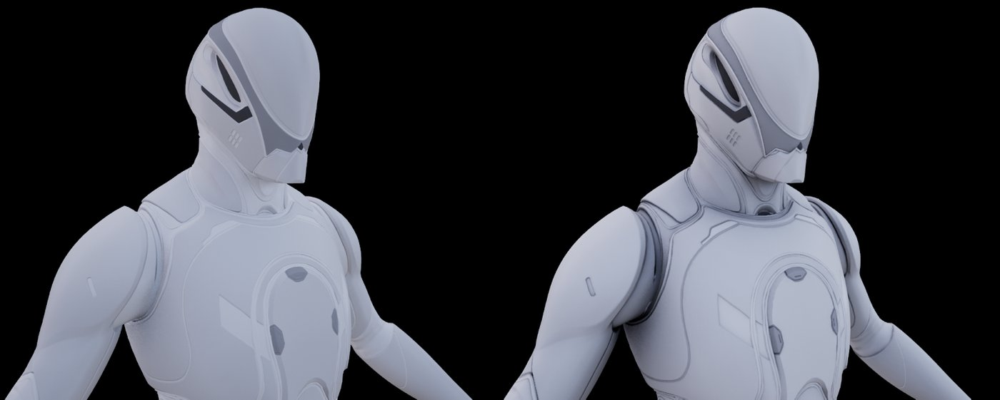

# Lumen全局光照和反射

> 路径：虚幻引擎5.7文档 / 构建虚拟世界 / 为场景设置光照 / 全局光照 / Lumen全局光照和反射

> 原始页面：https://dev.epicgames.com/documentation/unreal-engine/lumen-global-illumination-and-reflections-in-unreal-engine

Lumen是虚幻引擎的全动态全局光照和反射系统，专门针对下一代主机进行设计，是引擎默认的全局光照和反射系统。 Lumen能够在拥有大量细节的宏大场景中渲染间接漫反射，并确保无限次数的反弹以及间接高光度反射效果；无论是毫米级别的场景细节，还是数以千米的宏大场景，它都能应对得游刃有余。

## Lumen入门

新创建的项目会默认启用Lumen全局光照和反射及其依赖功能，例如[生成网格体距离场](../../mesh-distance-fields/index.md)。 项目从虚幻引擎4升级到虚幻引擎5时，**不会**自动启用Lumen功能。 这能防止破坏或更改这些项目中的光照路线。

Lumen可以在项目设置下的**渲染（Rendering） > 动态全局光照（Dynamic Global Illumination）**和**反射（Reflections）**类别中启用。

全局光照和反射可以单独设置。 在每个类别中，设置以下功能以启用Lumen：

- 动态全局光照：**Lumen**
- 反射方法：**Lumen**

  > [!NOTE]
  > 启用之后，将会启用**生成网格体距离场（Generate Mesh Distance Fields）**属性（如果尚未启用）。 此属性是Lumen的[软件光线追踪](lumen-technical-details/index.md)模式所必需的。 需要重新启用引擎。

Lumen的全局光照取代了[屏幕空间全局光照（SSGI）](../screen-space-global-illumination/index.md)和[距离场环境光遮蔽（DFAO）](../../mesh-distance-fields/distance-field-ambient-occlusion/index.md)。 Lumen的反射取代了屏幕空间反射。

> [!NOTE]
> 为项目启用Lumen之后，将会禁用预先计算的静态光照补充，并隐藏所有光照贴图。

## Lumen光照功能

Lumen为虚幻引擎带来了稳定的动态全局光照，并与虚幻引擎5中的其他支持系统充分集成，例如Nanite、世界分区和虚拟阴影贴图。

虚幻引擎4的功能，例如[屏幕空间全局光照](../screen-space-global-illumination/index.md)和[光线追踪全局光照](../../ray-tracing-and-path-tracing-features/hardware-ray-tracing/index.md)（RTGI），对于依赖实时高质量的项目而言，会显得不太可靠或性能不足。 此外，这些功能未与其他重要系统完全集成，无法广泛支持引擎的大部分功能。

### Lumen全局光照

Lumen全局光照解决了间接漫反射光照问题。 例如，在表面上散乱弹射的光线将使用表面的颜色，并将带有颜色的光线反射到其他附近的表面，从而造成颜色溢出效果。 场景中的网格体还会拦截间接光照，这也会造成间接阴影。

Lumen支持无限漫反射，这在使用明亮漫反射材质的场景中非常重要，例如下方使用了白色涂料的公寓。

虚幻引擎5的[Nanite虚拟几何体](https://dev.epicgames.com/documentation/unreal-engine/BlueprintAPI/Nanite?application_version=5.6)功能使得几何体的细节丰富程度远超以往。 Lumen实现了全分辨率阴影，同时还可以用低得多的分辨率来计算间接光照，从而实现较高的实时性能。

### 带有天空光照的Lumen

天空光照在Lumen的**最终采集（Final Gather）**过程中解决。 此过程还解决天空阴影问题，让室内空间可以比室外光照环境暗得多，实现更加自然的效果。

Lumen还为[光照半透明](../../../../designing-visuals-rendering-and-graphics/unreal-engine-materials/unreal-engine-materials-tutorials/using-transparency-in-unreal-engine-materials/index.md)和[体积雾](https://dev.epicgames.com/documentation/unreal-engine/BlueprintAPI/Rendering/VolumetricFog?application_version=5.6)提供更低质量的全局光照。

### Lumen和自发光材质

自发光材质通过Lumen的最终采集过程来传播光线，不会对性能造成任何影响。 但是，小型而明亮的自发光区域将会受到限制，以避免出现噪点瑕疵。 这种解决方式会受到内在限制，比手动放置光源困难得多。

### Lumen反射

Lumen为所有材质粗糙度数值解决了间接高光度或反射问题。

所有反射中都可以看到全局光照漫反射和带阴影的天空光照。 Lumen反射还支持透明涂层材质，例如下面示例中的汽车。

Lumen为半透明材质提供有光泽的反射，例如下面示例中的汽车窗户。

当项目启用了**高质量半透明反射（High Quality Translucency Reflections）**时，Lumen反射会在半透明表面材质的最上层提供镜面反射。

Lumen反射支持**单层水体（Single Layer Water）**材质，该材质会将反射强制设置为镜面反射。

### Lumen双面植被

**双面植被（Two-Sided Foliage）**着色模型的解算方式是，采集来自叶片背面的光线，将其通过叶片散射，并根据材质的**次表面颜色（Subsurface Color）**而衰减。

### 支持的光源类型和其他功能

在更高的层级上，Lumen支持以下功能：

- 支持所有[光源类型](../../light-types-and-their-mobility/index.md)，包括方向光源、天空光源、点光源、聚光光源和矩形光源。
- 所有类型的光源均支持[光源函数](../../features-and-properties-of-lights/using-light-functions/index.md)。
- 不支持将[移动性（Mobility）](../../light-types-and-their-mobility/index.md)设为**静态（Static）**的光源，因为静态光源完全存储在光照贴图中，其作用在启用Lumen之后被禁用。

## Lumen设置

你可以在两个地方找到Lumen的设置：**项目设置（Project Settings）**和**后期处理体积（Post Process Volumes）**。

### Lumen项目设置

适用于或能影响Lumen的所有项目设置都可以在**引擎（Engine）> 渲染（Rendering）**分段中找到。 项目设置中包含Lumen可以用于项目的所有默认设置。

以下是Lumen需要或能够影响Lumen的所有设置的列表。

| 属性名称 | 说明 |
| --- | --- |
| 全局光照 |  |
| **动态全局光照方法（Dynamic Global Illumination Method）** | 选择要在项目中使用的动态全局光照的类型。 |
| 反射 |  |
| **反射方法（Reflection Method）** | 选择要在项目中使用的动态反射的类型。 |
| Lumen |  |
| **在可用时使用硬件光线追踪（Use Hardware Ray Tracing when available）** | 当视频卡、RHI和操作系统支持时，使用适用于Lumen的硬件光线追踪功能。 否则，Lumen将重新使用软件光线追踪。 对于具有超过10万个实例的场景，硬件光线追踪将产生显著的场景更新成本。 如需了解相关信息，请参阅[光线追踪性能指南](https://dev.epicgames.com/documentation/unreal-engine/ray-tracing-performance-guide-in-unreal-engine?application_version=5.5)。 |
| **光线照射模式（Ray Lighting Mode）** | 当Lumen使用硬件光线追踪时，控制Lumen反射光线如何发光。 默认情况下，Lumen使用**表面缓存（Surface Cache）**来获得最佳性能，但如果要获得更高的质量，可以将其设为**反射的命中照射（Hit Lighting for Reflections）**。 |
| **高质量半透明反射（High Quality Translucency Reflections）** | 是否在半透明表面的前面一层上使用高质量镜面反射。 其他层将使用只能生成光滑反射的较低质量的辐射缓存方法。 在后期处理体积（Post Process Volume）设置中启用它会增加GPU开销。 |
| **软件光线追踪模式（Software Ray Tracing Mode）** | 当对场景进行光线追踪时，控制Lumen使用哪种追踪方法。 **细节追踪（Detail Tracing）**会追踪单个网格体的距离场，以获得最高质量。 **全局追踪（Global Tracing）**会追踪不太精细的全局距离场，以获得最快的追踪速度。 |
| 硬件光线追踪 |  |
| **支持硬件光线追踪（Support Hardware Ray Tracing）** | 从支持该功能的操作系统、RHI和视频卡启用光线追踪，以获得更高的质量效果。 |
| 软件光线追踪 |  |
| **生成网格体距离场（Generate Mesh Distance Fields）** | 是否构建静态网格体的距离场。 对于Lumen的软件光线追踪，以及在定向光源上实施可移动天空光照阴影和光线追踪距离场阴影的距离场环境光遮蔽，此功能是必需的。 启用此功能将会增加静态网格体的构建时间、内存使用和磁盘大小。 |
| **距离场体素密度（Distance Field Voxel Density）** | 确定网格体的默认刻度如何转换成距离场体素维度。 更改此值将导致重新构建所有距离场。 值越大，占用内存的速度越快。 |

### 后期处理设置

后期处理体积包含Lumen的重载和由美术师控制的属性。 这些设置可以在**全局光照（Global Illumination）**和**反射（Reflections）**类别中找到。

以下是可以在后期处理体积中找到的Lumen的所有设置：

| 属性名称 | 说明 |
| --- | --- |
| 全局光照：Lumen全局光照 |  |
| **Lumen场景光照质量（Lumen Scene Lighting Quality）** | 刻度越大，计算Lumen场景所使用的保真度越高，这种变化可以在反射中看到，但产生的GPU成本也越高。 |
| **Lumen场景细节（Lumen Scene Detail）** | 控制Lumen场景中可以呈现的实例大小。 值越大，越能确保呈现较小的对象，但会增加GPU成本。 |
| **Lumen场景视野距离（Lumen Scene View Distance）** | 设置Lumen为光线追踪所保持的场景最大视野距离。 值越大，天空阴影和全局光照的有效范围越大，但GPU成本也更高。 |
| **最终采集质量（Final Gather Quality）** | 提高Lumen全局光照的质量，减少所渲染的噪点，但会增加渲染时的GPU成本。 |
| **屏幕追踪（Screen Traces）** | 是否将屏幕空间追踪用于Lumen全局光照。 屏幕空间追踪会绕过Lumen场景，改为对场景深度和颜色取样。 这会提高质量，但同时会防止仅限Lumen场景的更改，例如添加仅在全局光照中可见的自发光物体。 |
| **最大跟踪距离（Max Trace Distance）** | 在解决光照时，控制Lumen应该跟踪的最大距离。 值太小将会导致光照泄漏到较大的范围，例如洞穴。 较大的值将会增加渲染场景时的GPU成本。 |
| **场景捕获缓存分辨率（Scene Capture Cache Resolution）** | Lumen表面缓存分辨率的比例因子。 使用较小的值可节省GPU内存，但质量会更低。 如果未重载，默认为0.5。 这应该在场景捕获组件上的后期处理设置中进行设置。 |
| 全局光照：Lumen全局光照：高级属性 |  |
| **Lumen场景光照更新速度（Lumen Scene Lighting Update Speed）** | 控制Lumen场景可以缓存多少光照结果，以提高性能。 刻度越大，光照变化的传播速度越快，但会增加GPU成本。 |
| **最终采集光照更新速度（Final Gather Lighting Update Speed）** | 控制Lumen最终采集可以缓存多少光照结果，以提高性能。 刻度越大，光照变化的传播速度越快，但会增加GPU成本。 |
| **漫反射颜色增强（Diffuse Color Boost）** | 允许通过将材质漫反射颜色计算为pow(DiffuseColor，1/DiffuseColorBoost)，使间接光照变明亮。 高于1的值（原始漫反射颜色）在物理上是不正确的，但它们适合用于美术调节，增加场景中的反射光照量。 最好将值保持在2以下，否则还会导致反射比场景更明亮。 |
| **天空光源泄露（Skylight Leaking）** | 控制应该允许天空光照强度以多大比例泄露。 这适合用于美术调节（非基于物理），防止室内区域变为全黑。 |
| **完全天空光源泄露距离（Full Skylight Leaking Distance）** | 控制与接收表面相距多远时天空光照泄露达到完全强度。 使用较小的值时，天空光照泄露更扁平，而使用较大的值时，会带来环境光遮蔽效果。 |
| 反射：Lumen反射 |  |
| **质量（Quality）** | 提高表面的Lumen反射的质量，减少所渲染的噪点，但会增加渲染时的GPU成本。 |
| **光线照射模式（Ray Lighting Mode）** | 在使用[Lumen的硬件光线追踪](lumen-technical-details/index.md)时，此设置控制反射是复用表面缓存来实现低成本光照，还是计算命中点上的光照来实现更高的质量。 |
| **屏幕追踪（Screen Traces）** | 是否将屏幕空间追踪用于Lumen全局光照。 屏幕空间追踪会绕过Lumen场景，改为对场景深度和颜色取样。 这会提高质量，但同时会防止仅限Lumen场景的更改，例如添加仅在全局光照中可见的自发光物体。 |
| **高质量半透明反射（High Quality Translucency Reflections）** | 是否在半透明表面的前面一层上使用高质量镜面反射。 其他层将使用只能生成光滑反射的较低质量的辐射缓存方法。 这在启用后会增加GPU成本。 需要首先启用项目设置**高质量半透明反射（High Quality Translucency Reflections）**。 |
| **要追踪的最大粗糙度（Max Roughness To Trace）** | 设置Lumen将为其追踪专用反射光线的最大粗糙度值。 值越大，反射质量越高，但会大幅增加GPU成本。 |
| **最大反射弹射次数（Max Reflection Bounces）** | 设置递归反射弹射的最大次数。 默认值为1，表示在类似镜面的表面中只弹射一次，没有次生弹射的反射光线。 当有足够的性能预算时，2次或更多弹射可以防止反射区域中出现黑色区域。 此后期处理设置可以最高为8次弹射。 你可以使用`r.Lumen.Reflections.MaxBounces`重载后期处理设置，以允许最高64次的反射弹射。 需要在项目设置中启用[使用命中光照反射的硬件光线追踪](index.md)。 |
| **最大折射弹射次数（Max Refraction Bounces）** | 要追踪的折射事件的最大数量。 若使用击中照射，在Lumen最大折射弹射次数大于0时，会追踪半透明网格体，使反射追踪的成本更高昂。 |

## 其他说明

以下是在项目中使用Lumen功能时需要注意的一些额外事项。

### Lumen光照更新速度

Lumen使用大量缓存来实现实时性能。 局部照射的变化可以快速传播，但全局照射变化（例如禁用太阳）可能需要几秒钟才能完成传播。 项目可以使用**Lumen场景光照更新速度（Lumen Scene Lighting Update Speed）**和**最终采集光照更新速度（Final Gather Lighting Update Speed）**等[后期处理体积中的控制点](index.md)来绕过这种延迟，但这会增加GPU成本。

### 为项目禁用静态光照

启用Lumen之后，将会从静态光照中移除预先计算的光照。 你可以为项目完全禁用预先计算的光照，方法是在项目设置的**引擎（Engine）> 渲染（Rendering）**分段下，禁用**允许静态光照（Allow Static Lighting）**。

禁用静态光照还可以在着色器排列方面节约一些静态光照开支。 这还能让[材质环境光遮蔽](../../../../designing-visuals-rendering-and-graphics/unreal-engine-materials/material-inputs/index.md)使用Lumen全局光照。

> [!NOTE]
> 已经使用了静态光照的项目将会把自身的光照贴图加载到内存和磁盘中，直到在已经加载的关卡的**世界设置（World Settings）**中启用**强制无预计算光照（Force No Precomputed Lighting）**。 然后，需要重新构建光照和保存关卡，以移除光照贴图数据。

### 将Lumen反射用于烘焙的静态光照

Lumen反射可以在没有Lumen全局光照的情况下使用。 如果游戏和项目使用静态光照，但希望将反射质量提升到超出放置的反射捕获的能力之外，该方法最有利。 独立的Lumen反射需要启用[Lumen硬件光线追踪模式](lumen-technical-details/index.md)，这会自动为反射启用命中光照。

### 透明涂层材质

Lumen支持透明涂层材质（带双法线），但有一些局限。 具体是：

- 只有顶层才能使用很低的粗糙度值。 底层假定有粗糙度的值，因此产生了光泽的效果。 此限制存在的原因是，单条反射光线按像素投射，使得顶层和底层无法投射清晰的反射。
- 透明涂层数量为0时，以上限制仍适用。 这意味着，尽管有单个（底）层，即使在粗糙度值很低的情况下，反射仍然看起来光滑/粗糙。

### 材质环境光遮蔽

Lumen全局光照支持[材质环境光遮蔽](../../../../designing-visuals-rendering-and-graphics/unreal-engine-materials/material-inputs/index.md)，后者可以为骨架网格体提供可靠的自遮蔽。

要在Lumen中使用材质环境光遮蔽，请进行以下设置：

- 在项目设置中禁用**允许静态光照（Allow Static Lighting）**即可在GBuffer中腾出空间。
- 将材质设置为输出到**环境光遮蔽（Ambient Occlusion）**。

左侧：骨架网格体上启用了Lumen全局光照，并且仅启用了屏幕追踪（软件光线追踪）；右侧：材质环境光遮蔽。

> [!NOTE]
> 使用缓冲区可视化**环境光遮蔽（Ambient Occlusion）**视图模式时，材质环境光遮蔽不可见。

Lumen全局光照支持材质的[环境法线贴图](../../../../designing-visuals-rendering-and-graphics/unreal-engine-materials/bent-normal-maps/index.md)。 但是，相对于材质环境遮蔽，这两种方法所导致的渲染成本高得多，但视觉提升非常有限。

要在Lumen中使用环境法线贴图，请进行以下设置：

- 在项目的DefaultEngine.ini配置文件的`[SystemSettings]`小节中，设`r.GBufferDiffuseSampleOcclusion=1`并重启编辑器。
- 将材质设为输出至**Bent Normal**自定义输出节点。
