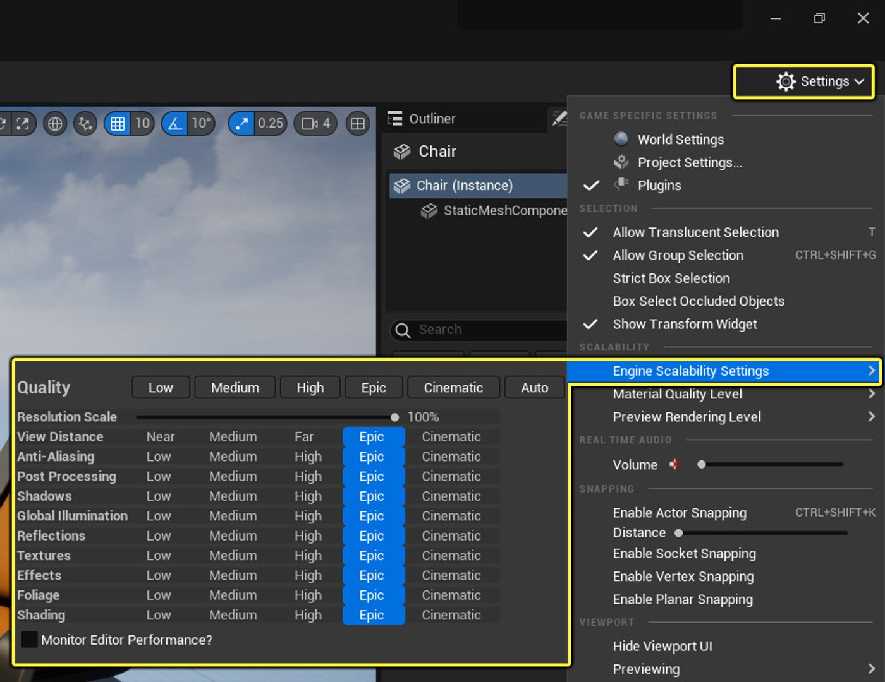
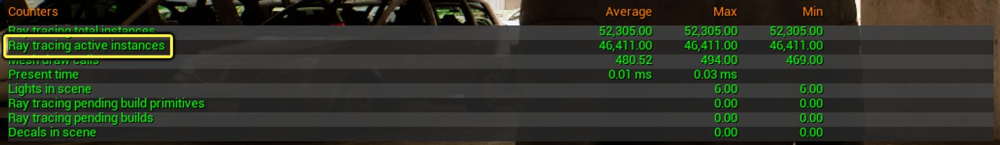
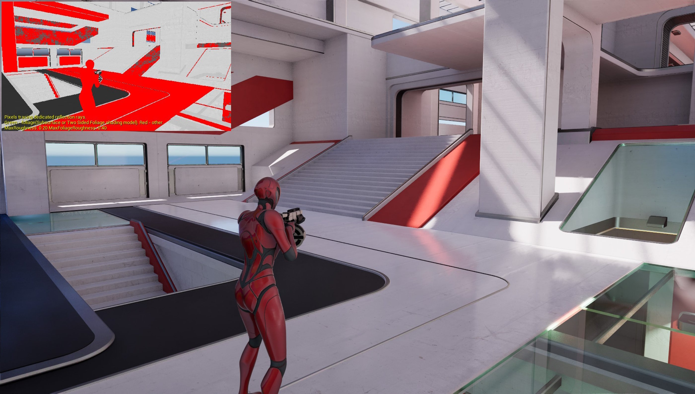
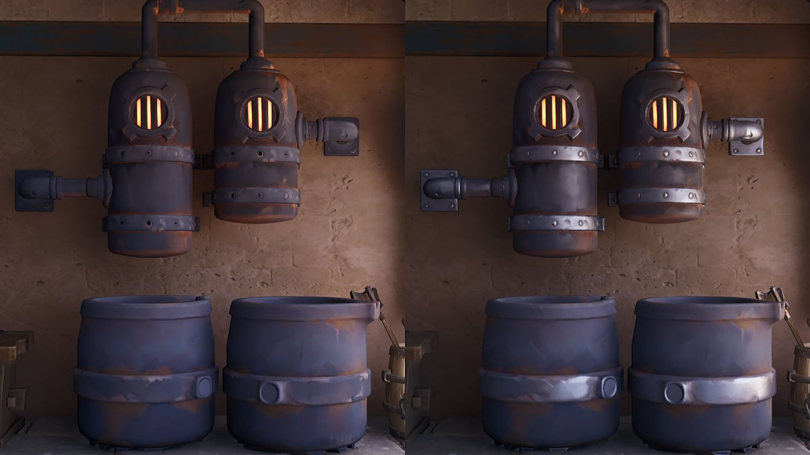
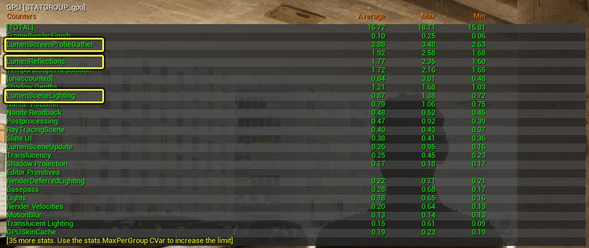
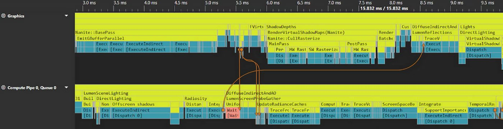

# Lumen Performance Guide

> 路径：虚幻引擎5.7文档 / 构建虚拟世界 / 为场景设置光照 / 全局光照 / Lumen全局光照和反射 / Lumen Performance Guide

> 原始页面：https://dev.epicgames.com/documentation/unreal-engine/lumen-performance-guide-for-unreal-engine

该页面没有可用的官方中文版本；以下内容保留原文，并按本项目人工译文规则逐步回译。

在主机上，Lumen 针对不透明和半透明材质上的全局光照、反射以及体积雾，以 1080p 下 8ms 和 4ms 帧预算为目标，实现 30 和 60 帧每秒（fps）。引擎使用预配置的 Scalability 设置来控制 Lumen 的目标 FPS。 **Epic** 可扩展性级别目标为 30 fps。 **High** 可扩展性级别目标为 60 fps。

Lumen 依赖 [Temporal Upsampling](../../../../../designing-visuals-rendering-and-graphics/optimizing-and-debugging-projects-for-realtime-rendering/dynamic-resolution/index.md) 以及 Unreal Engine 5 的 [Temporal Super Resolution](../../../../../designing-visuals-rendering-and-graphics/optimizing-and-debugging-projects-for-realtime-rendering/anti-aliasing-and-upscaling/temporal-super-resolution/index.md) （TSR）实现 4K 输出。Lumen 和其它功能使用较低的内部分辨率（1080p），这能让 TSR 获得最佳最终图像质量。否则，以原生 4K 渲染这些功能时，需要降低质量设置才能达到 30 或 60 fps。

## 可扩展性设置

可以在 Level Editor 的 Viewport 下找到 Scalability 设置： **Settings > Engine Scalability Settings**。在游戏内，可以通过 GameUserSettings 和图形设置菜单控制 Scalability 设置（示例请参阅 [Lyra](../../../../../samples-and-tutorials/sample-game-projects/lyra-sample-game/index.md) 项目）。Lumen 质量由 **Global Illumination** 和 **Reflections** 质量组设置：

- **Cinematic** 可扩展性级别目标为 [Movie Render Queue](https://dev.epicgames.com/documentation/unreal-engine/API/PluginIndex/MovieRenderPipeline?application_version=5.7).
- **Epic** 可扩展性级别目标为 30 fps 主机预算。
- **High** 可扩展性级别目标为 60 fps 主机预算。
- **Low** 和 **Medium** 可扩展性级别会禁用 Lumen 功能。



默认情况下，虚幻引擎在主机上目标为 30 fps。要以 60 fps 为目标，请在主机 Device Profile 中将 **Global Illumination** 和 **Reflections** 质量组设置为 **High** 。这些 profile 位于 `[Your Project Name]\Platforms[Console]\Config\` folder. For example, `[Your Project Name]\Platforms\PS5\Config\PS5DeviceProfiles.ini`.

目标为 60 fps 的 PlayStation 5 Device Profile 如下：

C++

```
[PS5 DeviceProfile]    ; Set Lumen GI and reflection quality to High, targeting 60 fps    +CVars=sg.GlobalIlluminationQuality=2    +CVars=sg.ReflectionQuality=2
```

## 在 Lumen 之外继续降级

默认 **Global Illumination** 和 **Reflections** 质量组位于 `\Engine\Config\BaseScalability.ini`. 这些设置会尝试让不同质量级别之间的间接光照观感保持相似。额外好处是，在降低 Lumen 成本时无需为每个平台重新制作光照。

Medium 质量级别

- 对于大尺度环境光遮蔽， **Distance Field Ambient Occlusion** 会替代 **Lumen Global Illumination**.
- 对于小尺度环境光遮蔽， **Screen Space Ambient Occlusion** 会被启用。

Low 质量级别

- 仅使用无阴影 skylight。
- 降低 skylight 强度（`r.SkylightIntensityMultiplier=0.7`）以更好匹配 **Medium** 质量级别，因为没有任何 skylight shadowing。

### Software Ray Tracing（软件光线追踪）

[Software Ray Tracing](../lumen-technical-details/index.md#software-ray-tracing) 是 Lumen 中最快的追踪方法。对于无法承担 Hardware Ray Tracing 成本的游戏，或不支持 Hardware Ray Tracing 的 GPU 的回退路径，建议使用它。

在此配置中，Lumen 会追踪单个合并的 Global Distance Field。追踪 global distance field 会使追踪成本独立于实例数量及实例之间的重叠情况。它也非常适合包含大量重叠实例的内容。

Global Distance Field 的更新性能仍取决于实例数量，但它有大量缓存，可降低更新成本。

Global Distance Field 会分别缓存 movable 和 static 对象。正确设置组件 mobility 很重要，因为移动 static actor 会使 static cache 失效，成本可能非常高。 `r.GlobalDistanceField.Debug.LogModifiedPrimitives` 可用于调试哪些 static actor 在运行时被移动。

> [!TIP]
> 禁用 **Affects Distance Field Lighting** ，或在 static mesh editor 中将 **Distance Field Resolution Scale** 设置为 **0** ，即可从 distance field scene 渲染中移除单独的 distance field 实例。移除对全局光照或反射影响不大的次要实例，可以帮助优化 Global Distance Field 更新性能。

### Hardware Ray Tracing（硬件光线追踪）

Hardware Ray Tracing 可提升 Lumen 质量，建议在主机上作为 30 fps 和 60 fps 的默认选项。它比 Software Ray Tracing 更昂贵，并且对大量实例重叠非常敏感，因此需要仔细优化场景。

Hardware Ray Tracing 需要每帧重建 **Top Level Acceleration Structure** （TLAS）。此成本与需要包含在该加速结构中的实例数量成正比。在次世代主机上获得良好性能通常意味着剔除后 **Ray Tracing Scene** 中的实例少于 100,000。在 Microsoft Windows 上，实例数量可以有所不同。

使用 `Stat SceneRendering` 检查 ray tracing scene 中有多少可见实例，并查看 **Ray tracing active instances** 统计项。



ray tracing scene culling 设置是控制场景中 ray tracing 实例数量的最强工具。Ray tracing culling 默认启用以简化设置，但也可以在 `[Your Project Name]\Config\` 文件夹下的 **DefaultEngine.ini** 配置文件中进行额外更改。

C++

```
[SystemSettings]    r.RayTracing.Culling=3    r.RayTracing.Culling.Radius=15000    r.RayTracing.Culling.Angle=0.5
```

> [!TIP]
> 可以通过在关卡中 actor 上禁用 **Visible In Ray Tracing** ，将单个实例从 ray tracing scene 中移除。
>
> 请参阅 [Ray Tracing 性能指南](https://dev.epicgames.com/documentation/unreal-engine/ray-tracing-performance-guide-in-unreal-engine?application_version=5.7) 了解 Hardware Ray Tracing 性能的详细信息，包括性能计数器和调试视图。

**Far Field** 提供激进剔除，同时不牺牲全局光照和反射距离。在 ray tracing scene 半径之外，所有射线都会使用 far field trace，以更低成本扩展全局光照和反射。 [Lumen 技术细节](../lumen-technical-details/index.md) 提供 Far Field 设置方式的信息。

> [!TIP]
> 增加 ray tracing scene culling 并配合 Far Field，有助于优化并降低 Lumen Hardware Ray Tracing 性能成本。

Hardware Ray Tracing 性能取决于场景中网格体的重叠程度。覆盖整个场景的大型网格体会带来性能问题，例如 skybox。这些网格体应禁用 **Visible In Ray Tracing** 。也可以在草网格体，以及由多层相交组合网格体拼装而成的 kit-bashed 网格体上节省追踪成本。

> [!WARNING]
> 要让使用 Hardware Ray Tracing 的场景保持性能，必须将重叠网格体数量控制在合理水平。

**Hit Lighting for Reflections** 可提升反射质量。它会在每个命中点评估材质和光照，但对游戏而言成本较高。除非材质非常简单且使用 **Ray Tracing Quality Switch** 节点优化。主机上，可以使用以下设置限制 BVH 遍历迭代次数，并提前终止较长且昂贵的射线： `r.Lumen.HardwareRayTracing.MaxIterations`. 被终止的射线会被视为完全遮挡且辐射为零，从而造成过度遮挡。此设置可用于微调性能，并避免场景中存在大量重叠几何体的部分导致性能问题。

## 提示

其成本 **Lumen Reflections** 会因屏幕上有多少平滑或低粗糙度材质而变化。这些材质需要专用反射射线。默认情况下，所有 roughness 低于 0.4 的像素都会追踪一条反射射线。roughness 高于该值的像素会基于 Lumen Global Illumination 获得免费的反射近似。

### Lumen 反射粗糙度阈值

可以使用 **Max Roughness To Trace** 设置控制粗糙度阈值，该设置位于 **Post Process Volume**。还可以使用可扩展性设置进一步限制它： `r.Lumen.Reflections.MaxRoughnessToTraceClamp`. roughness 低于设定阈值的像素会追踪专用 **Lumen Reflection** 射线，而 roughness 高于该阈值的像素会回退到免费的粗糙镜面近似。

植被有独立的粗糙度阈值。材质使用 **Two Sided Foliage** 或 **Subsurface</strong> shading model 的任何像素都会被视为植被。可以使用以下设置控制植被粗糙度： `r.Lumen.Reflections.MaxRoughnessToTraceForFoliage`. 需要专用反射射线的像素可使用 **Performance Overview** 视图模式可视化，该模式位于 Level Viewport 的 View Modes 菜单下。**



> [!TIP]
> 植被上的反射通常很难看到。将 foliage max roughness threshold 设为 0，可以在不影响质量的情况下获得显著性能收益。

### 用 Screen Space Reflections 替换 Lumen Reflections

可以通过用 **Screen Space Reflections** (SSR). You can do this by setting `r.Lumen.Reflections.Allow=0`. For example, you can save 1 ms。将以下内容添加到 `XSXDeviceProfiles.ini` file.

C++

```
[XSX_Lockhart DeviceProfile]    ; Use SSR in lieu of Lumen reflections for perf    +CVars=r.Lumen.Reflections.Allow=0
```

下方示例展示了即使禁用 Lumen Reflections，Lumen Global Illumination 也会提供粗糙镜面反射。



Lumen Reflections 的部分性能提升来自复用为 diffuse global illumination 追踪的射线。这只会为大量像素 roughness 位于 0.2 到 0.4 范围的场景提供速度提升。可以使用 `r.Lumen.Reflections.RadianceCache=1` 启用。

### Lumen Scene Lighting（Lumen 场景光照）

**Lumen Scene Lighting** 会更新 surface cache 的直接和间接光照，这些光照用于全局光照和反射的光照射线命中。性能取决于每帧更新的 surface cache 比例。直接光照更新可使用 `r.LumenScene.DirectLighting.UpdateFactor` 调整，间接光照更新可使用 `r.LumenScene.DirectLighting.MaxLightsPerTile` 和 `r.LumenScene.Radiosity.UpdateFactor` 调整。

> [!NOTE]
> Lumen Scene Lighting 会为每个 surface cache tile 选择一小部分最重要的灯光，使其性能对场景中灯光总数不那么敏感。每个 tile 的灯光数量可由以下设置控制： `r.LumenScene.DirectLighting.MaxLightsPerTile`.

### Lumen World Space Radiance Cache（世界空间辐照度缓存）

Lumen 使用 **World Space Radiance Cache**。

单个 probe 的分辨率可使用以下设置控制： `r.Lumen.ScreenProbeGather.RadianceCache.ProbeResolution` and `r.Lumen.TranslucencyVolume.RadianceCache.ProbeResolution`. 较高值会提升间接光照质量，但更新成本更高。

第二个主要性能控制项是每帧要更新的 probe 数量。可以使用以下设置： `r.Lumen.ScreenProbeGather.RadianceCache.NumProbesToTraceBudget`and `r.Lumen.TranslucencyVolume.RadianceCache.NumProbesToTraceBudget`. 较高值会让光照响应更快，但成本更高。该值设得过低会导致快速相机移动期间出现光照跳变，因为 Lumen 需要缓慢追赶；因此在进一步降级时，最终还需要使用以下设置降低 probe grid 分辨率： `r.Lumen.ScreenProbeGather.RadianceCache.GridResolution` and `r.Lumen.TranslucencyVolume.GridPixelSize`.

### Lumen Screen Probe Gather（屏幕探针采集）

**Screen Probe Gather** 负责最终 gather：从像素追踪射线并积分入射光照。

这里的主要性能控制项是 probe spacing（`r.Lumen.ScreenProbeGather.DownsampleFactor`）以及 screen space probe 的分辨率（`r.Lumen.ScreenProbeGather.TracingOctahedronResolution`）。增大 probe spacing 会降低间接阴影质量，并模糊间接光照。降低 screen probe 分辨率会降低间接光照方向性和粗糙反射质量。

> [!TIP]
> 可以选择使用 `r.Lumen.ScreenProbeGather.IntegrateDownsampleFactor 2` 以半分辨率运行间接光照积分。这会大幅加快积分，但可能产生额外噪声并软化法线，因此默认的可扩展性或设备预设均不会默认启用它。

### 分析 Lumen 性能

Lumen 分为三个 pass：

- **Lumen Scene Lighting** 用于评估 surface cache lighting。
- **Lumen Screen Probe Gather** 用于评估 diffuse global illumination、rough reflection 以及 translucency global illumination。
- **Lumen Reflections** 用于评估光滑表面上的专用反射射线。

`Stat GPU` 会显示 GPU pass 计时，包括各个 Lumen pass。



要获得更详细的性能拆解，请使用 `ProfileGPU` 命令。也可以使用 RenderDoc 等第三方性能分析工具。

> [!WARNING]
> Lumen 使用 Async Compute，与其它工作负载并行运行。为了单独测量 Lumen，建议使用以下控制台命令将其禁用： `r.Lumen.AsyncCompute 0`. 关于 Async Compute 的更多细节，请参阅下一节。

## Async Compute

Lumen 在主机上使用 **Async Compute** 。这允许 GPU 将 Lumen 工作与 non-Nanite geometry pass 和 direct lighting pass 重叠执行。此外，Lumen 还可以与 **Lumen Screen Probe Gather** 和 **Lumen Reflections** pass 重叠。



Async Compute 已针对常见工作负载预配置，但某些情况下非默认设置会更快。我们遇到的一种情况是， **Lumen Screen Probe Gather** pass 由于图形队列上存在大量 direct lighting 或 shadow map 工作，无法与 **Lumen Reflections** pass 重叠。在这种情况下，将 Lumen 完全作为 async compute pass 运行可能有利。可以通过设置以下内容实现：

C++

```
r.LumenScene.Lighting.AsyncCompute=1    r.Lumen.DiffuseIndirect.AsyncCompute=1    r.Lumen.Reflections.AsyncCompute=1
```

> [!TIP]
> Async Compute 会让 Lumen 与其它渲染 pass 重叠。这会让性能分析更困难，因为计时不仅包含 Lumen 的成本，还包含与其重叠的其它工作负载成本。单独分析 Lumen 时，请禁用 Async Compute。

## Scalability 参考

默认引擎可扩展性和各平台 device profile 包含单独的 Lumen 设置。这些设置可作为重要且最新的渲染器性能可扩展性设置参考，也可作为自定义可扩展性设置的良好起点。建议使用默认可扩展性级别来实现 30 fps 或 60 fps，同时保持不同级别之间的一致观感。可以在以下任一文件中查看这些可扩展性设置：

C++

```
[Engine Root]\Engine\Config\BaseScalability.ini    [Engine Root]\Platforms\[Console Name]\Base[ConsoleName]DeviceProfile.ini
```
